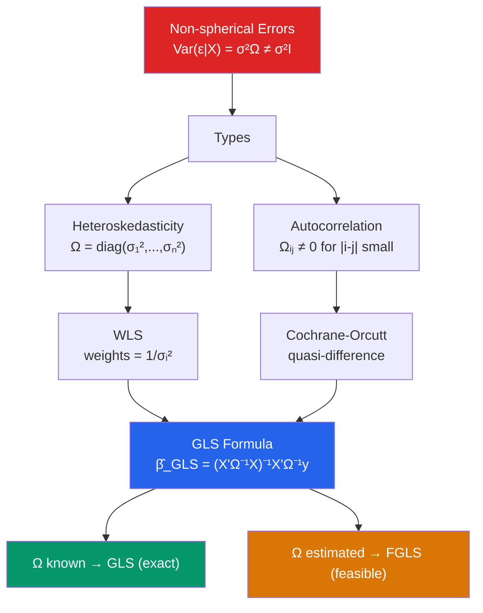

# ⚖️ GLS and WLS

> [!abstract] TL;DR
> When $\text{Var}(\varepsilon \mid X) = \sigma^2 \Omega \neq \sigma^2 I$, OLS is unbiased but inefficient. **Generalized Least Squares (GLS)** pre-multiplies the model by $\Omega^{-1/2}$ to restore spherical errors, making the transformed OLS estimator $\hat{\beta}_{GLS} = (X'\Omega^{-1}X)^{-1}X'\Omega^{-1}y$ the BLUE (**Aitken's theorem**). **WLS** is GLS for heteroskedasticity with a diagonal $\Omega$. **FGLS** estimates $\Omega$ from data first. The efficiency gain over OLS is meaningful when $\Omega$ is well-estimated; badly estimated $\Omega$ can make FGLS worse than OLS in finite samples.

## Intuition — analogy FIRST

Imagine you are averaging the opinions of 100 survey respondents to estimate a population mean. Some respondents are experts who give precise answers; others are guessing wildly. If you treat all answers equally (OLS), you dilute the experts' signal with noise. The smart approach is to **downweight the noisy respondents and upweight the experts** — that is WLS. The weight for each observation is inversely proportional to its variance: low-variance observations carry more weight, high-variance ones carry less.

GLS generalises this: when errors are not just heteroskedastic but also correlated across observations (autocorrelation), you need a more complex weighting that also accounts for the correlation structure.

---

## How It Works



## Key Concepts / Details

### Aitken's GLS

**Model**: $y = X\beta + \varepsilon$ with $E[\varepsilon \mid X] = 0$, $\text{Var}(\varepsilon \mid X) = \sigma^2 \Omega$

**Transformation**: Let $P = \Omega^{-1/2}$ (Cholesky factor). Pre-multiply:
$$P y = P X \beta + P \varepsilon$$
$$\tilde{y} = \tilde{X} \beta + \tilde{\varepsilon}$$

Now $\text{Var}(\tilde{\varepsilon}) = \sigma^2 P \Omega P' = \sigma^2 I$. OLS on the transformed model is efficient.

**GLS estimator**:
$$\hat{\beta}_{GLS} = (\tilde{X}'\tilde{X})^{-1}\tilde{X}'\tilde{y} = (X'\Omega^{-1}X)^{-1}X'\Omega^{-1}y$$

**Aitken's theorem**: $\hat{\beta}_{GLS}$ is BLUE when $\Omega$ is known — more efficient than OLS.

**Variance**:
$$\text{Var}(\hat{\beta}_{GLS}) = \sigma^2 (X'\Omega^{-1}X)^{-1}$$

### WLS for Heteroskedasticity

Special case: $\Omega = \text{diag}(\sigma_1^2/\sigma^2, \ldots, \sigma_n^2/\sigma^2)$ (diagonal).

WLS minimizes:
$$\sum_{i=1}^n w_i (y_i - x_i'\beta)^2, \quad w_i = 1/\sigma_i^2$$

Equivalent to transforming $\tilde{y}_i = y_i / \sigma_i$ and $\tilde{x}_i = x_i / \sigma_i$.

**When is WLS appropriate?**
- Per-capita data (variance proportional to population size $n_i$): use $w_i = n_i$
- Grouped data (averages): use $w_i$ = group size
- Known multiplicative heteroskedasticity: $\sigma_i^2 = \sigma^2 h(z_i)$

### FGLS for Heteroskedasticity

When $\sigma_i^2$ is unknown:
1. Fit OLS; get residuals $\hat{\varepsilon}_i$
2. Model: $\log \hat{\varepsilon}_i^2 = \gamma_0 + \gamma_1 z_{i1} + \ldots + v_i$ (auxiliary regression)
3. Estimate weights: $\hat{w}_i = 1/\exp(\hat{\gamma}_0 + \hat{\gamma}_1 z_{i1} + \ldots)$
4. WLS with $\hat{w}_i$

### FGLS for Autocorrelation (Cochrane-Orcutt)

For AR(1) errors ($\varepsilon_t = \rho \varepsilon_{t-1} + u_t$):
1. OLS; get $\hat{\varepsilon}_t$
2. Estimate $\hat{\rho}$ from $\hat{\varepsilon}_t = \rho \hat{\varepsilon}_{t-1} + u_t$
3. Quasi-difference: $\tilde{y}_t = y_t - \hat{\rho} y_{t-1}$, $\tilde{x}_t = x_t - \hat{\rho} x_{t-1}$
4. OLS on $\tilde{y}_t = \tilde{x}_t' \beta + u_t$
5. Iterate (Cochrane-Orcutt iteration) until convergence

**Prais-Winsten**: transforms the first observation as $\tilde{y}_1 = \sqrt{1-\rho^2} y_1$ to include all $T$ observations.

### Efficiency Gains and Risks

| Situation | Efficiency gain from FGLS vs OLS |
|-----------|----------------------------------|
| Variance pattern well-modeled | Large (especially when $\sigma_i$ varies a lot) |
| Variance pattern misspecified | None; FGLS can be worse than OLS |
| $\hat{\rho}$ well-estimated ($T$ large) | Meaningful in AR(1) setting |
| $n$ small relative to $k$ in aux regression | FGLS unreliable — stick to robust SEs |

**Key insight**: Robust SEs (HC/NW) always give valid inference under the respective violations. FGLS gives efficient estimates but only when $\Omega$ is correctly specified. In practice, many applied economists use robust SEs and forgo the efficiency claim.

```r
library(nlme)
library(lmtest)
library(sandwich)

# ---- WLS for known variance function ----
# wage regression: assume Var(ε|x) = σ² · exp(x) (exponential heteroskedasticity)
set.seed(42)
n  <- 400
x  <- rnorm(n, 5, 2)
e  <- rnorm(n, sd = exp(x/3))    # true sd grows with x
y  <- 1 + 0.5 * x + e

df <- data.frame(y, x)

# Step 1: OLS
ols <- lm(y ~ x, data = df)

# Step 2: Auxiliary regression to estimate variance function
log_e2  <- log(residuals(ols)^2)
aux_lm  <- lm(log_e2 ~ x, data = df)
sigma_hat <- sqrt(exp(fitted(aux_lm)))

# Step 3: FGLS (WLS with estimated weights)
fgls <- lm(y ~ x, data = df, weights = 1/sigma_hat^2)

# Compare
coeftest(ols, vcov = vcovHC(ols, "HC1"))  # robust OLS
summary(fgls)                              # FGLS

# ---- FGLS for AR(1) errors (Prais-Winsten) ----
library(prais)
# Simulate AR(1) errors
T  <- 200
x2 <- rnorm(T)
e2 <- arima.sim(list(ar = 0.6), T)
y2 <- 1 + 0.7 * x2 + e2

ts_df <- data.frame(y = y2, x = x2, t = 1:T)

# OLS (biased SEs)
ols_ts <- lm(y ~ x, data = ts_df)
dwtest(ols_ts)

# Prais-Winsten FGLS
pw_model <- prais_winsten(y ~ x, data = ts_df, index = "t")
summary(pw_model)

# Alternative: gls() with AR(1) correlation structure
gls_ar1 <- gls(y ~ x, data = ts_df,
                correlation = corAR1(form = ~ t))
summary(gls_ar1)
```

---

## Real-World Notes

- **Survey microdata**: Stratified survey designs often yield heteroskedasticity by design (larger samples from high-variance strata). Survey weights in household surveys are sometimes used as WLS weights, though the rationale is different (representativeness vs efficiency).
- **Panel data GLS**: Random effects estimator (see [[Random_Effects]]) is a form of GLS that accounts for the within-unit error correlation structure.
- **Financial time series**: ARCH/GARCH models are a special form of FGLS where the variance function is modeled dynamically. Standard WLS with estimated variances ignores the serial dependence in squared residuals.

---

## Common Pitfalls

- **Using WLS with the wrong weight**: Using $1/\text{income}$ as weight when the true variance function is $\sigma^2 \cdot \text{income}^2$ gives wrong weights and may be worse than OLS.
- **Confusing WLS for efficiency with survey sampling weights**: Survey weights adjust for unequal probability of selection (representativeness); WLS for heteroskedasticity adjusts for unequal error variance (efficiency). They are conceptually distinct.
- **Iterating Cochrane-Orcutt without checking convergence**: Always check the estimated $\hat{\rho}$ and whether residuals from the final model are white noise.

---

## Related Concepts

- [[_MOC_Advanced_Regression|↑ Section MOC]]
- [[Heteroskedasticity]] — The violation WLS/FGLS corrects
- [[Autocorrelation]] — The violation Cochrane-Orcutt corrects
- [[OLS_Estimation]] — The estimator GLS generalises
- [[Gauss_Markov_Theorem]] — Aitken's theorem is the GLS analogue of Gauss-Markov

---

## Review Questions

1. Derive the GLS estimator $\hat{\beta}_{GLS} = (X'\Omega^{-1}X)^{-1}X'\Omega^{-1}y$ by applying OLS to the transformed model $\tilde{y} = \tilde{X}\beta + \tilde{\varepsilon}$.
2. Explain Aitken's theorem: under what conditions is GLS BLUE, and how does it compare to the Gauss-Markov theorem for OLS?
3. When might FGLS perform worse than OLS in finite samples, and what should you do instead?

---

## Sources

- Wooldridge, J.M., *Introductory Econometrics*, Ch. 8–12 (WLS, FGLS, Cochrane-Orcutt)
- Greene, W.H., *Econometric Analysis*, Ch. 9 — The Generalized Regression Model
- Aitken, A.C. (1935), "On Least Squares and Linear Combination of Observations," *Proceedings of the Royal Society of Edinburgh*

#econometrics #statistics #advanced-regression #GLS #WLS #FGLS
