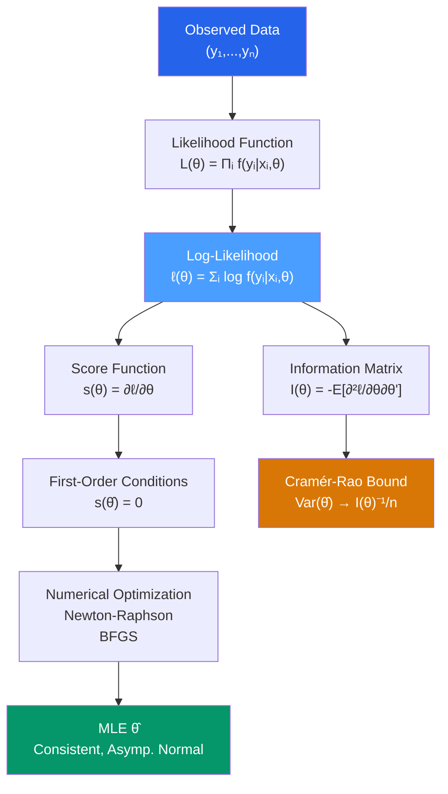

# 📈 Maximum Likelihood Estimation

> [!abstract] TL;DR
> MLE finds parameters $\hat{\theta}$ that make the observed data most probable: $\hat{\theta} = \arg\max_\theta \sum_i \log f(y_i \mid x_i, \theta)$. Under regularity conditions, MLE is **consistent**, **asymptotically normal**, and **asymptotically efficient** (achieves the Cramér-Rao lower bound). OLS is MLE for linear models with normal errors. MLE is the foundation for probit, logit, tobit, and all other limited dependent variable models where OLS is inappropriate.

## Intuition — analogy FIRST

A biologist captures 100 fish from a lake and measures their lengths. She wants to estimate the mean and variance of lengths in the whole lake. MLE asks: "For which values of mean $\mu$ and variance $\sigma^2$ would these 100 measured lengths be the most *likely* outcome?" She maximizes the probability of the data she actually observed. If most fish are around 30cm, then $\mu = 30$ is more "likely" than $\mu = 50$ because the observed data would be far less probable under $\mu = 50$.

In econometrics, MLE is the natural estimator whenever we model the full distribution of $y$ (not just its mean), which is necessary for non-linear models like probit and tobit.

---

## How It Works



## Key Concepts / Details

### The Likelihood and Log-Likelihood

For i.i.d. observations:
$$L(\theta) = \prod_{i=1}^n f(y_i \mid x_i; \theta)$$
$$\ell(\theta) = \sum_{i=1}^n \log f(y_i \mid x_i; \theta)$$

We maximize $\ell$ rather than $L$ for numerical stability (products of small numbers underflow). Log is monotone so they have the same maximizer.

### Score and Information

**Score function**: $s(\theta) = \nabla_\theta \ell(\theta) = \sum_i \frac{\partial \log f(y_i \mid x_i; \theta)}{\partial \theta}$

Under regularity: $E[s(\theta_0)] = 0$ at the true parameter $\theta_0$.

**Fisher information matrix**:
$$\mathcal{I}(\theta) = -E\left[\frac{\partial^2 \ell}{\partial \theta \partial \theta'}\right] = E[s(\theta) s(\theta)']$$

(These two forms are equal — the **information equality**.)

**Cramér-Rao lower bound**: For any unbiased estimator $\tilde{\theta}$:
$$\text{Var}(\tilde{\theta}) \geq \mathcal{I}(\theta_0)^{-1}/n$$

MLE achieves this bound asymptotically — it is **asymptotically efficient**.

### Asymptotic Distribution of MLE

Under standard regularity conditions:
$$\sqrt{n}(\hat{\theta}_{MLE} - \theta_0) \xrightarrow{d} N(0, \mathcal{I}(\theta_0)^{-1})$$

In practice, we use the estimated information matrix:
$$\widehat{\text{Var}}(\hat{\theta}) = [-\nabla^2 \ell(\hat{\theta})]^{-1}$$

or the outer product form (OPG estimator):
$$\widehat{\text{Var}}(\hat{\theta}) = \left[\sum_i s_i(\hat{\theta}) s_i(\hat{\theta})'\right]^{-1}$$

### OLS as a Special Case of MLE

If $y_i \mid x_i \sim N(x_i'\beta, \sigma^2)$:
$$\ell(\beta, \sigma^2) = -\frac{n}{2}\log(2\pi) - \frac{n}{2}\log\sigma^2 - \frac{1}{2\sigma^2}\sum_i (y_i - x_i'\beta)^2$$

Maximizing over $\beta$ is equivalent to minimizing $\sum_i (y_i - x_i'\beta)^2$ — **OLS is MLE under normality**.

MLE of $\sigma^2$: $\hat{\sigma}^2_{MLE} = \frac{1}{n}\sum_i \hat{\varepsilon}_i^2$ (biased; OLS uses $n-k$).

### Hypothesis Testing in MLE

Three asymptotically equivalent tests (all $\sim \chi^2_q$ under $H_0$):

| Test | Formula | Requires |
|------|---------|---------|
| **Wald** | $(\hat{\theta} - \theta_0)' [\mathcal{I}(\hat{\theta})/n]^{-1} (\hat{\theta} - \theta_0)$ | Unrestricted model only |
| **Likelihood Ratio (LR)** | $2[\ell(\hat{\theta}) - \ell(\hat{\theta}_R)]$ | Both restricted and unrestricted |
| **Lagrange Multiplier (LM/Score)** | $s(\hat{\theta}_R)' \mathcal{I}(\hat{\theta}_R)^{-1} s(\hat{\theta}_R)$ | Restricted model only |

In finite samples they differ; LR is often most reliable.

### Numerical Optimization

MLE rarely has a closed form (except linear-normal). In practice use:

- **Newton-Raphson**: $\theta^{(k+1)} = \theta^{(k)} - [\nabla^2 \ell(\theta^{(k)})]^{-1} s(\theta^{(k)})$
- **BFGS** (Quasi-Newton): approximates the Hessian; more robust
- **EM Algorithm**: for models with latent variables (mixture models, Heckman)

```r
library(stats4)
library(bbmle)

# Manual MLE for normal linear model
log_lik_normal <- function(beta0, beta1, log_sigma) {
  sigma <- exp(log_sigma)
  mu    <- beta0 + beta1 * x
  -sum(dnorm(y, mean = mu, sd = sigma, log = TRUE))
}

set.seed(42)
n <- 200
x <- rnorm(n)
y <- 2 + 1.5 * x + rnorm(n, sd = 0.8)

# bbmle package for MLE with standard errors
mle_fit <- mle2(
  log_lik_normal,
  start = list(beta0 = 0, beta1 = 0, log_sigma = 0)
)
summary(mle_fit)
coef(mle_fit)
confint(mle_fit)

# Compare to OLS (should be identical in large samples)
ols_model <- lm(y ~ x)
summary(ols_model)

# MLE for Poisson (count data) — not OLS
y_count <- rpois(n, lambda = exp(0.5 + 0.3 * x))
pois_mle <- glm(y_count ~ x, family = poisson(link = "log"))
summary(pois_mle)

# Likelihood Ratio test
library(lmtest)
lrtest(pois_mle, update(pois_mle, . ~ 1))

# Profile likelihood confidence interval
confint(pois_mle)
```

### Quasi-MLE and Misspecification

If the assumed distribution is wrong but the first moment is correct, **Quasi-MLE (QMLE)** remains consistent, with variance given by the **sandwich estimator**:
$$\text{Var}(\hat{\theta}_{QMLE}) = \mathcal{I}^{-1} \mathcal{J} \mathcal{I}^{-1}$$

where $\mathcal{J} = E[s s']$ and $\mathcal{I} = -E[\nabla^2 \ell]$. If the model is correctly specified, $\mathcal{J} = \mathcal{I}$ (information equality) and the sandwich collapses to $\mathcal{I}^{-1}$.

---

## Real-World Notes

- **Probit and logit**: These are MLE models — no closed-form OLS analogue exists for binary outcomes with proper probability constraints. All their properties (consistency, asymptotic normality) come from MLE theory.
- **GMM vs MLE**: When you do not want to assume a specific distribution for $\varepsilon$, **Generalized Method of Moments (GMM)** uses moment conditions instead. GMM is consistent under weaker assumptions; MLE is more efficient when the distribution is correctly specified.
- **Information criteria**: AIC $= -2\ell(\hat{\theta}) + 2k$ and BIC $= -2\ell(\hat{\theta}) + k\ln n$ directly use the maximized log-likelihood, providing a unified model selection framework across MLE models.

---

## Common Pitfalls

- **Confusing maximizing $L(\theta)$ vs $\ell(\theta)$**: The log transformation makes maximization numerically stable and turns the product into a sum. Always work with log-likelihood.
- **Assuming MLE is unbiased in finite samples**: MLE is asymptotically unbiased but can be biased in small samples (the $1/n$ vs $1/(n-k)$ difference for $\sigma^2$).
- **Using the information equality to compute SEs when the model is misspecified**: If the distribution is wrong, $\mathcal{I} \neq \mathcal{J}$ and you need the sandwich estimator.

---

## Related Concepts

- [[_MOC_Advanced_Regression|↑ Section MOC]]
- [[OLS_Estimation]] — A special case of MLE for normal linear models
- [[Probit_and_Logit]] — The canonical MLE models for binary outcomes
- [[Tobit_and_Censored_Models]] — MLE for censored data
- [[Goodness_of_Fit]] — AIC/BIC are based on the maximized log-likelihood

---

## Review Questions

1. Derive the MLE estimator for $\beta$ and $\sigma^2$ in the linear model $y \mid X \sim N(X\beta, \sigma^2 I)$. Show that the MLE of $\beta$ is identical to OLS.
2. State the Cramér-Rao lower bound and explain why MLE achieves it asymptotically while OLS does not (when errors are non-normal).
3. Explain the three classical MLE tests (Wald, LR, LM/Score). When would you prefer each, and when do they give different results in finite samples?

---

## Sources

- Greene, W.H., *Econometric Analysis*, Ch. 14 — Maximum Likelihood Estimation
- Wooldridge, J.M., *Econometric Analysis of Cross Section and Panel Data*, Ch. 13 — MLE and QMLE
- Cameron, A.C. & Trivedi, P.K., *Microeconometrics: Methods and Applications*, Ch. 5 — MLE

#econometrics #statistics #advanced-regression #MLE #likelihood
