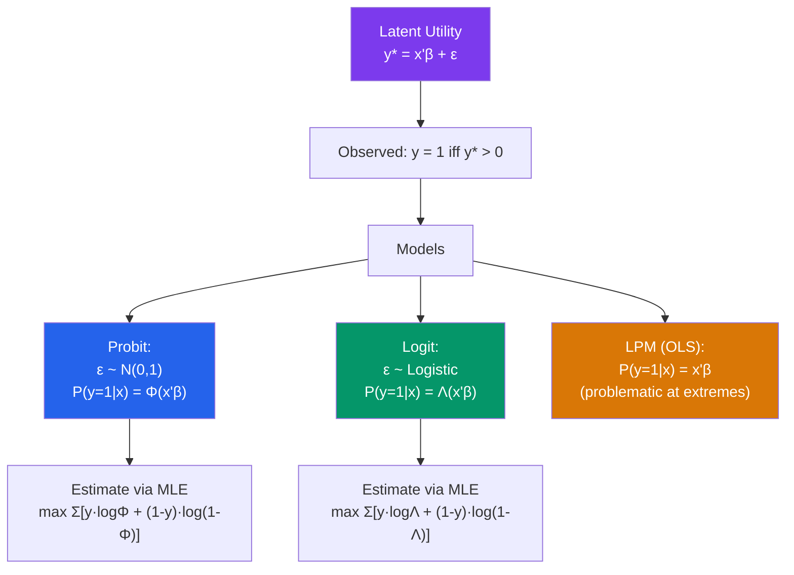

# 🔘 Probit and Logit

> [!abstract] TL;DR
> When $y_i \in \{0, 1\}$, OLS (the Linear Probability Model) can predict probabilities outside [0, 1] and gives heteroskedastic errors by construction. **Probit** models $P(y=1 \mid x) = \Phi(x'\beta)$ and **logit** models $P(y=1 \mid x) = \Lambda(x'\beta) = e^{x'\beta}/(1+e^{x'\beta})$. Both are estimated by MLE. Coefficients are not directly interpretable — compute **marginal effects** $\partial P/\partial x_j$. The latent variable interpretation links both to an underlying continuous utility index.

## Intuition — analogy FIRST

Imagine predicting whether a student passes an exam ($y = 1$) based on hours studied ($x$). The OLS line might predict a 120% probability of passing for students who study 20 hours — nonsensical. Probit and logit squash the linear index $x'\beta$ through an S-shaped curve (the normal CDF or logistic function) that ensures predictions always lie in (0, 1). The probability of passing rises with study hours but asymptotically approaches 1, never exceeding it.

---

## How It Works



## Key Concepts / Details

### The Latent Variable Model

Both probit and logit derive from:
$$y_i^* = x_i'\beta + \varepsilon_i, \quad y_i = \mathbf{1}[y_i^* > 0]$$

- **Probit**: $\varepsilon_i \sim N(0, 1)$ → $P(y_i = 1 \mid x_i) = \Phi(x_i'\beta)$
- **Logit**: $\varepsilon_i \sim \text{Logistic}(0,1)$ → $P(y_i = 1 \mid x_i) = \frac{e^{x_i'\beta}}{1 + e^{x_i'\beta}} = \Lambda(x_i'\beta)$

**Normalization**: The scale of $\varepsilon$ is not identified separately from $\beta$. We normalize $\text{Var}(\varepsilon) = 1$ (probit) or $\pi^2/3$ (logit) — this is why we cannot compare coefficient magnitudes between probit and logit. The ratio $\beta_{logit}/\beta_{probit} \approx 1.6$ (logit SDs larger).

### Log-Likelihood

**Logit** log-likelihood:
$$\ell(\beta) = \sum_{i=1}^n \left[ y_i \log \Lambda(x_i'\beta) + (1 - y_i) \log(1 - \Lambda(x_i'\beta)) \right]$$

This is globally concave → unique maximum, reliable numerical optimization.

**Probit** log-likelihood: same form with $\Phi$ in place of $\Lambda$.

### Marginal Effects

**The critical point**: probit/logit coefficients $\beta_j$ are NOT marginal effects. They are index coefficients. The actual effect of $x_j$ on $P(y=1)$ is:

**Probit** at a point $x$:
$$\frac{\partial P(y=1 \mid x)}{\partial x_j} = \phi(x'\beta) \cdot \beta_j$$

**Logit** at a point $x$:
$$\frac{\partial P(y=1 \mid x)}{\partial x_j} = \Lambda(x'\beta)[1 - \Lambda(x'\beta)] \cdot \beta_j$$

where $\phi$ and $\Lambda(1-\Lambda)$ are the "scaling factors" that depend on $x$. The marginal effect varies across observations.

**Three ways to report**:
1. **AME (Average Marginal Effect)**: $\frac{1}{n}\sum_i \phi(x_i'\hat{\beta}) \cdot \hat{\beta}_j$ — average over the sample
2. **MEM (Marginal Effect at the Mean)**: $\phi(\bar{x}'\hat{\beta}) \cdot \hat{\beta}_j$ — evaluate at sample means
3. **MER (Marginal Effect at a Representative value)**: pick a specific $x^*$

AME is generally preferred in applied work.

### Comparing LPM, Probit, and Logit

| Aspect | LPM (OLS) | Probit | Logit |
|--------|----------|--------|-------|
| Probability bounds | Can exceed [0,1] | Always in (0,1) | Always in (0,1) |
| Estimation | OLS | MLE | MLE |
| Heteroskedasticity | Inherent (need robust SEs) | Not present | Not present |
| Interpretation | Direct marginal effect | Need to compute ME | Need to compute ME |
| Consistency | Consistent for ME at mean | Consistent | Consistent |
| Practicality | Simple, always works | Slightly harder | Widely used in ML |

**When to use LPM**: When main goal is estimating average marginal effects, large $n$, outcome not too close to 0 or 1, and you need IV (2SLS with binary outcomes is tricky with probit).

**When to use probit/logit**: When probabilities near 0 or 1 are important, when you need predicted probabilities, or when the binary outcome mechanism is the focus.

### Odds Ratios (Logit only)

Logit has a special property: the log-odds is linear in $x$:
$$\log\frac{P(y=1 \mid x)}{P(y=0 \mid x)} = x'\beta$$

So $e^{\beta_j}$ is the **odds ratio**: how the odds of $y=1$ are multiplied when $x_j$ increases by 1. Intuitive for some audiences but can be misleading (odds ratios are not relative risks).

```r
library(margins)
library(stargazer)

# Simulate binary outcome
set.seed(42)
n  <- 1000
x1 <- rnorm(n)
x2 <- rbinom(n, 1, 0.4)
y  <- rbinom(n, 1, plogis(-0.5 + 0.8*x1 + 1.2*x2))

df <- data.frame(y, x1, x2)

# 1. LPM (OLS on binary y)
lpm  <- lm(y ~ x1 + x2, data = df)
coeftest(lpm, vcov = vcovHC(lpm, "HC1"))

# 2. Logit
logit_model <- glm(y ~ x1 + x2, data = df, family = binomial(link = "logit"))
summary(logit_model)

# 3. Probit
probit_model <- glm(y ~ x1 + x2, data = df, family = binomial(link = "probit"))
summary(probit_model)

# 4. Average Marginal Effects (AME)
ame_logit  <- margins(logit_model)
summary(ame_logit)

ame_probit <- margins(probit_model)
summary(ame_probit)

# 5. Predicted probabilities
pred_probs_logit  <- predict(logit_model, type = "response")
pred_probs_probit <- predict(probit_model, type = "response")

# 6. Odds ratios from logit
exp(coef(logit_model))

# 7. Model comparison
stargazer(lpm, logit_model, probit_model, type = "text",
          column.labels = c("LPM", "Logit", "Probit"))

# 8. Pseudo-R² (McFadden)
library(pscl)
pR2(logit_model)   # McFadden, Cox-Snell, etc.
```

### Goodness of Fit for Binary Models

| Measure | Formula | Notes |
|---------|---------|-------|
| McFadden's Pseudo-$R^2$ | $1 - \ell(\hat{\beta})/\ell(0)$ | 0.2–0.4 considered good fit |
| Percent correctly predicted | | Threshold-dependent |
| AUC (ROC) | Area under receiver operating characteristic | Threshold-free; 0.5 = random, 1 = perfect |
| Hosmer-Lemeshow | Calibration test | Tests if predicted $\approx$ observed probabilities |

---

## Real-World Notes

- **Labor force participation**: The canonical probit application — what determines whether a woman participates in the labor market (Mroz, 1987)? Binary outcome (in/out), continuous regressors (wage, education, non-labor income).
- **Credit scoring**: Logit is the industry standard for modeling default probability. Outputs are directly interpretable as "probability of default within 12 months."
- **Political science**: Logit models of voting behavior (vote = 1 if vote for party A) are standard. AMEs let researchers compare effects across models with different covariates.

---

## Common Pitfalls

- **Reporting logit coefficients as marginal effects**: $\hat{\beta}_j = 0.5$ in a logit does not mean $P(y=1)$ increases by 0.5 per unit of $x_j$. Compute AME.
- **Using LPM when probabilities are extreme**: LPM fitted values outside [0,1] are theoretically impossible. When your sample has many high-risk individuals, probit/logit is more appropriate.
- **Not scaling continuous regressors for AME interpretation**: A marginal effect for "years of education" is per one year; for "income in dollars" it's per dollar. Consider standardization for comparability.

---

## Related Concepts

- [[_MOC_Advanced_Regression|↑ Section MOC]]
- [[Maximum_Likelihood_Estimation]] — The estimation method for probit and logit
- [[Tobit_and_Censored_Models]] — Extension to censored continuous outcomes
- [[OLS_Estimation]] — The LPM as a baseline comparison

---

## Review Questions

1. Derive the log-likelihood function for the logit model. Explain why it is globally concave (unlike some other MLE log-likelihoods).
2. A logit model gives $\hat{\beta}_1 = 0.6$ for a continuous regressor $x_1$ with sample mean $\bar{x}_1 = 2$ and other regressors at their means. Compute the AME and MEM, and explain why they differ.
3. Under what circumstances would you prefer the LPM to probit/logit despite its theoretical limitations? Give two specific situations.

---

## Sources

- Wooldridge, J.M., *Introductory Econometrics*, Ch. 17 — Limited Dependent Variables
- Greene, W.H., *Econometric Analysis*, Ch. 17 — Discrete Choice Models
- Angrist, J.D. & Pischke, J.S., *Mostly Harmless Econometrics*, Ch. 3.4 — Nonlinear Causal Models

#econometrics #statistics #advanced-regression #probit #logit #binary-choice
