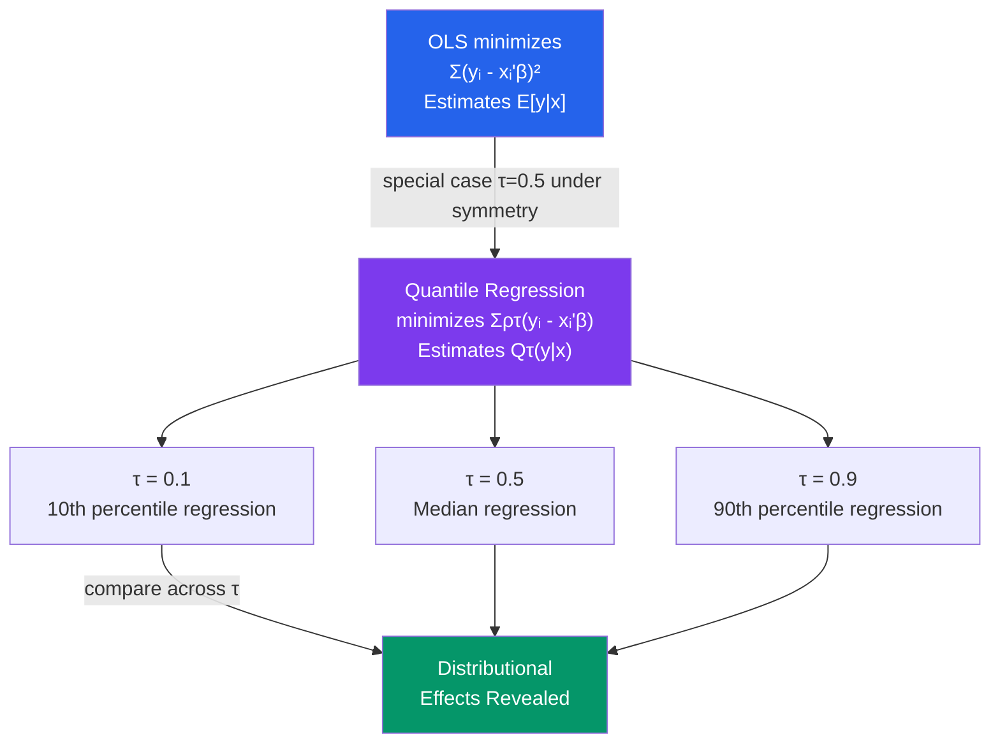

# 📊 Quantile Regression

> [!abstract] TL;DR
> OLS estimates the **conditional mean** $E[y \mid x]$. Quantile regression estimates the **conditional $\tau$-quantile** $Q_\tau(y \mid x)$ for any $\tau \in (0, 1)$, minimizing the asymmetric "check function" $\rho_\tau(u) = u(\tau - \mathbf{1}[u < 0])$. At $\tau = 0.5$, quantile regression is **median regression** — robust to outliers and valid without distributional assumptions. Running QR at multiple $\tau$ values reveals how the entire conditional distribution of $y$ shifts with $x$, critical for wage inequality research and risk modelling.

## Intuition — analogy FIRST

OLS tells you how the *average* wage changes with education. But suppose education has different effects for different types of workers: it dramatically raises wages for high-ability workers (top of the distribution) but barely affects wages for low-ability workers (bottom). OLS misses this heterogeneity by focusing only on the average.

Quantile regression asks: "How does education affect the *median* wage? The *90th percentile* wage? The *10th percentile* wage?" Running QR at multiple quantiles reveals the full picture of distributional effects — whether inequality is compressed or expanded as education rises.

---

## How It Works



## Key Concepts / Details

### The Check Function (Tilted Absolute Value)

The $\tau$-quantile regression minimizes:
$$\hat{\beta}(\tau) = \arg\min_\beta \sum_{i=1}^n \rho_\tau(y_i - x_i'\beta)$$

where the **check function** is:
$$\rho_\tau(u) = u \cdot (\tau - \mathbf{1}[u < 0]) = \begin{cases} \tau u & \text{if } u \geq 0 \\ (\tau - 1) u & \text{if } u < 0 \end{cases}$$

For $\tau = 0.5$: $\rho_{0.5}(u) = |u|/2$ → **least absolute deviations (LAD)**, the median.

The check function weights positive and negative residuals asymmetrically: over-predictions ($u < 0$) are weighted by $(1-\tau)$; under-predictions by $\tau$.

### Properties of the QR Estimator

| Property | OLS | QR |
|----------|-----|-----|
| Objective | Minimize $\sum u_i^2$ | Minimize $\sum \rho_\tau(u_i)$ |
| Estimate | Conditional mean $E[y\mid x]$ | Conditional $\tau$-quantile $Q_\tau(y\mid x)$ |
| Distribution assumption | None for consistency (CLT helps) | None for consistency |
| Efficiency | BLUE under homoskedastic normal errors | Less efficient than OLS under normality |
| Robustness to outliers | Sensitive | Robust (especially at $\tau = 0.5$) |
| Equivariance | Linear transformations | Monotone transformations of $y$ |

**Equivariance to monotone transformations**: $Q_\tau[\log y \mid x] = \log Q_\tau[y \mid x]$. This is a crucial advantage over OLS where $E[\log y] \neq \log E[y]$.

### Asymptotic Distribution (Koenker-Bassett)

Under regularity conditions:
$$\sqrt{n}(\hat{\beta}(\tau) - \beta(\tau)) \xrightarrow{d} N\left(0, \frac{\tau(1-\tau)}{f_{y|x}(Q_\tau(y\mid x))^2} (X'X/n)^{-1}\right)$$

where $f_{y|x}(Q_\tau)$ is the conditional density of $y$ evaluated at the $\tau$-quantile. Inference uses:
- **Bootstrap** (most common in practice)
- **Kernel density estimation** to estimate the sparsity function $f_{y|x}$
- **Rank score tests** for hypothesis testing

### Testing Homogeneity of QR Slopes

If $\hat{\beta}(\tau)$ is constant across $\tau$, the effect of $x$ on $y$ is purely location-shifting (the entire distribution shifts, not its shape). The **Koenker-Bassett test** of $H_0: \beta(\tau_1) = \beta(\tau_2)$ tests whether slopes differ across quantiles.

### Interpretation

$\hat{\beta}_j(\tau)$: A one-unit increase in $x_j$ is associated with a $\hat{\beta}_j(\tau)$ change in the $\tau$-quantile of $y$ conditional on $x$.

Unlike OLS, there is no "marginal effect" computation needed — the quantile regression coefficient directly describes the conditional quantile shift.

```r
library(quantreg)
library(ggplot2)

# Load wage data
data("engel", package = "quantreg")  # Engel food expenditure data

# Fit quantile regression at multiple quantiles
taus   <- c(0.1, 0.25, 0.5, 0.75, 0.9)
qr_fit <- rq(foodexp ~ income, data = engel, tau = taus)
summary(qr_fit)

# Plot quantile process (coefficients vs tau)
qr_process <- rq(foodexp ~ income, data = engel, tau = seq(0.05, 0.95, 0.05))
plot(summary(qr_process))

# Wage inequality example
library(tidyverse)

# Fit at many quantiles: how does educ affect wage distribution?
wage_qr <- rq(log(wage) ~ educ + exper + I(exper^2) + female,
              data = wage_data,
              tau = seq(0.1, 0.9, 0.1))

# Extract and plot coefficients for educ
coef_educ <- coef(wage_qr)["educ", ]
ggplot(
  data.frame(tau = seq(0.1, 0.9, 0.1), beta = coef_educ),
  aes(x = tau, y = beta)
) +
  geom_line(color = "#2563eb", size = 1) +
  geom_point(size = 2) +
  geom_hline(yintercept = coef(lm(log(wage) ~ educ + exper + I(exper^2) + female,
                                   data = wage_data))["educ"],
             linetype = "dashed", color = "red") +
  labs(title = "Return to Education Across Wage Distribution",
       x = "Quantile τ", y = "Coefficient on Education",
       caption = "Red dashed: OLS estimate")

# Bootstrap standard errors
qr_boot <- summary(wage_qr, se = "boot", R = 500)
plot(qr_boot)

# Khmaladze test for slope homogeneity across quantiles
anova(wage_qr)
```

### Wage Inequality Applications

Quantile regression is the main econometric tool for studying wage inequality:

| Research Question | QR Approach |
|------------------|------------|
| Did education returns widen inequality? | If $\hat{\beta}_{educ}(\tau)$ rises with $\tau$, high-earners gain more from education |
| Effect of minimum wage on lower tail | Focus on $\tau < 0.25$; minimum wage should compress the lower distribution |
| Gender wage gap across distribution | Separate QR by gender; "glass ceiling" if gap rises at top quantiles |
| Return to experience by career stage | QR captures heterogeneous experience profiles |

---

## Real-World Notes

- **Buchinsky (1994)**: Used quantile regression to show that the college wage premium grew dramatically at the top of the wage distribution in the 1980s, providing evidence for skill-biased technological change.
- **Machado-Mata decomposition**: Extends the Oaxaca-Blinder wage decomposition to the full quantile distribution, allowing researchers to decompose wage inequality changes into composition effects (who works) and coefficient effects (what they earn).
- **Value at Risk (VaR)**: In finance, quantile regression at $\tau = 0.01$ or $\tau = 0.05$ directly estimates the 1% or 5% conditional quantile of portfolio returns — exactly the risk measure required for regulatory capital calculations.

---

## Common Pitfalls

- **Using QR when OLS suffices**: If the distributional effects are homogeneous (same slope at all quantiles), QR provides no additional insight over OLS and is less efficient.
- **Forgetting the equivariance property**: $Q_\tau[\log y \mid x] = \log Q_\tau[y \mid x]$ means you should fit QR on $\log y$ if you want to model the distribution of $y$. Do not exponentiate OLS fitted values and call them median estimates.
- **Using asymptotic SEs with fat-tailed distributions**: The asymptotic variance involves the density at the quantile, which is hard to estimate reliably. Bootstrap SEs are more robust.

---

## Related Concepts

- [[_MOC_Advanced_Regression|↑ Section MOC]]
- [[OLS_Estimation]] — Estimates the conditional mean; QR generalizes this to quantiles
- [[Heteroskedasticity]] — Varying QR slopes across $\tau$ is evidence of heteroskedasticity in the conditional distribution
- [[GLS_and_WLS]] — Alternative approach to handling non-constant variance

---

## Review Questions

1. Derive the check function $\rho_\tau(u)$ and explain why at $\tau = 0.5$ it reduces to least absolute deviations (LAD/median regression). Why is median regression more robust to outliers than OLS?
2. A wage regression at $\tau = 0.9$ gives $\hat{\beta}_{educ} = 0.12$, while at $\tau = 0.1$ it gives $\hat{\beta}_{educ} = 0.05$. What does this tell you about the distribution of returns to education?
3. Explain the equivariance property of quantile regression with respect to monotone transformations. Why does this make QR more convenient than OLS for log-transformed outcomes?

---

## Sources

- Koenker, R. & Bassett, G. (1978), "Regression Quantiles," *Econometrica* 46(1), 33–50
- Koenker, R. (2005), *Quantile Regression*, Cambridge University Press
- Buchinsky, M. (1994), "Changes in the U.S. Wage Structure 1963–1987," *Econometrica*

#econometrics #statistics #advanced-regression #quantile-regression #median-regression
