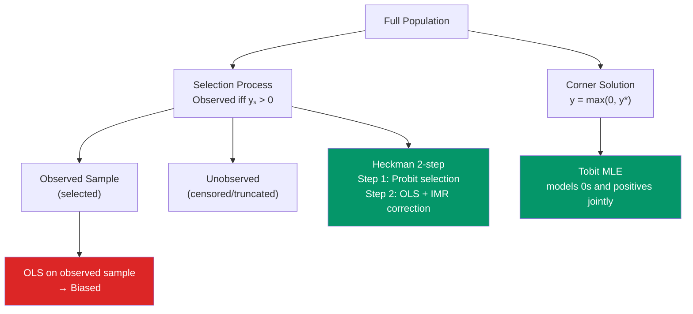

# 📊 Tobit and Censored Models

> [!abstract] TL;DR
> Censored outcomes (e.g., hours worked piled at 0 for non-workers, wages censored at minimum wage) violate OLS assumptions because the observed sample is not representative of the full population of interest. The **Tobit-1 model** handles corner-solution outcomes: $y = \max(0, x'\beta + \varepsilon)$, estimated by MLE. **Sample selection** (Heckman) addresses missing outcomes: a probit selection equation determines who is observed, and the **inverse Mills ratio** corrects for selection bias in the outcome equation. OLS on a selected sample is biased in the direction of the selection.

## Intuition — analogy FIRST

You want to study the effect of education on wages. But you only observe wages for people who work — those who do not work have no observed wage. If highly educated non-workers have different characteristics than non-workers without education, your sample of workers is non-representative. Regressing wages on education using only workers gives biased results because you have implicitly selected a sample that does not represent the full population.

The Heckman model is like a two-stage adjustment: first model who chooses to work (the selection equation), then adjust the wage equation for the systematic difference between workers and non-workers.

---

## How It Works



## Key Concepts / Details

### Censoring vs Truncation

| Type | What Happens | Example |
|------|-------------|---------|
| **Censoring** | Outcome value piled at boundary; $x$ observed for everyone | Wages censored at minimum wage; hours worked ≥ 0 |
| **Truncation** | Entire observation (both $y$ and $x$) lost below threshold | Only surveying employed workers (non-workers not in sample) |
| **Sample selection** | $y$ missing for some; $x$ observed for all; selection correlated with $y$ | Wage data missing for non-workers |

OLS on a censored or truncated sample is biased because the observed $y$ is a non-linear function of the true latent $y^*$.

### Tobit-1 Model (Corner Solution)

**Latent variable**: $y_i^* = x_i'\beta + \varepsilon_i$, $\varepsilon_i \sim N(0, \sigma^2)$

**Observed variable**: $y_i = \max(0, y_i^*) = \begin{cases} y_i^* & \text{if } y_i^* > 0 \\ 0 & \text{if } y_i^* \leq 0 \end{cases}$

**Log-likelihood**:
$$\ell(\beta, \sigma) = \sum_{y_i > 0} \log\left[\frac{1}{\sigma}\phi\left(\frac{y_i - x_i'\beta}{\sigma}\right)\right] + \sum_{y_i = 0} \log\left[\Phi\left(\frac{-x_i'\beta}{\sigma}\right)\right]$$

The first sum covers observed positive values (treated like normal regression); the second covers zeros (treated like a probit for $y^* \leq 0$).

**Marginal effects**: For the Tobit, there are three objects of interest:

| Quantity | Formula |
|----------|---------|
| Effect on latent $y^*$ | $\beta_j$ |
| Effect on $E[y \mid x]$ | $\Phi(x'\beta/\sigma) \cdot \beta_j$ (McDonald-Moffitt) |
| Effect on $E[y \mid y > 0, x]$ | More complex — involves inverse Mills ratio |

### Sample Selection (Heckman Model)

Two equations:
- **Selection equation**: $s_i = \mathbf{1}[\alpha_0 + x_i'\alpha + z_i'\gamma + u_i > 0]$ (probit)
- **Outcome equation**: $y_i = x_i'\beta + \varepsilon_i$ (observed only if $s_i = 1$)

If $(u_i, \varepsilon_i)$ are bivariate normal with correlation $\rho$:
$$E[y_i \mid x_i, s_i = 1] = x_i'\beta + \rho\sigma_\varepsilon \cdot \lambda(\alpha_0 + x_i'\alpha + z_i'\gamma)$$

where $\lambda(c) = \phi(c)/\Phi(c)$ is the **inverse Mills ratio (IMR)**.

**Heckman two-step estimator**:
1. Probit for selection; compute $\hat{\lambda}_i = \phi(\hat{\alpha}_0 + x_i'\hat{\alpha} + z_i'\hat{\gamma})/\Phi(\ldots)$
2. OLS of $y$ on $x$ and $\hat{\lambda}$ (for observed $s_i = 1$)

The coefficient on $\hat{\lambda}$ estimates $\rho\sigma_\varepsilon$. If it is significant, selection bias was present.

**Identification**: The exclusion restriction — at least one variable $z$ affects selection but not the outcome. Without $z$, the model is identified only through nonlinearity of $\lambda$, which is fragile.

```r
library(sampleSelection)
library(VGAM)

# Simulate Heckman selection
set.seed(42)
n       <- 1000
z       <- rnorm(n)            # exclusion restriction
x       <- rnorm(n)
u       <- rnorm(n)
eps     <- 0.7 * u + rnorm(n, sd = 0.7)  # correlated errors (ρ ≈ 0.7)
s_star  <- -0.5 + 0.4 * z + 0.3 * x + u
s       <- as.numeric(s_star > 0)        # selection
y       <- 2 + 1.5 * x + eps
y[s == 0] <- NA                           # censor non-selected

df <- data.frame(y, x, z, s)

# Heckman 2-step
heck <- heckit(
  selection = s ~ z + x,   # selection equation (includes z)
  outcome   = y ~ x,        # outcome equation (excludes z)
  data = df
)
summary(heck)

# Heckman MLE (more efficient than 2-step)
heck_ml <- selection(
  selection = s ~ z + x,
  outcome   = y ~ x,
  data = df,
  method = "ml"
)
summary(heck_ml)

# Tobit model (corner solution)
# Simulate: hours worked (0 for non-workers)
hours_star <- -2 + 1.2 * x + rnorm(n)
hours_obs  <- pmax(0, hours_star)   # censor at 0

# Tobit MLE
tobit_model <- vglm(hours_obs ~ x,
                     tobit(Lower = 0),
                     trace = FALSE)
summary(tobit_model)

# Alt: AER package
library(AER)
tobit_aer <- tobit(hours_obs ~ x, left = 0)
summary(tobit_aer)

# Marginal effects on E[y|x] (McDonald-Moffitt decomposition)
b    <- coef(tobit_aer)
s    <- tobit_aer$scale
xbar <- c(1, mean(x))  # intercept + mean(x)
prob_pos <- pnorm(sum(xbar * b) / s)
cat("dE[y|x]/dx1:", prob_pos * b["x"], "\n")
```

### Two-Part Models vs Tobit

The Tobit model assumes the **same process** drives both the 0/positive decision and the level. Sometimes this is wrong: the decision "to work at all" may be driven by different factors than "how many hours to work."

**Two-part model** (Cragg model):
1. Probit for $P(y > 0)$
2. Log-normal (or other) regression for $E[\log y \mid y > 0]$

These are estimated separately. The Tobit is a special case where both parts have the same $\beta/\sigma$.

---

## Real-World Notes

- **Mroz (1987)**: The classic Heckman application — women's wage offers. The wage equation is estimated only for workers; the exclusion restriction is number of young children (affects participation but arguably not the offered wage). This paper appears in virtually every textbook.
- **Income censoring in surveys**: Top-coded income (incomes above $\$999k$ recorded as $\$999k$) creates right-censoring. Tobit from above handles this.
- **Duration models**: Survival data is another form of censoring where the event time is censored by the observation window. Kaplan-Meier and Cox hazard models apply there.

---

## Common Pitfalls

- **Using OLS on a censored sample without adjustment**: OLS on truncated data is biased toward zero (the truncation throws away extreme cases). Quantify the bias before ignoring it.
- **Weak exclusion restriction in Heckman**: If $z$ weakly affects selection, the IMR is nearly collinear with $x$, making the two-step imprecise. Test instrument strength in the first-stage probit.
- **Confusing corner solutions with sample selection**: Tobit is appropriate for outcomes that are truly 0 (corner solution in optimization). Heckman is appropriate for outcomes that are missing due to a selection process.

---

## Related Concepts

- [[_MOC_Advanced_Regression|↑ Section MOC]]
- [[Probit_and_Logit]] — The selection equation is a probit
- [[Maximum_Likelihood_Estimation]] — Both Tobit and Heckman ML are estimated by MLE
- [[Omitted_Variable_Bias]] — Sample selection creates a form of OVB (the IMR is the omitted variable)
- [[Instrumental_Variables]] — Similar exclusion restrictions for identification

---

## Review Questions

1. Explain the difference between a censored sample and a truncated sample. Give an economic example of each. Why does OLS fail for both?
2. Derive the conditional expectation $E[y_i \mid s_i = 1, x_i]$ in the Heckman model. What is the inverse Mills ratio and why does its coefficient measure selection bias?
3. Under what circumstances would you use a two-part model instead of a Tobit model? What additional flexibility does the two-part model allow?

---

## Sources

- Wooldridge, J.M., *Econometric Analysis of Cross Section and Panel Data*, Ch. 17 — Tobit; Ch. 19 — Sample Selection
- Heckman, J.J. (1979), "Sample Selection Bias as a Specification Error," *Econometrica* 47(1), 153–161
- Mroz, T.A. (1987), "The Sensitivity of an Empirical Model of Married Women's Hours of Work," *Econometrica*

#econometrics #statistics #advanced-regression #tobit #censored #heckman #sample-selection
