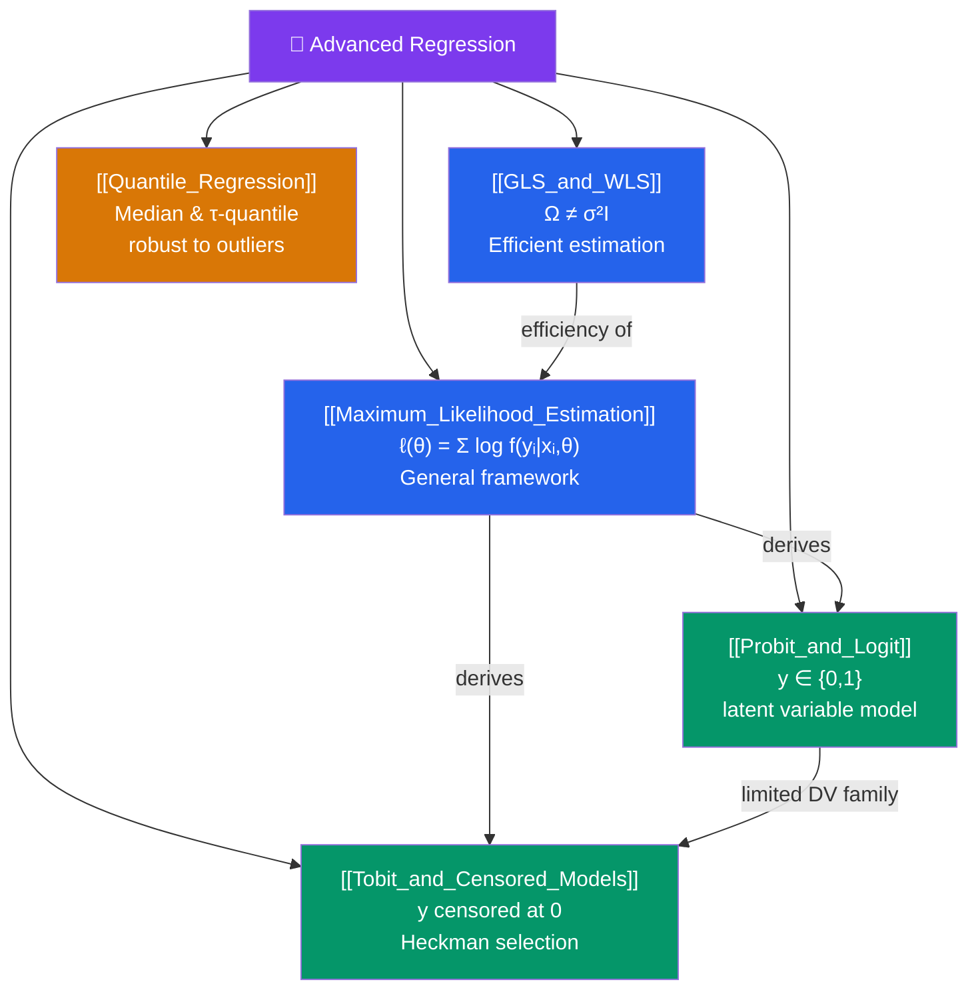

# 🗺️ Advanced Regression — Map of Content

> [!abstract] What This Section Covers
> This section extends OLS into settings where the Gauss-Markov assumptions fail structurally — not just with fixable violations. **GLS/WLS** handles non-spherical errors efficiently. **Maximum Likelihood Estimation** provides a general framework that nests OLS and produces efficient estimators for non-normal outcomes. **Probit and Logit** model binary outcomes properly (where OLS produces nonsensical probability predictions outside [0,1]). **Tobit and censored models** handle outcomes truncated or piled up at a boundary. **Quantile regression** describes the full conditional distribution of $y$, not just its mean.

## Concept Map

## Learning Path

1. [[GLS_and_WLS]] — The efficient estimator when errors are heteroskedastic or autocorrelated; FGLS; Aitken's theorem.
2. [[Maximum_Likelihood_Estimation]] — The general principle of ML estimation, the score and information matrix, and the asymptotic theory of MLE.
3. [[Probit_and_Logit]] — Binary outcomes: the latent variable interpretation, log-odds, marginal effects, and model selection.
4. [[Tobit_and_Censored_Models]] — Censored and truncated outcomes: Tobit-1, Heckman selection model, and two-part models.
5. [[Quantile_Regression]] — Estimation at quantiles of the conditional distribution; check function loss; applications in wage inequality research.

## All Notes at a Glance

| Note | Difficulty | What You'll Learn |
|------|------------|-------------------|
| [[GLS_and_WLS]] | Intermediate | Aitken's GLS, FGLS, Cochrane-Orcutt, WLS for known variance function |
| [[Maximum_Likelihood_Estimation]] | Intermediate | Likelihood function, score, information matrix, Cramér-Rao bound, Newton-Raphson |
| [[Probit_and_Logit]] | Intermediate | Latent variable model, log-odds, marginal effects, LPM vs probit vs logit |
| [[Tobit_and_Censored_Models]] | Advanced | Censoring vs truncation, Tobit, Heckman two-step, sample selection |
| [[Quantile_Regression]] | Advanced | Check function, quantile regression estimator, Koenker-Bassett, wage distribution applications |

## Key Questions This Section Answers

- When is GLS more efficient than OLS, and what additional information does it require?
- How is MLE related to OLS when errors are normally distributed?
- Why does OLS on binary outcomes (the Linear Probability Model) fail at the boundaries, and how does probit fix this?
- What is the difference between a censored and a truncated sample?
- How does quantile regression differ from OLS, and why is it more robust to outliers?

## Related Sections

- [[_MOC_Econometrics_Master|↑ Econometrics Master MOC]]
- [[_MOC_OLS_Problems|← OLS Problems]] — The violations that motivate GLS
- [[_MOC_Panel_Data|→ Panel Data]] — Panel estimators that extend GLS ideas

#MOC #Econometrics #advanced-regression
