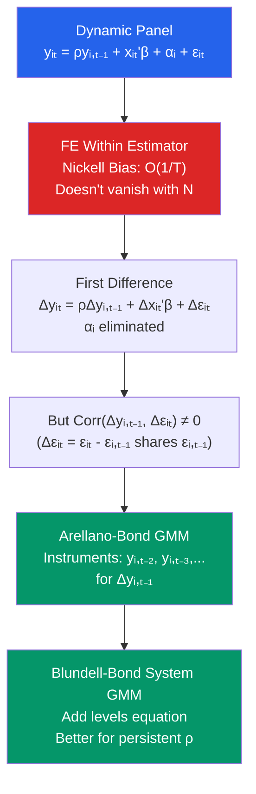

# ⚡ Dynamic Panel Data

> [!abstract] TL;DR
> A dynamic panel model includes the lagged dependent variable $y_{i,t-1}$ as a regressor: $y_{it} = \rho y_{i,t-1} + x_{it}'\beta + \alpha_i + \varepsilon_{it}$. The FE within estimator is **biased** in short panels ("Nickell bias") because $y_{i,t-1}$ is correlated with the demeaned error. The **Arellano-Bond (AB) GMM** estimator instruments $\Delta y_{i,t-1}$ with lagged levels $y_{i,t-2}, y_{i,t-3}, \ldots$. **Blundell-Bond System GMM** adds level equations and is preferred when $\rho$ is close to 1 or regressors are highly persistent.

## Intuition — analogy FIRST

Economic outcomes often depend on their past — firms with high investment last year tend to invest more this year; wages ratchet upward over careers. Including $y_{i,t-1}$ captures this persistence. But when you demean the data (as FE requires), $y_{i,t-1}$ and the demeaned error $(\varepsilon_{it} - \bar{\varepsilon}_i)$ are mechanically correlated because $\bar{\varepsilon}_i$ includes $\varepsilon_{i,t-1}$, which directly affects $y_{i,t-1}$. This is the Nickell bias — and it does not go away as $N \to \infty$ when $T$ is fixed.

The Arellano-Bond insight: first-difference to remove $\alpha_i$, then use past levels of $y$ as instruments for the differenced lagged dependent variable. Past levels are correlated with the current change in $y$ (relevant) but uncorrelated with the current innovation $\Delta \varepsilon_{it} = \varepsilon_{it} - \varepsilon_{i,t-1}$ (exogenous).

---

## How It Works



## Key Concepts / Details

### The Dynamic Panel Model

$$y_{it} = \rho y_{i,t-1} + x_{it}'\beta + \alpha_i + \varepsilon_{it}$$

where $|\rho| < 1$ (stationarity), $\varepsilon_{it}$ i.i.d., and $\alpha_i$ may be correlated with $x_{it}$ and $y_{i,0}$.

### Nickell Bias (FE is Biased)

The FE within transformation:
$$\tilde{y}_{it} = y_{it} - \bar{y}_i, \quad \tilde{y}_{i,t-1} = y_{i,t-1} - \bar{y}_i$$

The regressor $\tilde{y}_{i,t-1}$ is correlated with $\tilde{\varepsilon}_{it} = \varepsilon_{it} - \bar{\varepsilon}_i$ because $\bar{\varepsilon}_i = T^{-1}\sum_{s=1}^T \varepsilon_{is}$ includes $\varepsilon_{i,t-1}$, and $y_{i,t-1}$ is a function of $\varepsilon_{i,t-1}$.

**Magnitude of Nickell bias**: For $T$ small (fixed), the bias is $O(1/T)$:
$$\text{plim}_{N\to\infty} \hat{\rho}_{FE} = \rho - \frac{1+\rho}{T-1} + O(T^{-2})$$

For $T = 5$: bias ≈ $-(1+\rho)/4$. If $\rho = 0.5$: bias ≈ $-0.375$ — massive!

For large $T$ the bias vanishes. FE is acceptable for $T \geq 30$.

### Arellano-Bond First-Difference GMM

**Step 1**: First-difference to eliminate $\alpha_i$:
$$\Delta y_{it} = \rho \Delta y_{i,t-1} + \Delta x_{it}'\beta + \Delta \varepsilon_{it}$$

Now $\alpha_i$ is gone. But $\Delta y_{i,t-1} = y_{i,t-1} - y_{i,t-2}$ is correlated with $\Delta \varepsilon_{it} = \varepsilon_{it} - \varepsilon_{i,t-1}$ because both contain $\varepsilon_{i,t-1}$.

**Step 2**: Use lagged levels as instruments. For period $t$, the instrument set:
$$Z_i^{(t)} = (y_{i,1}, y_{i,2}, \ldots, y_{i,t-2})$$

These are valid because:
- **Relevance**: $y_{i,t-2}$ is correlated with $\Delta y_{i,t-1}$ (persistence in $y$)
- **Exogeneity**: $y_{i,t-2} \perp \Delta \varepsilon_{it}$ if $\varepsilon$ is serially uncorrelated

The instrument matrix grows with $T$ — this is the **instrument proliferation problem** for large $T$.

**Two-step GMM**: Use initial weight matrix; update using residuals. More efficient but standard errors need finite-sample correction (Windmeijer, 2005).

### Blundell-Bond System GMM

When $\rho$ is close to 1 or $x_{it}$ are persistent, lagged levels are weak instruments for first differences. **System GMM** (Blundell-Bond, 1998) augments the system:
1. First-difference equation: instruments are lagged levels $y_{i,t-2}$, $\Delta x_{i,t-1}$
2. Level equation: instruments are lagged differences $\Delta y_{i,t-1}$, $\Delta x_{i,t-1}$

Requires: stationarity condition $E[y_{i,1} \Delta \alpha_i] = 0$ (initial conditions mean-stationary).

System GMM is more efficient and reduces finite-sample bias when the AR coefficient is high.

### Specification Tests

| Test | Null | What it checks |
|------|------|----------------|
| **AR(1) test** | No autocorrelation in $\Delta \varepsilon_{it}$ of order 1 | Should reject (first differences create AR(1)) |
| **AR(2) test** | No autocorrelation in $\Delta \varepsilon_{it}$ of order 2 | Should NOT reject (no serial correlation in levels) |
| **Sargan/Hansen test** | Instruments are valid (overidentifying restrictions) | Should NOT reject ($p > 0.1$ preferred) |

If AR(2) is rejected: serial correlation in $\varepsilon_{it}$ — need more lags as instruments.  
If Sargan/Hansen rejects: instruments are invalid — use fewer or different lags.

```r
library(plm)
library(pgmm)

# Install pgmm if needed: install.packages("pgmm")
data("EmplUK", package = "plm")
emp_panel <- pdata.frame(EmplUK, index = c("firm", "year"))

# 1. FE (biased for dynamic panel with short T)
fe_dyn <- plm(log(emp) ~ lag(log(emp)) + log(wage) + log(capital) + log(output),
              data = emp_panel, model = "within")
summary(fe_dyn)
cat("FE ρ̂ (Nickell-biased):", coef(fe_dyn)["lag(log(emp))"], "\n")

# 2. Arellano-Bond first-difference GMM (one-step)
ab_model <- pgmm(log(emp) ~ lag(log(emp), 1:2) + log(wage) + log(capital) + log(output) |
                   lag(log(emp), 2:99),  # instruments: levels lagged 2+
                 data = emp_panel,
                 effect = "twoways",
                 model = "twosteps")
summary(ab_model, robust = TRUE)

# AR(1), AR(2) tests
mtest(ab_model, order = 1)  # should reject
mtest(ab_model, order = 2)  # should NOT reject

# Sargan-Hansen test of overidentifying restrictions
sargan(ab_model)

# 3. Blundell-Bond System GMM
bb_model <- pgmm(log(emp) ~ lag(log(emp), 1:1) + log(wage) + log(capital) + log(output) |
                   lag(log(emp), 2:99),
                 data = emp_panel,
                 effect = "twoways",
                 model = "twosteps",
                 transformation = "ld")  # level + difference equations
summary(bb_model, robust = TRUE)

cat("\nFE ρ̂:", coef(fe_dyn)["lag(log(emp))"], "\n")
cat("AB ρ̂:", coef(ab_model)[1], "\n")
cat("BB ρ̂:", coef(bb_model)[1], "\n")
```

### Finite-Sample Issues

| Problem | Consequence | Solution |
|---------|-------------|---------|
| Instrument proliferation (large $T$) | Sargan test over-rejects; GMM becomes biased | Collapse instruments; limit lag depth |
| Two-step standard errors | Biased downward in finite samples | Windmeijer (2005) finite-sample correction |
| Weak instruments ($\rho \approx 1$) | AB has large finite-sample bias | Switch to System GMM |
| Many regressors relative to $N$ | GMM unstable | Use fewer instruments; regularize |

---

## Real-World Notes

- **Arellano and Bond (1991)**: Seminal paper using UK firm-level employment data. Showed FE estimates of labour demand were severely biased for short panels. Their AB estimator became the standard in micro-panel dynamics.
- **Blundell and Bond (1998)**: Extended to system GMM after showing AB has poor finite-sample properties for near-unit-root processes. System GMM is now the most widely used dynamic panel estimator in applied economics.
- **Cross-country growth**: Caselli, Esquivel, and Lefort (1996) applied AB GMM to Solow growth regressions, finding much lower convergence rates than OLS suggested — a textbook case of Nickell bias in macroeconomic panels.

---

## Common Pitfalls

- **Using too many instruments**: With large $T$, the instrument matrix explodes and the Sargan test has no power. Limit lags to 2–4 or collapse the instrument matrix.
- **Reporting one-step GMM without Windmeijer correction**: Two-step standard errors without the Windmeijer correction are dramatically too small. Always report robust two-step SEs.
- **Using AB when $\rho$ is close to 1**: Near-unit-root processes make lagged levels weak instruments for first differences. Use System GMM.

---

## Related Concepts

- [[_MOC_Panel_Data|↑ Section MOC]]
- [[Fixed_Effects]] — The estimator that fails due to Nickell bias in short dynamic panels
- [[Instrumental_Variables]] — The underlying identification strategy for Arellano-Bond
- [[Autocorrelation]] — Serial correlation tests are central to validating the GMM estimator
- [[Unit_Roots_and_Integration]] — Related when $\rho \to 1$

---

## Review Questions

1. Explain the Nickell bias: why is the FE within estimator inconsistent for $\rho$ in a dynamic panel with fixed $T$? Show the mechanism using the demeaned error decomposition.
2. Describe the Arellano-Bond instrument: why are $y_{i,t-2}, y_{i,t-3}, \ldots$ valid instruments for $\Delta y_{i,t-1}$ in the first-differenced equation? What does "valid" require?
3. You run AB GMM and find: AR(1) rejects, AR(2) does not reject, Sargan does not reject. What do each of these tell you, and what is your conclusion about the validity of the estimates?

---

## Sources

- Arellano, M. & Bond, S. (1991), "Some Tests of Specification for Panel Data," *Review of Economic Studies*
- Blundell, R. & Bond, S. (1998), "Initial Conditions and Moment Restrictions in Dynamic Panel Data Models," *Journal of Econometrics*
- Nickell, S. (1981), "Biases in Dynamic Models with Fixed Effects," *Econometrica* 49(6), 1417–1426

#econometrics #statistics #panel-data #dynamic-panel #Arellano-Bond #GMM #Nickell-bias
