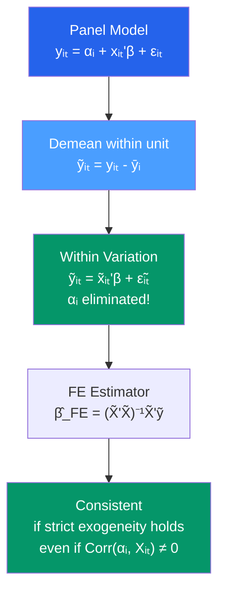

# 🔒 Fixed Effects

> [!abstract] TL;DR
> The Fixed Effects (FE) estimator eliminates all time-invariant unobserved heterogeneity by **demeaning each unit** (the within estimator): $\tilde{y}_{it} = y_{it} - \bar{y}_i$. The FE estimator $\hat{\beta}_{FE} = (\tilde{X}'\tilde{X})^{-1}\tilde{X}'\tilde{y}$ is consistent whenever $E[\varepsilon_{it} \mid x_{it}, \alpha_i] = 0$ (strict exogeneity), regardless of any correlation between $\alpha_i$ and $x_{it}$. The cost: **time-invariant regressors are absorbed** and cannot be estimated. Use two-way FE to control for both unit and time effects.

## Intuition — analogy FIRST

You want to know whether exercise increases wages. You have 10 years of data on 1000 people. Some people are just naturally more ambitious — they exercise more *and* earn more, but their wages would be high regardless of exercise. This unobserved "ambition" is a time-invariant confounder correlated with both exercise and wages.

Fixed effects solves this by using each person as their own control. Instead of comparing a high-exercise person to a low-exercise person (cross-sectional comparison plagued by confounders), FE compares each person's wages in their high-exercise years to their wages in their low-exercise years. Ambition is held constant because you're only looking within the same person over time.

---

## How It Works



## Key Concepts / Details

### The Within Transformation (Demeaning)

Start with:
$$y_{it} = \alpha_i + x_{it}'\beta + \varepsilon_{it}$$

Average within each unit $i$ over $t = 1, \ldots, T$:
$$\bar{y}_i = \alpha_i + \bar{x}_i'\beta + \bar{\varepsilon}_i$$

Subtract:
$$\underbrace{(y_{it} - \bar{y}_i)}_{\tilde{y}_{it}} = \underbrace{(x_{it} - \bar{x}_i)'}_{\tilde{x}_{it}}\beta + \underbrace{(\varepsilon_{it} - \bar{\varepsilon}_i)}_{\tilde{\varepsilon}_{it}}$$

The unit-specific intercepts $\alpha_i$ **cancel out**. OLS on the demeaned equation gives $\hat{\beta}_{FE}$.

### LSDV (Least Squares Dummy Variables)

Equivalently, include a dummy for each unit:
$$y_{it} = \sum_{i=1}^N \alpha_i D_i + x_{it}'\beta + \varepsilon_{it}$$

LSDV and the within estimator give identical $\hat{\beta}$ but different estimated intercepts. For large $N$, demeaning is computationally cheaper.

### What FE Controls For

FE controls for **all** time-invariant characteristics of each unit, both observed and unobserved. You never need to include:
- Region, gender, race (for individual FE)
- Industry, size category (for firm FE)
- Country culture, geography (for country FE)

These are all absorbed into $\alpha_i$.

**FE does NOT control for**:
- Time-varying confounders (variables that change over time and also affect $y$)
- Reverse causality (if $y_{it}$ affects $x_{it}$)

### Two-Way Fixed Effects (TWFE)

Add time fixed effects to control for aggregate shocks:
$$y_{it} = \alpha_i + \lambda_t + x_{it}'\beta + \varepsilon_{it}$$

This eliminates both (1) time-invariant unit heterogeneity and (2) common time trends. DiD (see [[Difference_in_Differences]]) is a special case of TWFE.

The within transformation for TWFE: demean by unit, by time, add back grand mean:
$$\tilde{y}_{it} = (y_{it} - \bar{y}_i - \bar{y}_t + \bar{y})$$

### The Strict Exogeneity Assumption

FE requires: $E[\varepsilon_{it} \mid x_{i1}, \ldots, x_{iT}, \alpha_i] = 0$ (strict exogeneity)

This rules out:
- Feedback from past errors to future regressors: $x_{it}$ cannot depend on $\varepsilon_{i,t-1}$
- Lagged dependent variable as regressor: $y_{i,t-1}$ on RHS violates strict exogeneity → [[Dynamic_Panel_Data]]

**Weaker condition sufficient for consistency**: $E[x_{it}'\varepsilon_{is}] = 0$ for all $t, s$ (but not enough for standard inference).

### Time-Invariant Regressors

Variables that do not vary within unit (gender, race, country, year-of-birth) are **perfectly collinear** with the unit dummies and cannot be estimated in FE. If you need to estimate the effect of a time-invariant variable, you must use [[Random_Effects]] (assuming RE assumptions hold) or the Hausman-Taylor estimator.

```r
library(plm)
library(lmtest)
library(sandwich)

data("Grunfeld", package = "plm")
p_data <- pdata.frame(Grunfeld, index = c("firm", "year"))

# 1. Fixed Effects (Within) estimator
fe_model <- plm(inv ~ value + capital, data = p_data, model = "within")
summary(fe_model)

# 2. Two-way FE (unit + time effects)
fe_twoway <- plm(inv ~ value + capital, data = p_data,
                 model = "within", effect = "twoways")
summary(fe_twoway)

# 3. Cluster-robust SEs (cluster by firm)
coeftest(fe_model, vcov = vcovHC(fe_model, cluster = "group"))

# 4. LSDV (equivalent — produces same β̂)
lsdv <- lm(inv ~ value + capital + as.factor(firm), data = Grunfeld)
# Compare coefficients (should match fe_model)
coef(lsdv)[c("value", "capital")]
coef(fe_model)

# 5. F-test for individual fixed effects
pFtest(fe_model, plm(inv ~ value + capital, data = p_data, model = "pooling"))

# 6. Manual demeaning
Grunfeld_dm <- Grunfeld |>
  dplyr::group_by(firm) |>
  dplyr::mutate(
    inv_dm    = inv    - mean(inv),
    value_dm  = value  - mean(value),
    capital_dm = capital - mean(capital)
  ) |>
  dplyr::ungroup()

fe_manual <- lm(inv_dm ~ 0 + value_dm + capital_dm, data = Grunfeld_dm)
summary(fe_manual)
```

### Properties of the FE Estimator

| Property | Condition | Notes |
|----------|-----------|-------|
| Consistent | Strict exogeneity + $N \to \infty$ | Consistent for any $\alpha_i$-$x_{it}$ correlation |
| Asymptotically normal | Standard regularity | Use cluster-robust SEs |
| Efficient vs RE | When $\text{Cov}(\alpha_i, x_{it}) \neq 0$ | FE may be less efficient than RE when RE is valid |
| Incidental parameters | Fixed $T$, growing $N$ | FE for non-linear models is biased (see probit FE) |

---

## Real-World Notes

- **Difference-in-differences**: The canonical 2x2 DiD (treatment/control × before/after) is exactly a two-way FE model with two units and two time periods. The DiD estimate equals the FE estimate. See [[Difference_in_Differences]].
- **Firm productivity studies**: Olley-Pakes (1996) shows that OLS of productivity on capital dramatically overstates returns to scale because more productive firms use more capital — exactly the $\text{Cov}(\alpha_i, x_{it}) \neq 0$ problem FE addresses.
- **Education and wages in panel data**: Ashenfelter and Krueger (1994) use identical twins to implement a differencing estimator (similar to FE) that controls for genetic endowment by comparing earnings of twins with different education levels.

---

## Common Pitfalls

- **Forgetting FE absorbs time-invariant regressors**: If you include gender (for individual FE) or country (for country-year FE) in the model, it is either dropped or causes collinearity. Know what variation FE removes.
- **Ignoring the incidental parameters problem in non-linear FE**: In probit/logit with unit FE, the $\hat{\alpha}_i$ are inconsistently estimated when $T$ is fixed, which biases $\hat{\beta}$ too. Use conditional logit or bias-corrected probit.
- **Applying FE when the coefficient of interest is time-invariant**: If your treatment variable (e.g., gender, country membership) does not vary within unit, FE cannot identify it.

---

## Related Concepts

- [[_MOC_Panel_Data|↑ Section MOC]]
- [[Pooled_OLS]] — The biased baseline FE corrects
- [[Random_Effects]] — The efficient GLS alternative when $\text{Cov}(\alpha_i, x_{it}) = 0$
- [[Hausman_Test]] — Formal test between FE and RE
- [[Difference_in_Differences]] — A specific application of two-way FE for causal inference
- [[Dynamic_Panel_Data]] — What to do when strict exogeneity fails

---

## Review Questions

1. Derive the within estimator by demeaning the panel model. Show explicitly that unit-specific effects $\alpha_i$ cancel in the transformed equation.
2. Why can fixed effects not estimate the effect of a time-invariant regressor like gender or race? Under what circumstances could you still recover such an effect?
3. A researcher studying the effect of pollution on property values uses a cross-section OLS and gets $\hat{\beta}_{pollution} = -0.2$. She then uses panel FE and gets $\hat{\beta}_{pollution} = -0.05$. Explain why these estimates differ and which you would trust more.

---

## Sources

- Wooldridge, J.M., *Econometric Analysis of Cross Section and Panel Data*, Ch. 10–11
- Angrist, J.D. & Pischke, J.S., *Mostly Harmless Econometrics*, Ch. 5.1 — Fixed Effects
- Arellano, M. (2003), *Panel Data Econometrics*, Oxford University Press, Ch. 2

#econometrics #statistics #panel-data #fixed-effects #within-estimator
