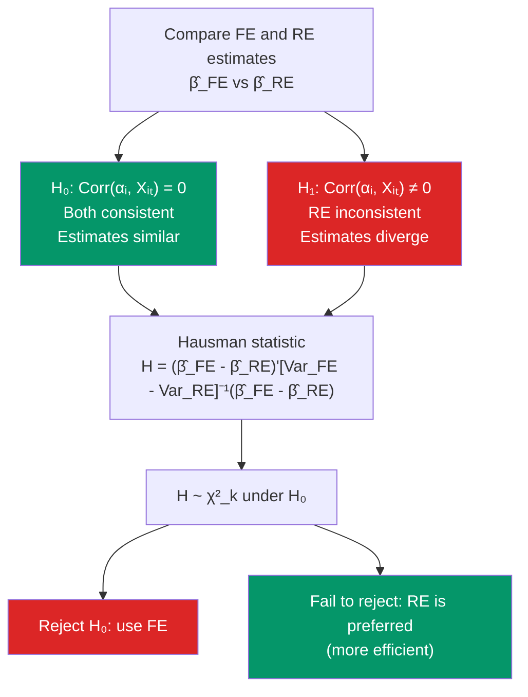

# ⚖️ Hausman Test

> [!abstract] TL;DR
> The Hausman test compares two estimators: one consistent under $H_0$ and $H_1$ (FE), and one consistent only under $H_0$ and efficient (RE). Under $H_0$: $\text{Cov}(\alpha_i, x_{it}) = 0$, both FE and RE are consistent so they should give similar estimates. Under $H_1$: $\text{Cov}(\alpha_i, x_{it}) \neq 0$, RE is inconsistent and FE and RE diverge. The test statistic is $H = (\hat{\beta}_{FE} - \hat{\beta}_{RE})'[\text{Var}(\hat{\beta}_{FE}) - \text{Var}(\hat{\beta}_{RE})]^{-1}(\hat{\beta}_{FE} - \hat{\beta}_{RE}) \sim \chi^2_k$.

## Intuition — analogy FIRST

You hire two accountants to audit your books. Accountant A (FE) is conservative: they scrutinize every transaction independently and their conclusions are always reliable but sometimes imprecise. Accountant B (RE) is more efficient: they use background information about your company to streamline the audit, but their conclusions are only valid if certain conditions hold (no systematic correlation between your past transactions and their background assumptions).

If both accountants agree, their background assumptions are plausibly valid — use B's more efficient conclusions. If they disagree substantially, something about B's assumptions is wrong — rely on A's more conservative but reliable estimate.

---

## How It Works



## Key Concepts / Details

### The Hausman Principle

The general Hausman principle applies whenever you have:
- $\hat{\beta}_1$: consistent under both $H_0$ and $H_1$
- $\hat{\beta}_2$: consistent and efficient under $H_0$, inconsistent under $H_1$

Under $H_0$: $\sqrt{n}(\hat{\beta}_1 - \hat{\beta}_2) \to 0$ (both converge to true $\beta$)  
Under $H_1$: $\hat{\beta}_1 - \hat{\beta}_2 \not\to 0$ (RE converges to a different plim)

**Key result** (Hausman 1978): Under $H_0$:
$$\text{Cov}(\hat{\beta}_{RE}, \hat{\beta}_{FE} - \hat{\beta}_{RE}) = 0$$

This simplifies the variance of the difference:
$$\text{Var}(\hat{\beta}_{FE} - \hat{\beta}_{RE}) = \text{Var}(\hat{\beta}_{FE}) - \text{Var}(\hat{\beta}_{RE})$$

### The Hausman Statistic

$$H = (\hat{\beta}_{FE} - \hat{\beta}_{RE})'[\hat{V}_{FE} - \hat{V}_{RE}]^{-1}(\hat{\beta}_{FE} - \hat{\beta}_{RE}) \xrightarrow{d} \chi^2_k$$

under $H_0$, where $k$ = number of time-varying regressors.

**Reject $H_0$** (use FE) if $H > \chi^2_{k, \alpha}$ (usually $\alpha = 0.05$).  
**Fail to reject** (RE preferred) if $H \leq \chi^2_{k, \alpha}$.

### When the Test Fails

The standard Hausman statistic requires $[\hat{V}_{FE} - \hat{V}_{RE}]$ to be positive semi-definite. In practice this may fail due to:
- Heteroskedasticity
- Cluster correlation in errors
- Finite-sample issues

**Alternatives**:
1. **Mundlak-Chamberlain test**: Add $\bar{x}_i$ to the RE model; test $H_0: \xi = 0$ (the regression approach). This is more robust and computable with heteroskedasticity-robust SEs.
2. **Robust Hausman** (Wooldridge 2002): A regression-based test using robust SEs.

### Hausman Test as Endogeneity Test

The Hausman test generalizes beyond panel data to any endogeneity test:
- $\hat{\beta}_1$: IV/2SLS (consistent under $H_0: E[\varepsilon \mid x] = 0$ and $H_1$)
- $\hat{\beta}_2$: OLS (efficient under $H_0$, inconsistent under $H_1$)

Test: are OLS and IV estimates significantly different? See [[Instrumental_Variables]] for the IV version (Wu-Hausman test).

```r
library(plm)
library(lmtest)
library(car)

data("Grunfeld", package = "plm")
p_data <- pdata.frame(Grunfeld, index = c("firm", "year"))

# Fit FE and RE
fe_model <- plm(inv ~ value + capital, data = p_data, model = "within")
re_model <- plm(inv ~ value + capital, data = p_data, model = "random")

# 1. Standard Hausman test
hausman_test <- phtest(fe_model, re_model)
print(hausman_test)
# p-value < 0.05: reject H0 → FE is needed

# 2. Mundlak device as alternative Hausman test
library(dplyr)
Grunfeld_m <- Grunfeld |>
  group_by(firm) |>
  mutate(
    value_bar   = mean(value),
    capital_bar = mean(capital)
  ) |>
  ungroup()

p_data_m <- pdata.frame(Grunfeld_m, index = c("firm", "year"))

# Mundlak RE model
mundlak_re <- plm(inv ~ value + capital + value_bar + capital_bar,
                   data = p_data_m, model = "random")

# Test H0: ξ_value_bar = ξ_capital_bar = 0
# Use Wald test on the Mundlak terms
lm_mundlak <- lm(inv ~ value + capital + value_bar + capital_bar + 0,
                  data = Grunfeld_m)

# Hausman via regression approach (Wooldridge)
# Instrument: use FE residuals or deviations
mundlak_test <- linearHypothesis(
  lm(inv ~ value + capital + value_bar + capital_bar, data = Grunfeld_m),
  c("value_bar = 0", "capital_bar = 0"),
  vcov = vcovCL(lm(inv ~ value + capital + value_bar + capital_bar,
                    data = Grunfeld_m), cluster = ~firm)
)
print(mundlak_test)

# 3. Summary comparison
cat("FE estimates:\n")
print(coef(fe_model))
cat("RE estimates:\n")
print(coef(re_model))
cat("\nDifference (FE - RE):\n")
print(coef(fe_model) - coef(re_model))
```

### Interpreting the Result

| Result | Decision | Interpretation |
|--------|----------|----------------|
| Reject $H_0$ (p < 0.05) | Use FE | Unit effects correlated with regressors; RE inconsistent |
| Fail to reject | Use RE | RE assumption plausible; RE is more efficient |
| Test fails (non-p.s.d.) | Use Mundlak or robust Hausman | Inference problem in standard formula |

**Practical guidance**: In economics, unit effects are often correlated with regressors (firms choose their capital in response to unobserved productivity). The Hausman test frequently rejects in practice. Default to FE unless strong theoretical reasons suggest RE.

---

## Real-World Notes

- **Hausman (1978)**: The original paper applied the test to a supply-demand system where OLS is the efficient estimator under exogeneity and IV is consistent under endogeneity. The panel FE vs RE application became the most common use.
- **Trade-off**: FE controls for all time-invariant confounders but cannot identify time-invariant regressors. RE is more efficient and identifies time-invariant effects but requires an untestable assumption. The Hausman test adjudicates, but remember it does not test all RE assumptions — only the correlation one.
- **Correlated Random Effects (CRE)**: Chamberlain's CRE model allows $\alpha_i = \bar{x}_i'\xi + v_i$, effectively recovering the FE estimate for time-varying regressors while estimating time-invariant effects as long as they are not collinear with $\bar{x}_i$.

---

## Common Pitfalls

- **Automatically accepting RE when the test fails to reject**: Failure to reject is not proof that RE assumptions hold — the test may have low power with small $N$ or few time periods.
- **Using standard Hausman when errors are heteroskedastic**: The standard formula assumes homoskedastic errors. Use the Mundlak or Wooldridge robust version.
- **Forgetting the test only covers time-varying regressors**: The Hausman comparison only involves $\hat{\beta}$ for time-varying variables. Time-invariant variables are not tested.

---

## Related Concepts

- [[_MOC_Panel_Data|↑ Section MOC]]
- [[Fixed_Effects]] — The consistent-under-$H_1$ estimator in the comparison
- [[Random_Effects]] — The efficient-under-$H_0$ estimator being tested
- [[Instrumental_Variables]] — The IV Hausman test (Wu-Hausman) follows the same principle

---

## Review Questions

1. Explain the Hausman principle: why does comparing two estimators — one consistent under both hypotheses and one efficient only under $H_0$ — identify endogeneity?
2. Derive the variance of $(\hat{\beta}_{FE} - \hat{\beta}_{RE})$. Why does the Hausman key result (zero covariance between RE and the difference) simplify the formula?
3. The standard Hausman statistic gives a negative definite matrix $[\hat{V}_{FE} - \hat{V}_{RE}]$. What is the problem, and what two alternatives would you use?

---

## Sources

- Hausman, J.A. (1978), "Specification Tests in Econometrics," *Econometrica* 46(6), 1251–1271
- Wooldridge, J.M., *Econometric Analysis of Cross Section and Panel Data*, Ch. 10.5 — The Hausman Test
- Mundlak, Y. (1978), "On the Pooling of Time Series and Cross Section Data," *Econometrica*

#econometrics #statistics #panel-data #hausman-test #FE-vs-RE
