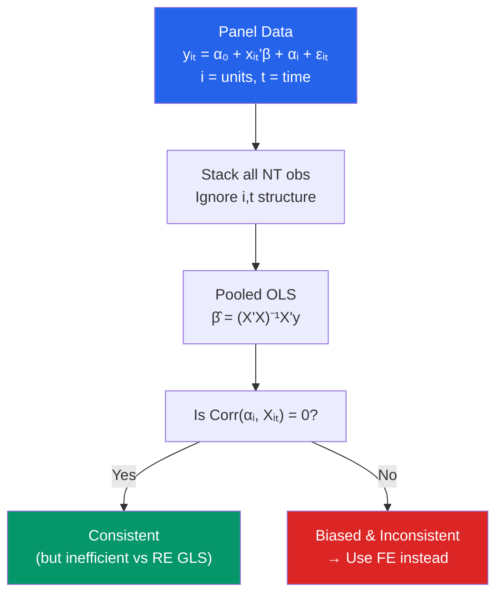

# 📋 Pooled OLS

> [!abstract] TL;DR
> Pooled OLS stacks all panel observations and runs a single OLS regression, ignoring the panel structure. It is **consistent only if unit-specific effects are uncorrelated with regressors** (the RE assumption). When unit effects are correlated with $X$ (the usual case in economics), pooled OLS is biased in the same way as cross-sectional OLS with omitted variables. Always use cluster-robust standard errors in a pooled panel regression to account for within-unit serial correlation.

## Intuition — analogy FIRST

Imagine you have 10 years of data on 50 countries' economic growth and democratic institutions. Pooled OLS treats these 500 observations as if they were 500 independent draws from a cross-section. But each country has a persistent "culture," "institutions," and "history" that affects both growth and democracy scores — and that does not change year to year. Ignoring this means your OLS cannot tell whether the positive correlation between democracy and growth in your data reflects a real causal link, or just the fact that the same stable unobserved factors drive both in each country over time.

---

## How It Works



## Key Concepts / Details

### The Panel Data Model

The one-way error component model:
$$y_{it} = x_{it}'\beta + \alpha_i + \varepsilon_{it}$$

where:
- $i = 1, \ldots, N$ (cross-sectional units: individuals, firms, countries)
- $t = 1, \ldots, T$ (time periods)
- $\alpha_i$ = unit-specific effect (time-invariant, unobserved heterogeneity)
- $\varepsilon_{it}$ = idiosyncratic error

Pooled OLS ignores $\alpha_i$ — it estimates $y_{it} = x_{it}'\beta + u_{it}$ where $u_{it} = \alpha_i + \varepsilon_{it}$.

### Consistency Conditions

Pooled OLS is consistent for $\beta$ iff $\text{Cov}(x_{it}, u_{it}) = \text{Cov}(x_{it}, \alpha_i + \varepsilon_{it}) = 0$.

This requires $\text{Cov}(x_{it}, \alpha_i) = 0$ — the unit effects are uncorrelated with the regressors.

**In economics, this is often violated**: ability is correlated with education, city-level infrastructure is correlated with firms' productivity, country culture correlates with institutions. Whenever $\alpha_i$ is an omitted variable correlated with $x_{it}$, pooled OLS is biased.

### Within vs Between Variation

The total variation in $x_{it}$ decomposes as:
$$\sum_{i,t} (x_{it} - \bar{x})^2 = \underbrace{N \sum_t (\bar{x}_t - \bar{x})^2}_{\text{between time}} + \underbrace{T \sum_i (\bar{x}_i - \bar{x})^2}_{\text{between units}} + \underbrace{\sum_{i,t} (x_{it} - \bar{x}_i - \bar{x}_t + \bar{x})^2}_{\text{within}}$$

**Pooled OLS** uses all three sources of variation.  
**Fixed effects** uses only within-unit variation (demeaned within each $i$).  
**Between estimator** uses only between-unit variation (regresses $\bar{y}_i$ on $\bar{x}_i$).

### Standard Errors in Pooled OLS

Within-unit errors are correlated across time (serial correlation from $\alpha_i$). The classical SEs assuming i.i.d. errors are wrong.

**Cluster-robust SEs** (clustering by unit $i$) account for arbitrary within-cluster correlation:
$$\widehat{\text{Var}}_{CL}(\hat{\beta}) = (X'X)^{-1}\left(\sum_{i=1}^N X_i' \hat{E}_i \hat{E}_i' X_i\right)(X'X)^{-1}$$

where $X_i$ is the $T \times k$ data matrix for unit $i$ and $\hat{E}_i$ is the $T \times 1$ vector of residuals. Always cluster-robust SEs in panel regressions.

```r
library(plm)
library(sandwich)
library(lmtest)

# Create panel data
data("Grunfeld", package = "plm")

# Declare panel structure
p_data <- pdata.frame(Grunfeld, index = c("firm", "year"))

# 1. Pooled OLS (ignores panel structure)
pool_ols <- plm(inv ~ value + capital, data = p_data, model = "pooling")
summary(pool_ols)

# 2. Cluster-robust SEs (cluster by firm)
coeftest(pool_ols, vcov = vcovHC(pool_ols, type = "HC1", cluster = "group"))

# Alternatively with lm() and clustered SEs
ols_lm <- lm(inv ~ value + capital, data = Grunfeld)
coeftest(ols_lm, vcov = vcovCL(ols_lm, cluster = ~firm))

# 3. Decompose within vs between variation
within_var  <- plm(inv ~ value + capital, data = p_data, model = "within")
between_var <- plm(inv ~ value + capital, data = p_data, model = "between")

cat("Pooled OLS β (value):", coef(pool_ols)["value"], "\n")
cat("Within (FE) β (value):", coef(within_var)["value"], "\n")
cat("Between β (value):", coef(between_var)["value"], "\n")

# 4. Breusch-Pagan test for random effects (tests if αᵢ matters)
plmtest(pool_ols, type = "bp")  # reject → unit effects are important
```

### When Pooled OLS Is Acceptable

| Situation | Pooled OLS OK? | Reason |
|-----------|---------------|--------|
| Short-T, large-N, unit effects known uncorrelated with $X$ | Yes | RE conditions hold |
| Macro data with strong cross-country confounders | No | Country FE needed |
| Randomized experiment with panel data | Yes (with cluster SEs) | Random assignment ensures $\text{Cov}(\alpha_i, x_{it}) = 0$ |
| Between-unit variation is the object of interest | With caution | Use between estimator, acknowledge cross-sectional confounding |

---

## Real-World Notes

- **Mundlak (1978)**: Showed that if $\alpha_i = \bar{x}_i' \xi + v_i$ (unit effects are linear functions of time-averaged regressors), pooled OLS with $\bar{x}_i$ added as controls is as efficient as RE and consistent even under RE failure. This is the Mundlak-Chamberlain correction.
- **Cross-country growth regressions**: Pooled OLS is deeply problematic for growth regressions because countries differ in culture, geography, and history — all correlated with institutions and correlated with growth. Arellano and Bond (1991) developed GMM partly to address this.

---

## Common Pitfalls

- **Not clustering standard errors**: Pooled OLS SEs without clustering are too small because within-unit errors are correlated. Cluster by the panel unit.
- **Believing pooled OLS is "safe" when $T$ is small**: With small $T$, unit effects are harder to estimate but just as problematic.
- **Confusing pooled OLS with RE**: RE is also estimated via stacked data but uses GLS and explicitly models the unit effect as random with zero correlation with $X$. Pooled OLS just runs OLS without any adjustment.

---

## Related Concepts

- [[_MOC_Panel_Data|↑ Section MOC]]
- [[Fixed_Effects]] — The consistent estimator when $\text{Cov}(\alpha_i, x_{it}) \neq 0$
- [[Random_Effects]] — The efficient GLS estimator when $\text{Cov}(\alpha_i, x_{it}) = 0$
- [[Autocorrelation]] — The within-unit serial correlation that makes cluster-robust SEs necessary
- [[Omitted_Variable_Bias]] — What pooled OLS suffers from when unit effects are omitted

---

## Review Questions

1. Write the error component model for panel data. Under what condition is pooled OLS consistent for $\beta$? When is this condition likely to fail in economics?
2. Explain why OLS standard errors are incorrect for pooled panel data even when pooled OLS is consistent. What correction is required?
3. A researcher runs pooled OLS of wages on education and experience using 10 years of PSID data. The estimated return to education is 0.12. What concern do you have, and what estimator would you use instead?

---

## Sources

- Wooldridge, J.M., *Econometric Analysis of Cross Section and Panel Data*, Ch. 10 — Basic Linear Unobserved Effects Panel Data Models
- Hsiao, C., *Analysis of Panel Data*, Ch. 2 — Simple Regression with Variable Intercepts
- Mundlak, Y. (1978), "On the Pooling of Time Series and Cross Section Data," *Econometrica*

#econometrics #statistics #panel-data #pooled-OLS #cluster-robust
