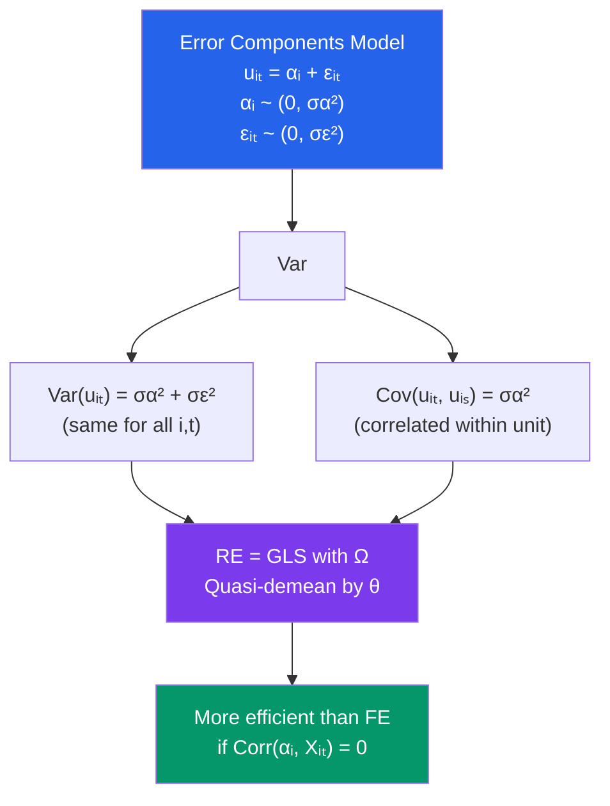

# 🎲 Random Effects

> [!abstract] TL;DR
> Random Effects (RE) treats unit-specific effects $\alpha_i$ as **random draws from a population** uncorrelated with the regressors. Under this assumption, the error $u_{it} = \alpha_i + \varepsilon_{it}$ is serially correlated within units, so OLS is inefficient. RE is a GLS estimator — **quasi-demeaning** by $\theta = 1 - \sigma_\varepsilon/\sqrt{T\sigma_\alpha^2 + \sigma_\varepsilon^2}$ — that is more efficient than FE when the RE assumption holds. It can also estimate time-invariant regressors, unlike FE. Use the [[Hausman_Test]] to decide between FE and RE.

## Intuition — analogy FIRST

In the FE model, each firm or individual has a unique fixed intercept that we absorb. In the RE model, we say those intercepts are random draws from a distribution — like drawing a new firm from an urn for each study. We do not try to estimate each individual $\alpha_i$ separately (which wastes degrees of freedom). Instead, we model the **variance** of $\alpha_i$ across units and use GLS to account for the resulting within-unit correlation.

The analogy: FE is like studying the specific 50 students in your classroom (their intercepts are fixed parameters to estimate). RE is like treating those 50 students as a random sample from all possible students (their intercepts are random variables you model statistically).

---

## How It Works



## Key Concepts / Details

### The Error Components Model

$$y_{it} = x_{it}'\beta + \alpha_i + \varepsilon_{it}$$

- $\alpha_i \sim (0, \sigma_\alpha^2)$ i.i.d., independent of $x_{it}$ and $\varepsilon_{it}$
- $\varepsilon_{it} \sim (0, \sigma_\varepsilon^2)$ i.i.d.

Composite error $u_{it} = \alpha_i + \varepsilon_{it}$:
$$\text{Var}(u_{it}) = \sigma_\alpha^2 + \sigma_\varepsilon^2$$
$$\text{Cov}(u_{it}, u_{is}) = \sigma_\alpha^2, \quad t \neq s$$
$$\text{Cov}(u_{it}, u_{jt}) = 0, \quad i \neq j$$

The intraclass correlation: $\rho_{IC} = \sigma_\alpha^2/(\sigma_\alpha^2 + \sigma_\varepsilon^2)$

### The RE Estimator (Quasi-Demeaning)

The optimal GLS transformation subtracts a fraction $\theta$ of the unit mean:
$$\tilde{y}_{it} = y_{it} - \theta \bar{y}_i, \quad \tilde{x}_{it} = x_{it} - \theta \bar{x}_i$$

where:
$$\theta = 1 - \frac{\sigma_\varepsilon}{\sqrt{T\sigma_\alpha^2 + \sigma_\varepsilon^2}} = 1 - \frac{1}{\sqrt{1 + T\lambda}}, \quad \lambda = \frac{\sigma_\alpha^2}{\sigma_\varepsilon^2}$$

The RE estimator is OLS on the quasi-demeaned data.

**Special cases**:
- $\theta = 0$: pooled OLS (RE with $\sigma_\alpha^2 = 0$)
- $\theta = 1$: within (FE) estimator ($T \to \infty$ or $\sigma_\alpha^2 \to \infty$)

RE is a **weighted average** of the FE (within) and the between estimators:
$$\hat{\beta}_{RE} = W \hat{\beta}_{FE} + (I - W) \hat{\beta}_{BE}$$

where $W$ depends on $\theta$, $T$, and the variance components.

### Variance Component Estimation

In practice, $\sigma_\alpha^2$ and $\sigma_\varepsilon^2$ are unknown and must be estimated (FGLS):
- $\hat{\sigma}_\varepsilon^2$: from residuals of the FE regression
- $\hat{\sigma}_\alpha^2$: from the between estimator or the full residuals

### RE Assumption: Corr($\alpha_i$, $x_{it}$) = 0

This is the critical assumption. If violated:
- RE is **biased and inconsistent** (treats correlated $\alpha_i$ as part of the error)
- FE remains consistent

Testing whether RE is appropriate: the [[Hausman_Test]].

### RE vs FE: When to Use Each

| Criterion | FE | RE |
|-----------|----|----|
| **Corr($\alpha_i$, $x_{it}$) $\neq 0$** | Consistent | **Biased** |
| **Corr($\alpha_i$, $x_{it}$) = 0** | Consistent (less efficient) | **Consistent + efficient** |
| **Time-invariant regressors** | Cannot estimate | Can estimate |
| **Short panels (small $T$)** | More degrees of freedom lost | Better |
| **Large $N$, small $T$** | Best when FE needed | Best when RE valid |
| **Experimental data** | Use if unit assignment is random | RE is natural |

### The Mundlak-Chamberlain Device

An intermediate approach: model $\alpha_i = \bar{x}_i' \xi + v_i$ where $v_i$ is uncorrelated with $x_{it}$. Include $\bar{x}_i$ (unit means of all time-varying regressors) in the RE model:
$$y_{it} = x_{it}'\beta + \bar{x}_i'\xi + v_i + \varepsilon_{it}$$

This:
- Gives the same $\hat{\beta}$ as FE for time-varying regressors
- Also estimates effects of time-invariant regressors
- Allows Hausman-type test: $H_0: \xi = 0$ (RE sufficient)

```r
library(plm)
library(lmtest)

data("Grunfeld", package = "plm")
p_data <- pdata.frame(Grunfeld, index = c("firm", "year"))

# 1. Random Effects estimator
re_model <- plm(inv ~ value + capital, data = p_data, model = "random")
summary(re_model)

# Components of variance
summary(re_model)$ercomp   # sigma_alpha², sigma_epsilon²

# 2. Fixed Effects for comparison
fe_model <- plm(inv ~ value + capital, data = p_data, model = "within")

# 3. Hausman test: H0: RE consistent (Corr(α, X) = 0)
phtest(fe_model, re_model)

# 4. RE with cluster-robust SEs
coeftest(re_model, vcov = vcovHC(re_model, cluster = "group"))

# 5. Mundlak device: add unit means of time-varying regressors
Grunfeld_m <- Grunfeld |>
  dplyr::group_by(firm) |>
  dplyr::mutate(
    value_bar   = mean(value),
    capital_bar = mean(capital)
  ) |>
  dplyr::ungroup()

p_data_m <- pdata.frame(Grunfeld_m, index = c("firm", "year"))
mundlak <- plm(inv ~ value + capital + value_bar + capital_bar,
               data = p_data_m, model = "random")
summary(mundlak)
# Test H0: ξ = 0 (coefs on value_bar, capital_bar = 0)
linearHypothesis(lm(inv ~ value + capital + value_bar + capital_bar + as.factor(firm),
                    data = Grunfeld_m), 
                 c("value_bar = 0", "capital_bar = 0"))

# 6. Between estimator (for comparison — uses only cross-sectional variation)
between_model <- plm(inv ~ value + capital, data = p_data, model = "between")
cat("\nFE β:", coef(fe_model), "\n")
cat("RE β:", coef(re_model), "\n")
cat("Between β:", coef(between_model), "\n")
```

---

## Real-World Notes

- **Biological/medical panels**: In clinical trials, patients are randomized, so $\text{Cov}(\alpha_i, x_{it}) = 0$ by design. RE is appropriate and efficient.
- **Wage equations**: For individuals with persistent unobserved ability, $\text{Cov}(\alpha_i, \text{educ}_{it}) \neq 0$ (ability drives both). FE (differencing) is consistent but loses the level identification. RE would be biased.
- **Cross-country macro**: Countries differ in culture, geography — both related to institutions and growth. RE would be inappropriate. FE with country and year dummies is standard.

---

## Common Pitfalls

- **Using RE without testing**: The Hausman test often rejects RE in economics. Start with FE as default and use RE only if Hausman does not reject and you need time-invariant coefficients.
- **Confusing RE with FE when $\theta \approx 1$**: When $\sigma_\alpha^2 \gg \sigma_\varepsilon^2$ or $T$ is large, $\theta \approx 1$ and RE ≈ FE. In this case RE offers no efficiency gain over FE.
- **Not understanding what "random" means**: RE does not mean effects are random in the sense of unpredictable. It means they are modeled as draws from a distribution, and they are assumed uncorrelated with $x_{it}$.

---

## Related Concepts

- [[_MOC_Panel_Data|↑ Section MOC]]
- [[Fixed_Effects]] — Consistent alternative when $\text{Cov}(\alpha_i, x_{it}) \neq 0$
- [[Hausman_Test]] — The test that decides between FE and RE
- [[GLS_and_WLS]] — RE is a GLS estimator for the panel error components model
- [[Pooled_OLS]] — RE nests pooled OLS when $\sigma_\alpha^2 = 0$

---

## Review Questions

1. Derive the quasi-demeaning transformation for RE and show that $\theta = 0$ gives pooled OLS and $\theta = 1$ gives the FE within estimator.
2. Explain the Mundlak device. How does adding unit means of time-varying regressors to a RE model relate to the FE estimator?
3. Why is RE inconsistent when $\text{Cov}(\alpha_i, x_{it}) \neq 0$? Trace through the omitted variable bias logic, with the unit effect playing the role of the omitted variable.

---

## Sources

- Wooldridge, J.M., *Econometric Analysis of Cross Section and Panel Data*, Ch. 10.4 — Random Effects
- Baltagi, B.H., *Econometric Analysis of Panel Data*, Ch. 2 — The One-Way Error Component Regression Model
- Mundlak, Y. (1978), "On the Pooling of Time Series and Cross Section Data," *Econometrica*

#econometrics #statistics #panel-data #random-effects #GLS
