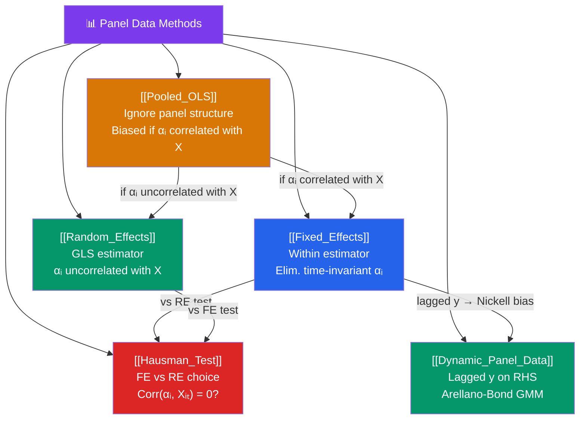

# 🗺️ Panel Data — Map of Content

> [!abstract] What This Section Covers
> Panel data (repeated observations on the same units over time) is the econometrician's most powerful observational tool. By tracking the same individuals, firms, or countries across time, panel methods can control for all time-invariant unobserved heterogeneity — the biggest threat to causal identification in cross-section data. This section covers the estimation continuum from **pooled OLS** (ignores the panel structure) through **fixed effects** (eliminates time-invariant heterogeneity) and **random effects** (efficient GLS if RE assumptions hold), the **Hausman test** that tells you which to use, and **dynamic panel** models for outcomes that depend on their own past.

## Concept Map

## Learning Path

1. [[Pooled_OLS]] — The naive baseline: stack all observations and run OLS, ignoring the panel structure. Understand when this fails.
2. [[Fixed_Effects]] — The "within estimator": demean by unit to eliminate time-invariant heterogeneity. The most robust panel method.
3. [[Random_Effects]] — The GLS approach assuming unit effects are uncorrelated with regressors. More efficient than FE when valid.
4. [[Hausman_Test]] — The formal test between FE and RE: if unit effects are correlated with regressors, FE is consistent and RE is not.
5. [[Dynamic_Panel_Data]] — Models with lagged outcome as regressor: Nickell bias in FE, and the Arellano-Bond GMM solution.

## All Notes at a Glance

| Note | Difficulty | What You'll Learn |
|------|------------|-------------------|
| [[Pooled_OLS]] | Intermediate | Stacked panel OLS, within/between variation, cluster-robust SEs |
| [[Fixed_Effects]] | Intermediate | Within estimator, demeaning, LSDV, time FE, two-way FE |
| [[Random_Effects]] | Intermediate | GLS on panel, quasi-demeaning, θ parameter, Mundlak-Chamberlain |
| [[Hausman_Test]] | Intermediate | Test statistic, null hypothesis, alternatives when test fails |
| [[Dynamic_Panel_Data]] | Advanced | Nickell bias, Arellano-Bond, instrument validity, system GMM |

## Key Questions This Section Answers

- Why is pooled OLS biased when unit-specific effects are correlated with regressors?
- What does the fixed effects estimator control for, and what does it NOT control for?
- Under what conditions is random effects more efficient than fixed effects?
- How does the Hausman test decide between fixed and random effects?
- Why does adding a lagged dependent variable to a fixed effects model cause bias, and what is the solution?

## Related Sections

- [[_MOC_Econometrics_Master|↑ Econometrics Master MOC]]
- [[_MOC_OLS_Problems|← OLS Problems]] — Omitted variable bias that FE addresses
- [[_MOC_Causal_Inference|→ Causal Inference]] — DiD as a specific application of two-way FE

#MOC #Econometrics #panel-data
