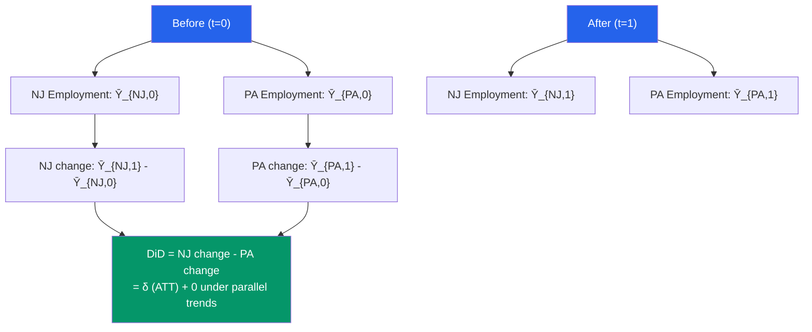

# 📊 Difference in Differences

> [!abstract] TL;DR
> DiD compares the change in outcomes for a treated group before and after treatment with the change for a control group over the same period. The DiD estimator $\hat{\delta} = (\bar{Y}_{T,post} - \bar{Y}_{T,pre}) - (\bar{Y}_{C,post} - \bar{Y}_{C,pre})$ identifies the ATT under the **parallel trends assumption**: treated and control groups would have had the same trend absent treatment. Implemented via regression with unit and time FE. Card and Krueger (1994) minimum wage study is the canonical example.

## Intuition — analogy FIRST

New Jersey raises its minimum wage in 1992; Pennsylvania does not. You want to know if this raised unemployment in NJ. If you just compare NJ employment before and after, you confuse the minimum wage effect with any other trend in NJ (economic boom, state policy, etc.). If you just compare NJ to PA after, you confuse the effect with any fixed differences between the states.

DiD takes the best of both: the difference-in-differences between the two states cancels out both (1) fixed differences between NJ and PA, and (2) common trends over time. What remains is the *differential* change in NJ relative to PA — attributable to the minimum wage only if the two states would have trended similarly absent the policy.

---

## How It Works



## Key Concepts / Details

### The 2×2 DiD Estimator

| Group | Before ($t=0$) | After ($t=1$) | Difference |
|-------|---------------|--------------|------------|
| Treated ($D=1$) | $\bar{Y}_{1,0}$ | $\bar{Y}_{1,1}$ | $\bar{Y}_{1,1} - \bar{Y}_{1,0}$ |
| Control ($D=0$) | $\bar{Y}_{0,0}$ | $\bar{Y}_{0,1}$ | $\bar{Y}_{0,1} - \bar{Y}_{0,0}$ |
| **DiD** | | | $(\bar{Y}_{1,1} - \bar{Y}_{1,0}) - (\bar{Y}_{0,1} - \bar{Y}_{0,0})$ |

**DiD = ATT** under the parallel trends assumption (no treatment spillovers and SUTVA).

### Regression Implementation

$$y_{it} = \alpha + \beta_1 D_i + \beta_2 T_t + \delta (D_i \times T_t) + \varepsilon_{it}$$

- $D_i$: treated group indicator (absorbs time-invariant group differences)
- $T_t$: post-period indicator (absorbs common time trend)
- $D_i \times T_t$: treatment indicator = 1 only for treated group after policy

$\hat{\delta}$: the DiD estimate = ATT under parallel trends.

**Equivalently**: DiD is a two-way FE model with unit and time fixed effects. With panel data (same units observed before and after):
$$y_{it} = \alpha_i + \lambda_t + \delta D_{it} + \varepsilon_{it}$$

where $D_{it} = 1$ for treated units in post-period.

### The Parallel Trends Assumption

**Formal statement**: $E[Y_i(0)_{t=1} - Y_i(0)_{t=0} \mid D_i = 1] = E[Y_i(0)_{t=1} - Y_i(0)_{t=0} \mid D_i = 0]$

In words: the treated group's counterfactual trend (absent treatment) equals the control group's actual trend.

**Testing parallel trends**:
- **Pre-trends test**: check that treated and control groups had similar trends *before* treatment. Plot event-study graphs.
- **Falsification**: include leads (future treatment) — if significant, pre-trends are problematic.

```r
# Event-study regression
event_study <- lm(y ~ factor(year)*treatment + controls, data = panel_data)
```

### Event Study / Dynamic DiD

Instead of a single post-period coefficient, estimate the effect at each period relative to treatment:
$$y_{it} = \alpha_i + \lambda_t + \sum_{k \neq -1} \delta_k \cdot \mathbf{1}[t - T_i^* = k] + \varepsilon_{it}$$

where $T_i^*$ is the treatment timing for unit $i$ and $k = 0$ is the treatment period (omitted baseline at $k = -1$).

Plot $\hat{\delta}_k$ vs $k$: pre-treatment coefficients ($k < 0$) should be near zero (parallel pre-trends). Post-treatment coefficients show the dynamic causal effect.

### Staggered Treatment Adoption

When different units are treated at different times ("staggered DiD"), the standard two-way FE estimator is a **weighted average** of individual 2×2 DiD comparisons — but with potentially **negative weights** (Goodman-Bacon decomposition). This can produce a wrong-sign estimate even when all individual DiD effects are positive.

**Modern approaches** (Callaway-Sant'Anna, Sun-Abraham, de Chaisemartin-D'Haultfoeuille):
- Estimate group-time ATTs separately for each cohort and period
- Aggregate with positive weights to avoid the negative weights problem

```r
library(tidyverse)
library(fixest)
library(did)

# Card-Krueger (1994) style: minimum wage and employment
# Load NJ/PA data from Card-Krueger
# nj = 1 (treated), pa = 0 (control)
# post = 1 (after Feb 1992), pre = 0 (before)

# Simulate CK-style data
set.seed(42)
n_firms <- 200
df_ck <- data.frame(
  firm_id = rep(1:n_firms, each = 2),
  state   = rep(c("NJ", "PA"), n_firms/2, each = 2),
  time    = rep(c(0, 1), n_firms),
  nj      = rep(c(1, 1, 0, 0), n_firms/2),
  post    = rep(c(0, 1), n_firms)
) |>
  mutate(
    employment = 20 + 2*nj - 1*post + 1.5*(nj*post) +   # true δ = 1.5
                 rnorm(n())
  )

# 1. 2x2 DiD (group means)
means <- df_ck |>
  group_by(nj, post) |>
  summarise(mean_emp = mean(employment), .groups = "drop")
print(means)

did_est <- (means[4,3] - means[3,3]) - (means[2,3] - means[1,3])
cat("DiD estimate:", as.numeric(did_est), "\n")

# 2. Regression DiD
did_reg <- lm(employment ~ nj + post + nj:post, data = df_ck)
summary(did_reg)

# 3. TWFE with panel data (same result)
twfe <- feols(employment ~ post:nj | firm_id + time, data = df_ck)
summary(twfe)

# 4. Cluster-robust SEs (cluster by state)
coeftest(did_reg, vcov = vcovCL(did_reg, cluster = ~state))

# 5. Event study (with multiple pre/post periods)
# Simulate panel with 5 periods (periods 1-3 = pre, period 4 = treatment, 5 = post)
panel_long <- df_ck |>
  group_by(firm_id) |>
  mutate(year = row_number() - 1) |>
  ungroup()

event_study <- feols(employment ~ i(time, nj, ref = 0) | firm_id + time,
                     data = df_ck)
iplot(event_study)

# 6. Callaway-Sant'Anna for staggered adoption
library(did)
# (requires staggered treatment data)
```

---

## Real-World Notes

- **Card and Krueger (1994)**: Compared fast-food employment in NJ (minimum wage raised Feb 1992) vs PA (no change). Found employment *increased* in NJ — contradicting the textbook prediction. This paper sparked enormous debate about minimum wage effects and popularized DiD in economics.
- **Parallel trends violation**: Bertrand, Duflo, and Mullainathan (2004) showed that many DiD studies in labor economics had implausible parallel trends and that the resulting "significant" effects were artifacts of serial correlation combined with standard (non-clustered) SEs.
- **Staggered treatment**: Sun and Abraham (2021) and Callaway-Sant'Anna (2021) showed that TWFE DiD with staggered timing can be severely biased when treatment effects are heterogeneous. This triggered widespread re-examination of published DiD papers.

---

## Common Pitfalls

- **Not clustering SEs at the treatment level**: In DiD, treatment is assigned at the state/firm level but observations are individuals. Cluster SEs at the treatment unit level (state, not individual).
- **Ignoring staggered adoption heterogeneity**: Standard TWFE is biased with staggered timing if treatment effects change over time. Use modern estimators (Callaway-Sant'Anna, Sun-Abraham).
- **Failing to test pre-trends**: Parallel trends is the identification assumption. Pre-treatment event study coefficients near zero make this more credible.

---

## Related Concepts

- [[_MOC_Causal_Inference|↑ Section MOC]]
- [[Potential_Outcomes_Framework]] — DiD identifies ATT under parallel trends
- [[Fixed_Effects]] — TWFE is the regression implementation of DiD
- [[Instrumental_Variables]] — Alternative identification strategy when parallel trends fails
- [[Regression_Discontinuity]] — Another quasi-experimental design

---

## Review Questions

1. Explain the parallel trends assumption in potential outcomes notation. What would a violation look like in an event-study graph?
2. Prove that the two-way FE regression $y_{it} = \alpha_i + \lambda_t + \delta D_{it} + \varepsilon_{it}$ gives the same estimate as the 2×2 DiD means comparison.
3. You are studying the effect of a job training program adopted by different states in different years (staggered adoption). Why might standard TWFE give a biased estimate, and what estimator would you use instead?

---

## Sources

- Card, D. & Krueger, A.B. (1994), "Minimum Wages and Employment: A Case Study of the Fast-Food Industry in New Jersey and Pennsylvania," *American Economic Review*
- Bertrand, M., Duflo, E. & Mullainathan, S. (2004), "How Much Should We Trust Differences-In-Differences Estimates?" *QJE*
- Callaway, B. & Sant'Anna, P.H.C. (2021), "Difference-in-Differences with Multiple Time Periods," *Journal of Econometrics*

#econometrics #statistics #causal-inference #DiD #difference-in-differences #parallel-trends
