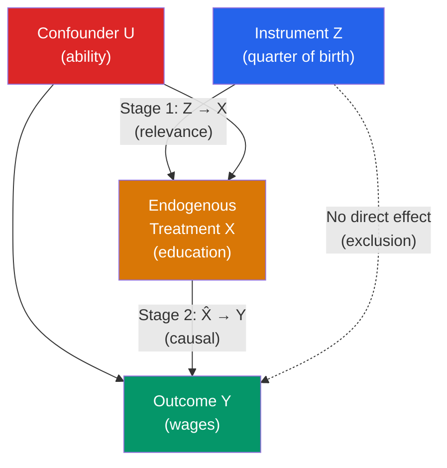

# 🎸 Instrumental Variables

> [!abstract] TL;DR
> Instrumental Variables (IV) recovers a causal effect when $x$ is endogenous (correlated with $\varepsilon$). The instrument $z$ must satisfy two conditions: **relevance** ($\text{Cov}(z, x) \neq 0$) and **exclusion** ($\text{Cov}(z, \varepsilon) = 0$ — $z$ affects $y$ only through $x$). IV estimator: $\hat{\beta}_{IV} = \text{Cov}(z, y)/\text{Cov}(z, x)$. With multiple instruments, 2SLS is used. IV identifies the **LATE** (Local Average Treatment Effect) — the effect for "compliers" whose treatment status changes with $z$.

## Intuition — analogy FIRST

You want to know the causal effect of education on wages, but ability is an omitted confounder (smarter people get more education and earn more regardless). You need something that shifts people's education independently of their ability.

Angrist and Krueger (1991) used **quarter of birth** as an instrument. In the US, children born in Q1 are slightly older when they enter school than children born in Q4 (same cohort, starting school in September). Compulsory schooling laws forced more education on younger kids (Q4 babies) — they had to stay in school longer before the legal dropout age. Quarter of birth affects education (slightly) but should not directly affect wages except through education. This is the IV strategy.

---

## How It Works



## Key Concepts / Details

### The IV Assumptions

1. **Relevance**: $\text{Cov}(z_i, x_i) \neq 0$ — instrument shifts treatment. Testable: F-statistic in first stage ≥ 10 (Stock-Yogo threshold).

2. **Exclusion restriction**: $\text{Cov}(z_i, \varepsilon_i) = 0$ — instrument affects $y$ only through $x$. **Not testable** with one instrument. Requires economic argument.

3. **Monotonicity** (for LATE interpretation): $x_i(1) \geq x_i(0)$ for all $i$ — increasing $z$ from 0 to 1 does not decrease treatment for anyone. Rules out "defiers."

### The IV Estimator (Simple Case)

For a single endogenous regressor and single instrument:
$$\hat{\beta}_{IV} = \frac{\text{Cov}(z_i, y_i)}{\text{Cov}(z_i, x_i)} = \frac{\sum_i (z_i - \bar{z})(y_i - \bar{y})}{\sum_i (z_i - \bar{z})(x_i - \bar{x})}$$

This is the Wald estimator. Under the three IV assumptions, it converges to the causal effect (LATE for compliers).

### Two-Stage Least Squares (2SLS)

With multiple instruments or controls:

**Stage 1**: Regress $x$ on $z$ and controls $w$:
$$x_i = \pi_0 + \pi_1 z_i + w_i'\gamma + v_i \quad \Rightarrow \quad \hat{x}_i$$

**Stage 2**: Regress $y$ on $\hat{x}$ and controls $w$:
$$y_i = \beta_0 + \beta_1 \hat{x}_i + w_i'\delta + \varepsilon_i$$

$\hat{\beta}_{2SLS}$ is consistent because $\hat{x}_i$ contains only the exogenous variation in $x$ (the part driven by $z$).

**Matrix formula**: $\hat{\beta}_{2SLS} = (X'P_Z X)^{-1} X'P_Z y$ where $P_Z = Z(Z'Z)^{-1}Z'$ projects onto the column space of $Z$.

### LATE (Local Average Treatment Effect)

IV does not estimate ATE or ATT — it estimates the effect for **compliers**:
- **Compliers**: units who take treatment when $z = 1$ and do not when $z = 0$ ($x_i(1) = 1, x_i(0) = 0$)
- **Always-takers**: always treated regardless of $z$
- **Never-takers**: never treated regardless of $z$
- **Defiers**: take treatment only when $z = 0$ (ruled out by monotonicity)

$$\text{LATE} = \frac{E[Y \mid Z=1] - E[Y \mid Z=0]}{E[X \mid Z=1] - E[X \mid Z=0]} = \frac{\text{Reduced form}}{\text{First stage}}$$

LATE = the effect of treatment for the subgroup of the population whose treatment status is changed by the instrument. LATE is not the same as ATE unless the instrument affects everyone equally.

### Weak Instruments

The first-stage F-statistic measures instrument strength. If $F < 10$ (Stock-Yogo 2005):
- 2SLS is biased toward OLS (weak instrument bias)
- Standard SEs are unreliable

**Rules of thumb**:
| F-statistic | Interpretation |
|------------|----------------|
| > 10 | Acceptable |
| > 20 | Preferred for small samples |
| < 10 | Weak — use LIML, Anderson-Rubin, or confidence sets |

For multiple instruments, use the **Cragg-Donald F-statistic** or **Kleibergen-Paap F-statistic** (robust to heteroskedasticity).

### Overidentification (Multiple Instruments)

With $k_z > k_x$ instruments (more instruments than endogenous regressors), the model is overidentified and can be tested:

**Sargan-Hansen J-test**: $H_0$: all instruments are valid (satisfy exclusion restriction).
$$J = n \cdot R^2_{2SLS\text{ residuals on }Z} \sim \chi^2_{k_z - k_x}$$

Reject → at least one instrument may be invalid. Cannot determine which one.

### Wu-Hausman Endogeneity Test

Tests $H_0: x$ is exogenous (OLS consistent) vs $H_1$: $x$ is endogenous (IV needed):
1. Run first stage; get residuals $\hat{v}$
2. Add $\hat{v}$ to the original OLS regression
3. t-test on coefficient of $\hat{v}$

Reject → $x$ is endogenous; use IV.

```r
library(AER)
library(lmtest)
library(sandwich)
library(ivreg)

# Angrist-Krueger (1991) style: returns to education via quarter of birth
# Using Card (1995) data: college proximity as IV
data("CollegeDistance", package = "AER")

# OLS (biased due to ability bias)
ols <- lm(score ~ education + gender + ethnicity + income + urban + region,
          data = CollegeDistance)
coeftest(ols, vcov = vcovHC(ols, "HC1"))

# IV: distance from college as instrument for education
iv_model <- ivreg(
  score ~ education + gender + ethnicity + income + urban + region |
  distance + gender + ethnicity + income + urban + region,
  data = CollegeDistance
)
summary(iv_model, diagnostics = TRUE)

# Diagnostics:
# First stage F-statistic (weak instrument test)
# Wu-Hausman endogeneity test
# Sargan test (overidentification)

# Manual 2SLS
stage1 <- lm(education ~ distance + gender + ethnicity + income + urban + region,
             data = CollegeDistance)
cat("First-stage F:", summary(stage1)$fstatistic[1], "\n")

CollegeDistance$educ_hat <- fitted(stage1)
stage2 <- lm(score ~ educ_hat + gender + ethnicity + income + urban + region,
             data = CollegeDistance)
cat("2SLS coefficient on education:", coef(stage2)["educ_hat"], "\n")
# Note: stage2 SEs are wrong — use ivreg() for correct SEs

# Robust 2SLS standard errors
coeftest(iv_model, vcov = vcovHC(iv_model, "HC1"))

# LATE interpretation
# IV estimates the effect for students whose college attendance changed
# because of proximity — a local effect on "compliers"
```

---

## Real-World Notes

- **Angrist and Krueger (1991)**: Quarter of birth as instrument for education. Returns to schooling ≈ 10%. Controversial exclusion restriction (season of birth may correlate with health), but highly influential.
- **Card (1995)**: College proximity as instrument. Less controversial exclusion restriction (living near a college affects attendance but not baseline wages). Returns ≈ 12–15% for compliers.
- **Card and Krueger (1994)**: Minimum wage. The DiD estimator in that paper is a special case of IV with the interaction term as the instrument.
- **Vietnam War draft lottery**: Angrist (1990) used randomly assigned draft lottery numbers as an instrument for military service to estimate the causal effect of military service on earnings.

---

## Common Pitfalls

- **Weak instruments** inflate bias toward OLS and standard errors are wrong. Always report first-stage F-statistic.
- **Assuming exclusion restriction is testable**: With one instrument and one endogenous regressor, the exclusion restriction is exactly identified and cannot be tested. Economic reasoning is essential.
- **Using many instruments without checking Sargan**: Overidentified IV uses more moment conditions — check Sargan/Hansen J-test.
- **Confusing LATE with ATE**: IV estimates the causal effect only for compliers. If compliers are a non-representative subgroup, LATE may differ substantially from ATE.

---

## Related Concepts

- [[_MOC_Causal_Inference|↑ Section MOC]]
- [[Potential_Outcomes_Framework]] — The framework that defines LATE
- [[Omitted_Variable_Bias]] — IV addresses endogeneity from OVB
- [[Measurement_Error]] — IV corrects attenuation bias from ME in $x$
- [[Difference_in_Differences]] — Another identification strategy for causal effects

---

## Review Questions

1. Prove that the IV estimator $\hat{\beta}_{IV} = \text{Cov}(z, y)/\text{Cov}(z, x)$ is consistent for $\beta$ in the simple model $y = \beta x + \varepsilon$ when the relevance and exclusion conditions hold.
2. Define compliers, always-takers, never-takers, and defiers. Why does IV identify the LATE (effect for compliers) and not ATE?
3. Your first-stage F-statistic is 6.2. What does this mean for your IV estimates? What alternative estimators would you consider?

---

## Sources

- Angrist, J.D. & Krueger, A.B. (1991), "Does Compulsory School Attendance Affect Schooling and Earnings?" *Quarterly Journal of Economics*
- Card, D. (1995), "Using Geographic Variation in College Proximity to Estimate the Return to Schooling," in *Aspects of Labour Market Behaviour*
- Angrist, J.D. & Pischke, J.S., *Mostly Harmless Econometrics*, Ch. 4 — Instrumental Variables in Action

#econometrics #statistics #causal-inference #IV #2SLS #LATE #exclusion-restriction
