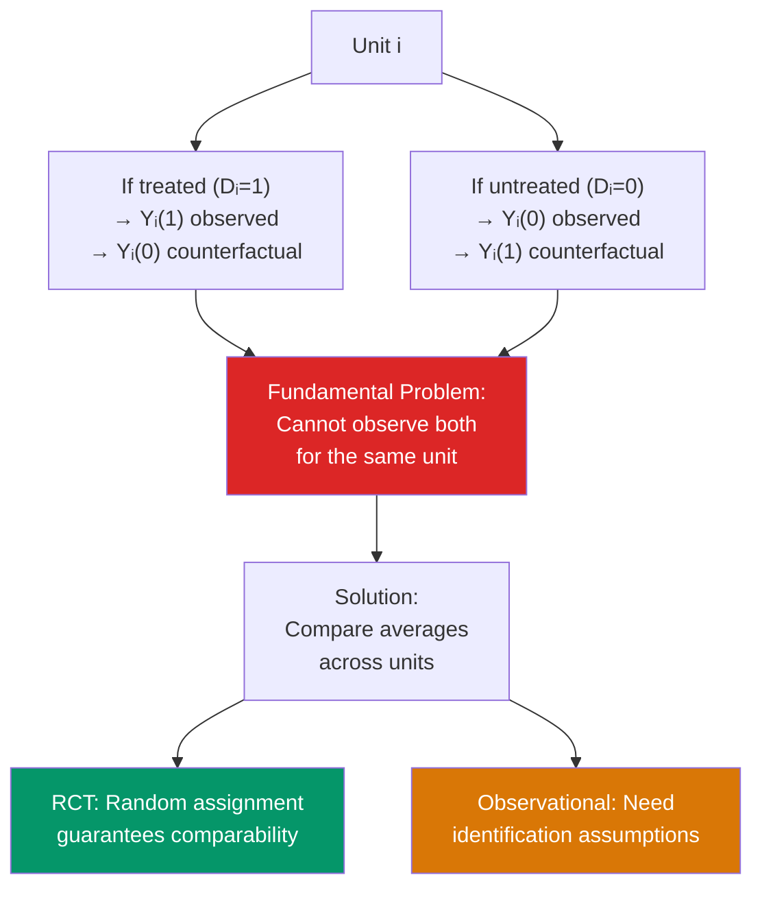

# 🎯 Potential Outcomes Framework

> [!abstract] TL;DR
> The potential outcomes (Rubin) framework defines causal effects as comparisons of what would happen under different treatment assignments. For unit $i$: $Y_i(1)$ is the outcome if treated, $Y_i(0)$ if untreated. The individual causal effect $\tau_i = Y_i(1) - Y_i(0)$ is never observed — the **fundamental problem of causal inference**. Average effects (ATE, ATT) are identified by random assignment or assumptions that make treated and control units comparable. Selection bias arises when the treated and untreated differ in their untreated potential outcomes: $E[Y(0) \mid D=1] \neq E[Y(0) \mid D=0]$.

## Intuition — analogy FIRST

You take an aspirin for your headache and it goes away. Did the aspirin cause your headache to go away? To know for sure, you would need to simultaneously observe two things: what happened when you took the aspirin (you did), and what would have happened if you had not taken it (the counterfactual). But you can only exist in one state of the world at a time. This is the fundamental problem of causal inference — you observe only one of two potential outcomes.

Science deals with this by aggregating over many units. If 1000 people with headaches are randomly assigned to aspirin vs placebo, the average difference in headache outcomes estimates the causal effect of aspirin — not for any one person, but on average across the population.

---

## How It Works



## Key Concepts / Details

### Notation

For binary treatment $D_i \in \{0, 1\}$:
- $Y_i(1)$: potential outcome under treatment
- $Y_i(0)$: potential outcome under control
- $Y_i = D_i Y_i(1) + (1 - D_i) Y_i(0)$: observed outcome (switching equation)

**Individual treatment effect**: $\tau_i = Y_i(1) - Y_i(0)$ — never observed.

### Treatment Effect Parameters

| Parameter | Definition | Interpretation |
|-----------|-----------|----------------|
| **ATE** (Average Treatment Effect) | $E[Y(1) - Y(0)]$ | Effect for a randomly chosen unit from the population |
| **ATT** (Average Treatment Effect on the Treated) | $E[Y(1) - Y(0) \mid D = 1]$ | Effect for those who actually receive treatment |
| **ATC** (Average Treatment Effect on the Control) | $E[Y(1) - Y(0) \mid D = 0]$ | Effect for those who actually receive control |
| **LATE** (Local ATE) | $E[Y(1) - Y(0) \mid \text{complier}]$ | Effect for "compliers" in IV/RD designs |

**Which parameter?**
- ATE: relevant for universal policy (everyone will be treated)
- ATT: relevant for evaluating an existing program (do participants benefit?)
- LATE: what IV identifies — see [[Instrumental_Variables]]

### The Fundamental Problem of Causal Inference

We only ever observe:
$$E[Y \mid D = 1] - E[Y \mid D = 0]$$

Decompose this:
$$E[Y \mid D=1] - E[Y \mid D=0] = \underbrace{E[Y(1) - Y(0) \mid D=1]}_{\text{ATT}} + \underbrace{E[Y(0) \mid D=1] - E[Y(0) \mid D=0]}_{\text{Selection Bias}}$$

**Selection bias**: the difference in counterfactual outcomes between treated and untreated. If treated and untreated have different baseline outcomes (untreated potential outcomes differ), the naive comparison is biased.

### Random Assignment Eliminates Selection Bias

If $D_i \perp (Y_i(0), Y_i(1))$ (independence/ignorability from random assignment):
$$E[Y(0) \mid D = 1] = E[Y(0) \mid D = 0] = E[Y(0)]$$

So selection bias = 0, and:
$$E[Y \mid D=1] - E[Y \mid D=0] = \text{ATE} = \text{ATT}$$

Randomized experiments are the gold standard for this reason.

### SUTVA (Stable Unit Treatment Value Assumption)

Two components:
1. **No interference**: $D_j$ does not affect $Y_i(D_i)$ for $i \neq j$ (treatment of one unit does not spill over to others)
2. **No hidden variations of treatment**: $D_i = 1$ means the same treatment for all $i$

SUTVA is violated when:
- Herd immunity (vaccination of some affects others' outcomes)
- General equilibrium effects (hiring subsidies raise wages for untreated too)
- Network effects (one person's program participation affects friends)

### Conditional Independence Assumption (CIA / Unconfoundedness)

In observational data, weaken independence to conditional on observables $X$:
$$D_i \perp (Y_i(0), Y_i(1)) \mid X_i$$

This says: conditional on $X_i$, treatment is as good as randomly assigned. CIA allows causal identification via matching or regression — see [[Propensity_Score_Matching]].

**CIA cannot be tested** (it involves unobservable counterfactuals). It requires subject-matter justification.

```r
library(tidyverse)

# Simulate selection bias
set.seed(42)
n <- 1000

# True model: treatment effect = 2 for everyone
U     <- rnorm(n)           # unobserved "ability"
D     <- rbinom(n, 1, plogis(U))  # high-ability more likely treated
Y0    <- U + rnorm(n)       # potential outcome under control
Y1    <- Y0 + 2             # potential outcome under treatment (ATE = ATT = 2)
Y_obs <- D * Y1 + (1-D) * Y0

df <- data.frame(Y_obs, D, U)

# Naive comparison (biased)
naive_diff <- mean(Y_obs[D == 1]) - mean(Y_obs[D == 0])
cat("Naive estimate:", naive_diff, "\n")   # Should be > 2 due to selection

# True ATE (by construction)
true_ATE <- mean(Y1 - Y0)
cat("True ATE:", true_ATE, "\n")           # = 2

# Selection bias
selection_bias <- mean(Y0[D == 1]) - mean(Y0[D == 0])
cat("Selection bias:", selection_bias, "\n")  # Positive: treated have higher Y(0)

# Verify decomposition: naive = ATT + selection bias
cat("ATT + selection bias:", mean(Y1[D==1] - Y0[D==1]) + selection_bias, "\n")

# RCT: random assignment removes bias
D_random <- rbinom(n, 1, 0.5)
Y_rct    <- D_random * Y1 + (1 - D_random) * Y0
rct_diff <- mean(Y_rct[D_random == 1]) - mean(Y_rct[D_random == 0])
cat("RCT estimate:", rct_diff, "\n")  # Should be ≈ 2

# Regression estimate (controls for U → removes selection bias)
ols_adj <- coef(lm(Y_obs ~ D + U, data = df))["D"]
cat("OLS controlling for U:", ols_adj, "\n")  # Should be ≈ 2
```

### Directed Acyclic Graphs (DAGs) and Potential Outcomes

The potential outcomes framework and the structural causal model (Pearl's do-calculus) are equivalent frameworks for the same problem. In a DAG:


The backdoor path $D \leftarrow U \rightarrow Y$ creates selection bias. Identification strategies block this path: IV uses a front-door variable, FE conditions on the unit effect, matching conditions on observables.

---

## Real-World Notes

- **LaLonde (1986)**: The seminal demonstration that non-experimental methods fail. LaLonde compared experimental estimates of a job training program with OLS estimates using non-experimental comparison groups — they diverged dramatically. This paper motivated the design-based approach to causal inference.
- **Heckman vs Rubin debate**: Heckman's structural approach and Rubin's potential outcomes framework have different philosophical orientations but both grapple with the fundamental problem. Modern econometrics uses elements of both.
- **The credibility revolution**: Angrist and Pischke's "Mostly Harmless Econometrics" (2008) popularized the potential outcomes framework in economics and advocated for design-based identification strategies over structural estimation.

---

## Common Pitfalls

- **Confusing ATE and ATT**: A job training program may help participants (ATT > 0) even if it would not help a randomly chosen person from the population (ATE ≈ 0) because participants self-select.
- **Ignoring SUTVA in policy evaluation**: If a tax incentive causes general equilibrium price effects, evaluating it as if other firms are unaffected violates SUTVA and overstates the true effect.
- **Treating CIA as a testable assumption**: CIA cannot be tested with the observed data. Sensitivity analyses (Rosenbaum bounds) can assess how sensitive the estimate is to CIA violations.

---

## Related Concepts

- [[_MOC_Causal_Inference|↑ Section MOC]]
- [[Omitted_Variable_Bias]] — The selection bias problem in OLS language
- [[Instrumental_Variables]] — Identifies LATE when CIA fails but a valid instrument exists
- [[Difference_in_Differences]] — Uses temporal variation to address selection bias
- [[Regression_Discontinuity]] — Achieves local randomization near a cutoff
- [[Propensity_Score_Matching]] — Identifies ATE/ATT under CIA

---

## Review Questions

1. Write down the selection bias decomposition: $E[Y \mid D=1] - E[Y \mid D=0] = \text{ATT} + \text{Selection Bias}$. Explain each term. Under what condition does random assignment set the selection bias to zero?
2. Explain SUTVA and give an economic example where each of its two components is violated.
3. A researcher observes that firms that adopt a new management practice have 20% higher productivity. Is this evidence that the practice causes higher productivity? Identify the selection bias mechanism and propose an identification strategy to overcome it.

---

## Sources

- Rubin, D.B. (1974), "Estimating Causal Effects of Treatments in Randomized and Non-Randomized Studies," *Journal of Educational Psychology*
- Angrist, J.D. & Pischke, J.S., *Mostly Harmless Econometrics*, Ch. 1–2
- Imbens, G.W. & Rubin, D.B., *Causal Inference for Statistics, Social, and Biomedical Sciences*, Ch. 1–3

#econometrics #statistics #causal-inference #potential-outcomes #ATE #ATT #selection-bias
