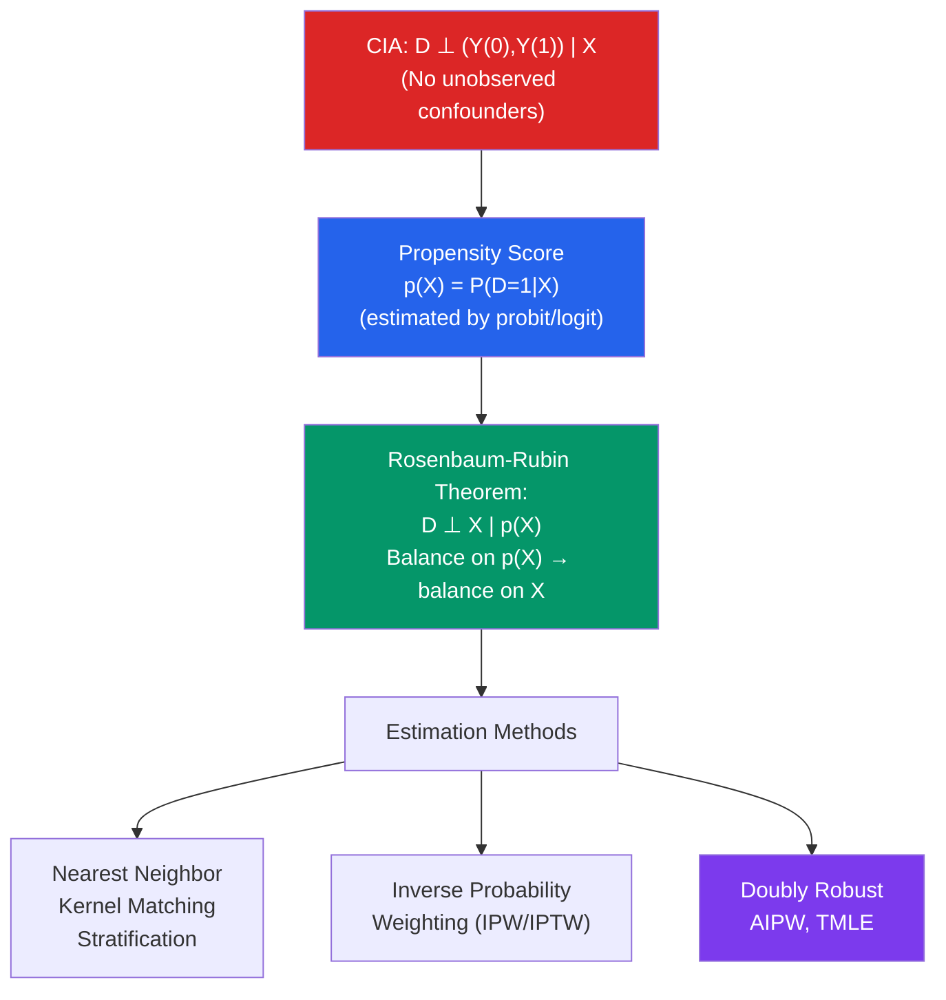

# 🔗 Propensity Score Matching

> [!abstract] TL;DR
> Propensity Score Matching (PSM) identifies the ATT under the **Conditional Independence Assumption (CIA)**: treatment is as good as random conditional on observed covariates $X$. The propensity score $p(X) = P(D=1 \mid X)$ is a dimension-reduction device: by balancing on $p(X)$ alone (a scalar), you balance on all of $X$ (Rosenbaum-Rubin theorem). Estimate ATE/ATT via matching, inverse probability weighting (IPW), or doubly-robust methods. PSM fails if unobservable confounders exist — use sensitivity analysis (Rosenbaum bounds) to gauge robustness.

## Intuition — analogy FIRST

You want to evaluate a job training program, but participants self-selected in. Workers who enrolled have different characteristics (younger, less experienced, more motivated) than non-participants. To estimate the causal effect, you want to compare each treated worker to a "clone" — an untreated worker as similar as possible in observed characteristics.

The propensity score theorem says: instead of finding a clone that matches on all 20 characteristics simultaneously (impossible in practice), you only need to match on the single probability that each worker would enroll given their characteristics. Workers with the same probability of enrolling are comparable on all observed covariates — even though they differ in individual characteristics.

---

## How It Works



## Key Concepts / Details

### The Conditional Independence Assumption (CIA)

$$D_i \perp (Y_i(0), Y_i(1)) \mid X_i$$

After conditioning on $X$, treated and untreated units are comparable. Equivalently: **unconfoundedness** or **selection on observables**.

**Overlap (common support)**: For all $x$ in the support of $X$:
$$0 < P(D = 1 \mid X = x) < 1$$

Both treated and untreated units must exist at every value of $X$. Without overlap, you cannot estimate the counterfactual.

Together, CIA + overlap are the **strong ignorability** conditions.

### The Propensity Score

**Definition**: $p(x) = P(D = 1 \mid X = x)$

**Rosenbaum-Rubin (1983) theorem**:
If CIA holds, then:
$$D_i \perp X_i \mid p(X_i)$$

You only need to condition on the scalar propensity score rather than the full covariate vector $X$. This solves the curse of dimensionality for matching.

**Estimation**: Logit or probit of $D$ on $X$ gives $\hat{p}(x_i) = \hat{P}(D=1 \mid X=x_i)$.

### Matching Estimators

**Nearest-neighbor (1:1) matching with replacement**:
1. For each treated unit $i$ with $D_i = 1$, find the control unit $j(i) = \arg\min_{j:D_j=0} |\hat{p}(x_i) - \hat{p}(x_j)|$
2. Estimate ATT: $\hat{\tau}_{ATT} = \frac{1}{N_1} \sum_{i:D_i=1} [Y_i - Y_{j(i)}]$

**Kernel matching**: weighted average over all control units with weights proportional to proximity in propensity score.

**Caliper matching**: require $|\hat{p}(x_i) - \hat{p}(x_j)| < \delta$ (avoid bad matches).

### Inverse Probability Weighting (IPW)

$$\hat{\tau}_{ATE} = \frac{1}{n}\sum_{i=1}^n \left[\frac{D_i Y_i}{\hat{p}(X_i)} - \frac{(1-D_i)Y_i}{1-\hat{p}(X_i)}\right]$$

IPW reweights observed outcomes to represent the counterfactual: treated units are downweighted (overrepresented in sample) and control units are upweighted.

**Stabilized weights** (to reduce variance): $w_i = D_i/\hat{p}(X_i) + (1-D_i)/(1-\hat{p}(X_i))$, normalized to sum to 1.

### Doubly Robust Estimators

**Augmented IPW (AIPW)** / Doubly Robust:
$$\hat{\tau}_{DR} = \frac{1}{n}\sum_i \left[\frac{D_i(Y_i - \hat{\mu}_1(X_i))}{\hat{p}(X_i)} - \frac{(1-D_i)(Y_i - \hat{\mu}_0(X_i))}{1-\hat{p}(X_i)} + \hat{\mu}_1(X_i) - \hat{\mu}_0(X_i)\right]$$

where $\hat{\mu}_d(X_i) = E[Y \mid D=d, X=X_i]$ is the outcome model.

**Double robustness**: consistent if EITHER the propensity score OR the outcome model is correctly specified (but not necessarily both). Achieves the semiparametric efficiency bound when both are correct.

### Assessing Balance

After matching, check covariate balance:
- **Standardized mean difference** (SMD): $SMD_j = (\bar{X}_{j,treat} - \bar{X}_{j,ctrl})/\sqrt{(s^2_{j,treat} + s^2_{j,ctrl})/2}$
- Target: $|SMD| < 0.1$ for all covariates after matching
- **Love plot**: visualize before/after SMD for all covariates

```r
library(MatchIt)
library(WeightIt)
library(cobalt)

# Simulate data with selection on observables
set.seed(42)
n  <- 1000
X1 <- rnorm(n)
X2 <- rnorm(n)
X3 <- rbinom(n, 1, 0.4)
# Selection: higher X1 and X2 → more likely treated
D  <- rbinom(n, 1, plogis(-0.5 + 0.7*X1 + 0.5*X2 + 0.3*X3))
tau <- 2  # true ATT
Y  <- 1 + tau*D + 0.5*X1 - 0.3*X2 + rnorm(n)

df <- data.frame(Y, D, X1, X2, X3)

# 1. Estimate propensity score
ps_model <- glm(D ~ X1 + X2 + X3, data = df, family = binomial("logit"))
df$pscore <- fitted(ps_model)

# 2. Nearest-neighbor matching (with replacement, 1:1)
m_nn <- matchit(D ~ X1 + X2 + X3, data = df,
                method = "nearest", distance = "glm",
                link = "logit", replace = TRUE)
summary(m_nn)

# Extract matched data
matched_data <- match.data(m_nn)

# ATT estimate from matched data
att_match <- lm(Y ~ D, data = matched_data, weights = weights)
coeftest(att_match, vcov = vcovCL(att_match, cluster = ~subclass))

# 3. Balance check (Love plot)
love.plot(m_nn, threshold = 0.1)

# 4. IPW estimation
w_model <- weightit(D ~ X1 + X2 + X3, data = df,
                    method = "ps", estimand = "ATE")
summary(w_model)

# Weighted regression
lm_ipw <- lm(Y ~ D, data = df, weights = w_model$weights)
coeftest(lm_ipw)

# 5. Doubly robust AIPW
library(AIPW)
aipw_obj <- AIPW$new(
  Y = df$Y, A = df$D,
  W = df[, c("X1", "X2", "X3")],
  Q.SL.library = c("SL.glm"),
  g.SL.library = c("SL.glm")
)
aipw_obj$fit()
aipw_obj$summary()

# 6. Rosenbaum bounds (sensitivity to hidden bias)
library(rbounds)
y_treated  <- matched_data$Y[matched_data$D == 1]
y_control  <- matched_data$Y[matched_data$D == 0]
psens(y_treated - y_control, Gamma = 2)
# How large would an unobserved confounder need to be to explain away the result?
```

### Sensitivity Analysis: Rosenbaum Bounds

CIA cannot be tested. Sensitivity analysis asks: how strong would a hidden confounder need to be to nullify the estimated effect?

**Rosenbaum sensitivity parameter $\Gamma$**: If $\Gamma = 1$, no hidden bias. If $\Gamma = 2$, two identical units could differ in treatment probability by a factor of 2 due to unobservables. If the result remains significant at $\Gamma = 2$, it is robust to moderate hidden bias.

---

## Real-World Notes

- **LaLonde (1986) revisited**: Dehejia and Wahba (1999, 2002) re-analyzed LaLonde's job training data using PSM and found that matching on propensity scores recovered estimates close to the experimental benchmark — a much better performance than OLS without matching.
- **Medical treatment evaluation**: PSM is standard in pharmacoepidemiology for comparing drug treatments using observational claims data. "New user" designs and IPTW are preferred over traditional matching in modern medical literature.
- **Limitations vs experimental methods**: PSM only controls for observed confounders. In labor economics, where unobserved ability and motivation are critical, PSM is considered a weaker design than IV, DiD, or RD.

---

## Common Pitfalls

- **CIA is an assumption, not a testable fact**: Balance on observed covariates does not guarantee CIA — unobserved confounders can still bias estimates. Always run sensitivity analysis.
- **Not checking overlap/common support**: Estimates for treated units without similar controls involve extrapolation. Trim or discard units with extreme propensity scores.
- **Using matched sample without correcting SEs**: After 1:1 matching, standard OLS SEs on the matched sample are wrong. Use cluster-robust SEs or bootstrap.
- **Treating PS matching as better than RCT**: Matching only balances on observables; randomization balances on everything. PSM is a second-best solution.

---

## Related Concepts

- [[_MOC_Causal_Inference|↑ Section MOC]]
- [[Potential_Outcomes_Framework]] — CIA is the key assumption enabling PSM
- [[Instrumental_Variables]] — Identifies causal effects even with unobservable confounders
- [[Omitted_Variable_Bias]] — The threat PSM controls for (on observables only)

---

## Review Questions

1. State the Rosenbaum-Rubin theorem and explain why conditioning on the propensity score is sufficient for causal identification under CIA.
2. Compare IPW and nearest-neighbor matching as estimators of the ATT. What are the relative advantages and disadvantages of each?
3. You estimate a job training treatment effect of +$2,000 using PSM. A Rosenbaum bounds analysis shows the result is only significant for $\Gamma \leq 1.3$. What does this tell you about the robustness of your estimate?

---

## Sources

- Rosenbaum, P.R. & Rubin, D.B. (1983), "The Central Role of the Propensity Score in Observational Studies for Causal Effects," *Biometrika*
- Dehejia, R.H. & Wahba, S. (1999), "Causal Effects in Non-Experimental Studies: Reevaluating the Evaluation of Training Programs," *JASA*
- Imbens, G.W. (2004), "Nonparametric Estimation of Average Treatment Effects Under Exogeneity: A Review," *Review of Economics and Statistics*

#econometrics #statistics #causal-inference #propensity-score #matching #IPW #CIA
