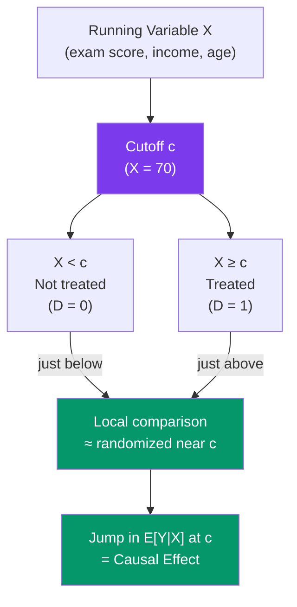

# 📍 Regression Discontinuity

> [!abstract] TL;DR
> Regression Discontinuity (RD) designs exploit a cutoff in a **running variable** that determines treatment assignment. Units just above and just below the cutoff are similar in all observed and unobserved characteristics (quasi-random assignment near the threshold), so the jump in outcomes at the cutoff identifies the causal effect. **Sharp RD**: treatment deterministically switches at the cutoff. **Fuzzy RD**: treatment probability jumps at the cutoff (use it as an instrument → local IV). Both estimate a **Local Average Treatment Effect** at the cutoff.

## Intuition — analogy FIRST

A scholarship is awarded to students who score ≥ 70 on an entrance exam. Students who score 69 vs 71 are essentially identical in ability (the difference between them is random noise from exam-day luck). But one group gets the scholarship and the other does not. By comparing outcomes (graduation rates, earnings) for students just below vs just above the 70-point threshold, we learn the causal effect of the scholarship — without needing a randomized trial.

The key insight: the cutoff creates local randomization. Students cannot precisely manipulate which side of 70 they fall on, so the assignment is as good as random in a neighborhood of the threshold.

---

## How It Works



## Key Concepts / Details

### Sharp vs Fuzzy RD

| Feature | Sharp RD | Fuzzy RD |
|---------|---------|---------|
| Treatment | $D_i = \mathbf{1}[X_i \geq c]$ (deterministic) | $P(D_i = 1 \mid X_i)$ jumps at $c$ (probabilistic) |
| Estimand | $\lim_{x \downarrow c} E[Y \mid X=x] - \lim_{x \uparrow c} E[Y \mid X=x]$ | LATE for compliers at cutoff |
| Estimation | Local regression, RD-specific bandwidth | Use jump in $D$ as instrument for treatment: 2SLS |
| Example | Scholarship if score ≥ 70 | Voting: incumbent wins if vote share ≥ 50% |

### Identification Assumption

**Continuity assumption**: In the absence of treatment, the conditional expectation of potential outcomes is continuous in $X$ at $c$:
$$\lim_{x \downarrow c} E[Y(0) \mid X = x] = \lim_{x \uparrow c} E[Y(0) \mid X = x]$$

This means the counterfactual outcome trend is smooth through the cutoff. Any discontinuity in $E[Y \mid X]$ at $c$ is attributable to the treatment.

The continuity assumption is **not directly testable** but is supported by:
1. **Density test (McCrary)**: no bunching/sorting in the running variable at the cutoff
2. **Covariate smoothness**: pre-determined covariates should be continuous at $c$
3. **Placebo cutoffs**: no discontinuities at other values of $X$

### Estimation: Local Polynomial Regression

The RD estimand is estimated as the limit from both sides as $X \to c$. Use local polynomial regression with a bandwidth $h$ around $c$:

$$\hat{\tau}_{RD} = \lim_{x \downarrow c} \hat{m}(x) - \lim_{x \uparrow c} \hat{m}(x)$$

**Local linear regression** (most common):
$$\hat{\tau}_{RD} = \hat{\alpha}_R - \hat{\alpha}_L$$

where $\hat{\alpha}_R$ and $\hat{\alpha}_L$ are intercepts from OLS on observations above and below the cutoff within bandwidth $h$, weighted by a kernel $K((X_i - c)/h)$.

**Bandwidth choice**: the MSE-optimal bandwidth (Imbens-Kalyanaraman 2012, Calonico-Cattaneo-Titiunik 2014 CCT bandwidth) trades off:
- Smaller $h$: less bias, more variance (fewer observations)
- Larger $h$: more variance of the slope estimate smoothed in, more bias from nonlinearity

**Polynomial order**: Local linear ($p=1$) is standard. Higher order polynomials are less reliable at boundaries (Gelman-Imbens).

### Fuzzy RD as IV

In fuzzy RD, the jump in treatment probability at $c$ serves as an instrument:
$$\hat{\tau}_{Fuzzy} = \frac{\lim_{x \downarrow c} E[Y \mid X=x] - \lim_{x \uparrow c} E[Y \mid X=x]}{\lim_{x \downarrow c} E[D \mid X=x] - \lim_{x \uparrow c} E[D \mid X=x]} = \frac{\text{Reduced form jump}}{\text{First stage jump}}$$

This is a Wald estimator = LATE for compliers at the cutoff.

```r
library(rdrobust)
library(rddensity)
library(ggplot2)

# Simulate RD data
set.seed(42)
n        <- 2000
x        <- runif(n, -2, 2)          # running variable
cutoff   <- 0
D        <- as.numeric(x >= cutoff)  # sharp treatment
tau      <- 2.0                       # true treatment effect
y        <- 1 + 0.5*x + tau*D + rnorm(n, sd = 0.5)

df <- data.frame(y, x, D)

# 1. RD plot: bin scatter and regression lines
rdplot(y = df$y, x = df$x, c = cutoff,
       title = "Regression Discontinuity",
       x.label = "Running Variable", y.label = "Outcome")

# 2. rdrobust: CCT optimal bandwidth + robust inference
rd_est <- rdrobust(y = df$y, x = df$x, c = cutoff, kernel = "triangular", p = 1)
summary(rd_est)
# Estimate, 95% CI (conventional and robust), bandwidth

# 3. McCrary density test (no sorting/manipulation)
density_test <- rddensity(X = df$x, c = cutoff)
rdplotdensity(density_test, df$x)
# Should NOT reject H0 of continuity

# 4. Covariate smoothness test (pre-determined variable z)
z <- rnorm(n) + 0.1 * x  # pre-determined covariate (should be continuous)
rd_covariate <- rdrobust(y = z, x = df$x, c = cutoff)
summary(rd_covariate)  # should be insignificant

# 5. Fuzzy RD
# Simulate: treatment compliance not perfect
prob_treat <- pmin(pmax(0.2 + 0.6 * D + rnorm(n, sd = 0.1), 0), 1)
D_fuzzy    <- rbinom(n, 1, prob_treat)
y_fuzzy    <- 1 + 0.5*x + tau*D_fuzzy + rnorm(n, sd = 0.5)

# Fuzzy RD: instrument the actual treatment with the threshold indicator
rd_fuzzy <- rdrobust(y = y_fuzzy, x = df$x, c = cutoff, fuzzy = D_fuzzy)
summary(rd_fuzzy)

# 6. Sensitivity: vary bandwidth
bws <- c(0.3, 0.5, 0.7, 1.0, 1.5)
sens <- sapply(bws, function(h) {
  coef(lm(y ~ D * I(x - cutoff), data = subset(df, abs(x - cutoff) < h)))["D"]
})
plot(bws, sens, type = "b", xlab = "Bandwidth", ylab = "RD Estimate",
     main = "Sensitivity to Bandwidth Choice")
abline(h = tau, lty = 2, col = "red")
```

### Threats to Validity

| Threat | What it Looks Like | Test |
|--------|-------------------|------|
| **Sorting/manipulation** | Bunching at or above cutoff | McCrary density test |
| **Discontinuity in covariates** | Pre-treatment variables jump at $c$ | RD on each covariate |
| **Other policies at same cutoff** | Confounded by another treatment | Background knowledge |
| **Extrapolation** | Results generalize beyond the cutoff | Caution; RD is local |

---

## Real-World Notes

- **Lee (2008)**: Incumbency advantage in US House elections. Running variable = Democratic vote share; cutoff = 50%. Winning the election (barely) by 1 vote is quasi-random and causes a large boost to future vote share. Classic sharp RD.
- **Angrist and Lavy (1999)**: Class size in Israeli schools. Maimonides' rule: class size must not exceed 40. Schools with 41 students split into 2 classes; those with 40 stay as 1 class. Sharp discontinuity in class size at multiples of 40.
- **Thistlethwaite and Campbell (1960)**: The original RD paper — scholarship cutoffs and academic outcomes. Largely forgotten until rediscovered in the 2000s.

---

## Common Pitfalls

- **Too-wide bandwidth**: Including observations far from the cutoff introduces bias from nonlinearities. Use the CCT/IK optimal bandwidth as starting point, then check sensitivity.
- **High-degree polynomial without local weights**: Global high-order polynomials are unreliable near boundaries. Always use local linear or local quadratic with a kernel.
- **Not testing manipulation**: If units can precisely sort above the cutoff, the continuity assumption fails. Always show the density test.
- **Treating LATE as ATE**: RD estimates the effect only for units near the threshold. Extrapolating to the full population requires additional assumptions.

---

## Related Concepts

- [[_MOC_Causal_Inference|↑ Section MOC]]
- [[Potential_Outcomes_Framework]] — RD estimates LATE at the cutoff
- [[Instrumental_Variables]] — Fuzzy RD is a special case of IV
- [[Difference_in_Differences]] — Alternative quasi-experimental design

---

## Review Questions

1. Explain the continuity assumption for sharp RD. What does a McCrary density test check, and why is a significant result problematic for identification?
2. How does fuzzy RD differ from sharp RD? Show that the fuzzy RD estimator is a ratio of two sharp RD estimates (the Wald formula).
3. A researcher estimates an RD effect of +5 at the scholarship cutoff of 70 exam points. Can she conclude that giving the scholarship to all students would raise outcomes by 5? What is the external validity limitation of RD?

---

## Sources

- Lee, D.S. (2008), "Randomized Experiments from Non-Random Selection in U.S. House Elections," *Journal of Econometrics*
- Imbens, G.W. & Lemieux, T. (2008), "Regression Discontinuity Designs: A Guide to Practice," *Journal of Econometrics*
- Calonico, S., Cattaneo, M.D. & Titiunik, R. (2014), "Robust Nonparametric Confidence Intervals for Regression-Discontinuity Designs," *Econometrica*

#econometrics #statistics #causal-inference #RD #regression-discontinuity #sharp-RD #fuzzy-RD
