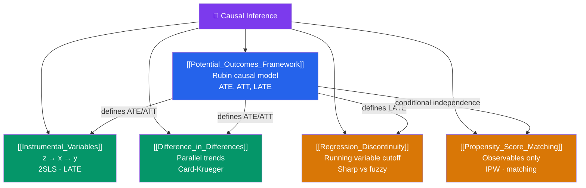

# 🗺️ Causal Inference — Map of Content

> [!abstract] What This Section Covers
> Causal inference is the core project of modern applied econometrics: how do we learn what would happen if we intervened in a system, using observational data that was not generated by a randomized experiment? This section covers the foundational **potential outcomes framework**, then four identification strategies: **instrumental variables** (exploit exogenous variation in treatment), **difference-in-differences** (compare treatment vs control before and after), **regression discontinuity** (exploit a cutoff in treatment assignment), and **propensity score matching** (match treated and control units on observed confounders).

## Concept Map

## Learning Path

1. [[Potential_Outcomes_Framework]] — The formal language of causality: potential outcomes, average treatment effects, the fundamental problem of causal inference, and selection bias.
2. [[Instrumental_Variables]] — Find a variable $z$ that shifts treatment $x$ but affects $y$ only through $x$. Estimate the causal effect via 2SLS.
3. [[Difference_in_Differences]] — Compare the change in outcomes for treated vs control units over time. Card-Krueger minimum wage study as the canonical example.
4. [[Regression_Discontinuity]] — Units just above vs just below a cutoff are quasi-randomly assigned to treatment. Lee (2008) electoral regression discontinuity.
5. [[Propensity_Score_Matching]] — When treatment is as-good-as-random conditional on observables. Match treated and control units on the propensity score.

## All Notes at a Glance

| Note | Difficulty | What You'll Learn |
|------|------------|-------------------|
| [[Potential_Outcomes_Framework]] | Intermediate | Rubin model, ATE/ATT/ATC, fundamental problem, selection bias, SUTVA |
| [[Instrumental_Variables]] | Intermediate | IV estimand, 2SLS, exclusion restriction, weak instruments, LATE |
| [[Difference_in_Differences]] | Intermediate | Parallel trends, DiD estimator, two-way FE, staggered adoption |
| [[Regression_Discontinuity]] | Intermediate | Sharp vs fuzzy RD, bandwidth, McCrary density test, external validity |
| [[Propensity_Score_Matching]] | Intermediate | CIA, propensity score theorem, IPW, matching estimators, overlap |

## Key Questions This Section Answers

- What is the fundamental problem of causal inference, and why can observational data not directly answer causal questions?
- What are the three assumptions required for IV to identify a causal effect?
- What is the parallel trends assumption in DiD, and how can you test it?
- How does a regression discontinuity design achieve identification, and what is its external validity limitation?
- When is propensity score matching valid, and why does it fail in the presence of unobservable confounders?

## Related Sections

- [[_MOC_Econometrics_Master|↑ Econometrics Master MOC]]
- [[_MOC_OLS_Problems|← OLS Problems]] — Omitted variable bias that causal methods address
- [[_MOC_Panel_Data|← Panel Data]] — Fixed effects as a causal inference tool

#MOC #Econometrics #causal-inference
