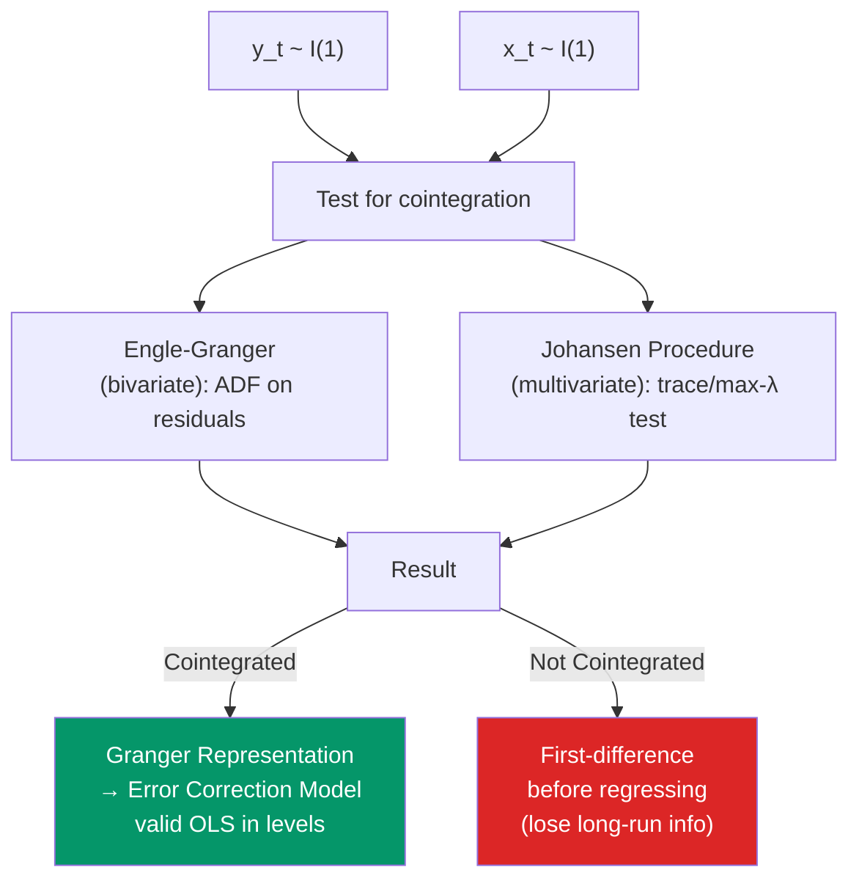

# 🔗 Cointegration

> [!abstract] TL;DR
> Two or more I(1) series are **cointegrated** if a linear combination of them is I(0). Cointegration captures a long-run equilibrium relationship: the series wander individually but are tethered together. The **Engle-Granger two-step** tests for cointegration in bivariate systems; the **Johansen procedure** handles multivariate cointegration and the number of cointegrating vectors. By the **Granger representation theorem**, cointegrated series have an Error Correction Model representation capturing short-run dynamics around the long-run equilibrium.

## Intuition — analogy FIRST

A drunkard and their dog are both I(1) processes — each meanders randomly. But the drunkard is walking their dog on a leash. Neither follows a deterministic path, but they cannot stray too far from each other — the leash enforces a long-run equilibrium. This is cointegration: two I(1) series bound together by an economic relationship.

In practice: GDP and consumption both grow stochastically, but the consumption share of GDP is roughly stable over the long run — they are cointegrated. Similarly, the price of oil in different markets meanders separately, but the price difference (spread) is bounded by arbitrage — the prices are cointegrated.

---

## How It Works



## Key Concepts / Details

### Definition

Variables $y_t$ and $x_t$ are **cointegrated** (order CI(1,1)) if:
- Both $y_t \sim I(1)$ and $x_t \sim I(1)$
- There exists $\beta$ such that $z_t = y_t - \beta x_t \sim I(0)$

The vector $(1, -\beta)'$ is the **cointegrating vector**. $z_t = y_t - \beta x_t$ is the equilibrium error — the deviation from long-run equilibrium.

In multivariate systems with $k$ I(1) variables, there can be up to $r \leq k-1$ cointegrating vectors (the **cointegrating rank** $r$).

### Why OLS is "Superconsistent" for Cointegrated Variables

If $y_t$ and $x_t$ are cointegrated, OLS of $y_t$ on $x_t$:
$$\hat{\beta}_{OLS} - \beta = O_p(T^{-1})$$

This is **superconsistency** — the estimator converges at rate $T$ instead of the usual $\sqrt{T}$. Inference is non-standard, however (non-normal limiting distribution), unless you use FMOLS or DOLS.

### Engle-Granger Two-Step Procedure

For bivariate cointegration test:

**Step 1**: Estimate the cointegrating regression by OLS:
$$y_t = \hat{\alpha} + \hat{\beta} x_t + \hat{z}_t$$

**Step 2**: Apply ADF test to the residuals $\hat{z}_t$:
$$\Delta \hat{z}_t = \gamma \hat{z}_{t-1} + \sum_j \delta_j \Delta \hat{z}_{t-j} + u_t$$

$H_0: \gamma = 0$ (no cointegration — residuals have a unit root)
$H_1: \gamma < 0$ (cointegration — residuals are stationary)

**Critical values**: Not standard ADF values — must use Engle-Granger/MacKinnon (1991) critical values (further left because we estimate $\hat{\beta}$ in step 1).

**Limitation**: Power low in small samples; asymmetric (OLS in step 1 is not symmetric — testing $y$ on $x$ vs $x$ on $y$ can give different results).

### Johansen Procedure (Multivariate)

For a $k$-vector of I(1) variables, the Johansen method estimates a VECM (Vector Error Correction Model) and tests for the cointegrating rank $r$.

**VAR in levels** → VECM representation:
$$\Delta Y_t = \Pi Y_{t-1} + \Gamma_1 \Delta Y_{t-1} + \ldots + \Gamma_{p-1} \Delta Y_{t-p+1} + \varepsilon_t$$

$\Pi = \alpha \beta'$ where $\text{rank}(\Pi) = r$ (cointegrating rank).

$\alpha$: adjustment (loading) matrix — speed of adjustment to equilibrium
$\beta$: cointegrating vectors matrix

**Trace test**: $H_0: \text{rank}(\Pi) \leq r$ vs $H_1: \text{rank}(\Pi) > r$ for $r = 0, 1, \ldots, k-1$

$$\lambda_{trace}(r) = -T \sum_{i=r+1}^k \ln(1 - \hat{\lambda}_i) \sim \chi^2 \text{ (non-standard)}$$

**Max-eigenvalue test**: $H_0: \text{rank}(\Pi) = r$ vs $H_1: \text{rank}(\Pi) = r+1$

$$\lambda_{max}(r, r+1) = -T\ln(1 - \hat{\lambda}_{r+1})$$

### Deterministic Components in Cointegration

Johansen procedure has 5 specifications for the trend/intercept:

| Case | Constant | Trend | Typical Application |
|------|---------|-------|---------------------|
| 1 | None | None | Rare; zero-mean series |
| 2* | In CE only | None | Series has non-zero mean, no trend (most common) |
| 3 | Unrestricted | None | |
| 4 | Unrestricted | In CE only | Series trend, CE has none |
| 5 | Unrestricted | Unrestricted | Series trend, CE also trends |

*Case 2 is the most common choice for macroeconomic series that have means but no deterministic trends in the cointegrating relationship.

```r
library(urca)
library(vars)
library(tsDyn)
library(tidyverse)

# Load macro data: GDP and consumption (both I(1))
data("UKpppuip", package = "urca")   # or use similar macro data

# Simulate cointegrated system
set.seed(42)
T    <- 200
eps1 <- rnorm(T, sd = 1)
eps2 <- rnorm(T, sd = 0.5)
ecm_error <- 0                   # start at equilibrium

# Long-run: y = 0.8*x + z, z ~ I(0) with AR(1) = 0.7
z    <- rep(0, T)
x    <- rep(0, T)
y    <- rep(0, T)
for (t in 2:T) {
  x[t] <- x[t-1] + eps1[t]
  z[t] <- 0.7 * z[t-1] + eps2[t]  # stationary equilibrium error
  y[t] <- 0.8 * x[t] + z[t]        # y = 0.8x + stationary component
}

df_ts <- data.frame(y = ts(y), x = ts(x))

# 1. Confirm both are I(1)
ur.df(df_ts$y, type = "drift", selectlags = "AIC") |> summary()
ur.df(df_ts$x, type = "drift", selectlags = "AIC") |> summary()

# 2. Engle-Granger two-step
# Step 1: cointegrating regression
coint_reg <- lm(y ~ x, data = df_ts)
cat("Cointegrating vector β̂:", coef(coint_reg)["x"], "\n")

# Step 2: ADF on residuals
resid_coint <- residuals(coint_reg)
ur.df(resid_coint, type = "none", selectlags = "AIC") |> summary()
# Use Engle-Granger critical values: -3.34 at 5% (not -2.86)

# 3. Johansen procedure
Y_matrix <- cbind(y, x)
colnames(Y_matrix) <- c("y", "x")

# Lag selection for VAR
var_sel <- VARselect(Y_matrix, lag.max = 5, type = "const")
print(var_sel$selection)

# Johansen trace test
jo_test <- ca.jo(Y_matrix, type = "trace", ecdet = "const",
                 K = 2, spec = "longrun")
summary(jo_test)
# First row: H0: r ≤ 0. If trace stat > 5% critical value, reject → r ≥ 1
# Second row: H0: r ≤ 1

# Johansen max-eigenvalue test
jo_max <- ca.jo(Y_matrix, type = "eigen", ecdet = "const", K = 2)
summary(jo_max)

# 4. Cointegrating vector and adjustment coefficients
# If r = 1, extract β and α
cat("Cointegrating vector (β):", jo_test@V[,1], "\n")
cat("Adjustment coefficients (α):", jo_test@W[,1], "\n")
```

### Inference on Cointegrating Vectors

Standard OLS inference is invalid for cointegrating regressions (non-normal limiting distribution). Use:
- **FMOLS (Fully Modified OLS)**: corrects for endogeneity and serial correlation
- **DOLS (Dynamic OLS)**: adds leads and lags of $\Delta x_t$ to the regression to account for short-run dynamics

```r
# DOLS: add leads and lags of Δx
d_x <- c(NA, diff(x))
df_dols <- data.frame(y, x,
  dx_lag1 = c(NA, NA, diff(x)[-length(diff(x))]),
  dx      = d_x,
  dx_lead1 = c(d_x[-1], NA)
)
dols <- lm(y ~ x + dx_lag1 + dx + dx_lead1, data = df_dols)
cat("DOLS β̂:", coef(dols)["x"], "\n")
```

---

## Real-World Notes

- **Engle and Granger (1987)**: Nobel Prize-winning paper introducing cointegration. Applied to US consumption and income — showed they are cointegrated with cointegrating vector close to 1 (consistent with the permanent income hypothesis).
- **Purchasing Power Parity**: The nominal exchange rate and domestic/foreign price levels should be cointegrated under PPP theory. Empirical tests yield mixed results — PPP holds as a long-run tendency but with slow adjustment.
- **Term structure**: Short and long interest rates are cointegrated (the "spread" is stationary) — a key prediction of the expectations hypothesis of the term structure.

---

## Common Pitfalls

- **Using standard ADF critical values in Engle-Granger step 2**: The EG residuals have estimated β in them, which shifts the distribution. Use MacKinnon (1991) critical values.
- **Testing for cointegration before confirming I(1)**: If either series is actually I(0), cointegration is irrelevant — just use the levels in OLS.
- **Ignoring the number of cointegrating vectors in multivariate systems**: With 4 I(1) variables, there could be up to 3 cointegrating relationships. The Johansen procedure tests for the rank.

---

## Related Concepts

- [[_MOC_TS_Econometrics|↑ Section MOC]]
- [[Unit_Roots_and_Integration]] — Prerequisite: both series must be I(1)
- [[Error_Correction_Models]] — The dynamic representation of cointegrated systems
- [[VAR_Models]] — VECM is a restricted VAR for cointegrated systems

---

## Review Questions

1. Define cointegration formally. Why does OLS give "superconsistent" estimates in a cointegrating regression, and why is standard inference still invalid?
2. Describe the Engle-Granger two-step procedure. Why must you use different critical values in step 2 compared to a standard ADF test?
3. In a Johansen trace test with 3 I(1) variables, you find: trace(r≤0) = 45 (5% CV = 29.7, reject), trace(r≤1) = 18 (5% CV = 15.4, reject), trace(r≤2) = 4 (5% CV = 3.8, reject). What do you conclude about the cointegrating rank?

---

## Sources

- Engle, R.F. & Granger, C.W.J. (1987), "Co-integration and Error Correction: Representation, Estimation, and Testing," *Econometrica*
- Johansen, S. (1991), "Estimation and Hypothesis Testing of Cointegration Vectors," *Econometrica*
- Hamilton, J.D., *Time Series Analysis*, Ch. 19 — Cointegration

#econometrics #statistics #time-series #cointegration #Johansen #Engle-Granger
