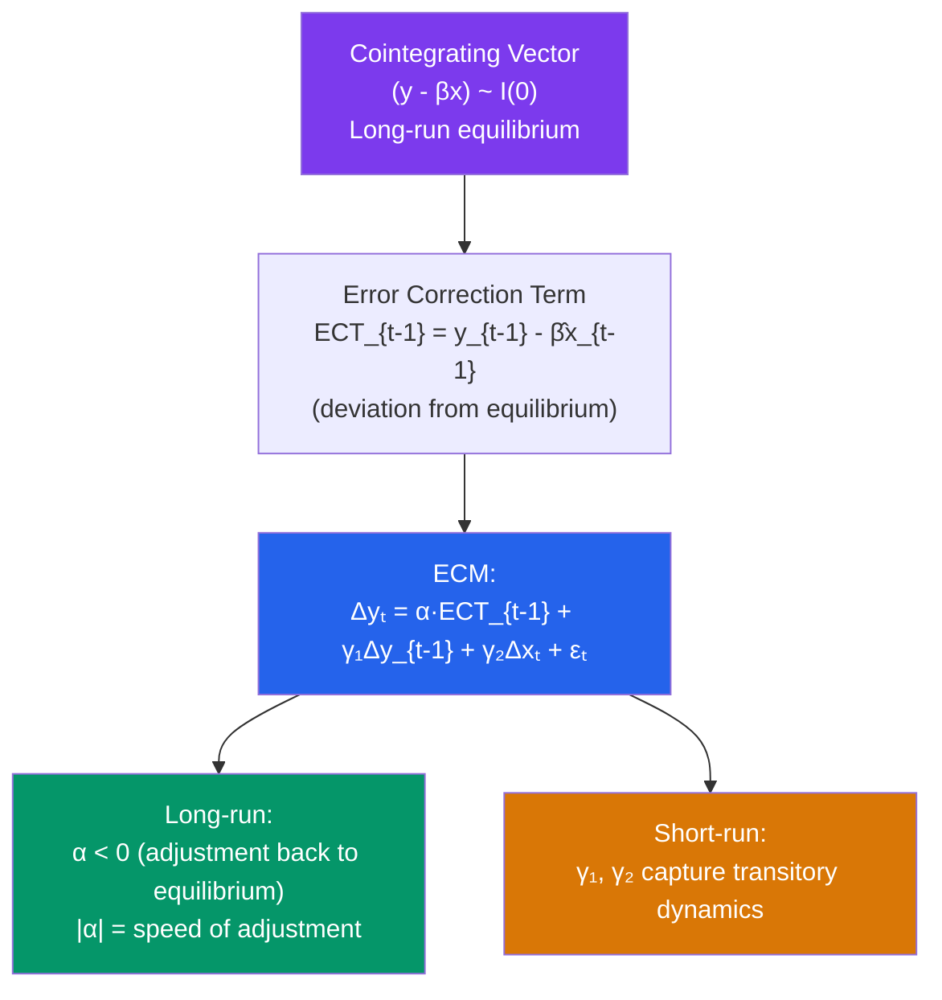

# ⚡ Error Correction Models

> [!abstract] TL;DR
> The **Granger Representation Theorem** states that if variables are cointegrated, they have an Error Correction Model (ECM) representation that separates short-run dynamics from long-run equilibrium adjustment. The ECM for two cointegrated I(1) variables: $\Delta y_t = \alpha (y_{t-1} - \beta x_{t-1}) + \text{short-run dynamics} + \varepsilon_t$. The **speed of adjustment** $\alpha < 0$ measures how fast the system corrects deviations from equilibrium. The ECM nests both short-run and long-run information without losing any through differencing.

## Intuition — analogy FIRST

Think of GDP and consumption as two hikers tied together by a bungee cord (the long-run cointegrating relationship). Each hiker meanders randomly (short-run dynamics), but whenever they drift too far apart, the bungee cord pulls them back together. The ECM captures both: the short-run wandering (first differences) and the bungee cord correction (the error correction term).

Pure first-differencing ($\Delta y$ on $\Delta x$) cuts the bungee cord — you model only the short-run changes and lose the information about the long-run equilibrium level. The ECM keeps both.

---

## How It Works



## Key Concepts / Details

### Granger Representation Theorem

**Theorem** (Engle-Granger 1987): Let $y_t$ and $x_t$ be I(1). Then:
$$y_t \text{ and } x_t \text{ are cointegrated} \iff \text{they have an ECM representation}$$

The ECM is:
$$\Delta y_t = \alpha_y (y_{t-1} - \beta x_{t-1}) + \sum_{j=1}^p \gamma_{yj} \Delta y_{t-j} + \sum_{j=0}^q \delta_{yj} \Delta x_{t-j} + \varepsilon_{yt}$$
$$\Delta x_t = \alpha_x (y_{t-1} - \beta x_{t-1}) + \sum_{j=1}^p \gamma_{xj} \Delta y_{t-j} + \sum_{j=0}^q \delta_{xj} \Delta x_{t-j} + \varepsilon_{xt}$$

**Components**:
- $(y_{t-1} - \beta x_{t-1})$: error correction term (ECT) — the deviation from long-run equilibrium in the previous period
- $\alpha_y$: adjustment coefficient for $y$ — must be negative for $y$ to error-correct
- $\alpha_x$: adjustment coefficient for $x$ — at least one must be non-zero (otherwise no equilibrium correction)
- $\sum \gamma, \delta$: short-run dynamics (ARMA structure in differences)

**Identification**: For cointegration to make sense, we need $\alpha_y < 0$ or $\alpha_x > 0$ (one variable adjusts toward the other). If neither adjusts, the series cannot be cointegrated.

### Interpretation of the Adjustment Coefficient

$\alpha_y = -0.3$: each period, 30% of the previous period's deviation from equilibrium is corrected. Full adjustment takes approximately $1/|\alpha|$ periods.

| $|\alpha|$ | Speed | Interpretation |
|------------|-------|----------------|
| Close to 1 | Fast | Full correction within 1 period (unusual for macro) |
| 0.1–0.3 | Moderate | 3–10 period adjustment |
| Close to 0 | Slow | Very slow mean reversion |
| 0 | No adjustment | Not truly error-correcting; may question cointegration |

### Estimation (Engle-Granger Two-Step)

**Step 1**: Estimate the long-run (cointegrating) relationship by OLS:
$$y_t = \alpha + \beta x_t + z_t \quad \Rightarrow \quad \hat{z}_t = y_t - \hat{\alpha} - \hat{\beta} x_t$$

**Step 2**: Estimate the short-run ECM with the lagged residual as ECT:
$$\Delta y_t = \alpha_y \hat{z}_{t-1} + \sum_j \gamma_j \Delta y_{t-j} + \sum_j \delta_j \Delta x_{t-j} + \varepsilon_t$$

In step 2, all variables are I(0) (first differences and the lagged ECT), so standard OLS inference is valid.

### VECM (Vector Error Correction Model)

The multivariate ECM (from Johansen procedure):
$$\Delta Y_t = \alpha \beta' Y_{t-1} + \Gamma_1 \Delta Y_{t-1} + \ldots + \Gamma_{p-1} \Delta Y_{t-p+1} + \varepsilon_t$$

$\beta' Y_{t-1}$: the $r$ error correction terms (one per cointegrating relationship)  
$\alpha$: $k \times r$ loading matrix (adjustment speeds)  
$\Gamma_j$: $k \times k$ short-run coefficient matrices

The VECM is a VAR in first differences augmented with the error correction terms. See [[VAR_Models]].

```r
library(dynlm)
library(tsDyn)
library(vars)
library(urca)

# Simulate cointegrated system
set.seed(42)
T    <- 300
x    <- cumsum(rnorm(T))           # I(1)
beta <- 1.5
ecm_err <- 0
y   <- rep(0, T)
for (t in 2:T) {
  ecm_err <- y[t-1] - beta * x[t-1]  # deviation from LR equilibrium
  dy  <- -0.4 * ecm_err + 0.2 * (y[t-1] - y[max(1, t-2)]) + rnorm(1)
  y[t] <- y[t-1] + dy
  x[t] <- x[t-1] + rnorm(1)
}

# Step 1: Estimate long-run relationship
lr_model <- lm(y ~ x)
ect <- residuals(lr_model)
cat("β̂ (long-run):", coef(lr_model)["x"], "\n")

# Step 2: ECM
dy <- diff(y); dx <- diff(x); ect_lag <- ect[-length(ect)]
ecm_df <- data.frame(
  dy     = dy,
  ect_lag = ect_lag,
  dy_lag = c(NA, dy[-length(dy)]),
  dx     = dx
)
ecm_model <- lm(dy ~ ect_lag + dy_lag + dx, data = ecm_df, na.action = na.omit)
summary(ecm_model)
cat("Speed of adjustment α̂:", coef(ecm_model)["ect_lag"], "\n")  # should be ≈ -0.4

# VECM via tsDyn
Y_matrix <- cbind(y, x)
vecm_model <- VECM(Y_matrix, lag = 2, r = 1, estim = "2OLS")
summary(vecm_model)

# VECM via urca/vars
jo_obj   <- ca.jo(Y_matrix, type = "trace", ecdet = "const", K = 2)
vecm_var <- vec2var(jo_obj, r = 1)
summary(vecm_var)

# Impulse response from VECM
vecm_irf <- irf(vecm_var, impulse = "x", response = "y",
                n.ahead = 20, boot = TRUE)
plot(vecm_irf)
```

### Long-Run Multiplier vs Short-Run Dynamics

The ECM decomposes the total effect of $\Delta x$ on $y$ into:
- **Impact multiplier**: $\delta_0$ (contemporaneous effect of $\Delta x$ on $\Delta y$)
- **Long-run multiplier**: $\beta$ (the cointegrating vector — total cumulative effect as $t \to \infty$)
- **Speed of adjustment**: $\alpha$ (fraction of gap closed per period)

This decomposition is crucial for policy analysis: a monetary policy shock may have small impact effects but large long-run effects, or vice versa.

---

## Real-World Notes

- **Consumption-income ECM (Davidson et al. 1978)**: The "DHSY model" — consumption growth depends on income growth and a correction toward the long-run consumption-income ratio. Found $\alpha \approx -0.1$ for UK quarterly data: about 10% of excess consumption is corrected each quarter, implying full adjustment in ~10 quarters.
- **Money demand ECM**: Quantity theory relates money (M), prices (P), output (Y), and velocity — cointegration among these generates an ECM for money demand. The adjustment speed estimates how fast excess money supply is absorbed.
- **Interest rate dynamics**: Short and long rates cointegrate (expectations hypothesis). The ECM captures how short rates adjust to deviations from the yield spread, with adjustment speed varying over the business cycle.

---

## Common Pitfalls

- **Omitting the ECT from the short-run model**: If variables are cointegrated, omitting the ECT from the short-run model results in a misspecified equation (omitted variable bias). Always include the ECT.
- **Wrong sign on the adjustment coefficient**: $\alpha_y$ must be negative for error correction. If it is positive, the system diverges from equilibrium — implies model misspecification or wrong cointegrating vector.
- **Using the ECT without confirming cointegration**: The Engle-Granger two-step must first confirm cointegration (step 2 ADF on residuals). Using an ECT without confirmed cointegration leads to spurious adjustment dynamics.

---

## Related Concepts

- [[_MOC_TS_Econometrics|↑ Section MOC]]
- [[Cointegration]] — The prerequisite: cointegration implies ECM by Granger representation
- [[Unit_Roots_and_Integration]] — Must confirm I(1) before ECM analysis
- [[VAR_Models]] — VECM is the multivariate ECM representation

---

## Review Questions

1. State the Granger Representation Theorem. What does it imply about the relationship between cointegration and error correction models?
2. Estimate an ECM for consumption and income via the Engle-Granger two-step. What does a speed-of-adjustment coefficient of $-0.15$ mean in economic terms?
3. In a bivariate system with $y$ and $x$ cointegrated, you estimate $\hat{\alpha}_y = -0.3$ and $\hat{\alpha}_x = 0.05$. How do you interpret these coefficients? Which variable does most of the error correction?

---

## Sources

- Engle, R.F. & Granger, C.W.J. (1987), "Co-integration and Error Correction," *Econometrica*
- Davidson, J.E.H., Hendry, D.F., Srba, F. & Yeo, S. (1978), "Econometric Modelling of the Aggregate Time-Series Relationship Between Consumers' Expenditure and Income in the United Kingdom," *Economic Journal*
- Johansen, S. (1991), "Estimation and Hypothesis Testing of Cointegration Vectors in Gaussian Vector Autoregressive Models," *Econometrica*

#econometrics #statistics #time-series #ECM #error-correction #VECM #Granger-representation
