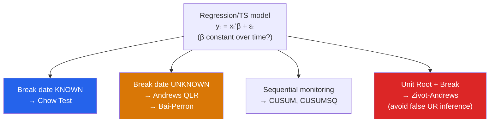

# 🔨 Structural Breaks

> [!abstract] TL;DR
> A structural break occurs when the parameters of a time-series model change at some point $t^*$. Ignoring breaks inflates residual variance and biases parameter estimates. The **Chow test** tests for a break at a known date. **CUSUM and CUSUMSQ** tests detect instability over time. **Andrews QLR** and **Bai-Perron** tests find unknown break dates. Crucially, structural breaks reduce the power of unit root tests — the **Zivot-Andrews** test allows for a break under the alternative to avoid falsely failing to reject the unit root null.

## Intuition — analogy FIRST

Imagine fitting a line to historical US GDP growth from 1950–2020. The early period (1950–1980) had strong growth with high variance; the post-1983 "Great Moderation" had lower growth with much lower variance; COVID caused a massive break in 2020. A single linear regression across all periods would fit none of them well and would produce misleading coefficient estimates.

Structural break tests ask: is there statistical evidence that the parameters changed at some point? If so, either treat the sub-periods separately or allow for regime-switching models.

---

## How It Works



## Key Concepts / Details

### Chow Test (Known Break Date)

**Setup**: Test whether parameters change at a known date $t^*$.

**Procedure**: Estimate three regressions:
1. Full sample: $y_t = x_t'\beta + \varepsilon_t$ (restricted)
2. Pre-break: $y_t = x_t'\beta_1 + \varepsilon_t$ for $t \leq t^*$
3. Post-break: $y_t = x_t'\beta_2 + \varepsilon_t$ for $t > t^*$

**Chow F-statistic**: $H_0: \beta_1 = \beta_2$
$$F = \frac{(SSR_R - SSR_1 - SSR_2)/k}{(SSR_1 + SSR_2)/(T - 2k)} \sim F_{k, T-2k}$$

Reject $H_0$ if there is a structural break at $t^*$.

**Limitation**: requires the break date to be specified a priori. Pre-testing on the same data biases the test.

### CUSUM and CUSUMSQ Tests

**CUSUM (cumulative sum of recursive residuals)**:
$$W_t = \frac{1}{\hat{\sigma}}\sum_{s=k+1}^t w_s, \quad w_s = y_s - x_s' \hat{\beta}_{s-1}$$

Plot $W_t$ with confidence bands $\pm c\sqrt{T}$. Crosses outside bands → instability.

**CUSUMSQ**: Same using squared residuals. More sensitive to changes in variance.

Both tests detect parameter drift or structural instability anywhere in the sample, without specifying a break date.

### Andrews Quandt Likelihood Ratio (QLR) Test

For unknown break date, compute the Chow F-statistic for all possible break dates $t^* \in [\pi_0 T, (1-\pi_0)T]$ (typically $\pi_0 = 0.15$):
$$QLR = \sup_{t^* \in [\pi_0 T, (1-\pi_0)T]} F(t^*)$$

Non-standard critical values (Andrews 1993) because we search over all dates. This is the proper way to handle unknown break dates — not choosing the date that maximizes $F$ and then using standard Chow critical values (that biases the test severely).

### Bai-Perron Multiple Break Test

Tests for $m$ structural breaks simultaneously, estimates their locations, and determines the number of breaks.

**Method**:
1. Test $H_0$: no breaks vs $H_1$: one break (SupF test)
2. Test $H_0$: $m$ breaks vs $H_1$: $m+1$ breaks (sequential)
3. Use BIC or modified SIC to determine optimal number of breaks
4. Estimate break dates by dynamic programming (minimize global SSR)

Bai-Perron is the state of the art for multiple structural breaks in regression models.

### Zivot-Andrews Unit Root Test with Structural Break

**Problem**: Under the alternative hypothesis of stationarity with a structural break, the ADF test has low power (it confuses the break with persistence). This leads to over-rejecting stationarity (failing to reject unit root) when the true process is trend-stationary with a break.

**Zivot-Andrews (1992) Test**: Allows for a trend break under $H_1$:
$$H_1: y_t = \mu + \beta t + \gamma D U_t(\lambda) + d D T_t^*(\lambda) + \alpha y_{t-1} + \ldots + u_t$$

where $\lambda = t^*/T$ is the (unknown) break fraction and $DU_t, DT_t^*$ are break dummies.

Test statistic: $\inf_\lambda t(\lambda)$ — the minimum t-statistic for $\alpha = 1$ across all break fractions. Critical values are non-standard and further left than standard ADF.

**If ZA rejects but ADF does not**: suggests the series is stationary around a broken trend, not a random walk.

```r
library(urca)
library(strucchange)
library(mbreaks)
library(tidyverse)

# Simulate data with structural break
set.seed(42)
T    <- 200
t_br <- 100  # break at period 100
x    <- 1:T
beta1 <- 0.5; beta2 <- 1.2  # break in slope
y    <- c(5 + beta1 * 1:t_br + rnorm(t_br),
          5 + beta1 * t_br + beta2 * (1:(T-t_br)) + rnorm(T-t_br))

df <- data.frame(y = y, x = x, t = 1:T)

# 1. Chow test at known break (t=100)
pre  <- df[1:100, ]
post <- df[101:200, ]
ssr_r  <- sum(lm(y ~ x, data = df)$residuals^2)
ssr_1  <- sum(lm(y ~ x, data = pre)$residuals^2)
ssr_2  <- sum(lm(y ~ x, data = post)$residuals^2)
k      <- 2
chow_F <- ((ssr_r - ssr_1 - ssr_2)/k) / ((ssr_1 + ssr_2)/(T - 2*k))
cat("Chow F-statistic:", chow_F, "(critical value 5%:", qf(0.95, k, T-2*k), ")\n")

# 2. CUSUM test (strucchange package)
ols_model <- lm(y ~ x, data = df)
cusum_test <- efp(y ~ x, data = df, type = "OLS-CUSUM")
plot(cusum_test)
sctest(cusum_test)

# CUSUMSQ
cusumsq_test <- efp(y ~ x, data = df, type = "OLS-MOSUM")
plot(cusumsq_test)

# 3. Andrews QLR test (unknown break date)
qlr_test <- Fstats(y ~ x, data = df, from = 0.15)
sctest(qlr_test, type = "supF")
plot(qlr_test)

# 4. Bai-Perron test (multiple breaks)
bp_test <- breakpoints(y ~ x, data = df, breaks = 5)
summary(bp_test)  # Optimal number of breaks by BIC
plot(bp_test)

# Extract break dates
print(breakdates(bp_test))

# 5. Zivot-Andrews test (unit root with unknown break)
# Simulate near-trend-stationary series with break
y_za <- c(0.5 * 1:100 + rnorm(100), 5 + 0.2 * 1:100 + rnorm(100))
za_test <- ur.za(y_za, model = "both", lag = 4)
summary(za_test)
# Compare test statistic to ZA critical values (-5.57 at 1%, -5.08 at 5%)
```

### Pre-Break vs Post-Break Analysis

When a break is confirmed:

| Approach | When to Use | Trade-off |
|----------|-------------|-----------|
| Split sample | Clear, permanent break | Lose power from smaller subsamples |
| Dummy variable approach | Small effect, interested in both periods | Assumes same error variance |
| Rolling regressions | Gradual change | No clear break date |
| Smooth transition models | Gradual regime change | More complex estimation |
| Regime-switching (Markov) | Recurrent breaks | Many parameters |

---

## Real-World Notes

- **Great Moderation (1984)**: McConnell and Perez-Quiros (2000) used the Chow test and found a significant break in US GDP volatility around 1984. The post-1984 period had roughly half the variance of the pre-1984 period. This was one of the most discussed structural breaks in macro.
- **Nelson-Plosser (1982) reconsidered**: Perron (1989) argued that many of the unit roots found by Nelson-Plosser were actually trend-stationary processes with a one-time structural break in 1929 (Great Depression). This sparked a major methodological debate.
- **Financial crises**: The 2008 financial crisis represents a structural break in many financial relationships (correlations between asset classes, yield spreads). Models estimated on pre-2008 data had dramatic forecast failures.

---

## Common Pitfalls

- **Using standard Chow critical values for an estimated break date**: If you pick the break date that maximizes $F$ (endogenous break selection) and then test with standard critical values, you will over-reject. Use Andrews QLR critical values.
- **Ignoring the Zivot-Andrews issue with unit roots**: A series that is I(0) with a structural break can look like I(1) in standard ADF tests. Always use ZA when there is reason to suspect a break.
- **Too many breaks with small samples**: Bai-Perron can overfit with many break candidates and short samples. The minimum segment length (typically 15% of sample) prevents degenerate solutions.

---

## Related Concepts

- [[_MOC_TS_Econometrics|↑ Section MOC]]
- [[Unit_Roots_and_Integration]] — Zivot-Andrews extends ADF to allow for breaks
- [[VAR_Models]] — Structural breaks in VAR parameters are common in macro applications
- [[Regression_Diagnostics]] — CUSUM is a general diagnostic for parameter instability

---

## Review Questions

1. Describe the Chow test for a structural break at a known date $t^*$. Why would it be invalid to choose $t^*$ as the date that maximizes the Chow F-statistic and then use standard Chow critical values?
2. Explain why structural breaks reduce the power of the ADF unit root test. What does the Zivot-Andrews test do differently to address this?
3. A researcher tests for structural breaks in a quarterly inflation regression using US data from 1960–2020. The Bai-Perron test identifies breaks in 1973 and 1984. How would you re-estimate the model, and how would the presence of breaks affect the interpretation of the long-run coefficients?

---

## Sources

- Chow, G.C. (1960), "Tests of Equality between Sets of Coefficients in Two Linear Regressions," *Econometrica*
- Andrews, D.W.K. (1993), "Tests for Parameter Instability and Structural Change with Unknown Change Point," *Econometrica*
- Bai, J. & Perron, P. (1998), "Estimating and Testing Linear Models with Multiple Structural Changes," *Econometrica*
- Zivot, E. & Andrews, D.W.K. (1992), "Further Evidence on the Great Crash, the Oil-Price Shock, and the Unit-Root Hypothesis," *Journal of Business and Economic Statistics*

#econometrics #statistics #time-series #structural-breaks #Chow-test #CUSUM #Zivot-Andrews
