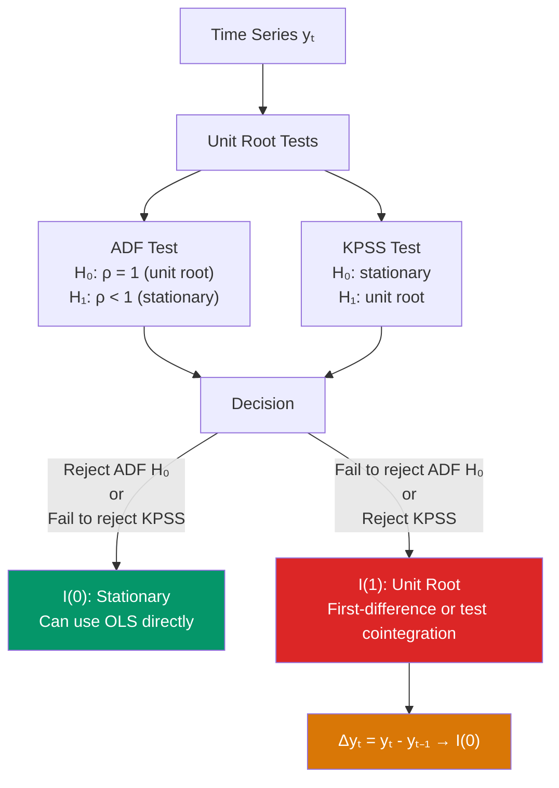

# 🌊 Unit Roots and Integration

> [!abstract] TL;DR
> A time series has a **unit root** (is I(1)) if it contains a stochastic trend: $y_t = y_{t-1} + \varepsilon_t$ (random walk). Regressing two independent random walks produces **spurious regression** — high $R^2$ and significant t-stats despite no true relationship. Test for unit roots with the **Augmented Dickey-Fuller (ADF)** test ($H_0$: unit root; non-standard distribution) or the **KPSS** test ($H_0$: stationarity). If both series are I(1) but cointegrated, OLS is valid; otherwise, first-difference before regressing.

## Intuition — analogy FIRST

A drunkard walking home starts at a lamppost and takes random steps left or right. After 1000 steps, they could be very far from the lamppost — the variance of their position grows with time. This is a random walk (unit root process): it has no fixed center it returns to.

A sober person walking home starts at the lamppost and walks consistently toward their house. Each deviation is temporary; they always trend back. This is a stationary process.

Economic variables like GDP, stock prices, and interest rates behave like drunkards — they do not have a fixed mean they return to over short horizons. Running a regression between two independent drunkards will show a spurious correlation just because they both drift.

---

## How It Works



## Key Concepts / Details

### Integrated Processes

A process $\{y_t\}$ is **integrated of order $d$**, denoted $I(d)$, if it must be differenced $d$ times to achieve stationarity.

- **I(0)**: Stationary — $E[y_t]$, $\text{Var}(y_t)$ constant; $\text{Cov}(y_t, y_{t-k}) \to 0$. Examples: white noise, ARMA processes.
- **I(1)**: First difference is stationary; level is not. Examples: random walk, GDP, stock prices, nominal exchange rates.
- **I(2)**: Second difference is stationary. Examples: price level (differences are inflation; differenced once gives I(1) inflation).

### The Random Walk (I(1))

$$y_t = y_{t-1} + \varepsilon_t, \quad \varepsilon_t \sim (0, \sigma^2)$$

Properties:
- $E[y_t] = y_0$ (constant mean, but non-mean-reverting)
- $\text{Var}(y_t) = t\sigma^2$ (grows without bound)
- $\text{Corr}(y_t, y_{t-k}) \to 1$ as $t \to \infty$

**Random walk with drift**: $y_t = \mu + y_{t-1} + \varepsilon_t$ (deterministic trend + stochastic trend)

### Spurious Regression

Two independent I(1) processes $y_t$ and $x_t$ (unrelated random walks):
$$y_t = \beta x_t + u_t$$

As $T \to \infty$, OLS gives:
- $R^2 \to 1$ (!!!)
- t-statistic $\to \infty$ (!!!)
- DW statistic $\to 0$ (strong autocorrelation in residuals)

**The DW test is the first check**: if $DW \ll 2$ in a levels regression of I(1) variables, suspect spurious regression.

Granger and Newbold (1974) first documented this empirically; Phillips (1986) proved it theoretically.

### The Augmented Dickey-Fuller (ADF) Test

**Model**: $\Delta y_t = \alpha + \beta t + \gamma y_{t-1} + \sum_{j=1}^p \delta_j \Delta y_{t-j} + \varepsilon_t$

**Null**: $H_0: \gamma = 0$ (unit root) vs $H_1: \gamma < 0$ (stationary)

**Test statistic**: $DF = \hat{\gamma}/SE(\hat{\gamma})$ — NOT t-distributed under $H_0$. Uses **Dickey-Fuller distribution** (non-standard, left-tailed).

The augmented lags $\Delta y_{t-j}$ (order $p$) control for serial correlation in residuals. Choose $p$ by AIC/BIC or general-to-specific testing (start with high $p$, drop insignificant lags).

**Specifications** (choose based on economic theory):

| Specification | Equation | Use when |
|--------------|---------|---------|
| No constant, no trend | $\Delta y_t = \gamma y_{t-1} + \ldots$ | Series has zero mean |
| Constant only | $\Delta y_t = \alpha + \gamma y_{t-1} + \ldots$ | Series has non-zero mean, no trend |
| Constant + trend | $\Delta y_t = \alpha + \beta t + \gamma y_{t-1} + \ldots$ | Series has deterministic trend |

Always include at least a constant for economic series.

### Phillips-Perron (PP) Test

Non-parametric alternative to ADF: corrects for serial correlation in $\varepsilon_t$ using Newey-West instead of augmented lags.
$$\Delta y_t = \alpha + \gamma y_{t-1} + \varepsilon_t$$

Modified test statistic accounts for long-run variance. More powerful than ADF in some settings, less powerful in others. Use ADF and PP together for robustness.

### KPSS Test

**Null**: $H_0$: stationarity (opposite of ADF!)
$$y_t = \xi_t + \varepsilon_t, \quad \xi_t = \xi_{t-1} + u_t$$

Test statistic: $\text{KPSS} = \frac{1}{T^2 \hat{\sigma}^2_{LR}} \sum_t \hat{S}_t^2$ where $\hat{S}_t = \sum_{s=1}^t \hat{\varepsilon}_s$ (partial sums).

**Confirmatory strategy**: If ADF rejects AND KPSS does not reject → strong evidence of stationarity. If both reject → evidence of unit root. If ADF does not reject AND KPSS rejects → consistent: unit root. If neither rejects → inconclusive.

```r
library(urca)
library(tseries)
library(tidyverse)

# GDP data example
data("gdp", package = "FinTS")  # or use macro data
gdp  <- ts(log(rnorm(200, mean = exp(cumsum(rnorm(200, 0.01, 0.02))), sd = 0.01)),
           start = c(1980, 1), frequency = 4)

# 1. Plot the series (visual check)
plot(gdp, main = "Log GDP", ylab = "Log GDP")
acf(as.numeric(gdp), main = "ACF of Log GDP")  # slow decay → possible unit root

# 2. ADF test (urca package: ur.df)
# With constant and trend
adf_result <- ur.df(gdp, type = "trend", selectlags = "AIC")
summary(adf_result)
# Compare test statistic to critical values at 1%, 5%, 10%

# With constant only
adf_const <- ur.df(gdp, type = "drift", selectlags = "AIC")
summary(adf_const)

# tseries package version
adf.test(gdp)  # less flexible but simpler

# 3. Phillips-Perron test
pp.test(gdp)

# 4. KPSS test
kpss.test(gdp, null = "Trend")   # H0: trend-stationary
kpss.test(gdp, null = "Level")   # H0: level-stationary

# 5. First-difference and retest
d_gdp <- diff(gdp)
ur.df(d_gdp, type = "drift", selectlags = "AIC") |> summary()
# Should be stationary (reject H0: unit root)

# 6. Spurious regression illustration
set.seed(42)
T     <- 200
y_rw  <- cumsum(rnorm(T))  # independent random walk 1
x_rw  <- cumsum(rnorm(T))  # independent random walk 2

spur_model <- lm(y_rw ~ x_rw)
cat("Spurious R²:", summary(spur_model)$r.squared, "\n")  # ≈ high!
cat("Durbin-Watson:", dwtest(spur_model)$statistic, "\n")  # ≈ low (< 1)

# Proper: first-difference both
d_y <- diff(y_rw); d_x <- diff(x_rw)
proper_model <- lm(d_y ~ d_x)
cat("Differenced R²:", summary(proper_model)$r.squared, "\n")  # ≈ near 0
```

### Decision Rule

```
Test for unit root in y_t and x_t:
├── Both I(0): OLS in levels is valid
├── y ~ I(1), x ~ I(0) (or vice versa): OLS usually spurious; reconsider model
├── Both I(1):
│   ├── Test for cointegration (Engle-Granger / Johansen)
│   │   ├── Cointegrated: OLS in levels is valid (superconsistent); use ECM
│   │   └── Not cointegrated: first-difference before regressing; lose long-run
└── Both I(2): difference twice; test for cointegration of I(2) series
```

---

## Real-World Notes

- **Nelson and Plosser (1982)**: Tested 14 US macroeconomic time series for unit roots using the ADF test. Found 13 of 14 appeared to have unit roots — including GDP, employment, and prices. Sparked a major debate about whether economic time series are trend-stationary or difference-stationary.
- **Purchasing power parity (PPP)**: Testing whether the real exchange rate is I(0) (mean-reverting) or I(1) (random walk) is a central question in international macroeconomics. Most studies find I(1) or "near I(1)" behavior at short horizons.
- **ADF power problem**: The ADF test has low power against near-unit-root alternatives (e.g., AR(1) with $\rho = 0.95$). With limited time series data, failing to reject the null does not strongly confirm a unit root.

---

## Common Pitfalls

- **Omitting the constant or trend when appropriate**: Including the wrong deterministic specification in the ADF test changes the distribution of the test statistic and critical values.
- **Using standard t-distribution critical values for ADF**: The ADF test statistic is not t-distributed under $H_0$. Always use Dickey-Fuller critical values.
- **Differencing when the series is actually trend-stationary**: If $y_t = \mu + \alpha t + \varepsilon_t$ (deterministic trend, no unit root), differencing is unnecessary and removes the level information. Include the trend in the regression instead.

---

## Related Concepts

- [[_MOC_TS_Econometrics|↑ Section MOC]]
- [[Autocorrelation]] — Serial correlation of stationary series (precursor to unit root discussion)
- [[Cointegration]] — What to do when two I(1) series move together
- [[Structural_Breaks]] — How breaks affect ADF test power and inference
- [[Error_Correction_Models]] — The ECM representation for cointegrated I(1) series

---

## Review Questions

1. Explain why regressing one independent random walk on another produces a spurious result with high $R^2$ and significant t-statistics. What diagnostic statistic would alert you to this problem?
2. Describe the ADF test: state the null hypothesis, the test equation, and why the test statistic does not follow a standard t-distribution under $H_0$.
3. A KPSS test fails to reject stationarity but an ADF test also fails to reject the unit root. Is this consistent or inconsistent? What would you conclude?

---

## Sources

- Dickey, D.A. & Fuller, W.A. (1979), "Distribution of the Estimators for Autoregressive Time Series with a Unit Root," *JASA*
- Granger, C.W.J. & Newbold, P. (1974), "Spurious Regressions in Econometrics," *Journal of Econometrics*
- Wooldridge, J.M., *Introductory Econometrics*, Ch. 18 — Advanced Time Series Topics

#econometrics #statistics #time-series #unit-root #ADF #integration #spurious-regression
