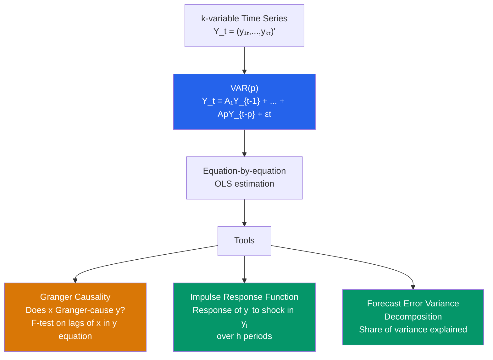

# 📡 VAR Models

> [!abstract] TL;DR
> Vector Autoregression (VAR) models a system of $k$ time series as a function of their own lags: $Y_t = A_1 Y_{t-1} + \ldots + A_p Y_{t-p} + \varepsilon_t$. Estimated equation-by-equation via OLS. VARs are used for **Granger causality** tests (does $x$ help predict $y$?), **impulse response functions** (how does $y$ respond to a shock in $x$?), and **forecast error variance decomposition** (what fraction of $y$'s forecast error is explained by each variable?). If variables are I(1) and cointegrated, use a **VECM** instead.

## Intuition — analogy FIRST

A macroeconomist wants to understand how GDP, inflation, and interest rates interact. Each variable affects the others with lags: the Fed raises interest rates (monetary policy shock), which slows growth after 2-4 quarters, which reduces inflation after another 2-4 quarters, which might prompt the Fed to lower rates again. No single equation captures this full dynamic system.

A VAR treats each variable as the dependent variable in turn, regressing it on lags of all variables in the system. It is atheoretic — it imposes minimal structure — and captures the full dynamic interdependencies. Impulse response functions trace out the multi-period effects of shocks.

---

## How It Works



## Key Concepts / Details

### The VAR(p) Model

$$Y_t = c + A_1 Y_{t-1} + A_2 Y_{t-2} + \ldots + A_p Y_{t-p} + \varepsilon_t$$

where:
- $Y_t$: $k \times 1$ vector of stationary time series
- $A_j$: $k \times k$ coefficient matrices
- $\varepsilon_t$: $k \times 1$ white noise vector with $E[\varepsilon_t] = 0$, $E[\varepsilon_t \varepsilon_t'] = \Sigma$ (contemporaneous covariance matrix)
- $c$: $k \times 1$ constant vector

**Estimation**: OLS on each equation separately is efficient (Zellner's SUR reduces to OLS when all equations have the same regressors).

**Parameter count**: $k^2 p + k$ (coefficients) + $k(k+1)/2$ (covariance parameters). VARs use many parameters — important for lag selection.

### Lag Length Selection

| Criterion | Formula | Tendency |
|-----------|---------|---------|
| **AIC** | $\ln|\hat{\Sigma}| + 2k^2 p/T$ | Prefers longer lags |
| **BIC/SIC** | $\ln|\hat{\Sigma}| + k^2 p \ln T/T$ | Penalizes more; shorter lags |
| **HQ (Hannan-Quinn)** | $\ln|\hat{\Sigma}| + 2k^2 p \ln\ln T/T$ | Intermediate |
| **LR test** | Sequential: test VAR($p$) vs VAR($p-1$) | Consistent |

Typical practice: use AIC for forecasting, BIC for structural analysis; always check residuals for serial correlation regardless of chosen lag.

### Stationarity Condition

A VAR(p) is stable (all roots lie outside the unit circle) iff:
$$\det(I_k - A_1 z - A_2 z^2 - \ldots - A_p z^p) \neq 0 \quad \text{for } |z| \leq 1$$

Equivalent to: all eigenvalues of the companion matrix have modulus < 1. Always check stability before computing IRFs.

### Granger Causality

"$x$ Granger-causes $y$" means $x$'s lags help predict $y$ beyond $y$'s own lags (and other system variables).

**Test**: In the $y$ equation of the VAR, test $H_0$: all coefficients on lags of $x$ are zero.
$$F = \frac{(RSS_R - RSS_U)/q}{RSS_U/(T - k_{params})} \sim F_{q, T - k_{params}}$$

**Interpretation**: Granger causality is a statistical predictive concept, NOT structural causality. "$x$ Granger-causes $y$" means $x$ carries predictive information about $y$'s future, but this could reflect a third variable causing both with different lags.

### Impulse Response Functions (IRF)

An IRF traces the response of $Y$ to a one-unit shock to one equation's error at time 0, over horizons $h = 0, 1, 2, \ldots$

**Problem**: $\Sigma \neq I$ — shocks are contemporaneously correlated. Must orthogonalize.

**Cholesky decomposition**: Decompose $\Sigma = PP'$ (lower triangular $P$). Define orthogonal shocks $u_t = P^{-1}\varepsilon_t$.

**Structural VAR (SVAR)**: Impose economic restrictions (from theory) to identify orthogonal structural shocks without Cholesky ordering assumption.

**Cholesky IRF is ordering-dependent**: the first variable responds immediately to all shocks; the last variable responds only to its own shock contemporaneously. Economic theory should guide the ordering.

### Forecast Error Variance Decomposition (FEVD)

How much of the $h$-step-ahead forecast error variance of $y_i$ is attributable to shocks in $y_j$?

$$\text{FEVD}_{ij}(h) = \frac{\sum_{s=0}^{h-1} (e_i' \Phi_s P e_j)^2}{\sum_{j=1}^k \sum_{s=0}^{h-1} (e_i' \Phi_s P e_j)^2}$$

where $\Phi_s$ are the moving average coefficient matrices and $P$ is the Cholesky factor.

```r
library(vars)
library(ggplot2)

# Bivariate VAR: GDP growth and inflation
data("Canada", package = "vars")  # Canada macroeconomic data: e, prod, rw, U
canada_ts <- Canada[, c("prod", "U")]  # productivity and unemployment

# 1. Lag selection
var_sel <- VARselect(canada_ts, lag.max = 8, type = "const")
print(var_sel$selection)

# 2. Estimate VAR(2)
var_model <- VAR(canada_ts, p = 2, type = "const")
summary(var_model)

# 3. Stability check
roots(var_model)  # all should be < 1

# 4. Serial correlation of residuals (Portmanteau test)
serial.test(var_model, lags.pt = 12, type = "PT.asymptotic")

# 5. Normality of residuals
normality.test(var_model, multivariate.only = FALSE)

# 6. Granger causality
causality(var_model, cause = "prod")  # Does productivity Granger-cause unemployment?

# 7. Impulse Response Functions
irf_model <- irf(var_model, impulse = "prod", response = "U",
                  n.ahead = 20, boot = TRUE, ci = 0.95)
plot(irf_model)

# Orthogonalized IRF (Cholesky)
irf_orth <- irf(var_model, impulse = "prod", response = "U",
                 n.ahead = 20, ortho = TRUE, boot = TRUE)
plot(irf_orth)

# 8. Forecast Error Variance Decomposition
fevd_res <- fevd(var_model, n.ahead = 20)
plot(fevd_res)

# 9. VAR forecasting
forecast_var <- predict(var_model, n.ahead = 8, ci = 0.95)
plot(forecast_var)

# 10. Trivariate VAR
var_3 <- VAR(Canada, p = 2, type = "const")
summary(var_3)
```

### Structural VAR (SVAR)

To recover economically meaningful shocks, impose identifying restrictions:

| Identification | Restriction | Example |
|---------------|-------------|---------|
| **Cholesky** | Recursive (lower triangular $A_0$) | $y$ doesn't respond to $x$ on impact |
| **Short-run** | $k(k-1)/2$ restrictions on $A_0$ | IS/LM model restrictions |
| **Long-run** | Blanchard-Quah: $k(k-1)/2$ restrictions on long-run impact | Supply shock has no long-run effect on output |
| **Sign restrictions** | Signs on IRF responses | Demand shock raises prices and output |

---

## Real-World Notes

- **Sims (1980)**: Nobel Prize for introducing VARs as alternatives to large simultaneous equations models. Showed that atheoretic VARs with good fit were superior to theory-based structural models for macro forecasting.
- **Bernanke-Sims SVAR**: Identifying monetary policy shocks via short-run restrictions — the Fed funds rate is ordered last (most exogenous on impact). IRFs show output falls and prices fall after a contractionary monetary policy shock.
- **Romer-Romer (2004)**: Used narrative evidence from Fed minutes to identify monetary policy shocks — an alternative to SVAR identification that does not rely on a Cholesky ordering.

---

## Common Pitfalls

- **Not checking for cointegration before VAR in levels**: If variables are I(1) and cointegrated, VAR in levels is inconsistent — use a VECM.
- **Cholesky ordering sensitivity**: IRFs can change dramatically with different orderings when $\Sigma$ has large off-diagonal elements. Always check sensitivity or use theory-motivated SVAR.
- **Overfit with too many lags**: VARs have $k^2 p$ parameters. With $k = 4$ and $p = 4$: 64 coefficients plus the covariance — easily over-parameterized for typical macro datasets.

---

## Related Concepts

- [[_MOC_TS_Econometrics|↑ Section MOC]]
- [[Error_Correction_Models]] — VECM is a VAR constrained by cointegration
- [[Cointegration]] — Prerequisite check before specifying VAR vs VECM
- [[Unit_Roots_and_Integration]] — Need stationary (I(0)) variables for standard VAR inference
- [[Autocorrelation]] — VAR residuals should be white noise; test with Portmanteau test

---

## Review Questions

1. Write out the VAR(2) model for a bivariate system $(y_t, x_t)$. How many parameters are being estimated? What is the stability condition?
2. Explain Granger causality: what does it mean for $x$ to Granger-cause $y$? How would you test it, and why does it not imply structural causality?
3. Why do impulse response functions depend on the ordering of variables in the Cholesky decomposition? When would you use a structural VAR instead?

---

## Sources

- Sims, C.A. (1980), "Macroeconomics and Reality," *Econometrica* 48(1), 1–48
- Stock, J.H. & Watson, M.W. (2001), "Vector Autoregressions," *Journal of Economic Perspectives*
- Hamilton, J.D., *Time Series Analysis*, Ch. 11 — Vector Autoregressions

#econometrics #statistics #time-series #VAR #Granger-causality #IRF #FEVD
