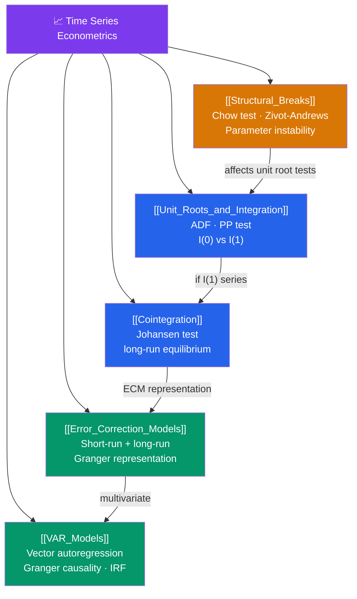

# 🗺️ Time Series Econometrics — Map of Content

> [!abstract] What This Section Covers
> Time series econometrics deals with the specific complications that arise when observations are ordered in time: non-stationarity, persistent trends, and long-run equilibrium relationships. **Unit roots and integration** address whether a series has a stochastic trend (ADF test). **Cointegration** captures long-run equilibrium between integrated series. **Error Correction Models** model the short-run dynamics around that equilibrium. **VAR models** extend to multivariate systems. **Structural breaks** address the possibility that parameters change over time. These tools are essential for macroeconomics, finance, and any long-run economic analysis.

## Concept Map

## Learning Path

1. [[Unit_Roots_and_Integration]] — ADF and PP tests for stochastic trends; I(0) vs I(1) processes; why spurious regression is the fatal consequence of ignoring unit roots.
2. [[Cointegration]] — Engle-Granger two-step and Johansen procedure for detecting long-run equilibrium relationships among I(1) series.
3. [[Error_Correction_Models]] — The Granger representation theorem: if variables cointegrate, there exists an ECM capturing short-run adjustments toward equilibrium.
4. [[VAR_Models]] — Vector autoregression for multiple time series: lag selection, Granger causality, impulse response functions, forecast error variance decomposition.
5. [[Structural_Breaks]] — Chow test, CUSUM, and Zivot-Andrews test for breaks; how breaks affect unit root tests and cointegration.

## All Notes at a Glance

| Note | Difficulty | What You'll Learn |
|------|------------|-------------------|
| [[Unit_Roots_and_Integration]] | Advanced | Random walk, ADF/PP tests, KPSS, orders of integration, spurious regression |
| [[Cointegration]] | Advanced | Cointegrating vectors, Engle-Granger, Johansen trace/max-eigenvalue tests |
| [[Error_Correction_Models]] | Advanced | ECM structure, speed of adjustment, Granger representation theorem |
| [[VAR_Models]] | Advanced | VAR(p) model, AIC/BIC lag selection, Granger causality, Cholesky IRF, FEVD |
| [[Structural_Breaks]] | Advanced | Chow test, CUSUM, Bai-Perron multiple breaks, Zivot-Andrews unit root with break |

## Key Questions This Section Answers

- What is a unit root, and why does failing to test for it before running regressions lead to spurious results?
- What is the difference between a stationary and a cointegrated relationship among I(1) variables?
- If GDP and consumption are both I(1) but cointegrated, what does this imply for modelling their short-run dynamics?
- How does a VAR model capture the dynamic interactions among multiple time series?
- How do you test for a structural break, and what happens to unit root tests when a break is present?

## Related Sections

- [[_MOC_Econometrics_Master|↑ Econometrics Master MOC]]
- [[_MOC_OLS_Problems|← OLS Problems]] — Autocorrelation and its tests
- [[_MOC_Panel_Data|← Panel Data]] — Panel unit root tests are extensions of these ideas

#MOC #Econometrics #time-series
