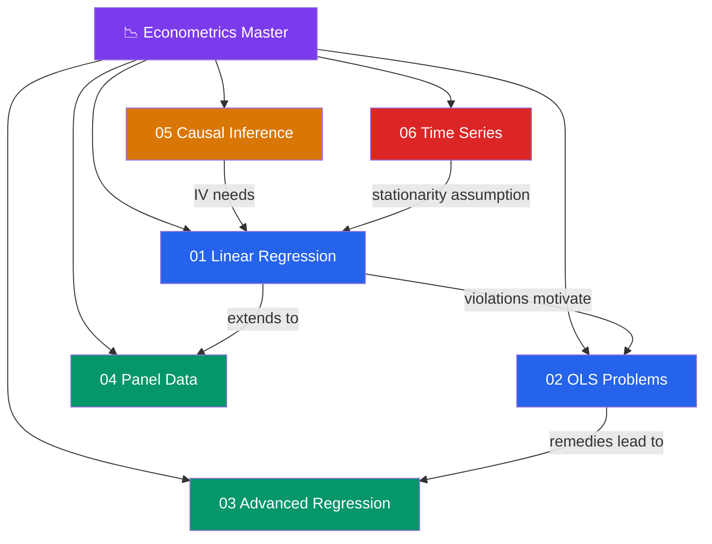

# 📉 Econometrics — Master Map of Content

> [!abstract] About This Vault
> A complete econometrics reference: **37 notes across 6 sections**, covering classical linear regression, OLS problems and remedies, advanced models, panel data, causal inference, and time-series econometrics. Every note pairs an intuition-first analogy with matrix algebra derivations, assumption tables, test statistics, R code using `lm`, `plm`, `AER`, `sandwich`, `lmtest`, and `urca`, real empirical examples (Card-Krueger, Angrist-Krueger, RD designs), and Mermaid causal DAGs. Start at the section that matches your goal below, or follow one of the four learning paths.

## Vault Architecture

## Sections at a Glance

| # | Section | Notes | Entry Point | Difficulty |
|---|---------|-------|-------------|------------|
| 01 | Linear Regression | 6 | [[_MOC_Linear_Regression]] | Beginner → Intermediate |
| 02 | OLS Problems | 6 | [[_MOC_OLS_Problems]] | Intermediate |
| 03 | Advanced Regression | 6 | [[_MOC_Advanced_Regression]] | Intermediate → Advanced |
| 04 | Panel Data | 6 | [[_MOC_Panel_Data]] | Intermediate → Advanced |
| 05 | Causal Inference | 6 | [[_MOC_Causal_Inference]] | Intermediate → Advanced |
| 06 | Time Series Econometrics | 6 | [[_MOC_TS_Econometrics]] | Advanced |

---

## Learning Paths

### Path 1 — Economics Student

> Best for: undergrad/grad students working through a standard econometrics course (Wooldridge sequence).

**Linear Regression → OLS Problems → Advanced Models → Panel Data**

[[_MOC_Linear_Regression]] → [[OLS_Estimation]] → [[Gauss_Markov_Theorem]] → [[Hypothesis_Testing_Regression]] → [[Goodness_of_Fit]] → [[_MOC_OLS_Problems]] → [[Heteroskedasticity]] → [[Autocorrelation]] → [[Multicollinearity]] → [[_MOC_Advanced_Regression]] → [[GLS_and_WLS]] → [[Probit_and_Logit]] → [[_MOC_Panel_Data]] → [[Fixed_Effects]] → [[Random_Effects]] → [[Hausman_Test]]

---

### Path 2 — Policy Researcher

> Best for: researchers who design and evaluate natural experiments and policy interventions.

**Causal Inference Core → Panel Tools → IV**

[[_MOC_Causal_Inference]] → [[Potential_Outcomes_Framework]] → [[Difference_in_Differences]] → [[Regression_Discontinuity]] → [[Instrumental_Variables]] → [[Propensity_Score_Matching]] → [[_MOC_Panel_Data]] → [[Fixed_Effects]] → [[Hausman_Test]] → [[_MOC_OLS_Problems]] → [[Omitted_Variable_Bias]]

---

### Path 3 — Empirical Finance

> Best for: finance practitioners doing asset pricing, macro-finance, and return predictability research.

**Time Series → Panel → Advanced Regression**

[[_MOC_TS_Econometrics]] → [[Unit_Roots_and_Integration]] → [[Cointegration]] → [[Error_Correction_Models]] → [[VAR_Models]] → [[Structural_Breaks]] → [[_MOC_Panel_Data]] → [[Pooled_OLS]] → [[Fixed_Effects]] → [[Dynamic_Panel_Data]] → [[_MOC_Advanced_Regression]] → [[Maximum_Likelihood_Estimation]] → [[Quantile_Regression]]

---

### Path 4 — Data Scientist

> Best for: ML practitioners learning econometric rigour — causal inference, uncertainty quantification, and limited dependent variables.

**OLS Foundations → Causal Inference → Limited DV Models**

[[OLS_Estimation]] → [[Gauss_Markov_Theorem]] → [[Regression_Diagnostics]] → [[_MOC_OLS_Problems]] → [[Omitted_Variable_Bias]] → [[_MOC_Causal_Inference]] → [[Potential_Outcomes_Framework]] → [[Instrumental_Variables]] → [[Difference_in_Differences]] → [[_MOC_Advanced_Regression]] → [[Probit_and_Logit]] → [[Tobit_and_Censored_Models]] → [[Quantile_Regression]]

---

## Cross-Vault Links

- **[[Macroeconomics]]** — macroeconomic theory that motivates the empirical models in [[VAR_Models]], [[Cointegration]], and [[Error_Correction_Models]].
- **[[Microeconomics]]** — utility and production theory underpinning [[Probit_and_Logit]], [[Tobit_and_Censored_Models]], and [[Potential_Outcomes_Framework]].
- **[[Time_Series_Analysis]]** — statistical time-series concepts (ARMA, spectral analysis) that precede [[Unit_Roots_and_Integration]] and [[Structural_Breaks]].
- **[[R_Programming]]** — R syntax, tidyverse, and base R needed to run the code blocks throughout this vault (`lm`, `plm`, `AER`, `sandwich`, `urca`).

---

## Section MOC Index

- [[_MOC_Linear_Regression]] — The classical linear model: OLS estimation, the Gauss-Markov theorem, hypothesis testing, fit measures, and diagnostics.
- [[_MOC_OLS_Problems]] — Violations of classical assumptions: heteroskedasticity, autocorrelation, multicollinearity, omitted variables, and measurement error.
- [[_MOC_Advanced_Regression]] — Beyond OLS: GLS/WLS, maximum likelihood, binary choice models, censored models, and quantile regression.
- [[_MOC_Panel_Data]] — Exploiting the panel structure: pooled OLS, fixed effects, random effects, the Hausman test, and dynamic models.
- [[_MOC_Causal_Inference]] — Identification strategies: potential outcomes, IV, DiD, regression discontinuity, and propensity score matching.
- [[_MOC_TS_Econometrics]] — Macroeconometrics: unit roots, cointegration, error-correction models, VARs, and structural breaks.

#MOC #Econometrics #MasterMOC
