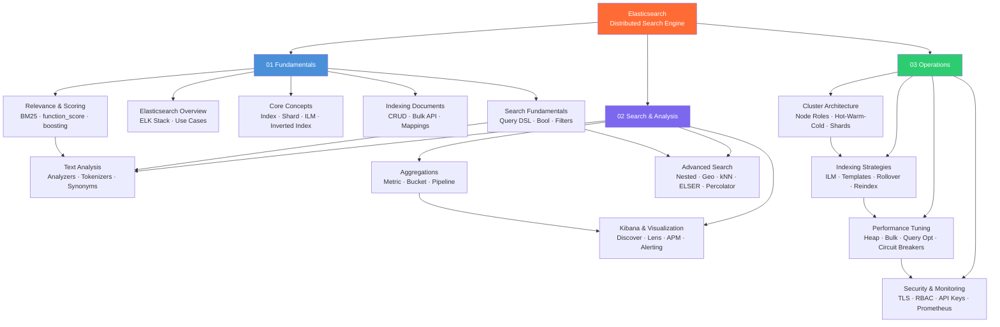

# Elasticsearch Master MOC

> [!abstract] About
> 13 notes across 3 sections — full-text search, log analytics, and the ELK stack. Covers Elasticsearch from first principles (inverted index, BM25) through production operations (ILM, cluster tuning, security). Cross-linked to [[_MOC_Database_Master]], [[_MOC_DevOps_Master]], and [[_MOC_SystemDesign_Master]].

## Concept Map



## Sections

### 01 — Fundamentals

| Note | Summary | Difficulty |
|------|---------|-----------|
| [[Elasticsearch_Overview]] | What is Elasticsearch, ELK stack components, use cases, ES vs Solr/RDBMS, NRT search, ES 8.x features | Beginner |
| [[Core_Concepts]] | Index/Document/Shard/Node/Cluster, data streams, ILM phases, inverted index internals | Beginner |
| [[Indexing_Documents]] | Index/Update/Delete/Bulk APIs, NDJSON format, dynamic vs explicit mapping, optimistic concurrency | Beginner |
| [[Search_Fundamentals]] | Query DSL, query vs filter context, bool query clauses, pagination, sorting, highlighting | Beginner |
| [[Relevance_and_Scoring]] | BM25 algorithm, explain API, function_score, decay functions, dis_max, rescore | Intermediate |

### 02 — Search and Analysis

| Note | Summary | Difficulty |
|------|---------|-----------|
| [[Text_Analysis]] | Analysis pipeline, built-in analyzers, custom analyzer, n-gram/edge-n-gram, synonyms, _analyze API | Intermediate |
| [[Aggregations]] | Metric aggs (avg/sum/percentiles/cardinality), bucket aggs (terms/date_histogram/range), pipeline aggs | Intermediate |
| [[Advanced_Search]] | Nested objects, parent-child, geo queries, kNN vector search, ELSER semantic search, percolator, search_after | Advanced |
| [[Kibana_and_Visualization]] | Discover, KQL, Lens, Dashboards, Dev Tools, Elastic APM, Fleet, Alerting, Spaces | Intermediate |

### 03 — Operations

| Note | Summary | Difficulty |
|------|---------|-----------|
| [[Cluster_Architecture]] | Node roles, hot-warm-cold tiers, shard sizing, split-brain prevention, cluster health, ingest pipelines | Advanced |
| [[Indexing_Strategies]] | ILM policy, component/index templates, data streams, rollover, reindex, shrink, force merge | Advanced |
| [[Performance_Tuning]] | Heap sizing, GC tuning, bulk indexing optimization, thread pools, circuit breakers, slow log, query optimization | Advanced |
| [[Security_and_Monitoring]] | TLS layers, built-in users, RBAC, document/field-level security, API keys, Stack Monitoring, Prometheus exporter | Advanced |

## Learning Paths

### Path A — Search Engineer

Focus: building production search experiences (product search, site search, semantic search)

```
Week 1: Fundamentals
  1. [[Elasticsearch_Overview]]       — understand what ES does and why
  2. [[Core_Concepts]]                — index/shard/node/inverted index
  3. [[Indexing_Documents]]           — CRUD + Bulk API + mappings

Week 2: Search
  4. [[Search_Fundamentals]]          — Query DSL: match, term, bool, filters
  5. [[Relevance_and_Scoring]]        — BM25, function_score, boosting
  6. [[Text_Analysis]]                — custom analyzers, synonyms, autocomplete

Week 3: Advanced
  7. [[Advanced_Search]]              — nested, geo, kNN/ELSER, search_after
  8. [[Aggregations]]                 — faceted navigation, analytics
```

Key skills: custom analyzers, multi-field mappings, function_score, kNN/ELSER, `search_after` pagination.

### Path B — Log Analytics / SRE

Focus: ELK stack for observability — log ingest, dashboards, alerting, APM

```
Week 1: Foundations
  1. [[Elasticsearch_Overview]]       — ELK stack components
  2. [[Core_Concepts]]                — data streams, ILM phases
  3. [[Indexing_Documents]]           — Bulk API, ingest pipelines

Week 2: Analytics
  4. [[Search_Fundamentals]]          — filtering logs with Query DSL
  5. [[Aggregations]]                 — time series aggregations
  6. [[Kibana_and_Visualization]]     — Discover (KQL), Lens, Dashboards, APM, Alerting

Week 3: Operations
  7. [[Indexing_Strategies]]          — ILM, data streams, rollover
  8. [[Security_and_Monitoring]]      — Stack Monitoring, Prometheus, API keys
```

Key skills: KQL queries, date_histogram aggregations, ILM policy design, Elastic APM, Kibana alerting.

### Path C — Elasticsearch Administrator

Focus: cluster operations, performance, security for production systems

```
Week 1: Architecture
  1. [[Core_Concepts]]                — shards, replicas, cluster health
  2. [[Cluster_Architecture]]         — node roles, hot-warm-cold, shard sizing

Week 2: Operations
  3. [[Indexing_Strategies]]          — ILM, templates, rollover, reindex, shrink
  4. [[Performance_Tuning]]           — heap, bulk indexing, thread pools, circuit breakers
  5. [[Security_and_Monitoring]]      — TLS, RBAC, API keys, Prometheus exporter

Week 3: Deep Dive
  6. [[Text_Analysis]]                — analyzer internals for troubleshooting
  7. [[Advanced_Search]]              — nested/parent-child, cross-cluster, async search
  8. All notes: [[Elasticsearch_Overview]] → [[Relevance_and_Scoring]] to fill gaps
```

Key skills: ILM policy authoring, shard sizing decisions, heap tuning, RBAC role design, Prometheus alerting.

## Cross-Vault Links

- [[_MOC_Database_Master]] — Compare with [[NoSQL_Overview]], [[Document_Stores]]; ES is a search engine, not a primary database
- [[_MOC_DevOps_Master]] — ES monitoring integrates with Prometheus/Grafana; Elastic Agent replaces some observability agents
- [[_MOC_SystemDesign_Master]] — Elasticsearch is a common component in search architecture (write to primary DB + async index to ES)

## Quick Reference

### Essential REST endpoints

| Operation | Endpoint |
|-----------|---------|
| Cluster health | `GET /_cluster/health` |
| Node info | `GET /_cat/nodes?v` |
| Index list | `GET /_cat/indices?v` |
| Shard distribution | `GET /_cat/shards?v` |
| Search | `GET /{index}/_search` |
| Index document | `POST /{index}/_doc` |
| Bulk index | `POST /_bulk` |
| Mapping | `GET /{index}/_mapping` |
| ILM policy | `PUT /_ilm/policy/{name}` |
| Index template | `PUT /_index_template/{name}` |

### Decision quick guide

| Scenario | Recommendation |
|----------|---------------|
| Field for exact match / aggregation | `keyword` type |
| Field for full-text search | `text` type (+ `keyword` sub-field) |
| Array of objects (queries must scope) | `nested` type |
| Object array, children updated often | `join` type (parent-child) |
| Pagination past 10k hits | `search_after` |
| Bulk load optimization | Disable refresh + replicas |
| Semantic / NLP search | ELSER or kNN dense_vector |
| Store queries, alert on new docs | Percolator |

#Elasticsearch #Search #ELK #MOC
