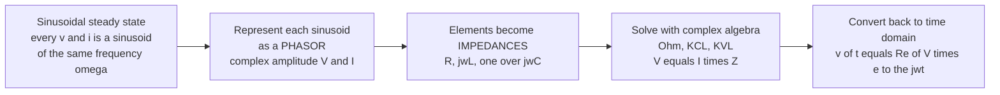

# ⚡ AC Circuit Analysis and Phasors

> [!abstract] TL;DR
> In **sinusoidal steady state**, every voltage and current in a linear circuit is a sinusoid of the *same* frequency, differing only in **amplitude** and **phase**. Represent each one as a **phasor** — a single complex number encoding those two facts — and the calculus of $i = C\,dv/dt$ collapses into algebra: the derivative $d/dt$ becomes multiplication by $j\omega$. Every element gets a complex **impedance** $Z$ (resistor $R$, inductor $j\omega L$, capacitor $1/j\omega C$), Ohm's law generalizes to $V = IZ$, and the entire toolbox of nodal/mesh analysis works with complex arithmetic. This is the workhorse method behind every power grid, radio, filter, and audio system.

## Intuition — analogy FIRST

Analyzing an AC circuit *directly* is a nightmare. Sinusoids driving inductors and capacitors produce differential equations full of sines, cosines, and derivatives that trade places with each other every time you differentiate. Solving even a simple RLC loop this way is pages of trig identities.

Then comes a magic trick. A sinusoid $v(t) = V_m\cos(\omega t + \phi)$ is really just a **spinning arrow** of length $V_m$ that started at angle $\phi$ and rotates at rate $\omega$. If *everything* in the circuit spins at the same rate $\omega$ (which it does in steady state), the spinning is shared background information — so **freeze it**. Keep only the arrow's length and starting angle as a single complex number, the **phasor** $\mathbf{V} = V_m\angle\phi$.

The moment you do this, the calculus evaporates. Differentiating a sinusoid rotates its arrow by $90°$ and scales it by $\omega$ — which is *exactly* what multiplying by $j\omega$ does to a complex number. So a capacitor's annoying $i = C\,dv/dt$ becomes plain division: $\mathbf{I} = j\omega C\,\mathbf{V}$, i.e. $\mathbf{V} = \mathbf{I}/(j\omega C)$. The whole circuit turns into simple algebra with complex numbers. Turning calculus into arithmetic is one of the most beautiful shortcuts in all of engineering — and it is how every power grid and radio front-end is actually analyzed.

---

## How It Works

The phasor method is a five-step pipeline that maps a differential-equation problem into an algebra problem, solves it, and maps back:



The engine behind every arrow is **Euler's formula**, $e^{j\theta} = \cos\theta + j\sin\theta$. A real sinusoid is the real part of a rotating complex exponential:

$$v(t) = V_m\cos(\omega t + \phi) = \operatorname{Re}\!\big[\underbrace{V_m e^{j\phi}}_{\text{phasor } \mathbf{V}}\, e^{j\omega t}\big]$$

Because the system is **linear**, the $e^{j\omega t}$ factor rides through every element unchanged, so it can be stripped off both sides. What remains is a purely algebraic relation between the complex amplitudes — the phasors.

---

## Key Concepts / Details

### Secondary Level

**Sinusoids have three numbers.** A sinusoid $v(t) = V_m\cos(\omega t + \phi)$ is fully described by amplitude $V_m$, angular frequency $\omega = 2\pi f$, and phase $\phi$. In steady state, $\omega$ is shared by *everything*, so only $V_m$ and $\phi$ distinguish signals.

**The phasor** packages those two survivors into one complex number:
$$\mathbf{V} = V_m\angle\phi = V_m e^{j\phi} = V_m(\cos\phi + j\sin\phi).$$
Length = amplitude, angle = phase. (EEs write $j = \sqrt{-1}$, reserving $i$ for current.)

**Lead and lag.** If current peaks *before* voltage, current **leads**; if after, it **lags**. The mnemonic **"ELI the ICE man"**: in an inductor (**L**), voltage **E** leads current **I** (**ELI**); in a capacitor (**C**), current **I** leads voltage **E** (**ICE**).

### Undergraduate Level

**Impedance** $Z$ is the generalized, complex resistance relating voltage and current phasors — Ohm's law for AC:
$$\boxed{\mathbf{V} = \mathbf{I}\,Z}, \qquad Z = R + jX \ \ (\Omega)$$

| Element | Impedance $Z$ | Behavior |
|---|---|---|
| Resistor $R$ | $R$ | in phase, dissipates energy |
| Inductor $L$ | $j\omega L$ | current **lags** $90°$, stores in magnetic field |
| Capacitor $C$ | $\dfrac{1}{j\omega C} = -\dfrac{j}{\omega C}$ | current **leads** $90°$, stores in electric field |

- **Reactance** $X = \operatorname{Im}(Z)$: $X_L = \omega L$ (positive), $X_C = -1/\omega C$ (negative). Reactance stores energy; it does not dissipate it.
- **Admittance** $Y = 1/Z = G + jB$ (siemens), the AC analog of conductance — convenient for parallel circuits.
- **All the DC machinery still applies.** Series/parallel combinations, voltage/current dividers, Kirchhoff's laws (KVL/KCL), nodal and mesh analysis, and Thévenin/Norton equivalents all carry over verbatim — you just do complex arithmetic instead of real.

**Series RLC and resonance.** For a series $R$–$L$–$C$ loop:
$$Z(\omega) = R + j\!\left(\omega L - \frac{1}{\omega C}\right).$$
At the **resonant frequency** $\omega_0 = 1/\sqrt{LC}$, the inductive and capacitive reactances cancel ($\omega_0 L = 1/\omega_0 C$), so $Z = R$ is **purely real and minimum** → current is **maximum**. This is the basis of tuning and filtering: a radio "tunes" a station by setting $\omega_0$ to its carrier.

### Graduate Level

**Quality factor and bandwidth.** Sharpness of resonance is measured by $Q = \omega_0 L / R = \dfrac{1}{R}\sqrt{L/C}$, with half-power bandwidth $\text{BW} = \omega_0/Q$. High $Q$ → narrow, selective peak (good for tuners); low $Q$ → broad response (good for damping).

**AC power decomposes into two parts.** With RMS phasors $V_{\text{rms}}, I_{\text{rms}}$ and phase angle $\phi = \angle Z$ (angle by which current lags voltage), define **complex power**:
$$\mathbf{S} = V_{\text{rms}} I_{\text{rms}}^{*} = P + jQ \quad (\text{VA})$$

- **Real (active) power** $P = V_{\text{rms}}I_{\text{rms}}\cos\phi$ (watts) — actually consumed / dissipated.
- **Reactive power** $Q = V_{\text{rms}}I_{\text{rms}}\sin\phi$ (VAR) — energy that merely *sloshes* in and out of $L$ and $C$ each cycle, doing no net work.
- **Apparent power** $|\mathbf{S}| = V_{\text{rms}}I_{\text{rms}}$ (VA) — what the wires and transformers must be sized for.
- These form the **power triangle**: $|\mathbf{S}|^2 = P^2 + Q^2$.

**Power factor** $\text{pf} = \cos\phi = P/|\mathbf{S}|$ is the fraction of apparent power that does useful work. A load drawing lots of reactive power (e.g. lightly loaded motors, $\text{pf} = 0.6$ lagging) forces the utility to push extra current for the same real power — so utilities **penalize low power factor** and industrial sites install **capacitor banks** to cancel inductive $Q$ and pull $\text{pf}$ back toward $1$.

**Why phasors are exact, not an approximation.** They are a change of basis, valid because of **(1) linearity** (superposition lets each frequency be treated independently) and **(2) Euler's formula** (sinusoids are eigenfunctions of LTI systems — $\frac{d}{dt}e^{j\omega t} = j\omega\,e^{j\omega t}$). This is the same insight that underlies the [[Fourier_Transform]] and the [[Signals_and_Systems/03_Laplace_Transform/Laplace_Transform|Laplace transform]]: impedance $Z(\omega)$ is just the transfer function evaluated on the imaginary axis $s = j\omega$.

---

## Python Demo

```python
# AC circuit analysis via phasors: impedance, phase shift, resonance, and AC power.
# Series RLC driven by a sinusoid. numpy + matplotlib only.
import numpy as np
import matplotlib.pyplot as plt

# --- Circuit parameters ---
R = 10.0            # ohms
L = 1e-3            # henries (1 mH)
C = 1e-6            # farads  (1 uF)
Vm = 10.0           # source voltage amplitude (peak), volts, phase = 0

w0 = 1.0 / np.sqrt(L * C)          # resonant angular frequency
f0 = w0 / (2 * np.pi)
print(f"Resonant frequency: w0 = {w0:.0f} rad/s,  f0 = {f0:.1f} Hz")

# Drive BELOW resonance -> net capacitive -> current LEADS voltage
w = 20000.0                         # rad/s
def impedance(w):                   # series RLC impedance Z(w) = R + j(wL - 1/wC)
    return R + 1j * (w * L - 1.0 / (w * C))

Z = impedance(w)
V = Vm + 0j                         # voltage phasor (reference, angle 0)
I = V / Z                          # current phasor  (Ohm's law: V = I*Z)
phi = np.angle(Z)                   # current lags voltage by phi (rad); phi<0 => leads
print(f"Z = {Z:.2f} ohms,  |Z| = {abs(Z):.2f},  angle(Z) = {np.degrees(phi):+.1f} deg")
print(f"Current phasor I = {abs(I):.3f} A at {np.degrees(np.angle(I)):+.1f} deg "
      f"({'leads' if np.angle(I) > 0 else 'lags'} the voltage)")

# --- Time-domain reconstruction: x(t) = Re[phasor * exp(jwt)] ---
t = np.linspace(0, 3 * 2 * np.pi / w, 1000)
v_t = np.real(V * np.exp(1j * w * t))
i_t = np.real(I * np.exp(1j * w * t))
p_t = v_t * i_t                                       # instantaneous power p(t) = v*i

# RMS quantities and AC power decomposition
Vrms, Irms = Vm / np.sqrt(2), abs(I) / np.sqrt(2)
P = Vrms * Irms * np.cos(phi)      # real power  (W)
Q = Vrms * Irms * np.sin(phi)      # reactive power (VAR)
S = Vrms * Irms                    # apparent power (VA)
pf = np.cos(phi)                   # power factor
print(f"P = {P:.3f} W,  Q = {Q:.3f} VAR,  |S| = {S:.3f} VA,  power factor = {pf:.3f}")

# --- Frequency sweep for the resonance curve ---
w_sweep = np.linspace(0.2 * w0, 3 * w0, 800)
Z_sweep = impedance(w_sweep)

# =========================== PLOTS ===========================
fig, ax = plt.subplots(2, 3, figsize=(16, 9))

# (1) Time-domain voltage & current -> the phase shift
ax[0, 0].plot(t * 1e3, v_t, label="v(t)  [V]", lw=2)
ax[0, 0].plot(t * 1e3, i_t / abs(I) * Vm, '--', lw=2,
              label="i(t)  [scaled]")
ax[0, 0].axhline(0, color='k', lw=0.5)
ax[0, 0].set(title="Time Domain: current LEADS voltage",
             xlabel="time [ms]", ylabel="amplitude")
ax[0, 0].legend(); ax[0, 0].grid(alpha=0.3)

# (2) Phasor diagram: arrows in the complex plane
for phasor, col, name in [(V, 'C0', 'V'),
                          (I / abs(I) * Vm, 'C1', 'I (scaled)'),
                          (1j * w * L * I, 'C2', 'V_L'),
                          (I / (1j * w * C), 'C3', 'V_C')]:
    ax[0, 1].annotate("", xy=(phasor.real, phasor.imag), xytext=(0, 0),
                      arrowprops=dict(arrowstyle="->", color=col, lw=2))
    ax[0, 1].text(phasor.real * 1.05, phasor.imag * 1.05, name, color=col)
lim = Vm * 1.6
ax[0, 1].set(title="Phasor Diagram (complex plane)",
             xlabel="Real", ylabel="Imag", xlim=(-lim, lim), ylim=(-lim, lim))
ax[0, 1].axhline(0, color='k', lw=0.5); ax[0, 1].axvline(0, color='k', lw=0.5)
ax[0, 1].set_aspect('equal'); ax[0, 1].grid(alpha=0.3)

# (3) |Z| vs frequency -> resonance dip
ax[0, 2].plot(w_sweep / w0, np.abs(Z_sweep), lw=2)
ax[0, 2].axvline(1.0, color='r', ls=':', label="resonance w0")
ax[0, 2].plot(1.0, R, 'ro')
ax[0, 2].set(title="|Z| vs frequency (min = R at w0)",
             xlabel="w / w0", ylabel="|Z| [ohms]")
ax[0, 2].legend(); ax[0, 2].grid(alpha=0.3)

# (4) phase(Z) vs frequency: capacitive (<0) below w0, inductive (>0) above
ax[1, 0].plot(w_sweep / w0, np.degrees(np.angle(Z_sweep)), lw=2)
ax[1, 0].axvline(1.0, color='r', ls=':')
ax[1, 0].axhline(0, color='k', lw=0.5)
ax[1, 0].set(title="Phase of Z: capacitive -> resistive -> inductive",
             xlabel="w / w0", ylabel="angle(Z) [deg]")
ax[1, 0].grid(alpha=0.3)

# (5) Instantaneous power with average (real) power marked
ax[1, 1].plot(t * 1e3, p_t, lw=2, label="p(t) = v*i")
ax[1, 1].axhline(P, color='r', lw=2, ls='--', label=f"avg P = {P:.2f} W")
ax[1, 1].axhline(0, color='k', lw=0.5)
ax[1, 1].fill_between(t * 1e3, p_t, 0, where=(p_t < 0), color='red', alpha=0.15)
ax[1, 1].set(title="Instantaneous vs Real Power (red = energy returned)",
             xlabel="time [ms]", ylabel="power [W]")
ax[1, 1].legend(); ax[1, 1].grid(alpha=0.3)

# (6) Power factor vs frequency (best = 1 at resonance)
pf_sweep = np.cos(np.angle(Z_sweep))
ax[1, 2].plot(w_sweep / w0, pf_sweep, lw=2)
ax[1, 2].axvline(1.0, color='r', ls=':', label="pf = 1 at w0")
ax[1, 2].set(title="Power Factor cos(phi) vs frequency",
             xlabel="w / w0", ylabel="power factor", ylim=(0, 1.05))
ax[1, 2].legend(); ax[1, 2].grid(alpha=0.3)

plt.tight_layout()
plt.savefig("ac_phasor_analysis.png", dpi=110)
print("Saved ac_phasor_analysis.png")
```

**What it shows.** The phasor solution turns one differential equation into a single line of complex division (`I = V / Z`). Panel 1 shows the current *leading* the voltage (net-capacitive drive below $\omega_0$); panel 2 draws all four phasors as arrows and reveals that $\mathbf{V}_L$ and $\mathbf{V}_C$ point in *opposite* directions (they cancel at resonance); panels 3–4 show $|Z|$ dipping to $R$ exactly at $\omega_0$ while the phase swings from capacitive through resistive to inductive; panels 5–6 show the instantaneous power dipping negative (energy handed back to the source by $L$ and $C$) and the power factor peaking at $1$ at resonance.

---

## Real-World Applications

- **The entire AC power grid.** Load-flow studies, transformer and transmission-line sizing, and reactive-power management are all phasor calculations. Utilities monitor **power factor** and install **capacitor banks / synchronous condensers** to cancel the lagging reactive power of motors and transformers — improving efficiency and freeing up line capacity.
- **Radio and RF front-ends.** LC **resonant tank circuits** select one station's carrier out of the whole spectrum: the receiver tunes $\omega_0 = 1/\sqrt{LC}$ to the desired frequency, where the impedance response peaks sharply (high $Q$).
- **Audio and analog filters.** Crossover networks, equalizers, and tone controls are designed directly in terms of impedance $Z(\omega)$ and the resulting frequency response — the foundation of every analog filter.
- **Power electronics and motor drives.** Inverters, PFC (power-factor-correction) stages, and induction-motor equivalent circuits are analyzed with impedance and complex power $S = P + jQ$.
- **Impedance matching.** Antennas, transmission lines, and amplifier stages are matched (e.g. to $50\,\Omega$) using complex-impedance / Smith-chart techniques to maximize power transfer and minimize reflections.

---

## Common Pitfalls

- **Forgetting phasors are single-frequency, steady-state only.** A phasor represents **sinusoidal steady state** at one $\omega$. Transients, switch-on behavior, and multi-frequency signals are *not* captured — for those you need [[Second_Order_Linear_ODEs|differential-equation]] or [[Signals_and_Systems/03_Laplace_Transform/Laplace_Transform|Laplace]] methods. (For many frequencies at once, superpose phasors — that *is* the [[Fourier_Transform|Fourier]] view.)
- **Confusing impedance $Z$ with reactance $X$.** $Z = R + jX$ is complex; $R$ is the real (dissipative) part, $X$ the imaginary (energy-storing) part. Inductor $Z = j\omega L$, capacitor $Z = 1/j\omega C = -j/\omega C$. Only $R$ consumes power.
- **Using $i$ instead of $j$.** Electrical engineers write $j = \sqrt{-1}$ because $i$ already means current. Mixing them up is a classic bug.
- **Getting lead/lag backwards.** Remember **"ELI the ICE man"**: inductor → voltage leads (**ELI**); capacitor → current leads (**ICE**). Equivalently, current lags voltage by $\phi = \angle Z$.
- **Mixing peak, RMS, and average values.** $V_{\text{rms}} = V_m/\sqrt{2}$ for a sinusoid; power formulas use RMS. Average real power is $P = \tfrac12 V_m I_m\cos\phi = V_{\text{rms}}I_{\text{rms}}\cos\phi$ — the factor of $\tfrac12$ appears only with peak values.
- **Thinking reactive power is "wasted."** Reactive power $Q$ does no net work, but it still forces real current through the wires, causing $I^2R$ losses and requiring larger equipment — which is why **low power factor is penalized** and corrected with capacitor banks.
- **Assuming resonance means "large impedance."** In a **series** RLC, resonance gives **minimum** $|Z| = R$ (max current). In a **parallel** RLC it is the opposite — maximum impedance. Know which topology you have.
- **Forgetting why it works.** The trick relies on **linearity** plus **Euler's formula** ($e^{j\theta} = \cos\theta + j\sin\theta$). In a nonlinear circuit (diodes, saturating cores), phasors do not apply.

---

## Related Concepts

- [[Complex_Numbers_and_Functions]] — the phasor *is* a complex number; Euler's formula $e^{j\theta}=\cos\theta+j\sin\theta$ is the mathematical engine of the whole method.
- [[Oscillations_and_SHM]] — an RLC circuit is the exact electrical twin of a driven, damped mass-spring oscillator; electrical resonance mirrors mechanical resonance.
- [[Wave_Motion_and_Properties]] — amplitude, frequency, and phase of a wave are precisely what a phasor encodes.
- [[Fourier_Transform]] — decomposes any signal into sinusoids; each frequency component is handled by exactly this phasor/impedance machinery.
- [[Frequency_Spectrum]] — sweeping $\omega$ over the impedance gives the circuit's frequency-domain fingerprint.
- [[Signals_and_Systems/03_Laplace_Transform/Laplace_Transform|Laplace Transform]] — generalizes impedance from $j\omega$ to the full complex frequency $s$; impedance is the transfer function at $s=j\omega$.
- [[Transfer_Functions]] — a circuit's transfer function $H(j\omega)$ is built directly from impedances via voltage dividers.
- [[Stability_Frequency_Response]] — the $|Z(\omega)|$ and $\angle Z(\omega)$ curves here are the same magnitude/phase (Bode) response used to characterize systems.
- [[Second_Order_Linear_ODEs]] — the underlying time-domain model of an RLC circuit before the phasor shortcut collapses it to algebra.

---

## Review Questions

1. **(Secondary)** A capacitor obeys $i = C\,dv/dt$. Explain in words why, in phasor form, this becomes a simple multiplication $\mathbf{I} = j\omega C\,\mathbf{V}$. What does the factor $j$ do to the phase of the current relative to the voltage?
2. **(Undergraduate)** A series RLC circuit has $R=10\,\Omega$, $L=1\,\text{mH}$, $C=1\,\mu\text{F}$, driven at $\omega = 20{,}000$ rad/s. Compute the impedance $Z$, the current phasor for a $10\,\text{V}$ (peak, $0°$) source, and state whether the current leads or lags — and by how much. At what frequency would $|Z|$ be smallest, and what is that minimum?
3. **(Graduate)** A factory draws $100\,\text{kW}$ at a power factor of $0.7$ lagging from a $480\,\text{V}$ RMS supply. Explain, using the power triangle $\mathbf{S}=P+jQ$, why the utility bills for more than $100\,\text{kW}$ of capacity. What size (reactive power $Q$) capacitor bank would raise the power factor to $0.95$, and why does the plant want to do this?

---

## Sources

- Alexander, C. & Sadiku, M. — *Fundamentals of Electric Circuits* (chapters on sinusoids, phasors, AC power). [McGraw-Hill](https://www.mheducation.com/highered/product/fundamentals-electric-circuits-alexander-sadiku/M9780078028229.html)
- Hayt, W., Kemmerly, J. & Durbin, S. — *Engineering Circuit Analysis*. [McGraw-Hill](https://www.mheducation.com/highered/product/engineering-circuit-analysis-hayt-kemmerly/M9780073545516.html)
- Nilsson, J. & Riedel, S. — *Electric Circuits* (sinusoidal steady-state analysis; AC power calculations). [Pearson](https://www.pearson.com/en-us/subject-catalog/p/electric-circuits/P200000003356)
- Steinmetz, C. P. — *Theory and Calculation of Alternating Current Phenomena* (1897), the original introduction of the phasor/complex-number method for AC. [Internet Archive](https://archive.org/details/theorycalculati00steigoog)
- MIT OpenCourseWare 6.002 — *Circuits and Electronics*, sinusoidal steady state and impedance. [MIT OCW](https://ocw.mit.edu/courses/6-002-circuits-and-electronics-spring-2007/)

---

#electrical-engineering #ac-circuits #phasors #impedance #power-factor
