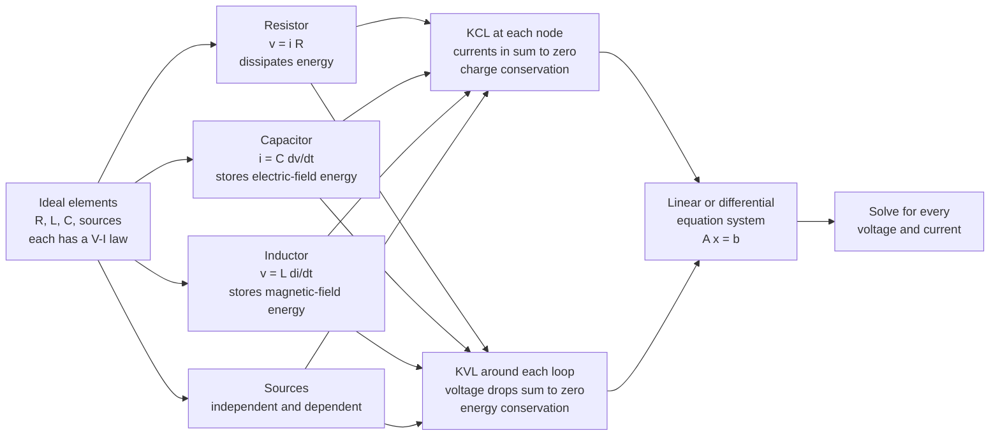

# ⚡ Circuit Elements and Kirchhoff's Laws

> [!abstract] TL;DR
> A circuit is a network of ideal elements — resistors ($v=iR$), capacitors ($i=C\,dv/dt$), inductors ($v=L\,di/dt$), and sources — wired together at nodes and loops. Two conservation laws govern the wiring: **KCL** (currents into any node sum to zero — charge is conserved) and **KVL** (voltage drops around any loop sum to zero — energy is conserved). Combined with each element's voltage–current relation, KCL and KVL turn *any* circuit into a system of linear or differential equations that fully determines every voltage and current. This is the entire foundation of circuit analysis — nodal/mesh methods, network theorems, transients, and AC phasors all descend from it.

---

## Intuition

**Analogy:** Picture a circuit as a network of water channels. Two commonsense bookkeeping rules govern it. First, at any junction where channels meet, whatever flows **in** must flow **out** — water does not pile up at a point. Second, if you walk around any closed loop of channels and return to your starting point, all the ups and downs in water pressure must cancel to zero — you end at the same height you began.

Swap "water flow" for **electric current** and "pressure" for **voltage** and you have Kirchhoff's two laws exactly: current is conserved at every node (KCL), and voltage is conserved around every loop (KVL). Each component (pump, narrow pipe, storage tank) has its own rule relating its flow to its pressure drop — that is the element's voltage–current law. Put the conservation laws and the element laws together and you can solve any circuit, no matter how tangled, by turning it into algebra.

---

## How It Works

### Core Mechanics

1. **Model the circuit with ideal elements.** Every real device is approximated by ideal building blocks, each with a fixed voltage–current relation:
   - **Resistor** — $v = iR$ (Ohm's law). Dissipates energy as heat; instantaneous, no memory.
   - **Capacitor** — $i = C\,\dfrac{dv}{dt}$. Stores energy in an electric field; current depends on how fast voltage changes.
   - **Inductor** — $v = L\,\dfrac{di}{dt}$. Stores energy in a magnetic field; voltage depends on how fast current changes.
   - **Sources** — independent (a fixed voltage or current regardless of the rest of the circuit) or dependent (value controlled by some other voltage/current, e.g. modeling a transistor).
2. **Label nodes, branches, and loops.** A **node** is a connection point; a **branch** is a single element between nodes; a **loop** is any closed path.
3. **Apply KCL at nodes.** The algebraic sum of currents entering a node is zero: $\sum_k i_k = 0$. Physically, charge does not accumulate at a point.
4. **Apply KVL around loops.** The algebraic sum of voltage drops around any closed loop is zero: $\sum_k v_k = 0$. Physically, electric potential is single-valued — go around and back and the potential is unchanged.
5. **Assemble and solve.** Substituting the element laws into the KCL/KVL equations gives a determined system: **linear algebra** ($A\mathbf{x}=\mathbf{b}$) for resistive circuits, or **differential equations** when capacitors and inductors are present. Solve once for every unknown voltage and current.

The **passive sign convention** keeps signs consistent: for a passive element, take current to flow *into* the terminal marked $+$. Then power $p = vi$ is positive when the element **absorbs** power and negative when it **delivers** power.

### Flow / Architecture



---

## Key Concepts

### Secondary Level

**A circuit** is a closed conducting path. Current $i$ (amperes) is the flow of charge; voltage $v$ (volts) is the potential difference that drives it.

**Ohm's law** for a resistor: $v = iR$, with resistance $R$ in ohms ($\Omega$). Power dissipated: $P = vi = i^2R = v^2/R$ (watts).

**Kirchhoff's Current Law (KCL):** at any node, currents in = currents out. If three wires meet and 3 A and 2 A flow in, then 5 A must flow out.

**Kirchhoff's Voltage Law (KVL):** around any loop, the source voltages equal the sum of the drops. A 12 V battery across two series resistors splits its 12 V between them — the drops add up to 12 V.

**Series** elements carry the **same current**; their resistances add: $R_\text{series} = R_1 + R_2 + \dots$

**Parallel** elements have the **same voltage**; their conductances add: $\dfrac{1}{R_\text{parallel}} = \dfrac{1}{R_1} + \dfrac{1}{R_2} + \dots$

**Voltage divider** (two series resistors): $v_2 = v_\text{in}\dfrac{R_2}{R_1+R_2}$.
**Current divider** (two parallel resistors): $i_1 = i_\text{tot}\dfrac{R_2}{R_1+R_2}$.

### Undergraduate Level

**Element V-I laws (the "constitutive" relations):**

$$v_R = iR, \qquad i_C = C\frac{dv_C}{dt}, \qquad v_L = L\frac{di_L}{dt}$$

Energy stored: capacitor $W_C = \tfrac{1}{2}Cv^2$; inductor $W_L = \tfrac{1}{2}Li^2$. Resistors store nothing — they dissipate.

**Active vs passive:** sources (and amplifiers) are *active* — they can deliver net energy; R, L, C are *passive*.

**Passive sign convention:** define $p = vi$ with current entering the $+$ terminal. Then $p>0$ means the element absorbs power. **Power balance** (Tellegen / conservation of energy): $\sum_\text{all elements} p_k = 0$ — sources' delivered power equals resistors' dissipated power.

**Systematic analysis.** KCL and KVL plus the element laws are enough, but two organized recipes scale to large circuits:
- **Nodal analysis** — unknowns are node voltages; write KCL at each non-reference node. Yields $G\mathbf{v}=\mathbf{i}$ with $G$ the conductance matrix.
- **Mesh analysis** — unknowns are loop currents; write KVL around each mesh. Yields $R\mathbf{i}=\mathbf{v}$ with $R$ the resistance matrix.

Both reduce a resistive circuit to $A\mathbf{x}=\mathbf{b}$ — a linear system solved with standard [[Systems_of_Linear_Equations|linear algebra]].

**Source transformation:** a voltage source $V_s$ in series with $R$ is equivalent (at its terminals) to a current source $I_s = V_s/R$ in parallel with $R$ — the seed of Thévenin/Norton equivalents. A **real source** carries internal resistance: a battery is $V_\text{oc}$ in series with $R_\text{int}$, so terminal voltage sags under load.

### Graduate Level

**Graph-theoretic foundation.** A circuit is a graph with $n$ nodes and $b$ branches. Choosing a reference node, there are exactly $n-1$ **independent KCL** equations (the reduced **incidence matrix** $A$ gives $A\mathbf{i}=0$) and $b-(n-1)$ **independent KVL** equations (from a loop/tie-set matrix, $B\mathbf{v}=0$). The branch relation $A^{\!\top}\mathbf{e}=\mathbf{v}$ ties node potentials $\mathbf{e}$ to branch voltages. **Tellegen's theorem** — $\mathbf{v}^{\!\top}\mathbf{i}=0$ — follows purely from KCL and KVL (the graph topology), independent of what the elements are, and generalizes power conservation.

**Generalized impedance.** Replacing $d/dt$ with $j\omega$ (phasors) or $s$ (Laplace) makes every element a complex impedance:

$$Z_R = R, \qquad Z_L = j\omega L = sL, \qquad Z_C = \frac{1}{j\omega C} = \frac{1}{sC}$$

KCL and KVL are unchanged, so nodal/mesh analysis carries over verbatim — resistive $A\mathbf{x}=\mathbf{b}$ becomes complex-valued $A(s)\mathbf{x}=\mathbf{b}$. This is why the same machinery solves DC, transient, and AC circuits.

**Modified Nodal Analysis (MNA)** — used inside SPICE — augments the node-voltage system with extra rows for voltage sources and inductors (elements whose current cannot be written from node voltages alone), handling dependent sources and nonlinear devices (via Newton iterations) uniformly.

**Lumped-element assumption and its limit.** KCL/KVL are the **quasi-static** approximation of Maxwell's equations: KCL is $\nabla\cdot\mathbf{J}=0$ (charge continuity with no accumulation), KVL is $\oint\mathbf{E}\cdot d\boldsymbol{\ell}=0$ (which requires negligible $\partial\mathbf{B}/\partial t$ through the loop — see [[Faradays_Law_and_Induction]]). They hold only when the circuit's physical size $\ell$ is far smaller than the signal wavelength $\lambda = c/f$, so propagation delay is negligible. Once $\ell \gtrsim \lambda/10$ (high frequency / RF, fast digital edges), voltages and currents vary along a wire, and you must switch to **distributed** models — transmission lines and the telegrapher's equations.

---

## Python Demo

```python
# Solving a two-mesh resistive circuit with KCL/KVL as a linear system A x = b,
# plus series/parallel combination and voltage/current dividers.
import numpy as np
import matplotlib.pyplot as plt

# -------------------------------------------------------------------------
# (a) Two-loop circuit solved by mesh analysis (KVL) as A i = b
#
#      a --R1-- b --R2-- c
#      |        |        |
#     V1       R3       V2
#      |        |        |
#      g -------g------- g   (ground = 0 V)
#
# Mesh 1 (I1, clockwise): V1, R1, shared R3.
# Mesh 2 (I2, clockwise): shared R3, R2, V2. Both sources drive clockwise.
# -------------------------------------------------------------------------
V1, V2 = 10.0, 4.0          # ideal voltage sources (V)
R1, R2, R3 = 1.0, 2.0, 3.0  # resistors (ohm); R3 is the shared branch

# KVL mesh equations:  (R1+R3) I1 - R3 I2 = V1 ;  -R3 I1 + (R2+R3) I2 = V2
A = np.array([[R1 + R3, -R3],
              [-R3,      R2 + R3]])
b = np.array([V1, V2])

I1, I2 = np.linalg.solve(A, b)          # mesh currents
i_R1 = I1                                # branch current through R1 and V1
i_R2 = I2                                # branch current through R2 and V2
i_R3 = I1 - I2                           # branch current down the shared R3

# Node voltages (ground = 0), walked from the sources
V_a = V1                                 # top of source V1
V_b = V_a - i_R1 * R1                    # = i_R3 * R3  (across R3)
V_c = V_b - i_R2 * R2                    # top of R2 / node at V2

print("=== Branch currents (A) ===")
print(f"  i_R1 = {i_R1:.4f}   i_R2 = {i_R2:.4f}   i_R3 = {i_R3:.4f}")
print("=== Node voltages (V) ===")
print(f"  V_a = {V_a:.4f}   V_b = {V_b:.4f}   V_c = {V_c:.4f}   V_g = 0")

# --- Verify KCL at the interior node b: current in == current out ---
kcl_b = i_R1 - (i_R3 + i_R2)             # I1 in; I3 and I2 out
# --- Verify KCL at the ground node ---
kcl_g = (i_R3 + i_R2) - i_R1            # returns to node b's balance from below
print(f"KCL residual at node b = {kcl_b:.2e}  (should be ~0)")
assert np.isclose(kcl_b, 0.0) and np.isclose(kcl_g, 0.0)

# --- Verify power balance: sources delivered == resistors dissipated ---
P_src  = V1 * i_R1 + V2 * i_R2
P_diss = i_R1**2 * R1 + i_R2**2 * R2 + i_R3**2 * R3
print(f"Power delivered by sources = {P_src:.4f} W")
print(f"Power dissipated in R      = {P_diss:.4f} W")
assert np.isclose(P_src, P_diss)         # conservation of energy, machine precision

# -------------------------------------------------------------------------
# (b) Series vs parallel combination and dividers
# -------------------------------------------------------------------------
R = np.array([10.0, 20.0, 30.0])
R_series   = R.sum()                     # resistances add
R_parallel = 1.0 / np.sum(1.0 / R)       # conductances add
print(f"R_series = {R_series:.2f} ohm   R_parallel = {R_parallel:.4f} ohm")

# Voltage divider: v_out = v_in * R2/(R1+R2)
Vin, Rtop = 12.0, 1000.0
Rbot = np.linspace(1, 10000, 400)
Vout = Vin * Rbot / (Rtop + Rbot)

# Current divider: i_1 = i_tot * R2/(R1+R2) for two parallel resistors
Itot = 1.0
Ra, Rb = 100.0, np.linspace(1, 1000, 400)
i_a = Itot * Rb / (Ra + Rb)

# -------------------------------------------------------------------------
# Plots
# -------------------------------------------------------------------------
fig, ax = plt.subplots(2, 2, figsize=(11, 8))

ax[0, 0].bar(["i_R1", "i_R2", "i_R3"], [i_R1, i_R2, i_R3],
             color=["#4a9eff", "#ff6b6b", "#51cf66"])
ax[0, 0].set_title("Solved branch currents (mesh analysis)")
ax[0, 0].set_ylabel("Current (A)")
ax[0, 0].grid(axis="y", alpha=0.3)

ax[0, 1].bar(["V_a", "V_b", "V_c", "V_g"], [V_a, V_b, V_c, 0.0],
             color=["#4a9eff", "#51cf66", "#ff6b6b", "#888888"])
ax[0, 1].axhline(0, color="k", lw=0.8)
ax[0, 1].set_title("Solved node voltages")
ax[0, 1].set_ylabel("Voltage (V)")
ax[0, 1].grid(axis="y", alpha=0.3)

ax[1, 0].bar(["R_series", "R_parallel"], [R_series, R_parallel],
             color=["#f59f00", "#7048e8"])
ax[1, 0].set_title("Same three resistors: series vs parallel")
ax[1, 0].set_ylabel("Equivalent resistance (ohm)")
for i, val in enumerate([R_series, R_parallel]):
    ax[1, 0].text(i, val, f"{val:.2f}", ha="center", va="bottom")
ax[1, 0].grid(axis="y", alpha=0.3)

ax[1, 1].plot(Rbot, Vout, lw=2, label="voltage divider  V_out")
ax[1, 1].plot(Rb, i_a * 12, lw=2, ls="--",
              label="current divider  i_a (scaled)")
ax[1, 1].axhline(Vin, color="gray", ls=":", label="V_in = 12 V")
ax[1, 1].set_title("Divider relations")
ax[1, 1].set_xlabel("Variable resistance (ohm)")
ax[1, 1].set_ylabel("Output")
ax[1, 1].legend(fontsize=8)
ax[1, 1].grid(alpha=0.3)

plt.tight_layout()
plt.show()
```

Running it prints branch currents `i_R1=5.6364, i_R2=4.1818, i_R3=1.4545` A, node voltages `V_a=10, V_b=4.3636, V_c=-4.0` V, and confirms KCL residual $\sim 10^{-16}$ with `P_src = P_diss = 73.09 W` — energy conservation to machine precision.

---

## Real-World Applications

> **Example — SPICE circuit simulators.** Every SPICE-family simulator (ngspice, LTspice, Cadence Spectre) is, at its core, a **Modified Nodal Analysis** engine: it builds one KCL equation per node, augments rows for voltage sources/inductors, stamps each element's V-I relation into the matrix, and solves $A\mathbf{x}=\mathbf{b}$ at each time step (with Newton iterations for nonlinear devices). The entire discipline of analog design rests on Kirchhoff's laws being solved millions of times per simulation.

- **Power-grid load flow** — utilities solve a large nonlinear generalization of KCL/KVL (the power-flow equations) to find bus voltages and line currents across a continent-scale network.
- **Op-amp circuits** — the "virtual ground" trick is just KCL applied at the inverting input: the feedback forces that node's voltage, so input and feedback currents must sum to zero.
- **PCB / IC power integrity** — current budgeting, IR-drop analysis, and decoupling-capacitor placement are KCL/KVL on the power distribution network.
- **Battery management systems** — cell balancing and state-of-charge estimation model each cell as an EMF plus internal resistance (a real source) and apply KVL across strings.

---

## Common Pitfalls

- **Forgetting what each law *is*** — KCL is **charge conservation** (currents at a node sum to zero, nothing accumulates); KVL is **energy conservation** (voltage around a loop sums to zero because potential is single-valued). Remembering the physics prevents sign and setup errors.
- **Passive sign convention slip-ups** — if you do not consistently take current *into* the $+$ terminal, your computed power gets the wrong sign and "sources" appear to absorb energy. Pick one convention per element and stick to it.
- **Ideal vs real sources** — an ideal voltage source holds its voltage under any load; a real battery has internal resistance, so terminal voltage droops as current rises. Assuming ideal sources overestimates delivered current and hides thermal limits.
- **Confusing series and parallel** — **series shares current, resistances add**; **parallel shares voltage, conductances add** (parallel resistance is always *smaller* than the smallest resistor). Mixing these up is the most common beginner error.
- **Misusing dividers under load** — the voltage-divider formula $v_\text{out}=v_\text{in}R_2/(R_1+R_2)$ assumes no current is drawn at the output. Connect a real load and the output sags; you must include the load in the network.
- **Element V-I sign/order errors** — mind the derivatives: capacitor $i=C\,dv/dt$ (current leads voltage change), inductor $v=L\,di/dt$ (voltage leads current change), resistor $v=iR$ (Ohm, instantaneous). Swapping $C$ and $L$ relations flips the circuit's transient behavior.
- **Applying lumped laws past their limit** — KCL/KVL assume the circuit is much smaller than the signal wavelength. At RF, fast digital edges, or long cables, propagation matters and you need transmission-line analysis instead — see [[Electromagnetic_Waves_and_Radiation]].

---

## Related Concepts

- [[Systems_of_Linear_Equations]] — KCL/KVL plus element laws assemble into $A\mathbf{x}=\mathbf{b}$; nodal/mesh analysis is Gaussian elimination on a circuit.
- [[Matrices_and_Determinants]] — the conductance/resistance matrix and its determinant (nonzero when the circuit has a unique solution) come straight from this note's equations.
- [[Electric_Fields_and_Coulombs_Law]] — voltage is the potential difference of an electric field; the microscopic origin of the "pressure" that drives current.
- [[Gauss_Law_and_Electric_Potential]] — a single-valued electric potential is *why* KVL holds: go around a loop and return to the same potential.
- [[Faradays_Law_and_Induction]] — supplies the inductor's V-I law $v=L\,di/dt$, and marks KVL's caveat: a changing magnetic flux through the loop adds an induced EMF term.
- [[Maxwells_Equations]] — KCL and KVL are the quasi-static (lumped) approximation of Maxwell's equations for circuits far smaller than a wavelength.
- [[Electromagnetic_Waves_and_Radiation]] — when the circuit approaches the signal wavelength, propagation breaks the lumped assumption and transmission-line effects appear.

*Sibling notes in this section (build these next):* Electrical_Engineering_Overview, Nodal_and_Mesh_Analysis (the systematic recipes), Network_Theorems (Thévenin/Norton, superposition, maximum power transfer), RC_RL_and_RLC_Transients (the differential-equation behavior of C and L), and AC_Circuit_Analysis_and_Phasors (impedance and the $j\omega$ generalization).

---

## Review Questions

1. **Secondary:** A 9 V battery drives two resistors in series, $R_1 = 2\,\Omega$ and $R_2 = 4\,\Omega$. Find the current, the voltage across each resistor, and confirm the two drops add to 9 V (KVL). Then find the output of the voltage divider taken across $R_2$.
2. **Undergraduate:** Take the two-mesh circuit from the Python demo ($V_1=10$ V, $V_2=4$ V, $R_1=1$, $R_2=2$, $R_3=3\,\Omega$). Solve it *by nodal analysis* (unknown $V_b$ with ground reference) instead of mesh analysis, and verify you get the same branch currents. Then confirm the total power delivered equals the total dissipated.
3. **Graduate:** A circuit graph has $n$ nodes and $b$ branches. Explain why there are exactly $n-1$ independent KCL equations and $b-n+1$ independent KVL equations, and state Tellegen's theorem. Given a 1 GHz signal, estimate the maximum circuit dimension for which the lumped-element (KCL/KVL) model is still valid, and justify the threshold.

---

## Sources

- Alexander, C. & Sadiku, M. — *Fundamentals of Electric Circuits*, 6th ed. (McGraw-Hill), Ch. 1–3.
- Hayt, W., Kemmerly, J. & Durbin, S. — *Engineering Circuit Analysis*, 8th ed. (McGraw-Hill), Ch. 2–4.
- Nilsson, J. & Riedel, S. — *Electric Circuits*, 11th ed. (Pearson), Ch. 1–4.
- Kirchhoff, G. (1845) — *"Ueber den Durchgang eines elektrischen Stromes durch eine Ebene…"*, Annalen der Physik 64, 497–514 (the original statement of the laws).
- [MIT OpenCourseWare 6.002 — Circuits and Electronics](https://ocw.mit.edu/courses/6-002-circuits-and-electronics-spring-2007/)
- [Wikipedia — Kirchhoff's circuit laws](https://en.wikipedia.org/wiki/Kirchhoff%27s_circuit_laws)

---

#electrical-engineering #circuits #kirchhoffs-laws #kcl-kvl #circuit-analysis
