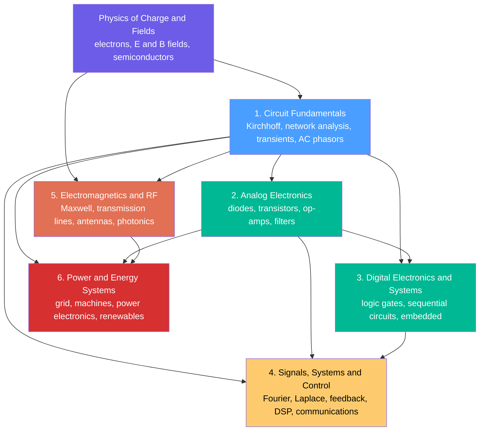

# ⚡ Electrical Engineering — Overview

> [!abstract] TL;DR
> Electrical engineering is the discipline of harnessing electricity and electromagnetism to sense, process, transmit, store, and use both **energy** and **information**. Everything grows from three quantities and one law: **voltage** (electrical pressure), **current** (flow of charge), and **resistance** (opposition to flow), tied together by **Ohm's law** $V = IR$ and the **power** relation $P = VI$. From this seed branch six great sub-disciplines — **circuit fundamentals, analog electronics, digital systems, signals/systems/control, electromagnetics/RF, and power/energy** — which together engineer the flow of electrons and fields inside the phone in your hand, the grid lighting your city, and the radio waves carrying your calls.

## Intuition — analogy FIRST

**Electricity is like water flowing through pipes.** The **voltage** is the *pressure* pushing the water; the **current** is the *flow rate* (litres per second going past a point); and the **resistance** is *how narrow the pipe is* — a thin pipe fights the flow, a fat pipe lets it gush. Raise the pressure and the flow increases; pinch the pipe and the flow drops. That single plumbing picture already gives you Ohm's law: flow (current) equals pressure (voltage) divided by narrowness (resistance).

From this one analogy grows *everything* electrical engineers build. A **battery** is a pump that maintains pressure. A **capacitor** is a stretchy rubber diaphragm that stores water under tension. An **inductor** is a heavy paddle-wheel whose spinning resists sudden changes in flow. A **transistor** is a valve where a tiny trickle controls a torrent. Chain these together and you can shape the flow of electrons — and the electromagnetic waves they radiate — to **sense** the world, **compute** on it, **communicate** across it, and **power** the machines that run the modern world. Electrical engineering is the art of that shaping.

The analogy has limits (covered below), but as a *first* mental model it is astonishingly powerful — most of first-year circuit theory is just careful plumbing.

---

## How It Works

Physics supplies the raw phenomena — moving charge, electric fields $\vec{E}$, magnetic fields $\vec{B}$, and the semiconductor materials that let us *control* charge. **Circuit fundamentals** is the shared trunk: once you can analyse a network of sources, resistors, capacitors and inductors, every other branch becomes a specialisation. Analog and digital electronics add **active** devices; signals/systems/control adds the mathematics of *time and frequency*; electromagnetics/RF zooms out to where wavelength matters; and power/energy scales everything up to megawatts and the grid.



The **two great regimes** cut across all six branches. In **DC (direct current / steady state)** nothing changes with time, capacitors are open circuits and inductors are wires — algebra suffices. In **AC (alternating current / time-varying)** everything oscillates, and we trade calculus for the elegant machinery of **phasors, impedance, and transforms** to keep the algebra simple. Almost every EE problem is really the question: *which regime am I in, and what tools does it license?*

---

## Key Concepts

### Secondary Level

- **Charge $q$ (coulombs, C)** — the fundamental "stuff"; one electron carries $-1.6\times10^{-19}$ C.
- **Current $I$ (amperes, A)** — *rate* of charge flow, $I = dq/dt$. One amp is one coulomb per second. Current flows **through** an element.
- **Voltage $V$ (volts, V)** — energy per unit charge, the "push". Voltage is measured **across** two points.
- **Resistance $R$ (ohms, $\Omega$)** — opposition to current.
- **Ohm's law:** $V = IR$. The single most-used equation in EE.
- **Power:** $P = VI$ (watts, W); **energy** is power over time, $E = Pt$ (joules, or kilowatt-hours on your bill).

### Undergraduate Level

- **Kirchhoff's laws** — KCL (currents into a node sum to zero) and KVL (voltages around a loop sum to zero); the backbone of network analysis.
- **Reactive elements** — the **capacitor** $i = C\,dv/dt$ (stores energy in an electric field) and the **inductor** $v = L\,di/dt$ (stores energy in a magnetic field).
- **AC steady state and phasors** — represent a sinusoid as a complex amplitude; resistance generalises to **impedance** $Z = R + jX$, and Ohm's law becomes $\vec{V} = \vec{I}\,Z$.
- **Semiconductor devices** — the **diode** (one-way valve) and the **transistor** (BJT / MOSFET), the amplifying and switching element behind all modern electronics.
- **The op-amp** — the analog designer's universal building block (amplify, filter, integrate, compare).
- **Boolean logic and digital abstraction** — voltages quantised to 0 / 1, combined by gates into arithmetic, memory, and processors.
- **Transforms** — **Fourier** (time $\leftrightarrow$ frequency) and **Laplace** (adds transients and stability), which turn differential equations into algebra.

### Graduate Level

- **Full electromagnetics** — **Maxwell's equations** unify electricity, magnetism, and light; transmission-line theory, waveguides, antennas, and photonics live here.
- **Feedback and control theory** — poles, zeros, stability margins, state-space and optimal/robust control; the mathematics of making systems behave.
- **Digital signal processing and communications** — sampling, the DFT/FFT, digital filters, modulation, information theory, and error-correcting codes.
- **Power systems and power electronics** — three-phase analysis, electrical machines, switching converters, grid stability, and renewable integration.
- **Device and semiconductor physics** — band theory, MOSFET scaling, VLSI, and the frontier of nanoelectronics and quantum devices.

---

## Python Demo

```python
# The two foundational relations of EE, visualised:
#   (a) Ohm's law  I = V/R  (straight lines, slope = 1/R) and power P = V*I
#   (b) The two great regimes: a DC steady value vs an AC sinusoid V(t)=V0*sin(2*pi*f*t)
import numpy as np
import matplotlib.pyplot as plt

# ---- (a) Ohm's law + power over a sweep of voltages ----
V = np.linspace(0, 10, 200)            # applied voltage sweep (volts)
resistances = [1.0, 2.0, 5.0, 10.0]    # ohms

fig, ax = plt.subplots(1, 3, figsize=(15, 4.5))

# Panel 1: I-V characteristics  ->  each resistor is a line of slope 1/R
for R in resistances:
    I = V / R                          # amperes; slope = 1/R
    ax[0].plot(V, I, label=f"R = {R:g} ohm  (slope 1/R = {1/R:.2f})")
ax[0].set_title("Ohm's Law:  I = V / R")
ax[0].set_xlabel("Voltage V  [V]")
ax[0].set_ylabel("Current I  [A]")
ax[0].legend(); ax[0].grid(True, alpha=0.3)

# Panel 2: Power dissipation  P = V*I = V^2/R = I^2*R  (quadratic in V)
for R in resistances:
    P = V * (V / R)                    # = V^2 / R
    ax[1].plot(V, P, label=f"R = {R:g} ohm")
ax[1].set_title("Power:  P = V*I = V^2 / R")
ax[1].set_xlabel("Voltage V  [V]")
ax[1].set_ylabel("Power P  [W]")
ax[1].legend(); ax[1].grid(True, alpha=0.3)

# ---- (b) DC steady vs AC sinusoid: EE splits into these two regimes ----
t   = np.linspace(0, 0.04, 1000)       # 40 ms window (seconds)
V0  = 5.0                              # amplitude / DC level (volts)
f   = 50.0                             # mains frequency (Hz)
v_dc = V0 * np.ones_like(t)            # DC: constant in time
v_ac = V0 * np.sin(2 * np.pi * f * t)  # AC: V(t) = V0 sin(2*pi*f*t)

ax[2].plot(t * 1000, v_dc, lw=2, label="DC steady:  V = V0")
ax[2].plot(t * 1000, v_ac, lw=2, label="AC:  V(t) = V0 sin(2*pi*f*t)")
ax[2].axhline(0, color="k", lw=0.6)
ax[2].set_title("Two Regimes: DC (steady) vs AC (time-varying), f = 50 Hz")
ax[2].set_xlabel("time  [ms]")
ax[2].set_ylabel("Voltage V  [V]")
ax[2].legend(); ax[2].grid(True, alpha=0.3)

plt.tight_layout()
plt.savefig("ee_overview.png", dpi=120)
plt.show()

# ---- Numerical sanity check: power computed three equivalent ways ----
R, Vx = 5.0, 10.0
Ix = Vx / R                            # Ohm's law
print(f"V = {Vx} V, R = {R} ohm  ->  I = {Ix} A")
print(f"P = V*I    = {Vx * Ix:.1f} W")
print(f"P = V^2/R  = {Vx**2 / R:.1f} W")
print(f"P = I^2*R  = {Ix**2 * R:.1f} W")   # all three print 20.0 W
```

The three power formulas printing the *same* 20.0 W is the whole point: $P = VI = V^2/R = I^2R$ are one relation wearing three hats, and knowing which to reach for is half of practical EE.

---

## Real-World Applications

- **Your smartphone** — a single device touching *every* branch: a power-management IC and battery (power electronics), the RF front-end and antenna (electromagnetics), the analog audio and camera chains (analog electronics), the applications processor (digital/VLSI), and the modem's DSP (signals and communications).
- **The electrical grid** — generators, three-phase transmission at hundreds of kilovolts, transformers stepping down to your wall socket, and increasingly power-electronic inverters tying in solar and wind (power and energy systems).
- **Wireless and radio** — Wi-Fi, 5G, GPS, and radar all shape electromagnetic waves per Maxwell's equations, modulate information onto them, and recover it with DSP.
- **Medical electronics** — an ECG amplifies microvolt signals from the heart (instrumentation op-amps), filters out noise (analog + digital filters), and digitises for display.
- **Electric vehicles** — battery packs, motor drives (three-phase inverters), regenerative braking, and control systems all sitting squarely inside EE.

---

## Common Pitfalls

- **Voltage is ACROSS, current is THROUGH.** You measure voltage *between two points* (a voltmeter in parallel) and current *through a wire* (an ammeter in series). "The voltage through the resistor" is a category error — a giveaway that the water analogy hasn't fully clicked yet.
- **Forgetting power is $P = VI$ (and its cousins).** A device can be at high voltage yet dissipate little power (tiny current), or at low voltage yet dissipate a lot (huge current). Always ask for *both* factors; use $I^2R$ for wire heating and $V^2/R$ for a load across a fixed supply.
- **Pushing the water analogy too far.** Electrons are **not "used up"** — the same charge that leaves the battery returns to it; only *energy* is delivered to the load. There is no "leak," current is the *same* all around a series loop, and unlike water there is no such thing as electricity "spilling out" of an open wire end. The analogy is a scaffold, not the building.
- **Confusing "electrical engineering" with "electronics."** EE is the broad discipline (circuits, electronics, signals, electromagnetics, power, communications, control). **Electronics** — the study of active devices and small-signal circuits — is just *one* sub-branch. Power engineers and RF engineers are electrical engineers who may touch very few transistors.
- **Blurring passive vs active components.** **Passive** elements (resistors, capacitors, inductors) can only store or dissipate energy; **active** elements (transistors, op-amps, sources) can *deliver* energy and provide gain. Amplification is impossible with passives alone.
- **Ignoring which regime you are in.** Treating an AC problem with DC algebra (or forgetting that a capacitor blocks DC but passes AC) is the classic beginner trap. Identify DC steady-state vs AC/transient *first*, then pick your tools.
- **Sloppy SI units and prefixes.** Mixing mA with A, or kΩ with Ω, silently injects factors of 1000. Memorise the ladder: pico (p, $10^{-12}$), nano (n, $10^{-9}$), micro (µ, $10^{-6}$), milli (m, $10^{-3}$), kilo (k, $10^{3}$), mega (M, $10^{6}$), giga (G, $10^{9}$).

---

## Related Concepts

- [[Electric_Fields_and_Coulombs_Law]] — the physics of charge and the electric field $\vec{E}$ that ultimately *is* voltage; EE builds on this foundation.
- [[Maxwells_Equations]] — the four equations unifying electricity, magnetism, and light; the theoretical bedrock of the electromagnetics/RF branch.
- [[Faradays_Law_and_Induction]] — induction underlies transformers, motors, generators, and inductors, tying the power branch back to physics.
- [[Electromagnetic_Waves_and_Radiation]] — how circuits radiate; the bridge from lumped circuits to antennas and wireless.
- [[CT_Signals]] — the continuous-time signals whose Fourier/Laplace analysis is the mathematics of the signals/systems/control branch.
- [[Fourier_Transform]] — the time $\leftrightarrow$ frequency lens that makes AC analysis, filtering, and communications tractable.
- [[Transfer_Functions]] — the input/output description of linear circuits and control systems in the $s$-domain.
- [[Boolean_Algebra_and_Logic_Gates]] — the digital abstraction where quantised voltages become logic, the entry to the digital-systems branch.
- [[Sequential_Circuits_and_FSMs]] — memory and state built from gates; the step from combinational logic toward processors and embedded systems.
- [[Complex_Numbers_and_Functions]] — the $j\omega$ and phasor mathematics that make AC circuit analysis simple algebra.
- [[Second_Order_Linear_ODEs]] — the equations governing RLC transients, resonance, and oscillation.
- [[Vectors_and_Vector_Spaces]] — the linear-algebra backbone of state-space methods, network equations, and DSP.

*Sibling notes in this section (Circuit Fundamentals) to be built next: Circuit_Elements_and_Kirchhoffs_Laws, Semiconductor_Devices_and_Diodes, Boolean_Logic_and_Combinational_Circuits, Feedback_and_Control_Systems, Maxwells_Equations_for_Engineers, and the capstone The_Reach_and_Future_of_Electrical_Engineering.*

---

## Review Questions

1. **(Secondary)** Using the water-in-pipes analogy, explain what happens to the current if you double the voltage while keeping resistance fixed, and separately if you double the resistance while keeping voltage fixed. Then state Ohm's law that captures both.
2. **(Undergraduate)** A 100 Ω resistor is connected first to a 12 V DC supply and then to a 12 V-amplitude, 60 Hz AC supply. In each case, describe how you would analyse the current, and explain why a capacitor placed in series would behave completely differently in the two cases. Which regime does each belong to?
3. **(Graduate)** Pick any everyday device (an EV charger, a Wi-Fi router, an insulin pump) and map which of the six EE sub-disciplines it exercises. For one chosen sub-system, argue whether the correct model is a lumped circuit or a distributed/electromagnetic one, and justify your choice using the relationship between signal wavelength and physical size.

---

## Sources

- Alexander, C. & Sadiku, M. — *Fundamentals of Electric Circuits* (McGraw-Hill) — the standard first course in circuits, DC through AC and transforms.
- Hayt, W., Kemmerly, J. & Durbin, S. — *Engineering Circuit Analysis* (McGraw-Hill) — rigorous network analysis and phasor/AC methods.
- Sedra, A. & Smith, K. — *Microelectronic Circuits* (Oxford) — the canonical analog electronics text (diodes, transistors, op-amps).
- Ulaby, F. — *Fundamentals of Applied Electromagnetics* (Pearson) — fields, transmission lines, and RF for engineers.
- Oppenheim, A. & Willsky, A. — *Signals and Systems* (Pearson) — the signals/systems/transforms foundation.

---

#electrical-engineering #circuits #electronics #signals #power
