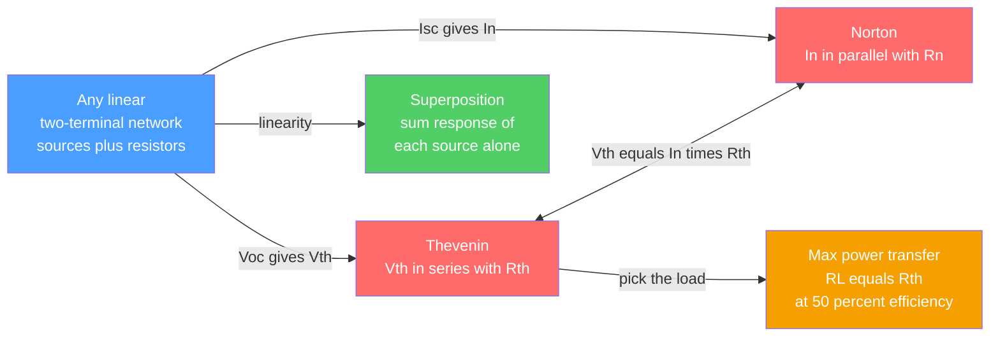

# 🔌 Network Theorems

> [!abstract] TL;DR
> The network theorems are the simplification toolkit for **linear** circuits. **Thevenin's theorem** says any linear two-terminal network is equivalent, as seen from those terminals, to a single voltage source $V_{th}$ (the open-circuit voltage) in **series** with a single resistance $R_{th}$. **Norton's theorem** is its dual: a current source $I_N$ (the short-circuit current) in **parallel** with $R_N = R_{th}$, related by the source transformation $V_{th} = I_N R_{th}$. **Superposition** lets you sum the response to each independent source acting alone (but never for power, which is quadratic). **Maximum power transfer** delivers peak power to a load when $R_L = R_{th}$, at only 50% efficiency. All four rest entirely on **linearity**.

## Intuition — analogy FIRST

You don't need to know the wiring behind a wall outlet to use it. From the outside it just looks like "a source with some internal resistance" — plug in a light bulb and it glows, plug in a heater and it draws more current, and the voltage sags a little under heavy load. **Thevenin's theorem makes that mental model rigorous:** *any* complicated linear circuit — dozens of resistors, multiple batteries, an entire amplifier output stage — behaves, when viewed from two chosen terminals, **exactly** like one voltage source hiding behind one resistor.

This is enormously powerful. It lets an engineer collapse a monstrous network into a trivial two-component model and then reason about "what will this circuit actually deliver to *my* load?" without ever redrawing the whole thing. Norton is the same idea told from the current side; superposition is the "one source at a time" bookkeeping that linearity permits; and maximum power transfer is what you get when you ask that two-component model, "which load extracts the most power from me?"

---

## How It Works

The core mechanism is *equivalence at a port*. Pick two terminals. Everything on the source side is a black box; the theorems tell you the simplest box that is indistinguishable from the original for **every** possible load.

1. **Thevenin** — Find $V_{th}$ as the **open-circuit** voltage across the terminals (remove the load, measure/compute $V_{oc}$). Find $R_{th}$ by one of three routes below. The equivalent is $V_{th}$ in series with $R_{th}$.
2. **Norton** — Find $I_N$ as the **short-circuit** current through the terminals (short the load, compute $I_{sc}$). $R_N = R_{th}$. The equivalent is $I_N$ in parallel with $R_N$.
3. **Source transformation** — The two are interchangeable: $V_{th} = I_N R_{th}$, i.e. $V_{th}/R_{th} = I_N$ and $V_{oc}/I_{sc} = R_{th}$.
4. **Finding $R_{th}$** — (a) **Deactivate** all *independent* sources (replace voltage sources with shorts, current sources with opens) and reduce by series/parallel; OR (b) compute $R_{th} = V_{oc}/I_{sc}$; OR (c) when **dependent** sources are present, apply a 1 V (or 1 A) **test source** at the port and compute $R_{th} = V_{test}/I_{test}$ (method (a) fails because dependent sources cannot simply be switched off).
5. **Superposition** — In a linear circuit the total response equals the **sum** of responses to each independent source alone, with the others deactivated. This is just linearity ($\mathcal{H}\{ax_1 + bx_2\} = a\mathcal{H}\{x_1\} + b\mathcal{H}\{x_2\}$) applied to a resistive network. It computes voltages and currents — **never power directly**.
6. **Maximum power transfer** — Given a fixed source $\left(V_{th}, R_{th}\right)$, the power in the load $P_L = \left(\frac{V_{th}}{R_{th}+R_L}\right)^2 R_L$ is maximized by setting $\frac{dP_L}{dR_L}=0$, which gives $R_L = R_{th}$ and $P_{max} = \frac{V_{th}^2}{4R_{th}}$ at exactly 50% efficiency.



---

## Key Concepts / Details

### Secondary Level

**Thevenin equivalent.** Any battery-plus-resistors box seen from two wires acts like one battery $V_{th}$ with one series resistor $R_{th}$. Measure the open-terminal voltage to get $V_{th}$; that is what a voltmeter reads with nothing connected.

**Norton equivalent.** The same box seen as one current source $I_N$ with a parallel resistor. $I_N$ is the current that flows if you short the two wires together.

**They agree.** $V_{th} = I_N \, R_{th}$ — a fully-charged $V_{th}=9\,\text{V}$, $R_{th}=3\,\Omega$ Thevenin box is the *same thing* as an $I_N = 3\,\text{A}$, $R_N = 3\,\Omega$ Norton box.

### Undergraduate Level

**Finding $R_{th}$ — three methods.**

$$R_{th} = \frac{V_{oc}}{I_{sc}} \qquad\text{(always valid)}$$

- **Deactivation + reduction** (independent sources only): short voltage sources, open current sources, then collapse the surviving resistor network by series ($R_s = \sum R_i$) and parallel ($\frac{1}{R_p} = \sum \frac{1}{R_i}$) rules.
- **$V_{oc}/I_{sc}$**: compute the open-circuit voltage and short-circuit current from full analysis; their ratio is $R_{th}$.
- **Test source** (required with dependent sources): kill *independent* sources, apply $V_{test}=1\,\text{V}$, solve for the port current $I_{test}$, and $R_{th} = V_{test}/I_{test}$.

**Superposition procedure.** For each independent source: keep it on, deactivate all others (short $V$-sources, open $I$-sources), solve the resulting circuit, and record the target current/voltage. Sum the contributions. Works because a resistive network is a **linear map** from source vector to node-voltage vector.

**Maximum power transfer.**

$$P_L = \frac{V_{th}^2 \, R_L}{\left(R_{th}+R_L\right)^2}, \qquad \frac{dP_L}{dR_L}=0 \;\Rightarrow\; R_L = R_{th}, \qquad P_{max} = \frac{V_{th}^2}{4 R_{th}}$$

At the match, half the source power is dissipated inside $R_{th}$, so efficiency $\eta = P_L / P_{source} = 50\%$.

### Graduate Level

**Linearity is the whole story.** A resistive network obeys $\mathbf{G}\,\mathbf{v} = \mathbf{i}_s$ (nodal form), a linear system in the node voltages. Thevenin/Norton, superposition, and reciprocity are all corollaries of this affine structure; the moment a nonlinear element (diode, transistor in a nonlinear regime) appears, they cease to hold globally and survive only as *small-signal* linearizations about an operating point.

**AC and impedance.** In the phasor domain every theorem generalizes by replacing $R$ with complex impedance $Z$. Maximum *average* power transfer to a load $Z_L = R_L + jX_L$ from a source $Z_{th} = R_{th} + jX_{th}$ requires the **conjugate match** $Z_L = Z_{th}^{*}$ (i.e. $R_L = R_{th}$, $X_L = -X_{th}$) — the foundation of RF/microwave impedance matching.

**Reciprocity.** In a linear, passive, time-invariant network with no dependent sources, swapping an ideal source and an ideal ammeter between two ports leaves the measured current unchanged: $\frac{V_1}{I_2} = \frac{V_2}{I_1}$. It reflects the symmetry ($\mathbf{G} = \mathbf{G}^{T}$) of the conductance matrix and underlies antenna transmit/receive symmetry.

**Superposition is not for power.** Power is $P = v\,i = i^2 R$, a *quadratic* form. Summing per-source currents is legal; squaring the sum introduces cross terms $2 i_1 i_2 R \neq 0$, so $P_{total} \neq \sum P_k$. Compute the total current first, then the power.

---

## Python Demo

```python
# Thevenin equivalent + maximum power transfer, verified numerically.
# (a) Compute a small linear circuit's Thevenin equivalent seen from a load port
#     and confirm it delivers IDENTICAL voltage/current for every load resistance.
# (b) Sweep the load RL and show delivered power PEAKS at RL = Rth (50% efficiency).
import numpy as np
import matplotlib.pyplot as plt

# ---- A small linear circuit (single internal node A; ground = 0 V) --------
# 12 V source through R1 to node A; R2 from A to ground; load RL from A to ground.
Vs, R1, R2 = 12.0, 4.0, 12.0   # volts, ohms, ohms

def solve_full_circuit(RL):
    """Nodal analysis at node A with load RL attached.
    KCL at A:  (VA - Vs)/R1 + VA/R2 + VA/RL = 0
    -> VA * (1/R1 + 1/R2 + 1/RL) = Vs/R1 . Returns (V_load, I_load)."""
    G = 1.0/R1 + 1.0/R2 + 1.0/RL     # total conductance seen at node A
    I_inj = Vs / R1                  # source branch modeled as injected current
    VA = I_inj / G
    return VA, VA / RL

# ---- Extract the Thevenin equivalent from the network itself -------------
Voc = (Vs/R1) / (1.0/R1 + 1.0/R2)    # open-circuit voltage (RL -> infinity)
Isc = Vs / R1                        # short-circuit current (RL -> 0, node A pinned to 0)
Vth = Voc
Rth = Voc / Isc                      # Rth via Voc / Isc
Rth_deact = 1.0 / (1.0/R1 + 1.0/R2)  # cross-check: kill source -> R1 || R2

print(f"Vth (open-circuit voltage) = {Vth:.3f} V")
print(f"Isc (short-circuit current) = {Isc:.3f} A")
print(f"Rth = Voc/Isc              = {Rth:.3f} ohm")
print(f"Rth via R1||R2 (deactivate) = {Rth_deact:.3f} ohm")

def thevenin_load(RL):
    I = Vth / (Rth + RL)
    return I * RL, I

# ---- Verify full circuit == Thevenin equivalent across many loads --------
RL = np.linspace(0.1, 30.0, 400)
V_full = np.array([solve_full_circuit(r)[0] for r in RL])
V_th   = np.array([thevenin_load(r)[0]     for r in RL])
I_th   = np.array([thevenin_load(r)[1]     for r in RL])
print(f"max |V_full - V_thevenin|  = {np.max(np.abs(V_full - V_th)):.2e} V (approx 0)")

# ---- Maximum power transfer ---------------------------------------------
P_load   = I_th**2 * RL              # power delivered to the load
P_source = Vth * I_th               # total power supplied by the Thevenin source
eta      = 100.0 * P_load / P_source
RL_star  = RL[np.argmax(P_load)]
P_max    = Vth**2 / (4.0*Rth)       # analytic maximum
print(f"RL for max power (numeric) = {RL_star:.2f} ohm  (Rth = {Rth:.2f} ohm)")
print(f"P_max = Vth^2/(4 Rth)      = {P_max:.3f} W  at efficiency {eta[np.argmax(P_load)]:.0f}%")

# ---- Plots ---------------------------------------------------------------
fig, ax = plt.subplots(1, 2, figsize=(12, 4.5))
ax[0].plot(RL, V_full, 'b-',  lw=6, alpha=0.35, label='Full circuit (nodal analysis)')
ax[0].plot(RL, V_th,  'r--', lw=2,             label='Thevenin equivalent')
ax[0].set(xlabel='Load resistance RL (ohm)', ylabel='Load voltage (V)',
          title='Full circuit vs Thevenin equivalent')
ax[0].legend(); ax[0].grid(alpha=0.3)

ax[1].plot(RL, P_load, 'g-', lw=2, label='Power to load')
ax[1].axvline(Rth, color='k', ls=':', label=f'RL = Rth = {Rth:.0f} ohm')
ax[1].plot(RL_star, P_max, 'ko', ms=8)
ax[1].set(xlabel='Load resistance RL (ohm)', ylabel='Power delivered (W)',
          title='Maximum power transfer (peak at RL = Rth)')
ax[1].legend(); ax[1].grid(alpha=0.3)
plt.tight_layout()
plt.savefig('network_theorems_demo.png', dpi=110)
plt.show()
```

Expected output: `Vth = 9.000 V`, `Isc = 3.000 A`, `Rth = 3.000 ohm` (both methods agree), the full-circuit and Thevenin curves overlay to within numerical noise, and power peaks at `RL = 3 ohm` with `P_max = 6.750 W` at 50% efficiency.

---

## Real-World Applications

- **Battery and power-supply modeling** — A real battery is quoted as an EMF plus an internal resistance: that *is* a Thevenin equivalent. Voltage sag under load and short-circuit current follow directly from $V_{th}$ and $R_{th}$.
- **Amplifier output stages and sensor front-ends** — An op-amp output, a microphone, or a photodiode is modeled to the next stage as a Thevenin (or Norton) source, letting designers predict loading effects without the internal schematic.
- **RF and audio impedance matching** — Antennas (50 Ω), transmission lines, and audio power stages use the conjugate-match form of maximum power transfer to move maximum signal power into the load.
- **Fault and stability analysis in power grids** — Utilities reduce enormous networks to Thevenin equivalents at a bus to compute available short-circuit current and set protection.
- **SPICE and circuit simulators** — Modified nodal analysis solves $\mathbf{G}\mathbf{v}=\mathbf{i}$; small-signal (`.tf`) analysis reports exactly the Thevenin/Norton resistance at a port.

---

## Common Pitfalls

- **Using superposition on power** — Power is quadratic ($P=i^2R$), so $P_{total}\neq \sum P_k$; cross terms are missed. Superpose *currents/voltages*, then compute power from the total. This is the single most common exam error.
- **Deactivating dependent sources** — You may only switch off *independent* sources when finding $R_{th}$. Dependent sources must stay live; use the **test-source** method ($R_{th}=V_{test}/I_{test}$) or $V_{oc}/I_{sc}$ instead. Shorting a dependent source gives a wrong (often too-small) $R_{th}$.
- **Wrong deactivation rule** — Voltage sources become **shorts** (0 Ω), current sources become **opens** (∞ Ω). Swapping these is a frequent slip.
- **Assuming max power means efficient** — At the matched load $R_L=R_{th}$ efficiency is only 50%. Power *systems* deliberately run $R_L \gg R_{th}$ for high efficiency; max-power matching is for *signal* transfer (RF, audio), not bulk energy delivery.
- **Applying the theorems to nonlinear circuits** — Everything here presumes linearity. With diodes/transistors in a nonlinear regime, only the small-signal linearized model around an operating point admits Thevenin/Norton/superposition.
- **Forgetting AC needs conjugate matching** — In the phasor domain the match is $Z_L = Z_{th}^{*}$, not merely $R_L = R_{th}$; ignoring the reactive part $X_{th}$ leaves power on the table.
- **Confusing the two ports** — Thevenin/Norton are defined *relative to a chosen terminal pair*. Change the port and $V_{th}$, $R_{th}$ change; the equivalence is only guaranteed at that port.

---

## Related Concepts

- [[Systems_of_Linear_Equations]] — a resistive network is exactly a linear system $\mathbf{G}\mathbf{v}=\mathbf{i}$; solving it is the engine behind nodal/mesh analysis and every theorem here.
- [[Linear_Transformations]] — Thevenin equivalence and superposition are corollaries of the source-to-response map being a linear (affine) transformation.
- [[System_Properties]] — superposition is the circuit incarnation of the linearity/LTI property that governs signal systems.
- [[Gauss_Law_and_Electric_Potential]] — supplies the voltage/potential foundation ($\vec E = -\nabla V$) that circuit potentials and node voltages abstract.

Within this Circuit Fundamentals section, Network Theorems builds directly on *Circuit_Elements_and_Kirchhoffs_Laws* and *Nodal_and_Mesh_Analysis* (the solving machinery), generalizes to the phasor domain in *AC_Circuit_Analysis_and_Phasors* (conjugate matching), models the output of *Operational_Amplifiers* as a Thevenin source, and underpins the impedance matching central to *RF_and_Microwave_Engineering*.

---

## Review Questions

1. **(Secondary)** A 12 V battery in series with a 4 Ω internal resistance is connected to a 4 Ω load. What is the load current, and how much of the battery's total power reaches the load versus is lost internally?
2. **(Undergraduate)** A two-terminal network has $V_{oc}=10\,\text{V}$ and $I_{sc}=2\,\text{A}$. Give both its Thevenin and Norton equivalents. For what load resistance is delivered power maximized, and what is that maximum power?
3. **(Graduate)** A circuit contains a voltage-controlled current source (a dependent source). Explain precisely why you cannot find $R_{th}$ by shorting the independent source and reducing series/parallel, and describe the test-source procedure you would use instead. How does the answer change if the load and source are complex impedances in the AC steady state?

---

## Sources

- Alexander, C. K. & Sadiku, M. N. O. — *Fundamentals of Electric Circuits* (McGraw-Hill), Ch. 4: Circuit Theorems.
- Hayt, W., Kemmerly, J. & Durbin, S. — *Engineering Circuit Analysis* (McGraw-Hill), Circuit Theorems chapter.
- Nilsson, J. W. & Riedel, S. A. — *Electric Circuits* (Pearson), Thevenin/Norton and Maximum Power Transfer.
- [All About Circuits — Thevenin's Theorem](https://www.allaboutcircuits.com/textbook/direct-current/chpt-10/thevenins-theorem/)
- [Wikipedia — Maximum power transfer theorem](https://en.wikipedia.org/wiki/Maximum_power_transfer_theorem)

---

#electrical-engineering #thevenin #norton #superposition #max-power-transfer
