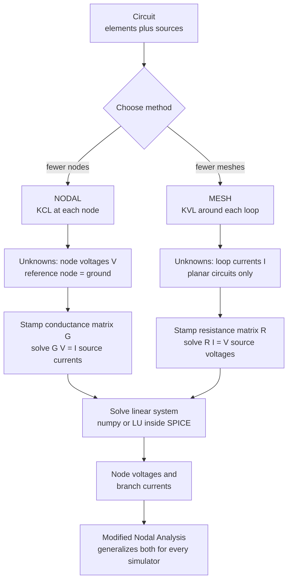

# ⚡ Nodal and Mesh Analysis

> [!abstract] TL;DR
> Nodal and mesh analysis are the two systematic recipes that turn *any* circuit into a solvable set of linear equations. **Nodal analysis** applies Kirchhoff's Current Law at each junction, solving for unknown **node voltages** $V$ via the conductance matrix ($GV = I$). **Mesh analysis** applies Kirchhoff's Voltage Law around each loop of a planar circuit, solving for unknown **loop currents** $I$ via the resistance matrix ($RI = V$). Both build a symmetric, diagonally-dominant matrix "by inspection," then hand it to a linear solver — which is exactly how **SPICE** (via *Modified Nodal Analysis*) simulates chips with billions of components.

## Intuition — analogy FIRST

Solving a tangled circuit by writing an equation for every single wire is chaos — like trying to track every individual drop of water flowing through a city's plumbing. You would drown in bookkeeping. **Nodal and mesh analysis are two disciplined accounting systems that cut through the chaos**, and they attack the same problem from opposite ends.

**Nodal** is like standing at each *street intersection* (a node) and demanding that all traffic flowing in equals all traffic flowing out — you solve for the "pressure" (voltage) at each intersection, measured against one reference corner you call ground. **Mesh** is like walking around each *city block* (a loop) and insisting that the total climb equals the total descent when you return to your start — you solve for a "circulating current" swirling around each block. Either way, you replace a jungle of wires with a tidy grid of numbers: a matrix equation that a computer solves in microseconds. This is the exact bridge from Kirchhoff's physical laws to computational circuit solving — linear algebra in action.

---

## How It Works

### Core mechanics

**Nodal analysis (the node-voltage method):**

1. Pick a **reference node** (ground, $0\text{ V}$). Every other node's voltage is measured relative to it.
2. Label the remaining $N-1$ node voltages $V_1, V_2, \dots$ as unknowns.
3. Write **KCL** at each non-reference node: the sum of currents leaving is zero. Express each branch current with **Ohm's law** in terms of node voltages, e.g. the current from node $i$ to node $j$ is $(V_i - V_j)/R_{ij}$.
4. Collect terms. The result is a linear system $GV = I$, where $G$ is the **conductance matrix** and $I$ is the vector of **source currents** injected into each node.
5. Solve for $V$, then recover any branch current by Ohm's law.

**By inspection**, the conductance matrix falls out mechanically (this is the "stamping" rule a simulator uses):
- $G_{ii}$ = sum of *all* conductances connected to node $i$.
- $G_{ij} = -(\text{conductance directly between nodes } i \text{ and } j)$.

**Mesh analysis (the loop-current method):**

1. Identify the independent **meshes** (loops with nothing inside them). Requires a **planar** circuit.
2. Assign a **mesh current** circulating around each mesh (conventionally clockwise).
3. Write **KVL** around each mesh: voltage rises equal voltage drops. A resistor shared by two meshes carries the *difference* of their mesh currents.
4. The result is $RI = V$, where $R$ is the **resistance matrix** and $V$ is the vector of **source voltages** driving each mesh.
5. Solve for the mesh currents; any branch current is a sum/difference of the mesh currents passing through it.

By inspection: $R_{ii}$ = sum of resistances in mesh $i$; $R_{ij} = -(\text{resistance shared between meshes } i \text{ and } j)$.

For **reciprocal resistive networks**, both $G$ and $R$ come out **symmetric** ($G_{ij} = G_{ji}$) and **diagonally dominant** — properties that guarantee a unique, numerically stable solution.

### Flow / Architecture



---

## Key Concepts / Details

### Secondary Level

- A **node** is a point where two or more components connect; a **branch** is a single component path; a **loop/mesh** is a closed path.
- **Nodal = solve for voltages at junctions; Mesh = solve for currents around loops.** Both use Kirchhoff's laws plus Ohm's law.
- Always choose a **reference node (ground)** for nodal analysis — voltages are meaningless without a reference.
- The two methods are just different bookkeeping; they must give the *same* physical answer for the same circuit.

### Undergraduate Level

- **Building matrices by inspection.** $G_{ii}$ = sum of conductances at node $i$; off-diagonals are negative shared conductances. Mirror rule for $R$ with resistances. Both are symmetric for reciprocal networks.
- **Supernode** — when an ideal **voltage source sits between two non-reference nodes**, its current is unknown, so you cannot write ordinary KCL at either node. Enclose both nodes in a *supernode*, write one KCL for the enclosed region, and add the source as a **constraint equation** $V_i - V_j = V_s$.
- **Supermesh** — when a **current source is shared by two meshes**, its voltage is unknown, so you cannot write ordinary KVL around either mesh. Merge them into a *supermesh* (KVL around the outer boundary), and add the source as the constraint $I_i - I_j = I_s$.
- **Choosing a method:** count unknowns. Nodal needs $N-1$ equations (fewer nodes → prefer nodal); mesh needs $B - N + 1$ equations (fewer meshes → prefer mesh). Nodal also works for **non-planar** circuits, where mesh does not.

### Graduate Level

- **Dependent (controlled) sources** add an extra equation expressing the controlling variable (a node-voltage difference or a branch current) in terms of the unknowns. They generally break the symmetry of $G$/$R$.
- **Modified Nodal Analysis (MNA)** is the industrial generalization: it augments the nodal system with an extra row/column per voltage source (and per inductor), treating the source current as an additional unknown. This handles voltage sources, current sources, and all elements *uniformly* — assemble one matrix, solve $Ax = z$. **This is the algorithm inside SPICE and every circuit simulator.**
- **AC / phasor analysis:** replace resistances with complex **impedances** $Z$ (and conductances with complex **admittances** $Y = 1/Z$). The exact same $GV=I$ / $RI=V$ machinery runs over $\mathbb{C}$; the matrix becomes complex-valued.
- **Sparsity & scale:** real chips yield matrices with millions of nodes but only a handful of nonzeros per row. Simulators store them **sparsely** and factor with sparse LU plus fill-reducing orderings — the same numerical-linear-algebra concerns (conditioning, pivoting) that govern any large $Ax=b$.

---

## Python Demo

A miniature SPICE: solve one resistive circuit **both ways** and confirm the branch currents are identical, then handle a **supernode**.

```python
"""
Mini-SPICE: automated Nodal and Mesh analysis of a resistive circuit.

Single circuit, solved BOTH ways -> identical branch currents:

    Vs=10V --[R1=2]--(node 1)--[R2=4]--(node 2)
       |               |                   |
      GND            [R3=4]              [R4=8]
                       |                   |
                      GND                 GND

The grounded source Vs in series with R1 enters the NODAL system as its
Norton equivalent: a current source Vs/R1 injected into node 1, with R1
appearing as a conductance from node 1 to ground.
"""
import numpy as np
import matplotlib.pyplot as plt

# ---- circuit data ----------------------------------------------------
Vs = 10.0                                # V, source referenced to ground
R1, R2, R3, R4 = 2.0, 4.0, 4.0, 8.0      # ohms

# =====================================================================
# (a) NODAL ANALYSIS BY INSPECTION  ->  build G, solve  G V = I
# =====================================================================
# Unknown node voltages V1, V2 (ground = 0 V). Resistors as
# (node_i, node_j, conductance); node 0 = ground.
n_unknown = 2
edges = [
    (1, 0, 1 / R1),   # R1 -> ground  (Norton form of the source branch)
    (1, 2, 1 / R2),   # R2 between node 1 and node 2
    (1, 0, 1 / R3),   # R3 node 1 -> ground
    (2, 0, 1 / R4),   # R4 node 2 -> ground
]

def build_conductance_matrix(n, edges):
    """Stamp each resistor into G by inspection -- exactly what SPICE does."""
    G = np.zeros((n, n))
    for i, j, g in edges:
        if i != 0:
            G[i - 1, i - 1] += g          # diag: sum of conductances at node
        if j != 0:
            G[j - 1, j - 1] += g
        if i != 0 and j != 0:
            G[i - 1, j - 1] -= g          # off-diag: -shared conductance
            G[j - 1, i - 1] -= g
    return G

G = build_conductance_matrix(n_unknown, edges)
I = np.array([Vs / R1, 0.0])              # source-current vector (Norton)
V = np.linalg.solve(G, I)                 # solve G V = I
V1, V2 = V

# branch currents from node voltages (Ohm's law, using the real Vs & R1)
branch_nodal = np.array([
    (Vs - V1) / R1,                       # I(R1)
    (V1 - V2) / R2,                       # I(R2)
    V1 / R3,                              # I(R3)
    V2 / R4,                              # I(R4)
])

# =====================================================================
# (b) MESH ANALYSIS BY INSPECTION  ->  build R, solve  R Im = Vsrc
# =====================================================================
# Two clockwise mesh currents: Im1 (left: Vs,R1,R3), Im2 (right: R3,R2,R4)
Rm = np.array([
    [R1 + R3,        -R3      ],           # diag = sum of R; off = -shared R
    [-R3,       R2 + R3 + R4  ],
])
Vsrc = np.array([Vs, 0.0])                # source voltages driving each mesh
Im = np.linalg.solve(Rm, Vsrc)
Im1, Im2 = Im

branch_mesh = np.array([
    Im1,          # R1 sits only in mesh 1
    Im2,          # R2 sits only in mesh 2
    Im1 - Im2,    # R3 is shared -> difference of mesh currents
    Im2,          # R4 sits only in mesh 2
])

# ---- the two methods must agree -------------------------------------
assert np.allclose(branch_nodal, branch_mesh), "nodal and mesh disagree!"
print(f"Node voltages:  V1 = {V1:.3f} V,  V2 = {V2:.3f} V")
print("Conductance matrix G (symmetric, diagonally dominant):")
print(G)
print("Branch currents [R1 R2 R3 R4] (A):")
print("  nodal:", np.round(branch_nodal, 4))
print("  mesh :", np.round(branch_mesh, 4))

# =====================================================================
# SUPERNODE: ideal voltage source between two NON-reference nodes.
# Write KCL around the supernode {1,2}, add the source as a constraint.
# =====================================================================
Is, Ra, Rb, Vfloat = 3.0, 2.0, 4.0, 5.0   # 3A in; R1->gnd, R2->gnd; V1-V2=5
A = np.array([
    [1 / Ra, 1 / Rb],    # supernode KCL : V1/Ra + V2/Rb = Is
    [1.0, -1.0],         # source constraint : V1 - V2 = Vfloat
])
b = np.array([Is, Vfloat])
Vsn = np.linalg.solve(A, b)
print(f"\nSupernode:  V1 = {Vsn[0]:.3f} V, V2 = {Vsn[1]:.3f} V "
      f"(KCL out = {Vsn[0]/Ra + Vsn[1]/Rb:.3f} A = Is)")

# =====================================================================
# Visualization
# =====================================================================
fig, ax = plt.subplots(1, 3, figsize=(15, 4.2))

labels = ["R1", "R2", "R3", "R4"]
x, w = np.arange(len(labels)), 0.38
ax[0].bar(x - w / 2, branch_nodal, w, label="Nodal", color="#4a9eff")
ax[0].bar(x + w / 2, branch_mesh, w, label="Mesh", color="#ff6b6b")
ax[0].set_xticks(x); ax[0].set_xticklabels(labels)
ax[0].set_ylabel("Branch current (A)")
ax[0].set_title("Nodal vs Mesh: identical branch currents")
ax[0].legend()

ax[1].bar(["V1", "V2"], [V1, V2], color="#51cf66")
ax[1].set_ylabel("Node voltage (V)")
ax[1].set_title("Solved node voltages (ref = ground)")
for i, v in enumerate([V1, V2]):
    ax[1].text(i, v + 0.1, f"{v:.2f} V", ha="center")

im = ax[2].imshow(G, cmap="viridis")
ax[2].set_title("Conductance matrix G (siemens)")
ax[2].set_xticks([0, 1]); ax[2].set_xticklabels(["node 1", "node 2"])
ax[2].set_yticks([0, 1]); ax[2].set_yticklabels(["node 1", "node 2"])
for (r, c), val in np.ndenumerate(G):
    ax[2].text(c, r, f"{val:.2f}", ha="center", va="center", color="w")
fig.colorbar(im, ax=ax[2], fraction=0.046)

plt.tight_layout()
plt.savefig("nodal_mesh_analysis.png", dpi=120)
plt.show()
```

**Output:**

```
Node voltages:  V1 = 6.000 V,  V2 = 4.000 V
Conductance matrix G (symmetric, diagonally dominant):
[[ 1.   -0.25]
 [-0.25  0.375]]
Branch currents [R1 R2 R3 R4] (A):
  nodal: [2.  0.5 1.5 0.5]
  mesh : [2.  0.5 1.5 0.5]

Supernode:  V1 = 5.667 V, V2 = 0.667 V (KCL out = 3.000 A = Is)
```

The two methods produce byte-for-byte identical branch currents from completely different matrices ($2 \times 2$ conductance vs. $2 \times 2$ resistance) — concrete proof they are two views of the same physics. Note $G$ is symmetric and diagonally dominant ($1.0 > 0.25$, $0.375 > 0.25$).

---

## Real-World Applications

> **SPICE and every EDA tool.** SPICE (and its descendants: HSPICE, LTspice, ngspice, Cadence Spectre) is built on **Modified Nodal Analysis**. Each simulation step stamps every transistor, resistor, and capacitor into one large sparse matrix and solves $Ax = z$. Verifying a modern SoC means solving these systems millions of times across operating points and transients.

- **Integrated-circuit design & sign-off** — timing, power-integrity, and IR-drop analysis all reduce to repeatedly solving nodal systems over a power-grid mesh with millions of nodes.
- **Power systems** — the AC **power-flow (load-flow)** problem is nodal analysis with complex admittances: the bus **admittance matrix** $Y_{bus}$ is exactly the conductance matrix generalized to phasors.
- **PCB and interconnect extraction** — parasitic RLC networks extracted from layout are solved with MNA to check signal integrity.
- **MRI, tomography, and FEM solvers** — the finite-element stiffness matrix assembly is the same "stamp local contributions into a global sparse symmetric matrix, then solve" pattern.

---

## Common Pitfalls

- **Nodal vs. mesh confusion.** Nodal uses **KCL**, unknowns are **node voltages**, and you *must* pick a reference/ground. Mesh uses **KVL**, unknowns are **loop currents**, and it only works on **planar** circuits. Mixing the two conventions (e.g., writing KVL but solving for voltages) produces nonsense.
- **Forgetting the reference node.** Node voltages are relative. Without declaring one node as $0\text{ V}$, the conductance matrix is singular (rank-deficient) and the solve fails.
- **Voltage source between two non-reference nodes → use a SUPERNODE.** You cannot write ordinary KCL at either terminal because the source current is unknown. Enclose both nodes, write one KCL for the region, and add the constraint $V_i - V_j = V_s$. Beginners often try to write two separate node equations and get an inconsistent system.
- **Current source shared by two meshes → use a SUPERMESH.** Its voltage is unknown, so ordinary KVL fails around either mesh. Take KVL around the outer loop and add $I_i - I_j = I_s$.
- **Dependent sources need a controlling-variable equation.** A source controlled by some node voltage or branch current adds one more equation; omitting it under-constrains the system.
- **Assuming symmetry always holds.** $G$ and $R$ are symmetric and diagonally dominant only for **reciprocal** (resistor/capacitor/inductor) networks. Dependent sources and gyrators break symmetry — do not "mirror" off-diagonals blindly.
- **Picking the harder method.** Count first: use nodal when there are fewer nodes, mesh when there are fewer meshes. And remember mesh cannot handle **non-planar** circuits at all — nodal (and MNA) always can, which is why simulators standardize on nodal.

---

## Related Concepts

- [[Systems_of_Linear_Equations]] — nodal and mesh analysis *are* the construction of $GV=I$ and $RI=V$; solving them is exactly solving $Ax=b$.
- [[Matrices_and_Determinants]] — the conductance/resistance matrices; their symmetry, diagonal dominance, and non-zero determinant guarantee a unique solution.
- [[Mathematics/16_Numerical_Methods/Numerical_Linear_Algebra|Numerical Linear Algebra]] — how simulators actually solve the assembled system: sparse LU factorization, pivoting, and conditioning for million-node matrices.
- [[Gauss_Law_and_Electric_Potential]] — defines the electric potential that node voltages measure; nodal analysis is Kirchhoff's discrete counterpart to solving Poisson's equation on a network.

*(Sibling circuit-fundamentals notes referenced in prose — Circuit_Elements_and_Kirchhoffs_Laws, Network_Theorems, AC_Circuit_Analysis_and_Phasors, Electrical_Engineering_Overview, and Digital_System_Design_and_HDL — are planned companions in this section.)*

---

## Review Questions

1. **(Secondary)** In your own words, what does each method solve *for* — and what fundamental Kirchhoff law does each rely on? Why must you always choose a reference node before doing nodal analysis?
2. **(Undergraduate)** A circuit has 4 essential nodes and 3 meshes, driven by two voltage sources. Which method gives the smaller system, and how many equations does it need? If one of the voltage sources sits between two non-reference nodes, how does your nodal setup change?
3. **(Graduate)** Explain why SPICE uses *Modified* Nodal Analysis rather than plain nodal or mesh analysis. What does adding a voltage source do to the matrix structure, and why does the choice of nodal (over mesh) matter for non-planar and very large circuits? How does the whole scheme extend to AC steady-state analysis?

---

## Sources

- Alexander, C. K. & Sadiku, M. N. O. — *Fundamentals of Electric Circuits*, McGraw-Hill (chapters on Nodal and Mesh Analysis, supernodes and supermeshes).
- Hayt, W. H., Kemmerly, J. E. & Durbin, S. M. — *Engineering Circuit Analysis*, McGraw-Hill.
- Nilsson, J. W. & Riedel, S. A. — *Electric Circuits*, Pearson.
- Ho, C.-W., Ruehli, A. E. & Brennan, P. A. — "The Modified Nodal Approach to Network Analysis," *IEEE Transactions on Circuits and Systems*, 1975 — the paper behind SPICE.
- Nagel, L. W. — *SPICE2: A Computer Program to Simulate Semiconductor Circuits*, UC Berkeley ERL Memo, 1975.

---

#electrical-engineering #nodal-analysis #mesh-analysis #circuit-analysis #spice
