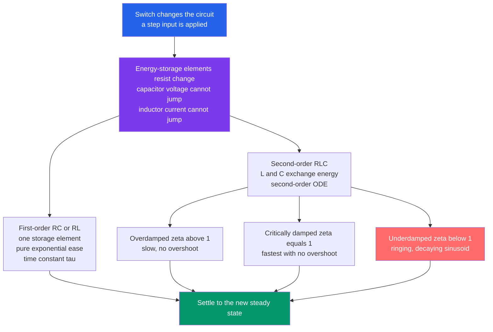

# ⚡ RC, RL, and RLC Transients

> [!abstract] TL;DR
> When a switch changes a circuit, capacitors and inductors refuse to change their stored energy instantly, so voltages and currents *ease* from their old values to the new steady state along a smooth curve instead of jumping. A single storage element (RC or RL) gives a pure **exponential** governed by the time constant $\tau = RC$ or $L/R$; a capacitor **and** an inductor together (RLC) form a second-order system that can **oscillate**, with a natural frequency $\omega_0 = 1/\sqrt{LC}$ and a damping ratio $\zeta$ that sets whether it is overdamped, critically damped, or underdamped (ringing). This settling behavior explains camera-flash charging, RC timers, digital-edge rise times, and power-supply overshoot.

## Intuition — analogy FIRST

Flip a light switch and the room *seems* to brighten instantly. But zoom into the microseconds and nothing in electronics happens instantly. Capacitors and inductors resist sudden change: a **capacitor is like a small water tank** that fills and drains gradually, and an **inductor is like a heavy flywheel** that speeds up and slows down reluctantly. When you flip a switch, the circuit does not teleport to its new state — it *eases* there along a smooth exponential curve set by a **time constant**.

Understanding this settling is why your camera flash takes a second to charge, why fast circuits *ring* like a struck bell, and why "instant" digital signals actually have finite, sloped edges. The RLC circuit is the exact electrical twin of a mass on a spring in molasses — same math, same overshoot-and-ring behavior.

---

## How It Works

A transient is the temporary journey between two steady states. It exists only because energy-storage elements enforce **continuity**: a capacitor stores energy in an electric field so its **voltage cannot jump** ($i = C\,dv/dt$ would demand infinite current), and an inductor stores energy in a magnetic field so its **current cannot jump** ($v = L\,di/dt$ would demand infinite voltage). Those two rules become the *initial conditions* for the differential equation the circuit obeys.



The total response always decomposes into a **natural (transient)** part — how the circuit relaxes on its own, decaying to zero — plus a **forced (steady-state)** part — where the drive pushes it in the long run.

---

## Key Concepts / Details

### Secondary Level — First-Order Circuits and the Time Constant

A circuit with **one** storage element (one capacitor *or* one inductor) plus resistors is **first-order**: its behavior is a single decaying exponential. Every voltage or current follows the universal first-order formula:

$$x(t) = x(\infty) + \big[x(0^+) - x(\infty)\big]\,e^{-t/\tau}$$

- $x(0^+)$ — the value **just after** the switch (from continuity of capacitor voltage / inductor current).
- $x(\infty)$ — the final steady-state value (capacitor $\to$ open, inductor $\to$ short at DC).
- $\tau$ — the **time constant**: $\tau = R_{\text{th}}C$ for capacitive circuits, $\tau = L/R_{\text{th}}$ for inductive circuits, where $R_{\text{th}}$ is the Thévenin resistance seen by the element.

**The 63 percent / 5 tau rule.** In one time constant the response covers $1 - e^{-1} \approx 63\%$ of its total change. After $2\tau$ it is at $86\%$, after $3\tau$ at $95\%$, and by $\sim 5\tau$ ($99.3\%$) it is treated as fully **settled**.

| Elapsed time | Fraction of the change completed |
|---|---|
| $1\tau$ | $63.2\%$ |
| $2\tau$ | $86.5\%$ |
| $3\tau$ | $95.0\%$ |
| $5\tau$ | $99.3\%$ (settled) |

*Charging* an RC from a source: $v_C(t) = V\big(1 - e^{-t/\tau}\big)$. *Discharging* into a resistor: $v_C(t) = V_0\,e^{-t/\tau}$.

### Undergraduate Level — Second-Order RLC Circuits

Put a capacitor **and** an inductor in the same loop and they can *trade* energy back and forth — the capacitor's electric field pumps current into the inductor's magnetic field and vice versa — so the circuit can **oscillate**. A series RLC driven by a step obeys a second-order ODE, written in canonical form as:

$$\frac{d^2 x}{dt^2} + 2\zeta\omega_0\,\frac{dx}{dt} + \omega_0^2\,x = \omega_0^2\,x(\infty)$$

with the two defining parameters:

- **Natural (undamped) frequency:** $\omega_0 = \dfrac{1}{\sqrt{LC}}$ — how fast it *would* ring with no resistance.
- **Damping ratio:** $\zeta = \dfrac{R}{2}\sqrt{\dfrac{C}{L}}$ (series) — how strongly resistance drains the oscillation. (For a parallel RLC, $\zeta = \dfrac{1}{2R}\sqrt{\dfrac{L}{C}}$.)

The roots of the characteristic equation $s^2 + 2\zeta\omega_0 s + \omega_0^2 = 0$ decide the regime:

| Regime | Condition | Roots | Behavior |
|---|---|---|---|
| **Overdamped** | $\zeta > 1$ | two real negative | slow, no overshoot, two exponentials |
| **Critically damped** | $\zeta = 1$ | repeated real | *fastest possible* with no overshoot |
| **Underdamped** | $\zeta < 1$ | complex pair | **ringing** — a decaying sinusoid, overshoot |

When underdamped, the circuit rings at the **damped natural frequency**:

$$\omega_d = \omega_0\sqrt{1 - \zeta^2}$$

and the envelope decays as $e^{-\zeta\omega_0 t}$. The **quality factor** $Q = \dfrac{1}{2\zeta}$ counts roughly how many oscillations occur before the ring dies out — high $Q$ means a sharp, long-lived ring.

### Graduate Level — Energy, Laplace, and the Mechanical Analogy

**Energy bookkeeping.** A capacitor stores $\tfrac{1}{2}CV^2$ (electric field); an inductor stores $\tfrac{1}{2}LI^2$ (magnetic field). In an underdamped RLC the transient *is* energy sloshing between these two reservoirs while $R$ dissipates it as heat — the electrical version of kinetic $\leftrightarrow$ potential energy exchange in a spring-mass-damper. The full dictionary: $m \leftrightarrow L$, damping $b \leftrightarrow R$, spring $k \leftrightarrow 1/C$, displacement $x \leftrightarrow q$ (charge), velocity $\leftrightarrow$ current.

**Laplace-domain view.** Transforming the ODE turns the transient into the poles of a transfer function $H(s)$. Pole location *is* the response: real poles $\to$ exponential decay (first-order / overdamped), a complex-conjugate pair at $s = -\zeta\omega_0 \pm j\omega_d$ $\to$ ringing. This is the bridge from time-domain transients to steady-state AC/phasor analysis and to control-system stability.

---

## Python Demo

```python
# Transients of energy-storage circuits:
#   (a) FIRST-ORDER RC/RL: exponential charge/discharge with time constant tau
#   (b) SECOND-ORDER RLC: overdamped / critically-damped / underdamped step response
# Only numpy + matplotlib. The RLC ODE is integrated by a hand-rolled RK4 (no scipy).
import numpy as np
import matplotlib.pyplot as plt

# ---------------------------------------------------------------
# (a) FIRST-ORDER: RC charging v(t) = V*(1 - e^{-t/tau}), tau = R*C
#     (an RL circuit has the identical shape with tau = L/R)
# ---------------------------------------------------------------
V = 5.0                                  # source / final voltage (volts)
taus = [0.5, 1.0, 2.0]                   # three time constants (seconds)
t = np.linspace(0, 10, 1000)

fig, (axL, axR) = plt.subplots(1, 2, figsize=(13, 5))

for tau in taus:
    v = V * (1.0 - np.exp(-t / tau))
    axL.plot(t, v, label=f"tau = {tau:g} s")
    # mark the 63% point at t = tau and the ~99% point at t = 5*tau
    axL.plot(tau,    V * (1 - np.exp(-1)), 'ko', ms=5)
    axL.plot(5*tau,  V * (1 - np.exp(-5)), 'k^', ms=6)

axL.axhline(0.632 * V, color='gray', ls=':', lw=1)
axL.text(6.2, 0.632 * V + 0.06, "63% reached at t = tau", fontsize=9)
axL.axhline(V, color='k', ls='--', lw=0.8)
axL.text(6.2, V - 0.35, "final value V (settled by ~5*tau)", fontsize=9)
axL.set_title("(a) First-Order RC Charging:  v(t) = V(1 - e^{-t/tau})")
axL.set_xlabel("time  t  [s]")
axL.set_ylabel("capacitor voltage  v(t)  [V]")
axL.legend(loc="lower right")
axL.grid(alpha=0.3)

# ---------------------------------------------------------------
# (b) SECOND-ORDER RLC step response, canonical form:
#     x'' + 2*zeta*w0*x' + w0^2 * x = w0^2 * X_final
#     State y = [x, x'];  RK4 integration for each damping regime.
# ---------------------------------------------------------------
w0 = 2.0 * np.pi        # natural frequency (rad/s) -> period ~ 1 s
Xf = 1.0                # final (steady-state) value = step target

def rlc_deriv(y, zeta):
    x, xdot = y
    xddot = w0**2 * (Xf - x) - 2.0 * zeta * w0 * xdot
    return np.array([xdot, xddot])

def rk4(zeta, t_end=3.0, n=3000):
    ts = np.linspace(0.0, t_end, n)
    h = ts[1] - ts[0]
    ys = np.zeros((n, 2))
    y = np.array([0.0, 0.0])            # start at rest: x(0)=0, x'(0)=0
    for i in range(n):
        ys[i] = y
        k1 = rlc_deriv(y, zeta)
        k2 = rlc_deriv(y + 0.5 * h * k1, zeta)
        k3 = rlc_deriv(y + 0.5 * h * k2, zeta)
        k4 = rlc_deriv(y + h * k3, zeta)
        y = y + (h / 6.0) * (k1 + 2*k2 + 2*k3 + k4)
    return ts, ys[:, 0]

regimes = [(2.5, "Overdamped  (zeta = 2.5)",  "tab:blue"),
           (1.0, "Critically damped (zeta = 1)", "tab:green"),
           (0.2, "Underdamped (zeta = 0.2)", "tab:red")]

for zeta, label, color in regimes:
    ts, x = rk4(zeta)
    axR.plot(ts, x, color=color, label=label)

axR.axhline(Xf, color='k', ls='--', lw=0.8)
axR.text(1.9, Xf + 0.02, "steady-state target", fontsize=9)
axR.set_title(f"(b) Second-Order RLC Step Response  (w0 = {w0:.2f} rad/s)")
axR.set_xlabel("time  t  [s]")
axR.set_ylabel("response  x(t)  [normalized]")
axR.legend(loc="lower right")
axR.grid(alpha=0.3)

plt.tight_layout()
plt.savefig("rc_rl_rlc_transients.png", dpi=110)
print("Saved rc_rl_rlc_transients.png")

# Quick numeric sanity checks
for tau in taus:
    print(f"RC tau={tau:g}s: at t=tau v={V*(1-np.exp(-1)):.3f} V "
          f"({100*(1-np.exp(-1)):.1f}% of {V} V)")
print(f"Underdamped ring frequency w_d = w0*sqrt(1-zeta^2) = "
      f"{w0*np.sqrt(1-0.2**2):.3f} rad/s")
```

Running it shows the left panel's three exponentials all passing through $63\%$ at their own $\tau$ (circles) and effectively settling by $5\tau$ (triangles), while the right panel shows the overdamped curve crawling up, the critically damped curve reaching the target as fast as possible without overshoot, and the underdamped curve overshooting and **ringing** before it settles.

---

## Real-World Applications

- **Camera flash and defibrillators.** A capacitor is charged through a resistor ($\tau = RC$) to store $\tfrac{1}{2}CV^2$, then dumped in milliseconds. The perceptible "charging" delay *is* the RC transient.
- **RC timing, delays, and debouncing.** 555 timers, power-on-reset circuits, and mechanical-switch debouncers all set delays by choosing $\tau = RC$.
- **Digital signal edges and timing.** Interconnect capacitance plus driver resistance forms an RC low-pass: the $63\%$/$5\tau$ rule sets the rise time, which caps how fast a bus can clock.
- **Power-supply and interconnect ringing.** Parasitic inductance with load capacitance makes an underdamped RLC that overshoots and rings on load steps — engineers add damping (series resistance, snubbers) to raise $\zeta$ toward critical.
- **Analog filters and resonators.** The same $\omega_0$, $\zeta$, and $Q$ that describe the RLC transient describe the resonant peak of an RLC bandpass filter in the frequency domain.
- **Sensor and instrument step response.** Any probe with a settling time (thermocouples, scope inputs) is characterized by a time constant or a damping ratio.

---

## Common Pitfalls

- **Assuming a voltage or current can jump.** Capacitor **voltage** and inductor **current** are *continuous* — they cannot change instantaneously. This continuity is exactly what supplies $x(0^+)$. (Capacitor current and inductor voltage, by contrast, *can* jump.)
- **Using the wrong resistance for $\tau$.** The time constant uses the **Thévenin resistance seen by the storage element**, not just the nearest resistor. Kill the sources, look back into the terminals.
- **Confusing $\tau = RC$ with $\tau = L/R$.** For capacitors more resistance means *slower* ($\tau \propto R$); for inductors more resistance means *faster* ($\tau \propto 1/R$). Opposite directions.
- **Forgetting a first-order circuit cannot oscillate.** One storage element $\to$ a single real pole $\to$ pure exponential. You need **both** $L$ and $C$ (two independent storage elements) for ringing.
- **Mixing up $\zeta$ and $\omega_0$.** $\omega_0 = 1/\sqrt{LC}$ sets *how fast* it rings; $\zeta$ (which contains $R$) sets *whether* it rings. Changing $R$ moves $\zeta$ without moving $\omega_0$.
- **Believing "critically damped" is the slowest.** It is the **fastest** approach with **no** overshoot — overdamped ($\zeta>1$) is actually slower.
- **Ignoring overshoot in design.** Chasing the fastest settle drives $\zeta$ down, which invites ringing and overshoot that can violate voltage limits or corrupt logic levels. Real designs trade settling speed against overshoot.
- **Separating natural and forced response incorrectly.** The total response is natural (transient, $\to 0$) **plus** forced (steady-state). Apply initial conditions to the *sum*, not to the natural part alone.

---

## Related Concepts

- [[First_Order_ODEs]] — an RC or RL circuit *is* a first-order linear ODE; the time constant is its characteristic decay rate.
- [[Second_Order_Linear_ODEs]] — the RLC circuit is the canonical second-order ODE, with the same real/repeated/complex-root cases as overdamped/critical/underdamped.
- [[Oscillations_and_SHM]] — the mass-spring-damper is the exact mechanical analog of the RLC; damping regimes and resonance carry over one-to-one.
- [[Faradays_Law_and_Induction]] — explains why an inductor stores energy in a magnetic field and enforces continuity of current ($v = L\,di/dt$).
- [[Impulse_Response]] — the natural (transient) response of a circuit is its impulse response; the forced part is the convolution with the input.
- [[Transfer_Functions]] — the Laplace-domain poles of the circuit encode exactly these transients (real poles vs complex-pair ringing).

Sibling circuit notes (in prose): Circuit_Elements_and_Kirchhoffs_Laws sets up the $i=C\,dv/dt$ and $v=L\,di/dt$ element laws; AC_Circuit_Analysis_and_Phasors handles the steady-state sinusoidal response that transients settle into; Fourier_and_Laplace_in_Circuits generalizes the pole picture; Analog_Filters_and_Frequency_Response reuses $\omega_0$, $\zeta$, and $Q$ in the frequency domain; Feedback_and_Control_Systems treats damping and overshoot as design targets.

---

## Review Questions

1. **(Secondary)** An RC circuit charges a capacitor toward $10\text{ V}$ with $R = 1\text{ k}\Omega$ and $C = 100\ \mu\text{F}$. What is the time constant, what voltage is reached after one time constant, and roughly when is it "fully" charged?
2. **(Undergraduate)** A series RLC has $L = 1\text{ mH}$ and $C = 1\ \mu\text{F}$. Find $\omega_0$. What value of $R$ makes it critically damped, and what happens to the step response if $R$ is set to *half* that value?
3. **(Graduate)** Explain, using pole locations in the $s$-plane, why an underdamped RLC rings while an overdamped one does not, and describe how increasing $R$ (in a series RLC) moves the poles. Connect this to the mass-spring-damper analogy and to why designers deliberately raise $\zeta$ in power-supply output stages.

---

## Sources

- Alexander, C. & Sadiku, M. — *Fundamentals of Electric Circuits* (chapters on first-order and second-order circuits).
- Hayt, W., Kemmerly, J. & Durbin, S. — *Engineering Circuit Analysis* (natural and step response of RL, RC, RLC).
- Nilsson, J. & Riedel, S. — *Electric Circuits* (response of first-order and second-order circuits).
- Agarwal, A. & Lang, J. — *Foundations of Analog and Digital Electronic Circuits* (energy storage, transients, and digital-edge timing).

---

#electrical-engineering #transients #time-constant #rlc #damping
