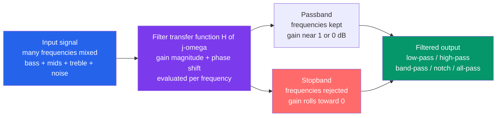

# 🎚️ Analog Filters and Frequency Response

> [!abstract] TL;DR
> A **filter** is a circuit whose response to a sinusoid depends on its frequency: it *passes* some frequencies (the **passband**) and *attenuates* others (the **stopband**). All of this behavior is captured by one complex function, the **transfer function** $H(j\omega) = \frac{\text{output phasor}}{\text{input phasor}}$, whose **magnitude** is the gain and whose **angle** is the phase shift at each frequency. The four basic shapes — **low-pass, high-pass, band-pass, band-stop/notch** — plus the $-3\text{ dB}$ **cutoff**, the filter **order** (steepness, $-20\text{ dB/decade}$ per pole), and the **Bode plot** (log-magnitude and phase vs log frequency) are the entire vocabulary of frequency-domain signal conditioning — from anti-aliasing before an ADC to a radio picking one station out of the air.

## Intuition — analogy FIRST

A filter is a **bouncer for frequencies**. Every signal arriving at the door is really a *crowd* of many frequencies mixed together, and the filter checks each one and decides who gets through. A **low-pass** filter waves through the slow, heavy bass and turns away the fast, jittery treble; a **high-pass** does the opposite; a **band-pass** admits only one chosen band — which is *exactly* how a radio tuner picks ONE station out of the crowded airwaves while rejecting all the others.

Every graphic equalizer slider, every radio dial, every noise-cleaning circuit, and every "smoothing" capacitor is a filter deciding which frequencies live and which die. Once you can look at a circuit and *see* the frequencies it keeps and kills, you have stopped thinking in the time domain and started thinking in the **frequency domain** — the native language of audio, radio, control, and communications.

---

## How It Works

A linear circuit driven by a sinusoid $V_{\text{in}}\cos(\omega t)$ responds, in steady state, with another sinusoid at the *same* frequency but a different amplitude and phase. Represent each sinusoid as a **phasor** (a complex amplitude), and the entire circuit collapses to one complex number *per frequency*: the **transfer function**

$$H(j\omega) = \frac{V_{\text{out}}(j\omega)}{V_{\text{in}}(j\omega)}, \qquad |H(j\omega)| = \text{gain}, \quad \angle H(j\omega) = \text{phase shift}.$$

A **filter** is simply a circuit whose $H(j\omega)$ is *designed* to be large over some frequencies (passband) and small over others (stopband). The canonical first-order **RC low-pass**, for example, is a voltage divider between a resistor and a capacitor whose reactance $\frac{1}{j\omega C}$ shrinks as frequency rises:

$$H(j\omega) = \frac{1}{1 + j\omega R C}, \qquad \omega_c = \frac{1}{RC}.$$

At low $\omega$ the capacitor is effectively open and $H \to 1$ (pass); at high $\omega$ it shorts to ground and $H \to 0$ (block); at the **cutoff** $\omega_c$ the gain has fallen to $\frac{1}{\sqrt 2} \approx 0.707$, i.e. $-3\text{ dB}$ — the half-power point.



The magnitude and phase of $H(j\omega)$ are almost always drawn as a **Bode plot**: gain in decibels ($20\log_{10}|H|$) and phase in degrees, both against a **logarithmic** frequency axis. On that log-log canvas the first-order roll-off becomes a dead-straight line falling at $-20\text{ dB/decade}$, and each additional **pole** (each extra order) adds another $-20\text{ dB/decade}$ of steepness.

---

## Key Concepts / Details

### Secondary Level — The Four Filter Shapes and the Cutoff

Think of the frequency axis as a piano keyboard laid left (low) to right (high). A filter is a mask laid over those keys:

| Filter type | Keeps | Blocks | Everyday use |
|---|---|---|---|
| **Low-pass** | low frequencies | high frequencies | smoothing, bass, anti-aliasing, ripple removal |
| **High-pass** | high frequencies | low / DC | AC coupling, treble, removing drift |
| **Band-pass** | one middle band | everything else | radio tuning, isolating one instrument |
| **Band-stop / notch** | everything else | one narrow band | killing $50$/$60\text{ Hz}$ mains hum |
| **All-pass** | all (gain flat) | nothing | pure phase shaping / delay equalization |

The single most important number is the **cutoff (corner) frequency** $f_c$, the **$-3\text{ dB}$** point where output power has dropped to *half* of passband power (amplitude to $0.707$). Above (or below) it, the signal is "rolled off." Filters do not have a brick wall — they *taper*, and the sharpness of that taper is the filter's **order**.

### Undergraduate Level — Order, Roll-off, Bode Plots, Passive vs Active

**Order and roll-off.** A first-order filter (one reactive element, one **pole**) rolls off at $-20\text{ dB/decade}$ ($\approx -6\text{ dB/octave}$). Stack more poles and the roll-off steepens linearly: an $n$-th order filter falls at $-20n\text{ dB/decade}$. Sharper cutoff means you can pass a wanted band and crush a nearby unwanted one — at the cost of more parts, more phase lag, and (often) less-flat passband.

**Bode plots.** The universal way to visualize $H(j\omega)$: log-magnitude (dB) and phase (degrees) versus **log** frequency. Advantages: multiplying transfer functions becomes *adding* dB curves, wide frequency ranges fit on one plot, and asymptotes are straight lines whose slopes reveal the poles and zeros by inspection.

**Passive vs active.**

- **Passive filters (RLC)** — resistors, capacitors, inductors only. Simple, need no power, handle high power/frequency, but bulky **inductors**, and each stage **loads** the next so cascading is hard. Gain $\le 1$.
- **Active filters (op-amp + RC)** — replace inductors with an op-amp plus resistors and capacitors. They provide **gain**, **buffer** each stage (near-zero output impedance so stages cascade cleanly), and avoid inductors entirely. Standard topologies: **Sallen-Key** and **multiple-feedback (MFB)**. Limited by op-amp bandwidth and noise. See sibling *Operational_Amplifiers*.

**Resonance and Q.** A second-order stage adds a **quality factor** $Q$ (equivalently a damping ratio $\zeta = \frac{1}{2Q}$). Low damping produces a **resonant peak** near $\omega_0$ and a sharper corner; too little damping causes overshoot and ringing — the same $\omega_0, \zeta, Q$ trio from the RLC transient, now viewed in the frequency domain.

### Graduate Level — Poles, Zeros, and the Filter Approximations

**Poles and zeros / the $s$-plane.** Write $H(s)$ as a ratio of polynomials in $s = \sigma + j\omega$ (Laplace). **Zeros** (roots of the numerator) pull the magnitude *down* toward zero — a notch is a pair of zeros on the $j\omega$ axis. **Poles** (roots of the denominator) push the magnitude *up* and set roll-off; a pole near the $j\omega$ axis (high $Q$) gives a sharp resonant peak. Filter *design* is the art of placing poles and zeros; evaluating $H(s)$ along $s = j\omega$ recovers the frequency response.

**The classic approximations** — every practical filter is a polynomial that trades off passband flatness, stopband sharpness, and phase linearity:

| Approximation | Passband | Stopband | Roll-off sharpness | Phase / transient |
|---|---|---|---|---|
| **Butterworth** | maximally **flat** (no ripple) | monotonic | moderate | moderate overshoot |
| **Chebyshev I** | **ripple** | monotonic | **sharper** | worse phase, ringing |
| **Chebyshev II** | flat | ripple | sharper | — |
| **Elliptic / Cauer** | ripple | ripple | **sharpest** (least order) | worst phase |
| **Bessel / Thomson** | flat, gentle | shallow | gentlest | **linear phase**, best transient / no overshoot |

The universal law: **you cannot maximize flatness, sharpness, and phase linearity at once.** Butterworth is the "default"; Chebyshev/elliptic buy a steeper transition band with ripple; Bessel sacrifices sharpness to preserve waveform shape (constant group delay) — vital for audio pulses and data. This is the exact same **Bode/pole** machinery used for **control-system stability** and the direct ancestor of **digital (DSP) filter design**.

---

## Python Demo

```python
# Analog filters & frequency response, from transfer function to Bode plot to filtering.
#   (a) FIRST-ORDER: RC low-pass  H = 1/(1 + j*w*R*C)  vs high-pass, as BODE PLOTS
#       (magnitude in dB & phase vs log frequency), showing the -3 dB cutoff and
#       the -20 dB/decade roll-off.
#   (b) SECOND-ORDER low-pass for several Q/damping values -> resonant peak + steeper
#       -40 dB/decade roll-off, then DEMONSTRATE filtering: pass (low tone + high noise)
#       through a low-pass and watch the noise vanish in the time domain.
# Only numpy + matplotlib. Time-domain filtering uses the discrete RC recursion (no scipy).
import numpy as np
import matplotlib.pyplot as plt

fig, ax = plt.subplots(2, 2, figsize=(14, 10))

# ---------------------------------------------------------------
# (a) FIRST-ORDER RC LOW-PASS vs HIGH-PASS  (normalize RC = 1  ->  wc = 1 rad/s)
# ---------------------------------------------------------------
w  = np.logspace(-2, 2, 2000)      # 0.01 .. 100 rad/s (log axis)
wc = 1.0                           # cutoff = 1/(R*C)

H_lp = 1.0 / (1.0 + 1j * w / wc)           # low-pass
H_hp = (1j * w / wc) / (1.0 + 1j * w / wc) # high-pass

mag_lp = 20 * np.log10(np.abs(H_lp))
mag_hp = 20 * np.log10(np.abs(H_hp))
ph_lp  = np.angle(H_lp, deg=True)
ph_hp  = np.angle(H_hp, deg=True)

axm = ax[0, 0]
axm.semilogx(w, mag_lp, 'tab:blue',  lw=2, label="RC low-pass")
axm.semilogx(w, mag_hp, 'tab:red',   lw=2, label="RC high-pass")
axm.axhline(-3.0, color='gray', ls=':', lw=1)
axm.axvline(wc,   color='k',    ls='--', lw=0.8)
axm.text(1.15, -14, "cutoff wc = 1/RC", fontsize=9)
axm.text(0.012, -2, "-3 dB half-power line", fontsize=9, color='gray')
axm.text(8, -8, "-20 dB/decade", fontsize=9, color='tab:blue', rotation=-30)
axm.set_title("(a) First-Order Bode Magnitude")
axm.set_xlabel("frequency  w  [rad/s, log]"); axm.set_ylabel("|H|  [dB]")
axm.set_ylim(-40, 5); axm.grid(True, which='both', alpha=0.3); axm.legend(loc="center left")

axp = ax[0, 1]
axp.semilogx(w, ph_lp, 'tab:blue', lw=2, label="low-pass phase")
axp.semilogx(w, ph_hp, 'tab:red',  lw=2, label="high-pass phase")
axp.axvline(wc, color='k', ls='--', lw=0.8)
axp.text(1.15, 0, "at cutoff: -45 deg (LP)", fontsize=9)
axp.set_title("(a) First-Order Bode Phase")
axp.set_xlabel("frequency  w  [rad/s, log]"); axp.set_ylabel("phase  [degrees]")
axp.grid(True, which='both', alpha=0.3); axp.legend(loc="center right")

# ---------------------------------------------------------------
# (b) SECOND-ORDER LOW-PASS:  H = w0^2 / (w0^2 - w^2 + j*2*zeta*w0*w)
#     Small zeta (high Q) -> resonant peak; roll-off is -40 dB/decade (2 poles).
# ---------------------------------------------------------------
w0 = 1.0
axr = ax[1, 0]
for zeta, col in [(0.1, 'tab:red'), (0.3, 'tab:orange'),
                  (0.707, 'tab:green'), (1.0, 'tab:blue')]:
    H2  = w0**2 / (w0**2 - w**2 + 1j * 2 * zeta * w0 * w)
    Q   = 1.0 / (2 * zeta)
    axr.semilogx(w, 20*np.log10(np.abs(H2)), color=col, lw=2,
                 label=f"zeta={zeta:g}  (Q={Q:.2f})")
axr.axhline(-3.0, color='gray', ls=':', lw=1)
axr.axvline(w0,   color='k',    ls='--', lw=0.8)
axr.text(0.012, 12, "zeta=0.707 -> Butterworth\n(maximally flat, no peak)", fontsize=9)
axr.text(6, -14, "-40 dB/decade\n(2nd order)", fontsize=9, color='tab:blue')
axr.set_title("(b) Second-Order Low-Pass: resonant peak vs damping")
axr.set_xlabel("frequency  w  [rad/s, log]"); axr.set_ylabel("|H|  [dB]")
axr.set_ylim(-40, 20); axr.grid(True, which='both', alpha=0.3); axr.legend(loc="lower left")

# ---------------------------------------------------------------
# (b) FILTERING DEMO: (low 5 Hz tone + high 120 Hz noise + hiss) -> RC low-pass
#     Discrete RC low-pass:  y[n] = y[n-1] + alpha*(x[n] - y[n-1]),  alpha = dt/(RC+dt)
# ---------------------------------------------------------------
fs = 2000.0                     # sample rate (Hz)
t  = np.arange(0, 0.5, 1/fs)
clean = np.sin(2*np.pi*5*t)     # wanted low tone (5 Hz)
np.random.seed(0)
noisy = clean + 0.6*np.sin(2*np.pi*120*t) + 0.25*np.random.randn(t.size)  # + hiss

fc = 15.0                       # low-pass cutoff (Hz): keep 5 Hz, kill 120 Hz + hiss
dt = 1/fs
RC = 1.0 / (2*np.pi*fc)
alpha = dt / (RC + dt)
y = np.zeros_like(noisy)
y[0] = noisy[0]
for n in range(1, noisy.size):
    y[n] = y[n-1] + alpha * (noisy[n] - y[n-1])

axf = ax[1, 1]
axf.plot(t, noisy, color='0.7', lw=0.8, label="input: 5 Hz tone + 120 Hz noise + hiss")
axf.plot(t, y,     color='tab:blue', lw=2, label=f"after low-pass (fc={fc:g} Hz)")
axf.plot(t, clean, color='k', ls='--', lw=1.2, label="original 5 Hz tone (reference)")
axf.set_title("(b) Filtering in the time domain: noise removed")
axf.set_xlabel("time  t  [s]"); axf.set_ylabel("amplitude")
axf.set_xlim(0, 0.5); axf.grid(alpha=0.3); axf.legend(loc="upper right", fontsize=8)

plt.tight_layout()
plt.savefig("analog_filters_frequency_response.png", dpi=110)
print("Saved analog_filters_frequency_response.png")

# Numeric sanity checks
idx = np.argmin(np.abs(w - wc))
print(f"RC low-pass at cutoff: |H| = {np.abs(H_lp[idx]):.3f} "
      f"= {20*np.log10(np.abs(H_lp[idx])):.2f} dB (expect ~ -3 dB), "
      f"phase = {np.angle(H_lp[idx], deg=True):.1f} deg (expect -45)")
print(f"2nd-order zeta=0.1 peak gain ~ 1/(2*zeta) = {1/(2*0.1):.1f}x "
      f"= {20*np.log10(1/(2*0.1)):.1f} dB")
print(f"Noise power before filtering: {np.var(noisy-clean):.4f}, "
      f"after: {np.var(y-clean):.4f}  (should shrink a lot)")
```

Running it draws the four panels: the first-order low-pass and high-pass crossing at $-3\text{ dB}$ on the cutoff line and each falling at $-20\text{ dB/decade}$ with a $-45^\circ$ phase at the corner; the second-order panel showing a tall resonant peak for $\zeta = 0.1$ that flattens to the maximally-flat Butterworth curve at $\zeta = 0.707$ and rolls off at $-40\text{ dB/decade}$; and the filtering panel where the grey noisy input is cleaned back down to the dashed $5\text{ Hz}$ tone after the low-pass.

---

## Real-World Applications

- **Anti-aliasing before an ADC.** Every sampled system puts a low-pass filter ahead of the converter to remove energy above the Nyquist frequency, preventing high frequencies from *folding* into the band of interest. The bridge to sampling and DSP.
- **Radio / RF channel selection.** A band-pass filter (LC tank or SAW) tunes the receiver to one station's carrier band and rejects all others — the literal "bouncer" that makes a radio work.
- **Audio equalizers and loudspeaker crossovers.** EQ = a bank of band-pass/shelving filters; a crossover splits the signal into low-pass (woofer) and high-pass (tweeter) paths.
- **Mains-hum notch filters.** A narrow band-stop at $50$/$60\text{ Hz}$ removes power-line interference from ECG, audio, and instrumentation signals.
- **Power-supply ripple filtering.** An LC or RC low-pass smooths the rectified/switched ripple down to clean DC.
- **Sensor signal conditioning.** Band-pass or low-pass stages isolate the sensor's band and reject drift (high-pass to kill DC offset) and noise (low-pass) before amplification.
- **Control-loop compensation.** Lead/lag networks are all-pass-flavored filters that shape a loop's Bode plot for stability margin — see *Feedback_and_Control_Systems*.

---

## Common Pitfalls

- **Forgetting $H(j\omega)$ carries phase, not just gain.** The transfer function is *complex*: $|H|$ is the gain and $\angle H$ is the phase shift **per frequency**. Two filters with identical magnitude can distort a waveform completely differently if their phase differs.
- **Misreading the $-3\text{ dB}$ cutoff.** Cutoff is the **half-power** point ($|H| = 0.707$, not $0.5$). It is *not* where the filter "stops passing" — it is where roll-off begins; there is no brick wall.
- **Confusing the filter types.** Low-pass keeps low, high-pass keeps high, band-pass keeps a band, band-stop/**notch** removes a band, all-pass touches only phase. Draw the mask before choosing parts.
- **Underestimating order.** Roll-off is $-20\text{ dB/decade}$ **per pole/order**. A first-order filter cannot separate two nearby frequencies — you need higher order for a sharp transition, at the cost of parts, phase lag, and passband behavior.
- **Reading Bode plots on a linear axis.** Bode plots are **log-magnitude (dB) and phase vs LOG frequency** on purpose; the straight-line asymptotes and pole/zero slopes only appear on log-log.
- **Cascading passive stages without buffering.** Each passive RC **loads** the previous one, shifting the cutoff and killing gain. Active filters (op-amp buffered — Sallen-Key, MFB) solve this; that's *why* active filters exist.
- **Assuming inductors in active filters.** Active filters deliberately use **no inductors** — an op-amp plus R and C synthesizes the same poles, giving gain, buffering, and small size.
- **Picking the wrong approximation.** **Butterworth** = maximally flat passband; **Chebyshev** = passband ripple but sharper cutoff; **elliptic** = sharpest but ripple in both bands; **Bessel** = linear phase / no overshoot but gentle roll-off. Chasing sharpness (Chebyshev/elliptic) *ruins* phase and transient response — bad for pulses/audio; chasing flat phase (Bessel) *costs* selectivity. You cannot have all three.
- **Ignoring the resonant peak.** Too little damping (high $Q$) gives a gain peak near $\omega_0$ and time-domain overshoot/ringing. A "sharper" second-order corner and a nasty peak are the same coin.

---

## Related Concepts

- [[Transfer_Functions]] — a filter *is* a transfer function $H(s)$; evaluating it along $s = j\omega$ gives the frequency response and the Bode plot.
- [[Frequency_Spectrum]] — a filter reshapes the spectrum of a signal by multiplying it by $|H(j\omega)|$ frequency-by-frequency.
- [[Fourier_Transform]] — decomposes a signal into the very frequencies a filter then selectively keeps or rejects; filtering is multiplication in the frequency domain.
- [[Stability_Frequency_Response]] — formalizes how pole/zero locations set both stability and the shape of $|H(j\omega)|$.
- [[Bode_Nyquist_and_Loop_Shaping]] — the same log-magnitude/phase Bode machinery, applied to control-loop stability and margins.
- [[RC_RL_and_RLC_Transients]] — the time-domain twin: the RLC's $\omega_0$, $\zeta$, and $Q$ reappear here as the resonant peak and cutoff of a filter.
- [[Complex_Numbers_and_Functions]] — phasors and $H(j\omega)$ live in the complex plane; magnitude and angle are gain and phase.
- [[Digital_Filter_Design]] — the DSP descendant: analog approximations (Butterworth, Chebyshev) map to discrete IIR filters via the bilinear transform.

Sibling analog-electronics notes (in prose): *Operational_Amplifiers* provides the gain and buffering behind Sallen-Key and multiple-feedback active filters; *AC_Circuit_Analysis_and_Phasors* supplies the phasor/impedance foundation for $H(j\omega)$; *RC_RL_and_RLC_Transients* is the time-domain view of the same poles; *Fourier_and_Laplace_in_Circuits* generalizes the $s$-plane pole/zero picture; *Feedback_and_Control_Systems* reuses Bode plots and phase margin for stability.

---

## Review Questions

1. **(Secondary)** You want to remove a high-pitched hiss from a recording while keeping the vocals. Which of the four filter types do you reach for, and what does the "cutoff frequency" mean physically?
2. **(Undergraduate)** An RC low-pass has $R = 1.6\text{ k}\Omega$ and $C = 10\text{ nF}$. Find the cutoff frequency $f_c$. If you cascade two such stages (buffered) into a second-order filter, how does the roll-off slope change, and what happens to the gain at $f_c$?
3. **(Graduate)** You must pass a $10\text{ kHz}$ band and strongly reject a nearby $12\text{ kHz}$ interferer, but the signal is a data pulse whose *shape* must be preserved. Discuss the tradeoff between choosing an elliptic and a Bessel approximation in terms of pole placement in the $s$-plane, roll-off steepness, and group delay / phase linearity — and state which you would pick and why.

---

## Sources

- Sedra, A. & Smith, K. — *Microelectronic Circuits* (frequency response, active filters, transfer functions).
- Williams, A. & Taylor, F. — *Electronic Filter Design Handbook* (Butterworth/Chebyshev/elliptic/Bessel tables and design).
- Horowitz, P. & Hill, W. — *The Art of Electronics* (practical active and passive filter design).
- Van Valkenburg, M. — *Analog Filter Design* (approximation theory, poles and zeros, the $s$-plane).

---

#electrical-engineering #filters #frequency-response #bode-plot #butterworth
