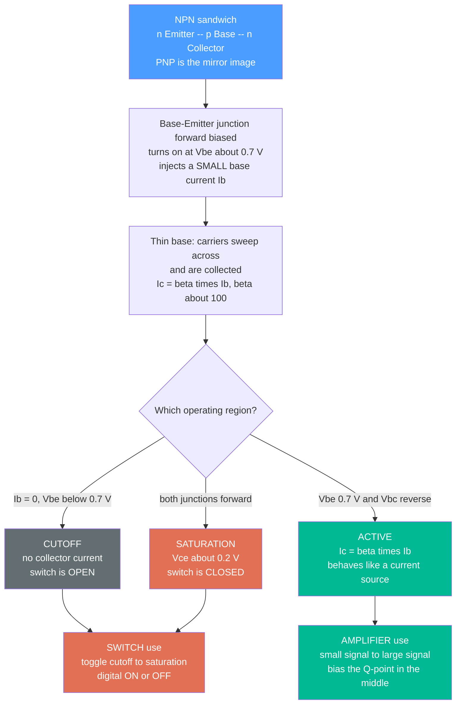

# 🎛️ Bipolar Junction Transistors

> [!abstract] TL;DR
> A **bipolar junction transistor (BJT)** is a three-terminal semiconductor device in which a **small base current controls a much larger collector current** ($I_C \approx \beta I_B$, with $\beta \approx 100$). That single property — **amplification** — lets a whisper of signal command a roar of power, making the BJT both a **linear amplifier** (in its active region) and a **switch** (toggling between cutoff and saturation). Invented in 1947 by Bardeen, Brattain, and Shockley, it replaced the vacuum tube and launched the electronic age; BJTs still dominate high-performance **analog, RF, and power** circuits, while [[Semiconductors_and_Devices|MOSFETs]] took over digital VLSI.

## Intuition — analogy FIRST

**A transistor is a faucet where a tiny trickle controls a firehose.** Turning the handle takes almost no effort — a gentle nudge of your wrist — yet it releases a torrent from the mains. In a BJT the *handle* is the **base**, the small effort is the **base current** $I_B$, and the torrent is the **collector current** $I_C$ gushing from collector to emitter. A whisper of input current commands a roar of output current — and if that output current is pushed through a resistor, a whisper of input *voltage* becomes a shout of output *voltage*.

That is **amplification**: the ability of a small input to control a large output. It is the single invention that made radio, computers, and all electronics possible, because a device that can amplify can also **switch fully on or fully off** — and chain a few of those switches together and you can build any logic gate. The transistor is to electronics what the lever is to mechanics: a way to make something small move something large.

---

## How It Works

### Core Mechanics

1. **A three-layer sandwich.** A BJT is a semiconductor stack of three doped regions: **NPN** (n-Emitter / p-Base / n-Collector) or its mirror image **PNP**. The middle layer — the **base** — is made *thin and lightly doped* on purpose.
2. **Bias the two junctions differently.** In normal amplifying operation the **base-emitter (BE) junction is forward-biased** (it turns on at $V_{BE} \approx 0.7$ V, like a [[p_n_Junctions_and_Diodes|diode]]) while the **base-collector (BC) junction is reverse-biased**.
3. **Carriers get swept across.** Forward bias injects a flood of carriers (electrons, for NPN) from the emitter into the thin base. Because the base is so thin, *almost all* of them shoot straight through and are swept into the collector by its reverse-biased field. Only a tiny fraction recombine and exit as base current.
4. **That ratio is the gain.** The result: $I_C = \beta \, I_B$, where $\beta$ (also written $h_{FE}$) is the **current gain**, typically 100–300. A 1 percent "leak" into the base commands the other 99 percent flowing collector-to-emitter.
5. **Three operating regions** emerge depending on how the junctions are biased — this is the whole story of the device (see diagram).

### Flow / Architecture



---

## Key Concepts

### Secondary Level

- **Three terminals:** **Emitter (E)**, **Base (B)**, **Collector (C)**. The base is the control knob.
- **The one equation to remember:** $I_C = \beta \, I_B$. A tiny base current makes a big collector current.
- **Turn-on voltage:** the base-emitter "diode" needs about **0.7 V** to conduct — below that, the transistor is off.
- **Two jobs:** an **amplifier** (make a small signal bigger) and a **switch** (fully on or fully off, the heart of early digital logic).
- **NPN vs PNP:** NPN turns on with a *positive* base voltage and passes current downward (C to E); PNP is the upside-down mirror. NPN is the more common workhorse.

### Undergraduate Level

- **The three regions** (memorise these — every BJT problem starts by identifying which one you are in):
  - **Cutoff:** $V_{BE} < 0.7$ V $\Rightarrow I_B \approx 0 \Rightarrow I_C \approx 0$. Transistor is an **open switch**.
  - **Forward-active:** BE forward, BC reverse $\Rightarrow I_C = \beta I_B$. Acts like a **current source** controlled by $I_B$; this is where **linear amplification** happens.
  - **Saturation:** both junctions forward $\Rightarrow V_{CE} \approx 0.2$ V, and $I_C < \beta I_B$ (current limited by the external circuit). Transistor is a **closed switch**.
- **Biasing and the Q-point:** DC bias resistors set a stable **quiescent operating point** $(V_{CE,Q}, I_{C,Q})$ in the middle of the active region so the signal can swing both up and down without hitting cutoff or saturation.
- **Load line:** KVL around the output loop gives $V_{CC} = I_C R_C + V_{CE}$, a straight line on the $I_C$–$V_{CE}$ plane; the Q-point is where it crosses the chosen base-current curve.
- **Small-signal model:** for tiny wiggles about the Q-point, the BJT linearises to a **transconductance** $g_m = I_{C,Q}/V_T$ (with thermal voltage $V_T \approx 26$ mV) and an **input resistance** $r_\pi = \beta / g_m$.
- **Common-emitter voltage gain:** $A_v \approx -g_m R_C$ — large and **inverting** (the minus sign). This is the workhorse amplifier.
- **The three configurations:**
  - **Common-emitter (CE):** high voltage gain, inverting — the general-purpose amplifier.
  - **Common-collector / emitter-follower:** voltage gain $\approx 1$, high input impedance, low output impedance — a **buffer** that delivers current without loading the source.
  - **Common-base (CB):** current gain $\approx 1$, excellent high-frequency behaviour — a current buffer used in RF.

### Graduate Level

- **Ebers–Moll / Gummel–Poon models:** the full large-signal description, $I_C = I_S\!\left(e^{V_{BE}/V_T} - 1\right)$, capturing all regions from one exponential; the basis of SPICE BJT models.
- **The Early effect:** finite output resistance $r_o = V_A / I_C$ from base-width modulation (Early voltage $V_A$), which makes the "flat" active curves gently slope upward and caps amplifier gain at $A_v \le -V_A/V_T$.
- **Frequency limits:** transit time and junction capacitances set the transition frequency $f_T$ (unity current gain) and $f_{max}$; the Miller effect on $C_\mu$ dominates CE bandwidth.
- **IC building blocks:** the **differential pair** (two matched BJTs sharing a tail current — the input stage of every op-amp) and the **current mirror** (copying a reference current using matched $V_{BE}$) are the atoms of analog integrated circuits.
- **Thermal behaviour:** $V_{BE}$ falls about 2 mV/°C at fixed current, so a hotter transistor draws more current, which heats it further — the seed of **thermal runaway**, tamed with emitter degeneration resistors and $V_{BE}$-tracking bias.
- **BJT vs MOSFET trade-off:** BJTs offer higher $g_m$ per unit current and lower offset (great for precision analog, RF, and power), while MOSFETs' near-zero gate current and superior scaling won them digital VLSI. **BiCMOS** blends both on one die.

---

## Python Demo

```python
# Bipolar Junction Transistor (NPN, common-emitter):
#   (a) OUTPUT CHARACTERISTICS  Ic vs Vce for a family of base currents Ib,
#       showing cutoff / active (flat, Ic ~ beta*Ib) / saturation, plus the
#       load line and the Q-point (DC operating point).
#   (b) COMMON-EMITTER AMPLIFIER small-signal voltage gain Av = -gm*Rc,
#       plotting input sinusoid vs the amplified, INVERTED output, and showing
#       how a too-large input (or bad bias) drives the output into CLIPPING.
import numpy as np
import matplotlib.pyplot as plt

# ---- Device + circuit parameters ----
beta     = 100.0     # current gain (hFE):  Ic ~ beta * Ib
VA       = 80.0      # Early voltage (V): gentle upward slope in the active region
Vcc      = 10.0      # supply voltage (V)
Rc       = 1000.0    # collector load resistor (ohms)
VT       = 0.026     # thermal voltage kT/q at 300 K (V)
Vce_knee = 0.2       # saturation knee (V): below this the device saturates

# ---------- (a) OUTPUT CHARACTERISTICS ----------
Vce     = np.linspace(0, Vcc, 400)                    # collector-emitter sweep
Ib_list = np.array([10, 20, 30, 40, 50, 60]) * 1e-6   # base currents (A)

def Ic_model(Vce, Ib):
    # (1 - exp) pins Ic -> 0 near Vce=0 (saturation) then rises to the active plateau;
    # (1 + Vce/VA) is the Early-effect slope of the "flat" active region.
    return beta * Ib * (1.0 - np.exp(-Vce / Vce_knee)) * (1.0 + Vce / VA)

# Load line from KVL:  Vcc = Ic*Rc + Vce  ->  Ic = (Vcc - Vce)/Rc
Ic_loadline = (Vcc - Vce) / Rc

# Q-point: choose base bias so the transistor sits mid-supply (max symmetric swing)
IbQ  = 50e-6
IcQ  = beta * IbQ                 # ~ 5 mA (active region)
VceQ = Vcc - IcQ * Rc             # ~ 5 V  (mid-supply)

fig, ax = plt.subplots(1, 2, figsize=(15, 5.5))

for Ib in Ib_list:
    ax[0].plot(Vce, Ic_model(Vce, Ib) * 1e3, label=f"Ib = {Ib*1e6:.0f} uA")
ax[0].plot(Vce, Ic_loadline * 1e3, 'k--', lw=2,
           label=f"load line (Vcc={Vcc:g}V, Rc={Rc/1e3:g}k)")
ax[0].plot(VceQ, IcQ * 1e3, 'ro', ms=11, zorder=5)
ax[0].annotate(f"Q-point\n({VceQ:.1f} V, {IcQ*1e3:.1f} mA)", (VceQ, IcQ*1e3),
               textcoords="offset points", xytext=(14, 14), fontsize=9,
               arrowprops=dict(arrowstyle="->"))
ax[0].axvspan(0, Vce_knee, color='orange', alpha=0.18)
ax[0].text(0.25, 9.2, "SATURATION\nswitch ON", fontsize=8, color='darkorange')
ax[0].text(5.3, 6.7, "ACTIVE (amplify)\nIc ~ beta*Ib", fontsize=9, color='green')
ax[0].text(3.4, 0.35, "CUTOFF (Ib=0): Ic ~ 0, switch OFF", fontsize=8, color='gray')
ax[0].set_xlabel("Collector-emitter voltage  Vce  [V]")
ax[0].set_ylabel("Collector current  Ic  [mA]")
ax[0].set_title("(a) BJT Output Characteristics + Load Line")
ax[0].set_xlim(0, Vcc); ax[0].set_ylim(0, 11)
ax[0].legend(fontsize=8, loc='upper right'); ax[0].grid(True, alpha=0.3)

# ---------- (b) COMMON-EMITTER AMPLIFIER (small signal) ----------
gm  = IcQ / VT           # transconductance (S):  gm = Ic / VT
rpi = beta / gm          # base input resistance (ohms)
Av  = -gm * Rc           # small-signal voltage gain (large, INVERTING)

f   = 1000.0                             # signal frequency (Hz)
t   = np.linspace(0, 3.0 / f, 1000)      # 3 periods
vin_small = 0.005 * np.sin(2*np.pi*f*t)  # 5 mV  input -> stays linear
vin_big   = 0.040 * np.sin(2*np.pi*f*t)  # 40 mV input -> overdrives -> clips

# Output = DC operating point + gain*input, physically clipped by the rails
vo_clean = np.clip(VceQ + Av*vin_small, Vce_knee, Vcc)
vo_clip  = np.clip(VceQ + Av*vin_big,   Vce_knee, Vcc)

axb = ax[1]
axr = axb.twinx()                         # input in mV on the right axis
l1, = axr.plot(t*1e3, vin_small*1e3, color='tab:blue',  lw=1.8,
               label="input vin (5 mV)")
l2, = axb.plot(t*1e3, vo_clean,      color='tab:green', lw=2.2,
               label=f"output clean (Av={Av:.0f}, inverted)")
l3, = axb.plot(t*1e3, vo_clip,       color='tab:red',   lw=2, ls='--',
               label="output for 40 mV in -> CLIPPED")
axb.axhline(VceQ, color='gray', ls=':', lw=1)
axb.set_xlabel("time  [ms]")
axb.set_ylabel("output voltage  Vout  [V]")
axr.set_ylabel("input voltage  vin  [mV]", color='tab:blue')
axr.tick_params(axis='y', labelcolor='tab:blue')
axb.set_title("(b) Common-Emitter Amplifier: amplified + inverted output")
axb.set_ylim(0, Vcc)
axb.legend(handles=[l1, l2, l3], fontsize=8, loc='upper right')
axb.grid(True, alpha=0.3)

plt.tight_layout()
plt.savefig("bjt_characteristics_amplifier.png", dpi=120)
plt.show()

# ---- Numerical summary ----
print(f"Q-point:  IbQ={IbQ*1e6:.0f} uA, IcQ={IcQ*1e3:.2f} mA, VceQ={VceQ:.2f} V")
print(f"gm  = IcQ/VT   = {gm*1e3:.1f} mS")
print(f"rpi = beta/gm  = {rpi:.0f} ohm")
print(f"Av  = -gm*Rc   = {Av:.1f}  (magnitude {abs(Av):.0f}, inverting)")
print(f"5 mV input  -> {abs(Av)*0.005:.2f} V swing  (linear, no clipping)")
print(f"40 mV input -> {abs(Av)*0.040:.2f} V demanded -> hits rails -> CLIPS")
```

The green output is a faithful, ~190x-larger, upside-down copy of the blue input (the minus sign in $A_v=-g_mR_C$ is why the common-emitter stage **inverts**). The red trace shows what happens when the input is too big for the Q-point's headroom: the output flattens against the supply rail and saturation floor — **clipping**, the audible/visible signature of an over-driven or badly biased amplifier.

---

## Real-World Applications

- **Audio power amplifiers** — the output stage of most hi-fi and guitar amps uses complementary NPN/PNP BJTs (a push-pull emitter-follower) to deliver watts of current into a speaker with low distortion; their soft clipping is the classic "warm" overdrive tone.
- **RF and wireless front-ends** — heterojunction bipolar transistors (HBTs, SiGe/GaAs) power the transmit amplifiers in phones and base stations, where the BJT's high $g_m$ and $f_T$ beat MOSFETs at microwave frequencies.
- **Bandgap voltage references** — nearly every chip's precision reference exploits the predictable $V_{BE}$ and its temperature coefficient across matched BJTs to synthesise a stable ~1.2 V independent of temperature.
- **Op-amp input stages** — the differential pair and current mirror at the heart of classic bipolar op-amps (e.g., the 741) are pure BJT circuits; the transistor's low offset gives precision analog its accuracy.
- **Power switching and motor drive** — insulated-gate bipolar transistors (IGBTs), a BJT-MOSFET hybrid, switch hundreds of amps in EV inverters, trains, and industrial drives.
- **Early digital logic** — TTL (transistor-transistor logic), which ran minicomputers and the Apollo-era digital world, used BJTs slammed between cutoff and saturation as ones and zeros.

---

## Common Pitfalls

- **Forgetting the BJT is CURRENT-controlled.** Unlike a voltage-controlled [[Semiconductors_and_Devices|MOSFET]], a BJT's collector current is set by the *base current*: $I_C = \beta I_B$ with $\beta$ (a.k.a. $h_{FE}$) around 100. Design around $I_B$ and base current supply, not just base voltage.
- **Treating $\beta$ as a precise constant.** $\beta$ varies wildly (2:1 or more) with device, temperature, and current. Good bias circuits use **negative feedback** (an emitter resistor) so the Q-point barely depends on $\beta$ — never rely on a nominal $\beta$ for a stable operating point.
- **Confusing the three regions.** **Cutoff** = off = open switch ($I_C \approx 0$); **active** = amplifier ($I_C = \beta I_B$, $V_{BE}\approx0.7$ V); **saturation** = fully on = closed switch ($V_{CE}\approx0.2$ V). A "transistor that won't amplify" is usually accidentally saturated or in cutoff because the bias is wrong.
- **Biasing the Q-point off-center.** For undistorted linear amplification the DC operating point must sit in the middle of the active region. Bias too close to saturation or cutoff and one half of the waveform **clips** — exactly the red trace in the demo.
- **Mixing up large-signal and small-signal models.** Use the exponential $I_C$–$V_{BE}$ (Ebers–Moll) for DC bias, but switch to the *linearised* small-signal model ($g_m=I_C/V_T$, $r_\pi=\beta/g_m$) for gain and impedance. Applying one where the other belongs is a classic exam mistake.
- **Choosing the wrong configuration.** Want voltage gain? **Common-emitter** (but it inverts). Need to drive a heavy load without loading the source? **Common-collector / emitter-follower** (buffer, gain ≈ 1). High frequency current buffer? **Common-base**. Reaching for a CE stage as a buffer, or an emitter-follower for gain, is a design error.
- **Ignoring thermal runaway.** Because $V_{BE}$ drops ~2 mV/°C, a self-heating power BJT can spiral into ever-more current and destroy itself; emitter degeneration resistors and heatsinking are mandatory in power stages.
- **NPN/PNP polarity slips.** NPN and PNP need opposite supply polarities and current directions. Swapping them (or the emitter/collector, which are *not* symmetric) gives a dead or barely-working circuit.

---

## Related Concepts

- [[Semiconductors_and_Devices]] — the underlying device physics: doping, the p-n junction, and how two back-to-back junctions form a BJT; also introduces the MOSFET that BJTs are contrasted against.
- [[p_n_Junctions_and_Diodes]] — a BJT is literally two p-n junctions sharing a thin base; the 0.7 V base-emitter turn-on *is* a forward-biased diode.
- [[Semiconductors_Intrinsic_and_Extrinsic]] — the n-type and p-type doping that defines the emitter, base, and collector layers.
- [[Crystal_Structure_and_Band_Theory]] — band gaps and carrier transport that set carrier injection and $\beta$.
- [[Electrical_Engineering_Overview]] — places the transistor as the "active" device that makes amplification (impossible with passives alone) possible across all of EE.
- [[Boolean_Algebra_and_Logic_Gates]] — the switch-mode BJT (cutoff ↔ saturation) is the physical realisation of a logic 0/1; TTL logic was built from exactly this.
- [[Combinational_Circuits]] — logic gates and adders that emerge once transistors act as controllable switches.
- [[RC_RL_and_RLC_Transients]] — the coupling and bypass capacitor networks around a BJT amplifier obey exactly this transient/frequency behaviour.

*Sibling notes in this Analog Electronics section (prose references, to be built): Semiconductor_Devices_and_Diodes, MOSFETs_and_CMOS, Operational_Amplifiers, Oscillators_and_Feedback_Amplifiers, and Analog_Filters_and_Frequency_Response.*

---

## Review Questions

1. **(Secondary)** Using the "faucet" analogy, explain why a BJT is called an *amplifier* even though it does not create energy. Where does the extra output power actually come from, and what plays the role of the "mains" pressure behind the faucet?
2. **(Undergraduate)** A common-emitter stage has $V_{CC}=10$ V, $R_C=1$ kΩ, and is biased at $I_{C,Q}=5$ mA. (a) Find the Q-point $V_{CE,Q}$ and confirm it is in the active region. (b) Compute $g_m$ and the small-signal gain $A_v=-g_mR_C$. (c) What is the largest input amplitude before the output clips, and would raising $R_C$ increase gain indefinitely? Explain using the load line and the Early effect.
3. **(Graduate)** You must design (a) a precision instrumentation input, (b) a 2 GHz RF power amplifier, and (c) a million-gate digital logic block. For each, argue whether you would reach for a BJT or a MOSFET, citing transconductance-per-current, input impedance, gate/base current, offset, and scaling. Then explain why a bandgap reference and a current mirror both rely on *matched* $V_{BE}$ rather than absolute $V_{BE}$.

---

## Sources

- Sedra, A. & Smith, K. — *Microelectronic Circuits* (Oxford) — the canonical treatment of BJT operation, biasing, small-signal models, and the three configurations.
- Razavi, B. — *Fundamentals of Microelectronics* (Wiley) — intuition-first BJT physics, Ebers–Moll, and amplifier design.
- Horowitz, P. & Hill, W. — *The Art of Electronics*, 3rd ed. (Cambridge) — the practitioner's bible: biasing rules of thumb, emitter followers, and real-world transistor circuits.
- Gray, P., Hurst, P., Lewis, S. & Meyer, R. — *Analysis and Design of Analog Integrated Circuits* (Wiley) — differential pairs, current mirrors, and the Early/Gummel–Poon models for IC design.
- Sze, S. & Ng, K. — *Physics of Semiconductor Devices* (Wiley) — the device-physics foundation of carrier injection and current gain.

---

#electrical-engineering #bjt #transistors #amplifiers #common-emitter
