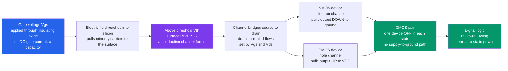

# ⚡ MOSFETs and CMOS

> [!abstract] TL;DR
> A **MOSFET** is a switch you throw with a *voltage*, not a current: a voltage on an **insulated gate** builds an electric field that, above a **threshold** $V_{th}$, *inverts* the silicon surface into a conducting **channel** between source and drain. Because the gate is a capacitor, it draws essentially **no DC current** — so you can control a transistor for almost free. **CMOS** wires a complementary **NMOS** pull-down against a **PMOS** pull-up so that in *either* logic state one device is off, dissipating **near-zero static power** — power is burned only while switching ($P \approx CV^2 f$). That single efficiency trick is *why* CMOS won digital electronics and made Moore's Law possible: every CPU, GPU, DRAM, and phone is a city of **billions** of MOSFETs, the most-manufactured device in human history.

## Intuition — analogy FIRST

Picture an **electrically-controlled sluice gate** in a canal. Water (electric current) wants to flow from an upstream reservoir (the **source**) to a downstream one (the **drain**), but a gate blocks the channel. Now here is the trick: you do not lift the gate with your hands — you hold a **charged plate** *above* the water. Raise the plate's voltage high enough and its electric field reaches down and pulls a conducting **channel** of water into being beneath it; drop the voltage and the channel vanishes. You never touch the water and you spend almost no energy holding the gate open — just a *voltage*, like charging a capacitor.

That is a MOSFET. The **gate** is separated from the silicon by a glass-thin insulating **oxide**, so no current flows *into* the gate — it is a pure voltage command. This voltage control and near-zero holding power is the whole reason you can pack **billions** of MOSFETs onto a fingernail-sized chip that sips power. Every processor, every memory cell, every phone is a vast city of MOSFETs switching on and off billions of times a second.

---

## How It Works

A MOSFET has **four** terminals: **gate (G)**, **source (S)**, **drain (D)**, and **body/substrate (B)**. The gate sits on a thin **oxide** (traditionally SiO$_2$) over the semiconductor — a tiny parallel-plate capacitor. Apply a gate-to-source voltage $V_{GS}$ and its field pushes majority carriers away and pulls **minority** carriers toward the surface. Once $V_{GS}$ exceeds the **threshold voltage** $V_{th}$, the surface **inverts**: for an **NMOS** built in a p-type body, a thin sheet of **electrons** appears, forming an n-type **channel** that links the n-type source and drain. Now a drain-to-source voltage $V_{DS}$ can drive current $I_D$ through that channel. A **PMOS** is the mirror image: holes, an n-type body, and voltages reversed.

Combine one NMOS with one PMOS and you get **CMOS**. Tie their gates together as the input and their drains together as the output: a high input turns the NMOS on (pulling the output to ground) while the PMOS is off; a low input does the reverse. In *both* steady states exactly one transistor conducts and the other blocks, so there is no direct path from supply to ground — hence **near-zero static power**.



---

## Key Concepts / Details

### Secondary Level — The MOSFET as a Voltage-Controlled Switch

The plainest picture: a MOSFET is a switch controlled by the gate **voltage**, not a gate current.

- **Insulated gate.** The gate is separated from the channel by an oxide, so in DC steady state **no current flows into the gate** — the input looks like a tiny capacitor with very high input impedance. This is the headline difference from a bipolar transistor, which *needs* base current.
- **Threshold voltage $V_{th}$.** Below it the transistor is **off** (cutoff, $I_D \approx 0$); above it a channel forms and current can flow. It is the "turn-on" knob.
- **NMOS vs PMOS.** An **NMOS** turns on with a *high* gate voltage and is good at pulling a node *down* to ground. A **PMOS** turns on with a *low* gate voltage and is good at pulling a node *up* to the supply $V_{DD}$. They are complements.
- **Enhancement vs depletion.** **Enhancement-mode** devices (the standard for digital logic) are off at $V_{GS}=0$ and must be *enhanced* on. **Depletion-mode** devices conduct at $V_{GS}=0$ and must be turned off.
- **Switch, not resistor.** In digital use we only care that it is fully **on** (low resistance) or fully **off** (open) — a clean 1/0.

### Undergraduate Level — Operating Regions and the Square Law

For an enhancement NMOS with overdrive $V_{ov} \equiv V_{GS} - V_{th}$, three regions describe the drain current:

| Region | Condition | Drain current $I_D$ | Behavior |
|---|---|---|---|
| **Cutoff** | $V_{GS} < V_{th}$ | $\approx 0$ | off; an open switch |
| **Triode / linear** | $V_{GS} > V_{th}$ and $V_{DS} < V_{ov}$ | $k\big[V_{ov}V_{DS} - \tfrac{1}{2}V_{DS}^2\big]$ | voltage-controlled **resistor** |
| **Saturation** | $V_{GS} > V_{th}$ and $V_{DS} \ge V_{ov}$ | $\tfrac{1}{2}k\,V_{ov}^2\,(1+\lambda V_{DS})$ | **square-law current source** |

where the transconductance parameter $k = \mu C_{ox}\dfrac{W}{L}$ collects mobility $\mu$, oxide capacitance per area $C_{ox}$, and the device's width-to-length ratio $W/L$.

- In **triode**, for small $V_{DS}$ the $V_{DS}^2$ term is negligible and $I_D \approx k\,V_{ov}\,V_{DS}$ — the device acts like a **resistor** whose conductance you tune with $V_{GS}$. This is the "on" switch state and the basis of transmission gates.
- In **saturation**, the channel "pinches off" at the drain and $I_D$ becomes almost independent of $V_{DS}$: a **current source** obeying the famous **square law** $I_D \propto (V_{GS}-V_{th})^2$. This is the amplifying region.
- **Transconductance** $g_m = \dfrac{\partial I_D}{\partial V_{GS}} = k\,V_{ov} = \sqrt{2k\,I_D}$ measures how strongly the gate voltage steers the current — the gain knob for analog amplifiers.
- **Channel-length modulation** ($\lambda$) gives saturation a slight upward slope, setting the transistor's finite output resistance $r_o = 1/(\lambda I_D)$.

**The CMOS inverter** is the atom of digital logic. Its **voltage transfer characteristic (VTC)** — output vs input — is nearly flat at $V_{DD}$ for low inputs, flat at $0$ for high inputs, and switches **sharply** through a high-gain transition near $V_{DD}/2$. The steepness gives **noise margins**: how much a logic level can be corrupted before it flips. Crucially, DC current from supply to ground flows *only* during the brief transition (the **crowbar** or **short-circuit** current), so the static power is essentially leakage.

### Graduate Level — Physics, Power, and Scaling

- **Surface-potential / inversion physics.** Threshold is reached when the surface band-bending equals twice the bulk potential $2\phi_F$; $V_{th} = V_{FB} + 2\phi_F + \dfrac{\sqrt{2\varepsilon_s q N_A(2\phi_F)}}{C_{ox}}$. The **body effect** raises $V_{th}$ when the source is biased above the body — the body acts as a **back-gate**, which is why the fourth terminal matters.
- **Dynamic power dominates CMOS.** Switching a node of capacitance $C$ over a rail $V_{DD}$ at frequency $f$ dissipates $P_{dyn} = \alpha C V_{DD}^2 f$ (activity factor $\alpha$), plus short-circuit and leakage terms. The $V_{DD}^2$ dependence is why lowering supply voltage is the single most powerful energy lever.
- **Dennard scaling and its end.** For decades, shrinking a MOSFET let you cut $V_{DD}$ and keep the electric field — and thus power density — constant while packing more transistors (Moore's Law). Around the mid-2000s $V_{th}$ and $V_{DD}$ could no longer scale down without **subthreshold leakage** exploding, so **static power** stopped being negligible — the end of Dennard scaling, and the pivot to multicore.
- **Short-channel effects.** As $L$ shrinks toward nanometers: drain-induced barrier lowering (DIBL), velocity saturation, punch-through, and gate-oxide tunneling degrade the ideal square law. Fixes drove **high-k/metal-gate** stacks, then **FinFET** (a 3-D fin wrapped by the gate on three sides), and now **gate-all-around (GAA) nanosheets** that wrap the channel completely for better electrostatic control.
- **Analog MOSFETs.** Biased in saturation, the MOSFET is a transconductance amplifier ($g_m$) — the core device of op-amps, RF front-ends, and mixed-signal ICs. **Power MOSFETs** (vertical DMOS, trench, LDMOS, plus GaN/SiC variants) switch large currents efficiently in supplies, motor drives, and inverters, prized for their fast, voltage-driven, no-holding-current gate.
- **MOSFET vs BJT.** MOSFET = **voltage-controlled**, high input impedance, square-law, superb as a low-power switch and dense to integrate. BJT = **current-controlled**, exponential $I_C$–$V_{BE}$, higher $g_m$ per unit current and better matching — favored in some precision analog and high-speed roles. CMOS's static-power advantage is why *digital* VLSI is overwhelmingly MOSFET.

---

## Python Demo

```python
# MOSFETs and CMOS, visualized two ways:
#   (a) MOSFET I-V: drain current Id vs Vds for several gate voltages Vgs,
#       showing the TRIODE (resistor-like) and SATURATION (square-law) regions.
#   (b) CMOS INVERTER: complementary NMOS + PMOS -> voltage transfer
#       characteristic (Vout vs Vin), rail-to-rail swing, noise margins,
#       and the tiny "crowbar" current spike only during the transition
#       (near-ZERO static power -- the reason CMOS won).
# Only numpy + matplotlib. Current balance solved by hand-rolled bisection.
import numpy as np
import matplotlib.pyplot as plt

# ---- device parameters (normalized units) ------------------------
VDD   = 1.8          # supply rail (volts)
Vth   = 0.4          # threshold voltage magnitude, same for NMOS and PMOS
k     = 1.0e-3       # transconductance param k = mu*Cox*(W/L)  (A/V^2)
lam   = 0.05         # channel-length modulation (1/V)

def id_nmos(vgs, vds):
    """NMOS drain current (square-law model), source at 0."""
    vov = vgs - Vth
    if vov <= 0.0:                       # cutoff
        return 0.0
    if vds < vov:                        # triode / linear
        return k * (vov * vds - 0.5 * vds * vds)
    # saturation (with channel-length modulation)
    return 0.5 * k * vov * vov * (1.0 + lam * vds)

def id_pmos(vsg, vsd):
    """PMOS current magnitude, source at VDD; symmetric to NMOS."""
    vov = vsg - Vth
    if vov <= 0.0:
        return 0.0
    if vsd < vov:
        return k * (vov * vsd - 0.5 * vsd * vsd)
    return 0.5 * k * vov * vov * (1.0 + lam * vsd)

# ---- (a) MOSFET output characteristics --------------------------
vds_axis = np.linspace(0, VDD, 400)
vgs_set  = [0.6, 0.9, 1.2, 1.5, 1.8]

fig, (axA, axB, axC) = plt.subplots(1, 3, figsize=(17, 5))

for vgs in vgs_set:
    curve = np.array([id_nmos(vgs, vd) for vd in vds_axis]) * 1e3  # mA
    axA.plot(vds_axis, curve, label=f"Vgs = {vgs:.1f} V")
    # mark the triode/saturation boundary Vds = Vgs - Vth
    vov = vgs - Vth
    if vov > 0:
        axA.plot(vov, id_nmos(vgs, vov) * 1e3, 'ko', ms=4)

axA.plot([], [], 'ko', ms=4, label="Vds = Vgs - Vth (pinch-off)")
axA.set_title("(a) NMOS I-V:  triode vs saturation (square law)")
axA.set_xlabel("drain-source voltage  Vds  [V]")
axA.set_ylabel("drain current  Id  [mA]")
axA.text(0.05, 0.9*axA.get_ylim()[1] if False else 0.02,
         "left of dots: TRIODE (resistor-like)\nright of dots: SATURATION (Id ~ (Vgs-Vth)^2)",
         fontsize=8, va="bottom")
axA.legend(loc="upper left", fontsize=8)
axA.grid(alpha=0.3)

# ---- (b) CMOS inverter VTC via current balance ------------------
def cmos_solve(vin):
    """Find Vout where NMOS pulldown current == PMOS pullup current."""
    def f(vout):
        i_n = id_nmos(vin, vout)                 # NMOS: Vgs=Vin,   Vds=Vout
        i_p = id_pmos(VDD - vin, VDD - vout)     # PMOS: Vsg=VDD-Vin, Vsd=VDD-Vout
        return i_n - i_p                          # monotone increasing in Vout
    lo, hi = 0.0, VDD
    for _ in range(60):                           # bisection
        mid = 0.5 * (lo + hi)
        if f(mid) > 0.0:
            hi = mid
        else:
            lo = mid
    vout = 0.5 * (lo + hi)
    icrow = id_nmos(vin, vout)                     # supply-to-ground current
    return vout, icrow

vin_axis = np.linspace(0, VDD, 500)
vout = np.zeros_like(vin_axis)
icrow = np.zeros_like(vin_axis)
for i, vin in enumerate(vin_axis):
    vout[i], icrow[i] = cmos_solve(vin)

# noise margins: find the two points where dVout/dVin = -1
slope = np.gradient(vout, vin_axis)
below = np.where(slope <= -1.0)[0]
VIL, VIH = vin_axis[below[0]], vin_axis[below[-1]]
VOH, VOL = vout[below[0]], vout[below[-1]]
NMH = VOH - VIH          # high noise margin
NML = VIL - VOL          # low noise margin

axB.plot(vin_axis, vout, color="tab:blue", lw=2, label="Vout (VTC)")
axB.plot([0, VDD], [0, VDD], 'k:', lw=0.8, label="Vout = Vin")
axB.axvline(VIL, color="gray", ls="--", lw=0.8)
axB.axvline(VIH, color="gray", ls="--", lw=0.8)
axB.plot(VIL, VOH, 'go', ms=6)
axB.plot(VIH, VOL, 'ro', ms=6)
axB.set_title("(b) CMOS inverter VTC: sharp, rail-to-rail switch")
axB.set_xlabel("input voltage  Vin  [V]")
axB.set_ylabel("output voltage  Vout  [V]")
axB.text(0.03, 0.30, f"VIL = {VIL:.2f} V\nVIH = {VIH:.2f} V\nNMH = {NMH:.2f} V\nNML = {NML:.2f} V",
         fontsize=8, va="top",
         bbox=dict(boxstyle="round", fc="white", ec="gray", alpha=0.8))
axB.legend(loc="upper right", fontsize=8)
axB.grid(alpha=0.3)

axC.plot(vin_axis, icrow * 1e6, color="tab:red", lw=2)
axC.fill_between(vin_axis, icrow * 1e6, color="tab:red", alpha=0.25)
axC.set_title("(c) Crowbar current: burned ONLY while switching")
axC.set_xlabel("input voltage  Vin  [V]")
axC.set_ylabel("supply-to-ground current  [uA]")
axC.text(0.03, 0.92 * axC.get_ylim()[1] if False else axC.get_ylim()[1]*0.0 + 1,
         "flat ~0 at both rails -> near-ZERO static power\nspike near VDD/2 -> only dynamic (switching) power",
         fontsize=8, va="bottom")
axC.grid(alpha=0.3)

plt.tight_layout()
plt.savefig("mosfets_and_cmos.png", dpi=110)
print("Saved mosfets_and_cmos.png")

# numeric sanity checks
print(f"Vth = {Vth} V; at Vgs=1.8, pinch-off at Vds = Vgs-Vth = {1.8-Vth:.2f} V")
print(f"Peak crowbar current = {icrow.max()*1e6:.2f} uA at Vin ~ {vin_axis[icrow.argmax()]:.2f} V")
print(f"Static current at rails: Vin=0 -> {icrow[0]*1e9:.3f} nA, Vin=VDD -> {icrow[-1]*1e9:.3f} nA")
print(f"Noise margins: NMH = {NMH:.3f} V, NML = {NML:.3f} V (switch centered near VDD/2 = {VDD/2:.2f} V)")
```

Running it: panel (a) shows the classic MOSFET family of curves — each rising steeply in **triode** then flattening into **saturation** past the pinch-off dots, with higher $V_{GS}$ giving quadratically larger current (the square law). Panel (b) shows the inverter's **sharp, rail-to-rail** VTC snapping from $V_{DD}$ to $0$ around $V_{DD}/2$, with the noise-margin points marked. Panel (c) is the punchline: the supply-to-ground current is essentially **zero at both logic levels** and spikes only during the transition — visual proof of CMOS's near-zero static power.

---

## Real-World Applications

- **Every digital chip.** CPUs, GPUs, DRAM, NAND flash, FPGAs, and microcontrollers are built from CMOS logic — literally billions of MOSFETs per die switching at gigahertz. CMOS's static-power efficiency is the enabling reason.
- **Memory.** DRAM stores a bit as charge on a capacitor gated by one **access transistor**; SRAM cells are six-MOSFET (6T) latches; flash uses **floating-gate** MOSFETs that trap charge to hold data without power.
- **Analog and RF.** MOSFETs biased in saturation form the input pairs and gain stages of op-amps, ADCs/DACs, LNAs, mixers, and PLLs in every mixed-signal SoC and radio.
- **Power electronics.** Power MOSFETs (and GaN/SiC FETs) switch supplies, DC-DC converters, motor drives, EV inverters, and USB-C chargers — fast, voltage-driven, low gate-drive energy.
- **Image sensors and displays.** CMOS image sensors put a MOSFET amplifier at every pixel; TFT MOSFETs on glass drive every subpixel in LCD and OLED panels.
- **Moore's Law itself.** The MOSFET's voltage control, scalability, and CMOS low power made decades of transistor-count doubling economically possible — the substrate of the entire digital age.

---

## Common Pitfalls

- **Thinking the gate draws current.** A MOSFET is **voltage-controlled**: the gate is a capacitor behind an oxide, so in DC there is **no gate current** and the input impedance is enormous. (In *switching*, you still must charge/discharge that gate capacitance — that is where dynamic power and drive strength come in.) Contrast with a BJT, which needs base current.
- **Confusing triode with saturation.** **Triode/linear** ($V_{DS}<V_{ov}$) is the resistor-like "on switch" region; **saturation** ($V_{DS}\ge V_{ov}$) is the square-law current-source "amplifier" region. Digital switches live mostly in triode/cutoff; analog amplifiers live in saturation. Mislabeling them gives wrong gain or wrong on-resistance.
- **Getting the threshold sign/type wrong.** $V_{th}$ for NMOS is positive (turn on with high gate); for PMOS it is effectively negative (turn on with low gate). Enhancement devices are off at $V_{GS}=0$; depletion devices are on — do not assume enhancement blindly.
- **Ignoring the body/back-gate.** The fourth terminal matters: a source biased above the body raises $V_{th}$ (body effect). In stacked logic and analog bias chains this shifts thresholds and can break assumptions.
- **Assuming CMOS burns no power.** CMOS static power is near-zero *in principle*, but real power is **dynamic**, $P \approx \alpha C V_{DD}^2 f$, plus rising **leakage** at small nodes. At nanometer scale, subthreshold and gate leakage make static power a first-order concern again (end of Dennard scaling).
- **Treating the square law as exact.** $I_D \propto (V_{GS}-V_{th})^2$ is a first-order model. Real short-channel devices show velocity saturation, DIBL, and mobility degradation — the current is closer to linear in overdrive at deep-submicron nodes.
- **Floating gates and ESD.** Because the gate is so high-impedance, a floating or statically-charged gate can latch a device on/off or be destroyed by ESD punching through the thin oxide. Always provide a defined gate voltage and ESD protection.
- **Forgetting the PMOS is the weaker device.** Holes are less mobile than electrons, so a PMOS of equal size is weaker; CMOS gates size PMOS **wider** to balance rise/fall times and center the switching threshold.

---

## Related Concepts

- [[Semiconductors_Intrinsic_and_Extrinsic]] — doping creates the n- and p-type regions and free carriers that the gate field marshals into a channel.
- [[p_n_Junctions_and_Diodes]] — the source/drain-to-body junctions are p-n diodes; understanding depletion regions underlies threshold and leakage.
- [[Semiconductors_and_Devices]] — the condensed-matter physics of bands, carriers, and junctions from which the MOSFET is built.
- [[Electronic_Band_Structure]] — band bending at the oxide-silicon surface is exactly what "inversion" and threshold mean microscopically.
- [[Boolean_Algebra_and_Logic_Gates]] — CMOS gates physically realize Boolean functions; NAND/NOR map to transistor pull-up/pull-down networks.
- [[Combinational_Circuits]] — the adders, muxes, and decoders built from CMOS gates whose speed and power the MOSFET model sets.
- [[Hardware_Description_Languages]] — the RTL that synthesis tools map down to gate netlists and ultimately CMOS transistor layouts.
- [[Nano_Electronics_and_MEMS_NEMS]] — FinFET/GAA scaling and nanofabrication push the MOSFET to atomic dimensions.

Sibling analog-electronics notes (in prose): **Bipolar_Junction_Transistors** contrasts the current-controlled BJT with the voltage-controlled MOSFET; **Semiconductor_Devices_and_Diodes** covers the junctions and carrier physics beneath the channel; **Boolean_Logic_and_Combinational_Circuits** builds the digital abstraction CMOS implements; **Digital_System_Design_and_HDL** designs systems from these gates; **Operational_Amplifiers** are built from MOSFET (or BJT) gain stages biased in saturation.

---

## Review Questions

1. **(Secondary)** Why can a single MOSFET be controlled with essentially *no* power spent holding it on, and why does that property let you pack billions of them onto one chip? What role does the insulating oxide play?
2. **(Undergraduate)** For an NMOS with $V_{th}=0.5$ V and $k=2$ mA/V$^2$, is the device in triode or saturation at $V_{GS}=1.5$ V, $V_{DS}=0.3$ V? Compute $I_D$. Then compute $I_D$ at $V_{DS}=2$ V and explain which region each answer belongs to and why the second is nearly flat.
3. **(Graduate)** Explain precisely why a static CMOS inverter dissipates near-zero *static* power but nonzero *dynamic* power, deriving the $P \approx \alpha C V_{DD}^2 f$ form. Then argue why the "free lunch" ended: how do shrinking $V_{th}$ and $V_{DD}$ interact with subthreshold leakage to end Dennard scaling, and how do FinFET/GAA structures push back?

---

## Sources

- Sedra, A. & Smith, K. — *Microelectronic Circuits* (MOSFET operation, regions, and amplifier biasing).
- Razavi, B. — *Design of Analog CMOS Integrated Circuits* (device physics, $g_m$, and analog MOS design).
- Weste, N. & Harris, D. — *CMOS VLSI Design: A Circuits and Systems Perspective* (CMOS inverter, noise margins, dynamic power, scaling).
- Sze, S. M. & Ng, K. K. — *Physics of Semiconductor Devices* (MOS electrostatics, threshold, and short-channel effects).
- Baker, R. J. — *CMOS: Circuit Design, Layout, and Simulation* (practical CMOS device and gate design).

---

#electrical-engineering #mosfet #cmos #vlsi #transistors
