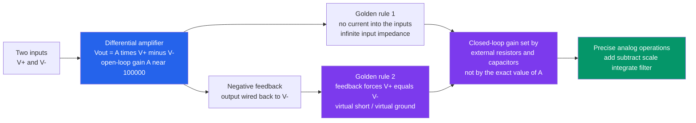

# 🔺 Operational Amplifiers

> [!abstract] TL;DR
> An **operational amplifier** is a differential amplifier with an absurdly large **open-loop gain** ($A \sim 10^5$–$10^6$), near-infinite input impedance, and near-zero output impedance — it amplifies only the *difference* $V_+ - V_-$. On its own that raw gain is useless (any tiny input slams the output to a supply rail), but wrap **negative feedback** around it and the huge gain forces the two inputs to become essentially equal — the **"virtual short"** — while drawing no input current. Those two facts are the **ideal-op-amp golden rules**, and they let you design amplifiers, adders, subtractors, integrators, and filters by inspection, with the closed-loop behavior set by **external resistors and capacitors**, *not* by the op-amp's exact (and unreliable) gain. This is the op-amp's whole magic: trading raw gain for precise, predictable behavior — the same feedback idea that underlies control systems.

## Intuition — analogy FIRST

An op-amp is an **absurdly eager assistant with one simple obsession**: it stares at its two inputs and cranks its output as hard as it possibly can to make them equal. Left alone, the assistant is hopeless — the tiniest imbalance sends the output smashing into the ceiling (the positive supply rail) or the floor (the negative rail). It has enormous strength but zero self-control.

Now wrap a little **feedback** around it — route the output back to the "minus" input through a couple of resistors — and something magical happens. The assistant, still obsessed with making its inputs equal, now automatically does *exactly the math you wired up*: add, subtract, multiply by a ratio, integrate, differentiate, filter. You no longer care how strong the assistant is (its exact gain), only about the resistor ratios you chose. With two "golden rules" — **no current flows into the inputs**, and **feedback forces the inputs equal** — you can design amplifiers, filters, and sensor front-ends on the back of a napkin. The op-amp is the **LEGO brick of analog electronics**: a handful of standard blocks you snap together.

---

## How It Works

An op-amp senses the voltage difference between its **non-inverting input** $V_+$ and **inverting input** $V_-$ and multiplies it by a gigantic open-loop gain: $V_{out} = A\,(V_+ - V_-)$ with $A$ around $10^5$–$10^6$. Because $A$ is so large, the *only* way the output can sit at a sensible value (not pinned to a rail) is if $(V_+ - V_-)$ is essentially **zero**. **Negative feedback** — wiring the output back to $V_-$ — makes the circuit self-correct until that condition holds: if the output drifts high, more of it feeds back to $V_-$, which *reduces* $(V_+ - V_-)$, which pulls the output back. The loop settles exactly where $V_+ \approx V_-$.

That gives the two **golden rules** you use to analyze any ideal op-amp *with negative feedback*:

1. **No input current** — the inputs are infinite-impedance sensing terminals; treat both input currents as $0$.
2. **Virtual short** — feedback forces $V_+ = V_-$. When $V_+$ is tied to ground, $V_-$ sits at $0\text{ V}$ without actually being grounded: a **"virtual ground."**

Apply Kirchhoff's Current Law at the inverting node using those two rules and every classic circuit's gain drops out in one line. The op-amp's own gain vanishes from the answer — the closed-loop behavior is set by the **external components**.



The deep point: **feedback converts unreliable raw gain into reliable, predictable behavior.** The op-amp's gain varies wildly with temperature, part-to-part, and frequency, yet the closed-loop amplifier's gain is a rock-solid resistor ratio.

---

## Key Concepts / Details

### Secondary Level — The Op-Amp and the Two Golden Rules

An op-amp has two inputs and one output. It outputs a large multiple of the **difference** between the inputs:

$$V_{out} = A\,(V_+ - V_-), \qquad A \approx 10^5\text{–}10^6$$

- The **non-inverting input** $V_+$ pushes the output the *same* direction.
- The **inverting input** $V_-$ pushes the output the *opposite* direction.

Because $A$ is enormous, connecting the output back to $V_-$ (**negative feedback**) forces $V_+ = V_-$. Combined with the fact that essentially **no current** enters the inputs, you get the two rules that solve nearly every op-amp circuit:

| Golden rule | Statement | Why |
|---|---|---|
| **Rule 1** | No current flows into either input | Input impedance is effectively infinite |
| **Rule 2** | With negative feedback, $V_+ = V_-$ | Huge gain + feedback drives the difference to zero |

The two workhorse amplifiers:

- **Inverting amplifier:** input through $R_{in}$ to $V_-$, feedback $R_f$ from output to $V_-$, and $V_+$ grounded. Since $V_-$ is a **virtual ground**, KCL gives

$$A_v = -\frac{R_f}{R_{in}}$$

The minus sign flips the signal; the magnitude is a pure resistor ratio.

- **Non-inverting amplifier:** input driven straight into $V_+$, feedback divider $R_f$/$R_{in}$ into $V_-$. Then

$$A_v = 1 + \frac{R_f}{R_{in}}$$

always $\ge 1$, and **in phase** with the input.

Set $R_f = 0$ (or $R_{in} = \infty$) in the non-inverting amp and you get the **voltage follower / buffer**: $A_v = 1$, huge input impedance, tiny output impedance — perfect for **impedance isolation** so a delicate sensor is not "loaded down" by whatever it drives.

### Undergraduate Level — The Classic Circuit Family

Every canonical op-amp circuit is the golden rules applied to a slightly different resistor/capacitor network:

| Circuit | Function | Ideal relation |
|---|---|---|
| **Inverting amp** | scale + invert | $V_{out} = -\dfrac{R_f}{R_{in}}V_{in}$ |
| **Non-inverting amp** | scale, in phase | $V_{out} = \left(1 + \dfrac{R_f}{R_{in}}\right)V_{in}$ |
| **Buffer / follower** | impedance isolation | $V_{out} = V_{in}$ |
| **Summing amp** | analog addition | $V_{out} = -R_f\left(\dfrac{V_1}{R_1} + \dfrac{V_2}{R_2} + \cdots\right)$ |
| **Difference amp** | subtract, reject common mode | $V_{out} = \dfrac{R_f}{R_{in}}(V_2 - V_1)$ |
| **Integrator** | analog calculus | $V_{out} = -\dfrac{1}{R C}\displaystyle\int V_{in}\,dt$ |
| **Differentiator** | analog calculus | $V_{out} = -R C \,\dfrac{dV_{in}}{dt}$ |
| **Active filter** | frequency shaping | e.g. Sallen-Key low/high/band-pass |
| **Comparator** | analog to digital-like | output slams to a rail when $V_+ \gtrless V_-$ |

Two families deserve emphasis:

- **Summing and difference amplifiers** turn the op-amp into an **analog arithmetic unit**. The **difference / instrumentation amplifier** subtracts two inputs while *rejecting* the voltage common to both (60 Hz mains hum, ground shifts) — the foundation of every precision **sensor front-end** (strain gauges, thermocouples, ECG electrodes). Its ability to reject the shared signal is measured by the **common-mode rejection ratio (CMRR)**.
- The **integrator** puts a **capacitor in the feedback path**. Since the capacitor current is $C\,dV/dt$ and the virtual ground forces the input current $V_{in}/R$ to flow into it, integrating gives $V_{out} = -\tfrac{1}{RC}\int V_{in}\,dt$ — the op-amp is literally *doing calculus* because feedback wraps a differential relationship around infinite gain. Swap the R and C and you get a **differentiator**.

The **comparator** is the exception that proves the rule: run the op-amp **open-loop** (or with *positive* feedback) and the output is no longer a linear function — it snaps to whichever rail depending on the sign of $V_+ - V_-$. Add positive feedback and you get a **Schmitt trigger** with hysteresis, the bridge from the analog to the digital world.

### Graduate Level — Feedback Theory and the Non-Idealities That Bite

The closed-loop gain of any negative-feedback amplifier is

$$A_{cl} = \frac{A}{1 + A\beta} \xrightarrow{A \to \infty} \frac{1}{\beta}$$

where $\beta$ is the **feedback factor** (the fraction of output fed back). The quantity $A\beta$ is the **loop gain**. This single formula is the whole story: as long as the loop gain $A\beta \gg 1$, the closed-loop gain depends only on $\beta$ (your resistor network), *not* on $A$. Feedback **desensitizes** gain to the op-amp's messy internals — the same de-sensitization principle used in every control loop.

But $A$ is not really infinite or constant, and real designs live and die by the **non-idealities**:

- **Finite gain-bandwidth product (GBW).** The open-loop gain rolls off with frequency (one dominant pole), so gain $\times$ bandwidth is roughly **constant**: $A_{cl}\cdot f_{BW} \approx \text{GBW}$. A part with GBW $= 1\text{ MHz}$ gives $10\times$ gain only up to $100\text{ kHz}$. **You trade gain for bandwidth.**
- **Slew rate.** The output cannot change faster than some $\text{V}/\mu\text{s}$ limit (set by internal current charging the compensation capacitor). Large fast signals get **slew-limited** into triangles regardless of small-signal bandwidth.
- **Input offset voltage** and **input bias/offset current.** Real inputs are not perfectly matched, so a tiny voltage/current imbalance appears amplified at the output — critical in high-gain DC and integrator circuits (the integrator will **drift to a rail** on offset alone unless a reset/leak resistor is added).
- **Saturation to the rails.** The output can only swing between (near) the supply rails. Ask for $-\tfrac{R_f}{R_{in}}V_{in}$ bigger than a rail and it **clips**.
- **CMRR and PSRR.** Finite common-mode and power-supply rejection let shared/supply noise leak through — the enemy of precision instrumentation.
- **Stability / phase margin.** Feedback around a multi-pole amplifier can *oscillate* if the loop accumulates $180°$ of phase while $|A\beta| > 1$. Op-amps are **internally compensated** (a dominant pole) to guarantee stability at unity gain, which is precisely *why* the gain-bandwidth trade exists.

**The big idea:** an op-amp trades **raw, unreliable gain** for **precise, stable, predictable behavior** through feedback — the identical bargain made by every feedback control system.

---

## Python Demo

```python
# Ideal op-amp via the two GOLDEN RULES ( V+ = V-  and  no input current ):
#   (a) INVERTING amp    Av = -Rf/Rin          (V- is a virtual ground)
#   (b) NON-INVERTING amp Av = 1 + Rf/Rin       (>= 1, in phase; shows rail saturation)
#   (c) INTEGRATOR        Vout = -(1/RC) * integral(Vin dt)   (square wave -> triangle)
#   (d) FINITE GAIN-BANDWIDTH PRODUCT: gain x bandwidth = constant (a key non-ideality)
# Only numpy + matplotlib.
import numpy as np
import matplotlib.pyplot as plt

Vrail = 12.0                                   # +/- supply rails (saturation limits)

# --- verify the closed-loop gains straight from the golden rules (KCL) ---
def inverting_gain(Rin, Rf):
    # V- = V+ = 0 (virtual ground); no input current -> current in Rin = current in Rf
    # (Vin - 0)/Rin + (Vout - 0)/Rf = 0  ->  Vout/Vin = -Rf/Rin
    return -Rf / Rin
def noninv_gain(Rin, Rf):
    # V- = V+ = Vin; divider from Vout: Vin = Vout * Rin/(Rin+Rf) -> Vout/Vin = 1 + Rf/Rin
    return 1.0 + Rf / Rin
print("check inverting  Rf=20k,Rin=10k ->", inverting_gain(10e3, 20e3), "(expect -2.0)")
print("check non-invert Rf=20k,Rin=10k ->", noninv_gain(10e3, 20e3), "(expect  3.0)")

fig, ax = plt.subplots(2, 2, figsize=(13, 9))

# shared 1 kHz test tone, +/-0.5 V
t = np.linspace(0, 2e-3, 2000)
vin = 0.5 * np.sin(2 * np.pi * 1000.0 * t)

# ---- (a) INVERTING amp: clean scaling with a 180-degree flip ----
Rin = 10e3
for Rf in [10e3, 20e3, 47e3]:
    Av = inverting_gain(Rin, Rf)
    vout = np.clip(Av * vin, -Vrail, Vrail)
    ax[0, 0].plot(t * 1e3, vout, label=f"Rf/Rin={Rf/Rin:.1f}  Av={Av:+.1f}")
ax[0, 0].plot(t * 1e3, vin, 'k--', lw=1.2, label="Vin")
ax[0, 0].set_title("(a) Inverting Amp:  Av = -Rf/Rin  (virtual ground, inverted)")
ax[0, 0].set_xlabel("time  [ms]"); ax[0, 0].set_ylabel("voltage  [V]")
ax[0, 0].legend(fontsize=8, loc="upper right"); ax[0, 0].grid(alpha=0.3)

# ---- (b) NON-INVERTING amp: gain >= 1, in phase; top gain CLIPS to the rail ----
for Rf in [10e3, 100e3, 300e3]:
    Av = noninv_gain(Rin, Rf)
    vout = np.clip(Av * vin, -Vrail, Vrail)          # np.clip = saturation at +/- rails
    ax[0, 1].plot(t * 1e3, vout, label=f"Av={Av:.0f}")
ax[0, 1].axhline( Vrail, color='r', ls=':', lw=1); ax[0, 1].axhline(-Vrail, color='r', ls=':', lw=1)
ax[0, 1].text(0.05, Vrail - 1.4, "supply rail -> SATURATION", color='r', fontsize=8)
ax[0, 1].plot(t * 1e3, vin, 'k--', lw=1.2, label="Vin")
ax[0, 1].set_title("(b) Non-Inverting Amp:  Av = 1 + Rf/Rin  (in phase)")
ax[0, 1].set_xlabel("time  [ms]"); ax[0, 1].set_ylabel("voltage  [V]")
ax[0, 1].legend(fontsize=8, loc="lower right"); ax[0, 1].grid(alpha=0.3)

# ---- (c) INTEGRATOR: feedback capacitor makes the op-amp do CALCULUS ----
# square wave in -> triangle out, because the integral of a constant is a ramp.
R, C = 10e3, 100e-9                               # RC = 1 ms
t2 = np.linspace(0, 4e-3, 4000)
vsq = 0.5 * np.sign(np.sin(2 * np.pi * 500.0 * t2))   # +/-0.5 V, 500 Hz square wave
dt = t2[1] - t2[0]
vtri = np.clip(-(1.0 / (R * C)) * np.cumsum(vsq) * dt, -Vrail, Vrail)
ax[1, 0].plot(t2 * 1e3, vsq, 'k--', lw=1.2, label="Vin (square)")
ax[1, 0].plot(t2 * 1e3, vtri, 'tab:purple', lw=1.8, label="Vout (triangle)")
ax[1, 0].set_title("(c) Op-Amp Integrator:  Vout = -(1/RC) * integral(Vin dt)")
ax[1, 0].set_xlabel("time  [ms]"); ax[1, 0].set_ylabel("voltage  [V]")
ax[1, 0].legend(fontsize=8, loc="upper right"); ax[1, 0].grid(alpha=0.3)

# ---- (d) FINITE GAIN-BANDWIDTH PRODUCT: gain x bandwidth = constant ----
GBW = 1e6                                          # 1 MHz gain-bandwidth product
freqs = np.logspace(1, 7, 600)
for Av0 in [1, 10, 100]:
    fc = GBW / Av0                                 # closed-loop -3 dB bandwidth
    gain = Av0 / np.sqrt(1.0 + (freqs / fc) ** 2)  # single-pole roll-off
    ax[1, 1].loglog(freqs, gain, label=f"Av={Av0:3d}  BW={fc/1e3:.0f} kHz")
ax[1, 1].set_title("(d) Non-Ideality: Gain x Bandwidth = constant")
ax[1, 1].set_xlabel("frequency  [Hz]"); ax[1, 1].set_ylabel("closed-loop gain")
ax[1, 1].legend(fontsize=8, loc="lower left"); ax[1, 1].grid(alpha=0.3, which="both")

plt.tight_layout()
plt.savefig("operational_amplifiers.png", dpi=110)
print("Saved operational_amplifiers.png")
```

Running it prints the golden-rule gain checks ($-2.0$ and $3.0$) and produces four panels: **(a)** inverting outputs cleanly scaled *and flipped* versus the input; **(b)** non-inverting outputs in phase, with the highest-gain trace **clipping flat against the supply rail** (saturation); **(c)** a square wave integrated into a **triangle** — feedback around high gain literally performing calculus; and **(d)** three closed-loop responses whose $\text{gain} \times \text{bandwidth}$ is the same constant, so higher gain buys less bandwidth.

---

## Real-World Applications

- **Sensor signal conditioning.** Instrumentation amplifiers (a difference-amp core) sit at the front end of strain gauges, load cells, thermocouples, and ECG/EEG electrodes, amplifying microvolt differences while rejecting common-mode hum.
- **ADC/DAC front-ends.** Buffers, level-shifters, anti-aliasing active filters, and reference drivers precede nearly every analog-to-digital converter; op-amp buffers keep the source from being loaded by the sampling network.
- **Audio.** Preamps, tone controls, mixing consoles (summing amplifiers), and active crossovers are op-amp circuits; the summing amp *is* the audio mixer.
- **Active filters.** Sallen-Key and multiple-feedback low/high/band-pass filters shape frequency response without bulky inductors — ubiquitous in audio, communications, and data acquisition.
- **Precision measurement and control.** Integrators and differentiators build analog PID controllers, ramp/sawtooth generators, and voltage-to-frequency converters.
- **Power and regulation.** Error amplifiers inside voltage regulators and switch-mode supplies compare the output to a reference and drive the feedback loop — an op-amp closing a control loop.
- **Comparators and interfacing.** Threshold detectors, zero-crossing detectors, and Schmitt triggers convert messy analog signals into clean digital edges.

---

## Common Pitfalls

- **Applying the golden rules without negative feedback.** "$V_+ = V_-$" only holds when negative feedback is present to enforce it. An op-amp used **open-loop** or with **positive feedback** (a comparator or Schmitt trigger) does *not* obey the virtual short — its output sits at a rail. Always confirm the feedback goes to the **inverting** input.
- **Confusing the virtual short with a real short.** The inputs are forced to the *same voltage*, but **no current** flows between them — that is the whole point of "virtual." A virtual ground sits at $0\text{ V}$ yet sources/sinks no current to actual ground.
- **Expecting the ideal gain outside the bandwidth.** Because of the **finite gain-bandwidth product**, a "$100\times$" amplifier is only $100\times$ at low frequency; its gain rolls off above $\text{GBW}/100$. Chasing high gain *and* high bandwidth from one stage fails.
- **Ignoring slew rate.** Even within the small-signal bandwidth, large fast swings are limited by the **slew rate** and come out as triangles. Small-signal bandwidth and large-signal (slew-limited) bandwidth are different specs.
- **Forgetting the rails.** The output cannot exceed the supplies. An inverting amp asked for $-15\text{ V}$ on $\pm12\text{ V}$ rails simply **saturates/clips**. Check the required output swing against the supply.
- **Naked integrators and DC offset.** With only a feedback capacitor, **input offset voltage and bias current integrate forever** and drift the output to a rail. Real integrators add a large parallel resistor (a "leak") or a reset switch to bound the DC gain.
- **Loading the output or driving capacitance.** The output impedance is low but not zero; heavy loads reduce swing, and driving a large capacitive load can add phase lag that makes the loop ring or **oscillate**.
- **Assuming perfect common-mode rejection.** Finite **CMRR** means shared noise on both inputs is not perfectly cancelled — resistor mismatch in a discrete difference amp badly degrades it, which is why matched, laser-trimmed **instrumentation amplifiers** exist.

---

## Related Concepts

- [[Feedback_Control_Fundamentals]] — the op-amp is negative feedback in its purest form; the loop-gain and desensitization ideas are identical to closing a control loop.
- [[PID_Control]] — an analog PID controller *is* op-amp summing, integrator, and differentiator stages wired together; the integrator here is the "I" term.
- [[Transfer_Functions]] — active filters and the integrator are best analyzed as $s$-domain transfer functions; poles set the filter's roll-off and the amplifier's bandwidth.
- [[Stability_Frequency_Response]] — the gain-bandwidth trade and loop stability (phase margin) come straight from the op-amp's open-loop frequency response and pole placement.
- [[Network_Theorems]] — the golden rules are just KCL/KVL plus ideal-source reasoning; Thévenin/nodal analysis derives every closed-loop gain.
- [[RC_RL_and_RLC_Transients]] — the feedback capacitor's $i = C\,dV/dt$ law is exactly what makes the integrator integrate and the differentiator differentiate.
- [[First_Order_ODEs]] — an op-amp integrator or first-order active filter implements a first-order linear ODE in hardware.
- [[Electrical_Engineering_Overview]] — parent map; op-amps are the entry point to active analog design.

Sibling analog-electronics notes (in prose): **Bipolar_Junction_Transistors** and **MOSFETs_and_CMOS** are the devices that build the op-amp's internal differential pair and gain stages; **Analog_Filters_and_Frequency_Response** develops the active-filter family (Sallen-Key, etc.) the op-amp enables; **Oscillators_and_Feedback_Amplifiers** flips the sign to *positive* feedback for sustained oscillation; **Feedback_and_Control_Systems** generalizes the "trade gain for precision" bargain to closed-loop control.

---

## Review Questions

1. **(Secondary)** An inverting amplifier uses $R_{in} = 10\text{ k}\Omega$ and $R_f = 47\text{ k}\Omega$ with $V_+$ grounded. What is the gain, what is the voltage at the inverting input when the input is $0.2\text{ V}$, and why is that node called a "virtual ground"?
2. **(Undergraduate)** You need to compute $V_{out} = 3V_1 + 3V_2 - 3V_3$ from three sensor voltages. Which op-amp building blocks would you combine, and how do the resistor ratios set each coefficient? Then explain what physically limits how fast this circuit can respond to a step on $V_1$.
3. **(Graduate)** Using $A_{cl} = A/(1 + A\beta)$, explain why the closed-loop gain barely changes when the op-amp's open-loop gain drops from $10^6$ to $10^5$ over temperature. Then explain how the *same* dominant-pole compensation that guarantees stability is exactly what creates the finite gain-bandwidth product — and why a naked integrator drifts to a rail even with zero input.

---

## Sources

- Sedra, A. & Smith, K. — *Microelectronic Circuits* (op-amp fundamentals, ideal model, classic configurations).
- Horowitz, P. & Hill, W. — *The Art of Electronics* (practical op-amp design, golden rules, non-idealities).
- Franco, S. — *Design with Operational Amplifiers and Analog Integrated Circuits* (feedback theory, GBW, active filters, instrumentation amps).
- Razavi, B. — *Fundamentals of Microelectronics* (differential pairs, internal gain stages, frequency response).

---

#electrical-engineering #op-amps #negative-feedback #analog-design #virtual-ground
