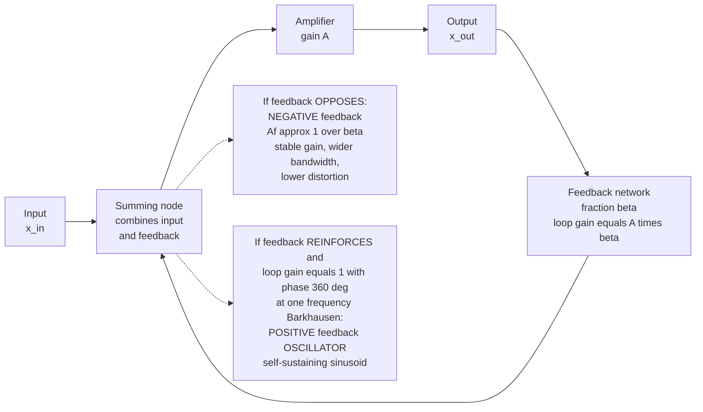

# 🔁 Oscillators and Feedback Amplifiers

> [!abstract] TL;DR
> Take an amplifier of gain $A$ and feed a fraction $\beta$ of its output back to its input; the **loop gain** is $A\beta$ and the closed-loop gain is $A_f = A/(1 \pm A\beta)$. Feed it back to **oppose** the input (**negative feedback**) and the amplifier becomes stable and precise: $A_f \approx 1/\beta$, set by the passive feedback network, with wider bandwidth and lower distortion — the price is raw gain. Feed it back to **reinforce** (**positive feedback**) so that at exactly one frequency the loop gain is $1$ with $360°$ phase — the **Barkhausen criterion** — and the circuit sustains a sinusoid from nothing: an **oscillator**. Oscillators generate every clock, carrier, and timing reference in electronics; feedback is arguably the single most unifying idea in all of engineering, tying together amplifiers, oscillators, and control systems.

## Intuition — analogy FIRST

Feedback is a double-edged sword, and you have heard both edges. Push a microphone toward its own loudspeaker and you get that awful, escalating **screech** — the mic picks up a whisper, the amp makes it louder, the speaker plays it, the mic picks *that* up, and the sound feeds itself, growing until it howls at one shrill pitch. That is a signal feeding itself, out of control.

Engineers deliberately wield **both** edges of that sword.

**Negative feedback** — feeding the output back to *oppose* the input — is the tame edge. It is the same idea as a thermostat that turns the heater *down* when the room gets *too warm*: the loop constantly corrects its own errors. Applied to an amplifier, it trades away brute gain in exchange for something far more valuable: a gain that is stable, predictable, low-distortion, and set by precise passive parts rather than by a hot, drifting, nonlinear transistor. This is why every op-amp circuit works.

**Positive feedback** — feeding the output back to *reinforce* — is the wild edge, the microphone howl. But engineers do not merely avoid it; they *build it on purpose*. Tune the loop so that at exactly one frequency the round-trip gain is precisely unity and the phase comes back in step, and the "howl" becomes a **pure, controlled tone that sustains itself forever** — an **oscillator**. Every clock in every computer, every radio carrier lofting your Wi-Fi, every quartz watch, every heartbeat monitor's timebase is an oscillator: a circuit that has been taught to sustain its own rhythm with no input at all.

---

## How It Works

A single structure — an amplifier wrapped in a feedback path — produces *both* behaviors. Which one you get depends on the **sign** of the feedback and on whether the round-trip **loop gain** $A\beta$ reaches unity with the phase realigned.



The master equation for the whole loop is:

$$A_f = \frac{A}{1 \pm A\beta}, \qquad \text{loop gain } T = A\beta$$

- **Minus sign (negative feedback):** $A_f = A/(1 + A\beta)$. When $T = A\beta \gg 1$, the $1$ is negligible and $A_f \to 1/\beta$ — the amplifier's messy internal gain $A$ **cancels out**, and the closed-loop gain is fixed by the clean feedback network $\beta$.
- **Plus sign (positive feedback):** $A_f = A/(1 - A\beta)$. As $A\beta \to 1$, the denominator collapses to zero and $A_f \to \infty$: the circuit produces an output with **no input**. That singular point — $|A\beta| = 1$ with total phase $0°/360°$ — is the **Barkhausen criterion**, the birth of oscillation.

---

## Key Concepts / Details

### Secondary Level

- **Feedback = routing the output back to the input.** Two flavors: **negative** (the returned signal *subtracts*, opposing change) and **positive** (it *adds*, reinforcing change).
- **The microphone-speaker screech is positive feedback** run away — the same physics as an oscillator, just uncontrolled.
- **Negative feedback buys stability.** A cruise control that eases off the throttle as you speed up, or a thermostat that cuts the heat as the room warms, keeps a quantity locked to a target. Wrapped around an amplifier, it makes the gain rock-steady and clean.
- **An oscillator makes a signal out of nothing.** It is the electronic **heartbeat** — the metronome that tells a CPU when to take each step, that sets the pitch a radio transmits on, that ticks once per second in a quartz watch.

### Undergraduate Level

**The feedback equation.** With forward gain $A$ and feedback fraction $\beta$, the closed-loop gain is $A_f = A/(1 + A\beta)$ for negative feedback. The product $T = A\beta$ is the **loop gain** (return ratio) — the single most important number in the loop.

**Why negative feedback is worth the lost gain** (all benefits scale with $1 + T$):

| Benefit | Result | Mechanism |
|---|---|---|
| **Gain desensitization** | $\dfrac{dA_f/A_f}{dA/A} = \dfrac{1}{1+T}$ | a $10\%$ drift in $A$ becomes a tiny drift in $A_f$ |
| **Bandwidth extension** | $f_{H,\text{closed}} = (1+T)\,f_{H,\text{open}}$ | gain-bandwidth product is conserved; you trade gain for bandwidth |
| **Lower distortion & noise** | reduced by $\approx (1+T)$ | the loop corrects its own nonlinearity each cycle |
| **Impedance shaping** | $\times(1+T)$ or $\div(1+T)$ | series/shunt sensing and mixing set $Z_{in}, Z_{out}$ |

The recurring price: closed-loop gain drops from $A$ to $A/(1+T)$. You **spend gain to buy precision**.

**The Barkhausen criterion for oscillation.** A feedback loop sustains a steady sinusoid at frequency $f_0$ when, at that frequency:
$$|A\beta| = 1 \quad\text{and}\quad \angle A\beta = 0° \ (\text{or } 360°).$$
Magnitude condition: the signal returns exactly as strong as it left. Phase condition: it returns exactly *in step* to reinforce itself. Both must hold, and (crucially) hold at **only one** frequency, or the output is not a clean tone.

**In practice you start above unity.** If $|A\beta|$ were designed at exactly $1$, thermal drift would kill the oscillation. So circuits set $|A\beta|$ slightly **greater than $1$** — oscillation grows out of ever-present noise — and a **nonlinearity** (soft saturation, a diode limiter, an AGC element) gently pulls the *effective* loop gain back to exactly $1$ as amplitude rises, locking the amplitude in place.

**Oscillator families** — the phase-shift network sets the frequency:

| Type | Frequency network | Range | Notable use |
|---|---|---|---|
| **RC phase-shift** | 3+ cascaded RC sections ($180°$) | audio | simple tone generators |
| **Wien bridge** | RC bridge, $0°$ at $f_0$ | audio | low-distortion lab oscillators (HP200A) |
| **LC — Colpitts / Hartley** | resonant $LC$ tank | RF | radio local oscillators, transmitters |
| **Crystal** | quartz piezoelectric resonator | any digital clock | CPU/MCU clocks, watches, radios |
| **Relaxation (RC)** | capacitor charge/discharge | timers | 555 timer, blinkers, PWM (square/triangle) |

### Graduate Level

**Loop gain and return ratio.** Rigorous feedback analysis breaks the loop, injects a test signal, and measures the **return ratio** $T$. All closed-loop metrics — gain, bandwidth, impedances — are functions of $T$. The four canonical topologies (series-shunt = voltage amp, shunt-series = current amp, series-series = transconductance, shunt-shunt = transimpedance) differ only in how the output is *sensed* and how the feedback is *mixed*, which sets whether $Z_{in}$ and $Z_{out}$ are multiplied or divided by $(1+T)$.

**Stability — the accidental oscillator.** A negative-feedback amplifier has, at low frequency, $\angle T \approx 180°$ (the "negative" sign). But each pole adds up to $-90°$ of *extra* lag. If a second and third pole push the total phase around so that $\angle T$ reaches a full $360°$ **while $|T| > 1$**, the amplifier *satisfies Barkhausen* and oscillates — you built an oscillator by accident. The safety margins are read off the loop-gain [[Bode_Nyquist_and_Loop_Shaping|Bode/Nyquist]] plots:
- **Phase margin** $= 180° - |\angle T|$ at the frequency where $|T| = 1$ (want $\gtrsim 45°$–$60°$).
- **Gain margin** $= $ how far below $1$ is $|T|$ when $\angle T$ hits $360°$.

This is *exactly* the stability theory of [[Feedback_Control_Fundamentals|control systems]] ([[Stability_Routh_Hurwitz_and_Root_Locus|Routh-Hurwitz / root-locus]], Nyquist) — oscillators and control loops are the same mathematics viewed from opposite sides: the control engineer *avoids* the encirclement of $-1$; the oscillator designer *lands on it*. Op-amps ship with **dominant-pole (Miller) compensation** to guarantee a comfortable phase margin.

**Crystal oscillators — why every clock is quartz.** A quartz crystal is a mechanical resonator (the piezoelectric effect couples voltage to vibration) with an astonishing quality factor $Q \sim 10^4$–$10^6$, versus $Q \sim 10$–$100$ for an $LC$ tank. In the loop it acts as an extraordinarily narrow, stable frequency-selective element, so the Barkhausen phase condition is met over a razor-thin band — giving frequency accuracy and stability of **ppm** (parts per million). The **Pierce** topology (one inverter/transistor + two capacitors) clocks nearly every microcontroller; the ubiquitous **32.768 kHz** ($2^{15}$ Hz) tuning-fork crystal drives real-time clocks and watches. For tighter specs, **TCXOs** (temperature-compensated) and **OCXOs** (oven-controlled, held at constant temperature) reach sub-ppb stability.

**Phase-locked loops (PLLs).** A PLL is feedback applied to *phase*: a **phase detector** compares a local **VCO** (voltage-controlled oscillator) against a reference, a **loop filter** integrates the error, and the loop drives the VCO until it locks to the reference. Put a divide-by-$N$ counter in the feedback path and the VCO runs at $N \times$ the reference — **frequency synthesis**, the heart of every RF transceiver. PLLs also perform **clock recovery** (extracting the clock embedded in a serial data stream, as in USB/Ethernet/SerDes). Oscillator quality is ultimately limited by **phase noise** (Leeson's model), the spectral skirt around the carrier caused by amplifier noise modulating the resonator.

---

## Python Demo

```python
# Two faces of the feedback loop, simulated with numpy + matplotlib.
#   (a) NEGATIVE feedback: closed-loop gain Af = A/(1 + A*beta) desensitizes to A,
#       approaching 1/beta as the loop gain A*beta grows -> stability for the price of gain.
#   (b) POSITIVE feedback / BARKHAUSEN: a loop with slightly-greater-than-unity loop gain
#       and a soft-saturating nonlinearity grows a sinusoid out of noise, then the
#       nonlinearity clamps the amplitude -> a steady, self-sustaining oscillation.
import numpy as np
import matplotlib.pyplot as plt

# ============================================================
# (a) NEGATIVE FEEDBACK -- gain desensitization
# ============================================================
beta = 0.01                       # feedback fraction -> ideal closed-loop gain 1/beta = 100
A = np.logspace(1, 6, 500)        # raw amplifier gain sweeps 5 decades (very variable!)
loop_gain = A * beta              # T = A*beta
Af = A / (1.0 + A * beta)         # closed-loop gain
ideal = 1.0 / beta                # 100 -> the 1/beta asymptote

# Sensitivity: pick a nominal A, then change it by +50% and watch Af barely move.
A0     = 1.0e4
Af0    = A0        / (1 + A0 * beta)
Af_hi  = 1.5 * A0  / (1 + 1.5 * A0 * beta)
print(f"1/beta (ideal closed-loop gain) = {ideal:.1f}")
print(f"A = {A0:.0f}   -> open-loop gain {A0:.0f}, closed-loop gain {Af0:.3f}")
print(f"A x1.5 = {1.5*A0:.0f} -> closed-loop gain {Af_hi:.3f}")
print(f"  amplifier gain changed +50.0%, closed-loop gain changed only "
      f"{100*(Af_hi-Af0)/Af0:+.3f}%  <-- desensitization!")

# ============================================================
# (b) POSITIVE FEEDBACK -- Barkhausen oscillation build-up
#     Loop = phase-shift network (a rotation that FIXES the frequency f0)
#            + amplifier with loop gain g slightly > 1
#            + soft saturation (tanh) that LIMITS amplitude.
# ============================================================
fs   = 5000.0                     # sample rate [Hz]
dt   = 1.0 / fs
f0   = 50.0                       # oscillation frequency set by the phase-shift network
w0   = 2 * np.pi * f0 * dt        # phase increment per sample
g    = 1.01                       # loop gain slightly > 1 -> grows from noise
Vsat = 1.0                        # limiter (saturation) level
N    = 3000
t    = np.arange(N) * dt

x, y = 1e-3, 0.0                  # tiny "noise" seed to start the oscillation
wave = np.empty(N)
c, s = np.cos(w0), np.sin(w0)
for n in range(N):
    # phase-shift / resonant network: rotate the state (selects f0, provides the phase)
    xr = x * c - y * s
    yr = x * s + y * c
    # amplifier with loop gain g and soft saturation -> amplitude self-limits
    x = Vsat * np.tanh(g * xr / Vsat)
    y = Vsat * np.tanh(g * yr / Vsat)
    wave[n] = x

# ============================================================
# PLOTS
# ============================================================
fig, ax = plt.subplots(2, 2, figsize=(14, 9))

# (1) Closed-loop gain vs loop gain -> flattens onto the 1/beta asymptote
ax[0, 0].semilogx(loop_gain, Af, lw=2, label="closed-loop gain  Af = A/(1+A*beta)")
ax[0, 0].axhline(ideal, color='r', ls='--', lw=2, label=f"1/beta asymptote = {ideal:.0f}")
ax[0, 0].axvline(1.0, color='gray', ls=':', label="loop gain = 1")
ax[0, 0].set(title="(a) NEGATIVE feedback: gain -> 1/beta as loop gain grows",
             xlabel="loop gain  T = A*beta", ylabel="closed-loop gain  Af")
ax[0, 0].legend(); ax[0, 0].grid(alpha=0.3, which='both')

# (2) Desensitization: closed-loop gain barely moves as raw gain A varies wildly
ax[0, 1].semilogx(A, Af, lw=2, label="closed-loop Af")
ax[0, 1].semilogx(A, np.full_like(A, ideal), 'r--', lw=1.5, label="ideal 1/beta")
ax[0, 1].fill_between(A, Af, ideal, alpha=0.15)
ax[0, 1].set(title="(a) Af stays near 100 while A ranges over 5 decades",
             xlabel="raw amplifier gain  A", ylabel="closed-loop gain  Af", ylim=(0, 110))
ax[0, 1].legend(); ax[0, 1].grid(alpha=0.3, which='both')

# (3) Oscillation build-up: noise -> growth -> amplitude-limited steady sinusoid
ax[1, 0].plot(t, wave, lw=0.9)
ax[1, 0].axhline(0, color='k', lw=0.5)
ax[1, 0].set(title="(b) BARKHAUSEN: sinusoid grows from noise, nonlinearity limits it",
             xlabel="time [s]", ylabel="output")
ax[1, 0].grid(alpha=0.3)

# (4) Zoom on the steady state -> clean, amplitude-stabilized tone at f0
zoom = slice(N - 400, N)
ax[1, 1].plot(t[zoom], wave[zoom], lw=1.5)
ax[1, 1].axhline(0, color='k', lw=0.5)
ax[1, 1].set(title=f"(b) Steady state: self-sustaining tone at f0 = {f0:.0f} Hz",
             xlabel="time [s]", ylabel="output")
ax[1, 1].grid(alpha=0.3)

plt.tight_layout()
plt.savefig("feedback_and_oscillation.png", dpi=110)
print("Saved feedback_and_oscillation.png")
```

**What it shows.** Panels (a) demonstrate the negative-feedback bargain: as the loop gain $A\beta$ climbs past $1$, the closed-loop gain flattens onto the $1/\beta = 100$ asymptote, and even a $+50\%$ swing in the raw amplifier gain $A$ (transistor drift, temperature, part-to-part spread) barely nudges the closed-loop gain — the printout quantifies the desensitization. Panels (b) demonstrate positive feedback at the Barkhausen point: seeded only by a $10^{-3}$ "noise" sample, the loop's slightly-above-unity gain grows the oscillation exponentially, then the `tanh` saturation compresses the effective loop gain back to exactly $1$, freezing the amplitude into a clean, steady tone whose **frequency is set by the phase-shift network**, not by the amplitude.

---

## Real-World Applications

- **Every digital clock is a crystal oscillator.** A quartz crystal in a **Pierce** loop times essentially every CPU, microcontroller, and SoC; a **32.768 kHz** tuning-fork crystal drives real-time clocks and quartz watches. Without a stable oscillator there is no synchronous logic.
- **Radio and RF.** LC **Colpitts/Hartley** and crystal oscillators generate carriers and **local oscillators**; a **PLL frequency synthesizer** produces every channel in a Wi-Fi, Bluetooth, cellular, or GPS transceiver from one reference crystal.
- **The 555 timer** is an **RC relaxation oscillator** — capacitor charge/discharge through resistors — producing square waves for blinkers, PWM motor/LED drives, and timing.
- **Every op-amp circuit** relies on **negative feedback**: the closed-loop gain of an inverting/non-inverting amp is set by resistor ratios ($1/\beta$), immune to the op-amp's own huge, sloppy open-loop gain.
- **Lab signal generators.** The **Wien-bridge** oscillator (amplitude-stabilized historically by a small incandescent lamp) gives ultra-low-distortion audio tones — it was Hewlett-Packard's founding product, the **HP200A**.
- **Serial links.** **Clock-and-data recovery (CDR)** PLLs extract the embedded clock from USB, Ethernet, and SerDes streams; PLLs also de-jitter and multiply reference clocks across a whole board.

---

## Common Pitfalls

- **Getting the sign convention wrong in $A_f = A/(1 \pm A\beta)$.** Minus in the denominator ($1 + A\beta$ after the sign of feedback is folded in) is **negative** feedback (desensitizes gain to $\approx 1/\beta$, widens bandwidth by $1+T$, lowers distortion and output impedance — at the cost of gain). A plus that drives the denominator toward zero ($1 - A\beta$) is **positive** feedback: regeneration toward oscillation, latch, or Schmitt-trigger hysteresis. Track which sign you actually have around the whole loop.
- **Forgetting Barkhausen needs BOTH conditions.** Oscillation requires $|A\beta| = 1$ **and** $\angle A\beta = 0°/360°$ at the *same* single frequency. Meeting only the magnitude condition, or meeting the phase condition at several frequencies, gives no oscillation (or a dirty, multi-tone mess).
- **Designing the loop gain at exactly $1$.** In reality you set $|A\beta|$ slightly $> 1$ so oscillation *starts* from noise, and rely on a **nonlinearity** (soft saturation, diode limiter, AGC, the Wien-bridge lamp) to pull the effective gain back to $1$ and stabilize the amplitude. Too much excess gain $\Rightarrow$ hard clipping and distortion; too little $\Rightarrow$ it may never start.
- **Building an amplifier that oscillates by accident.** A negative-feedback amp becomes an oscillator if parasitic poles rotate the loop phase to $360°$ while $|T| > 1$ — **insufficient phase margin**. Cures: dominant-pole (Miller) compensation, supply decoupling, careful layout to kill parasitic feedback. Read the danger straight off the [[Bode_Nyquist_and_Loop_Shaping|loop-gain Bode/Nyquist]] plot.
- **Confusing the startup condition with the steady-state condition.** Startup needs loop gain $> 1$; steady state settles at effective loop gain $= 1$. They are different operating points, bridged by the amplitude-limiting nonlinearity.
- **Picking the wrong oscillator for the frequency and stability you need.** RC phase-shift / **Wien-bridge** for audio, **LC** (Colpitts/Hartley) for RF, **crystal** for extreme frequency accuracy (all digital clocks), **relaxation/RC** (the 555) for cheap square/triangle timing. Do not expect ppm stability from an $LC$ tank.
- **Mishandling the crystal.** Overdriving a quartz crystal ages or cracks it; confusing its **series** vs **parallel** resonant modes (and mismatching the load capacitance) lands the oscillator on the wrong frequency by tens of ppm.
- **Assuming negative feedback is free.** It costs gain, can slow settling if over-compensated, and — if the loop is unstable — makes things dramatically worse. Feedback is a tool with a phase-margin budget, not a magic fix.

---

## Related Concepts

- [[AC_Circuit_Analysis_and_Phasors]] — the $LC$ resonant tank at the heart of Colpitts/Hartley oscillators is analyzed exactly by impedance and resonance $\omega_0 = 1/\sqrt{LC}$; the loop-gain magnitude/phase conditions live in the same phasor world.
- [[RC_RL_and_RLC_Transients]] — the RC charge/discharge dynamics behind relaxation oscillators (the 555) and the RC sections of a phase-shift oscillator are these first-order transients.
- [[Oscillations_and_SHM]] — an electronic oscillator is the exact analog of a *driven* mechanical resonator; the negative-damping-that-limits picture mirrors a self-sustaining physical oscillation.
- [[Feedback_Control_Fundamentals]] — negative feedback in an amplifier is the identical error-correcting loop used to regulate a plant; loop gain $T = A\beta$ is the return ratio of control theory.
- [[Bode_Nyquist_and_Loop_Shaping]] — phase margin and gain margin, read off the loop-gain plots, are what separate a stable amplifier from an accidental oscillator.
- [[Stability_Routh_Hurwitz_and_Root_Locus]] — the same stability tests decide whether poles cross into the right-half plane, i.e. whether the loop oscillates.
- [[Transfer_Functions]] — the loop gain $A(s)\beta(s)$ is a transfer function; Barkhausen and the Nyquist criterion are statements about it on the $s = j\omega$ axis.
- [[Feedback_Loops_and_Causality]] — the general systems-thinking view: *balancing* (negative) loops stabilize, *reinforcing* (positive) loops amplify — precisely the two edges of the electronic feedback sword.

---

## Review Questions

1. **(Secondary)** In plain language, why does pushing a microphone toward its own loudspeaker produce a howling screech, and how is that runaway process the *same idea* an engineer uses on purpose to build an oscillator? What is the one thing the engineer controls that the accidental howl does not?
2. **(Undergraduate)** An amplifier has open-loop gain $A = 10^5$ and negative feedback with $\beta = 0.02$. Compute the loop gain $T$, the closed-loop gain $A_f$, and the ideal $1/\beta$. If $A$ then *halves* to $5\times10^4$ (temperature drift), by what percentage does $A_f$ change? Explain, using $1/(1+T)$, why the change is so small.
3. **(Graduate)** State the Barkhausen criterion precisely, and explain why a negative-feedback amplifier with three poles can end up satisfying it and oscillate on its own. Define **phase margin**, say what value you would design for, and describe one compensation technique that restores it. Why is this the *same* mathematics as the Nyquist stability test in control systems?

---

## Sources

- Sedra, A. & Smith, K. — *Microelectronic Circuits* (chapters on feedback amplifiers, stability/phase margin, and sinusoidal oscillators). [Oxford University Press](https://global.oup.com/academic/product/microelectronic-circuits-9780197521427)
- Horowitz, P. & Hill, W. — *The Art of Electronics*, 3rd ed. (feedback, oscillators, and crystal/timing circuits). [Cambridge University Press](https://artofelectronics.net/)
- Razavi, B. — *RF Microelectronics* (LC and crystal oscillators, phase noise, PLLs and frequency synthesis). [Pearson](https://www.pearson.com/en-us/subject-catalog/p/rf-microelectronics/P200000009291)
- Gray, P., Hurst, P., Lewis, S. & Meyer, R. — *Analysis and Design of Analog Integrated Circuits* (feedback topologies, return ratio, loop-gain stability). [Wiley](https://www.wiley.com/en-us/Analysis+and+Design+of+Analog+Integrated+Circuits%2C+5th+Edition-p-9780470245996)
- Texas Instruments — *xx555 Precision Timers* datasheet (astable/relaxation oscillator operation). [TI](https://www.ti.com/lit/ds/symlink/ne555.pdf)

---

#electrical-engineering #oscillators #feedback #barkhausen #crystal-oscillator
