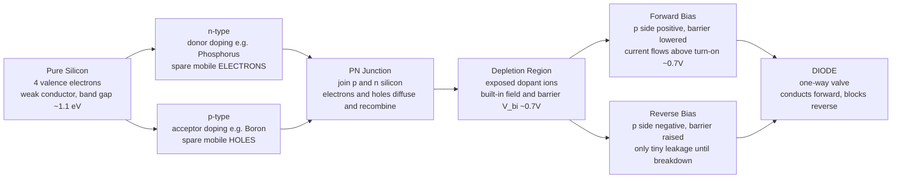

# 🔀 Semiconductor Devices and Diodes

> [!abstract] TL;DR
> A **diode** is a two-terminal device that lets current flow one way and blocks it the other, made by joining two subtly different "flavours" of silicon — **n-type** (doped to have spare mobile electrons) and **p-type** (doped to have spare mobile holes). Their meeting point, the **PN junction**, grows a built-in electric field that conducts under **forward bias** (past a turn-on of ~0.7 V in silicon) and blocks under **reverse bias** until breakdown, an exponential relationship captured by the **Shockley equation**. This one-way trick is the *atom of electronics*: it rectifies AC into DC, references voltage (Zener), emits light (LED), harvests sunlight (solar cell), and — once you add a third terminal — becomes the **transistor** that amplifies and switches inside every chip.

---

## Intuition

**Analogy:** A diode is a **one-way valve for electricity** — like a subway turnstile that lets people through in one direction but slams shut against the other. Push current *forward* and it flows freely; try to push it *backward* and the door holds. A rare determined jumper still sneaks over the barrier — that trickle is the diode's tiny reverse leakage current.

The valve is not a mechanical part; it is a *material* trick. Take pure silicon (a mediocre conductor) and sprinkle in two different impurities to make two blocks: one with an excess of mobile negative charges (electrons) and one with an excess of mobile positive charges (holes). Press the blocks together and, right at the seam, the electrons and holes annihilate each other, leaving behind a thin *charged no-man's-land* — the **depletion region** — whose built-in field is exactly the closed turnstile. Lean on it the right way and the barrier collapses and current gushes; lean on it the wrong way and the barrier grows and nothing moves. Everything below is just the physics of *why* the turnstile only turns one way.

---

## How It Works

### Core Mechanics

1. **Start with silicon.** A silicon atom has four valence electrons locked into covalent bonds — a nearly full valence band separated from the empty conduction band by a **band gap** of about $1.12$ eV. Cold, pure silicon barely conducts.
2. **Dope it to control conductivity.** Replace a few silicon atoms with **donor** impurities (phosphorus, 5 valence electrons) and each donates one loosely bound electron to the conduction band — this is **n-type** silicon, where mobile **electrons** carry the current. Replace them instead with **acceptor** impurities (boron, 3 valence electrons) and each creates a missing bond — a **hole** — that behaves like a mobile positive charge: **p-type** silicon. Doping changes conductivity by orders of magnitude and is *tunable by design*.
3. **Join p and n — carriers diffuse.** At the metallurgical boundary, electrons from the n-side and holes from the p-side diffuse across and **recombine**. This strips a thin layer on each side of its mobile carriers, exposing the fixed dopant ions (positive on the n-side, negative on the p-side).
4. **A built-in field appears.** Those exposed ions form the **depletion region** and set up an internal electric field and a **built-in potential** $V_{bi}$ (about $0.7$ V in silicon) that opposes further diffusion. At equilibrium, diffusion and drift exactly cancel: no net current.
5. **Forward bias — barrier down.** Connect the **p** side to **+** and the **n** side to **−**. The applied voltage opposes $V_{bi}$, narrows the depletion region, and lowers the barrier. Once the applied voltage exceeds the **turn-on / cut-in voltage** (~$0.7$ V for Si, ~$0.3$ V for Ge, ~$2$–$3$ V for an LED), carriers flood across and current rises **exponentially**.
6. **Reverse bias — barrier up.** Swap the polarity and the applied voltage *reinforces* $V_{bi}$, widening the depletion region. Only a tiny **reverse saturation current** $I_S$ (thermally generated minority carriers) leaks through — until the field gets so strong the junction suffers **reverse breakdown** (avalanche or Zener), where current shoots up at a well-defined voltage.
7. **The I-V law.** All of this is summarised by the **Shockley diode equation**, $I = I_S\left(e^{\,V/(nV_T)} - 1\right)$, where $V_T = kT/q \approx 25.85$ mV at room temperature ($300$ K), $n$ is the ideality factor ($\approx 1$–$2$), and $I_S$ is the reverse saturation current.

### Flow / Architecture



---

## Key Concepts

### Secondary Level

- **Semiconductor** — a material (silicon, germanium) whose conductivity sits *between* a metal and an insulator and, crucially, can be **controlled**.
- **Doping** — deliberately adding impurities: **donors** make **n-type** (extra electrons), **acceptors** make **p-type** (extra holes).
- **Diode** — a one-way valve for current. Its two terminals are the **anode** (p-side) and **cathode** (n-side); the arrow of the schematic symbol points the way current flows.
- **Forward vs reverse bias** — connect the anode positive to conduct; reverse it to block.
- **Turn-on voltage** — a silicon diode needs about **0.7 V** across it before it conducts meaningfully.

### Undergraduate Level

- **The PN junction** — diffusion, recombination, the **depletion region**, and the **built-in potential** $V_{bi}$ that arises with no external supply.
- **Drift and diffusion currents** — carriers move both by the electric field (**drift**) and down concentration gradients (**diffusion**); at equilibrium they cancel.
- **Shockley equation** — $I = I_S\left(e^{\,V/(nV_T)} - 1\right)$; the exponential turn-on, near-zero reverse current $\approx -I_S$, and sharp "knee". **Thermal voltage** $V_T = kT/q \approx 26$ mV.
- **Diode models for analysis** — trade accuracy for tractability:
  - **Ideal switch:** short when forward, open when reverse (0 V drop).
  - **Constant-drop:** open until $0.7$ V, then a fixed $0.7$ V drop while conducting — the workhorse for hand analysis.
  - **Small-signal:** linearise around a DC operating point with dynamic resistance $r_d = nV_T/I_D$.
  - **Full exponential:** the Shockley curve itself, for simulation/SPICE.
- **Rectification** — using the one-way property to turn AC into DC: **half-wave** (one diode), **full-wave bridge** (four diodes), then a **smoothing capacitor** to reduce **ripple**.
- **Reverse breakdown** — avalanche (impact ionisation) and Zener (tunnelling) — destructive for ordinary diodes, but *useful and controlled* in Zener diodes.

### Graduate Level

- **Band structure and the band gap** — from solving the Schrödinger equation in a periodic crystal potential: valence/conduction bands, effective mass, and why $E_g$ sets the turn-on voltage, the emission wavelength of an LED, and the absorption edge of a solar cell.
- **Carrier statistics** — Fermi-Dirac occupation, the Fermi level, and how doping shifts it toward the conduction band (n) or valence band (p); **intrinsic** ($n = p = n_i$) vs **extrinsic** carriers.
- **Junction electrostatics** — solving Poisson's equation across the depletion region for its width $W$, the field profile, and the voltage-dependent **junction capacitance** $C_j \propto 1/\sqrt{V_{bi}-V}$ (exploited by **varactors**).
- **Recombination-generation** — Shockley-Read-Hall statistics, minority-carrier lifetimes, and their role in $I_S$, LED efficiency, and solar-cell performance.
- **Heterojunctions and special structures** — joining different-band-gap materials for lasers, high-electron-mobility transistors, and multi-junction solar cells; the frontier where device physics meets quantum confinement.

---

## Python Demo

```python
# Two demos in one:
#   (a) The Shockley diode I-V curve and its analysis models (ideal / constant-drop)
#   (b) Half-wave, full-wave, and capacitor-smoothed rectifiers (AC -> DC)
import numpy as np
import matplotlib.pyplot as plt

# --- Physical constants and diode parameters ---
q  = 1.602e-19          # electron charge (C)
kB = 1.381e-23          # Boltzmann constant (J/K)
T  = 300.0              # temperature (K)
VT = kB * T / q         # thermal voltage ~ 0.02585 V (25.85 mV)
Is = 1e-12              # reverse saturation current (A)
n  = 1.0                # ideality factor (~1 for silicon)
print(f"Thermal voltage VT = {VT*1e3:.2f} mV at T = {T:.0f} K")

# ================= (a) Shockley I-V curve + models =================
V = np.linspace(-0.8, 0.8, 1000)
I = Is * (np.exp(V / (n * VT)) - 1.0)       # Shockley equation (amperes)

fig1, ax = plt.subplots(1, 2, figsize=(13, 4.6))

# Full curve in mA: exponential turn-on near 0.7 V
ax[0].plot(V, I * 1e3, lw=2.2, color="#00b894",
           label="Shockley:  I = Is(exp(V/nVT) - 1)")
ax[0].axvline(0.7, color="#e17055", ls="--", lw=1.8,
              label="constant-drop model (0.7 V)")
ax[0].axvline(0.0, color="#636e72", ls=":",  lw=1.6,
              label="ideal-diode model (0 V)")
ax[0].set_ylim(-2, 20)
ax[0].set_title("Diode I-V: exponential 'knee' near 0.7 V (Si)")
ax[0].set_xlabel("diode voltage V  [V]")
ax[0].set_ylabel("diode current I  [mA]")
ax[0].axhline(0, color="k", lw=0.6); ax[0].axvline(0, color="k", lw=0.6)
ax[0].legend(fontsize=8); ax[0].grid(True, alpha=0.3)

# Zoom on the reverse region: current saturates at about -Is (nanoamp scale)
ax[1].plot(V, I * 1e9, lw=2.2, color="#0984e3")
ax[1].set_xlim(-0.8, 0.4); ax[1].set_ylim(-2, 2)
ax[1].set_title("Reverse leakage saturates at about -Is (tiny)")
ax[1].set_xlabel("diode voltage V  [V]")
ax[1].set_ylabel("diode current I  [nA]")
ax[1].axhline(0, color="k", lw=0.6); ax[1].axvline(0, color="k", lw=0.6)
ax[1].grid(True, alpha=0.3)

fig1.tight_layout()
fig1.savefig("diode_iv.png", dpi=120)

# ================= (b) Rectifiers: AC -> DC =================
f  = 60.0                                   # mains frequency (Hz)
Vm = 10.0                                   # peak AC amplitude (V)
t  = np.linspace(0, 3.0 / f, 3000)          # three cycles
dt = t[1] - t[0]
vin = Vm * np.sin(2 * np.pi * f * t)        # AC input

Vd = 0.7                                     # one diode drop (constant-drop model)
v_half = np.clip(vin - Vd, 0, None)          # half-wave: positive halves only
v_full = np.clip(np.abs(vin) - 2 * Vd, 0, None)  # full-wave bridge: two drops

# Full-wave bridge feeding a smoothing capacitor into a load resistor.
# When the rectified source exceeds the cap voltage, diodes conduct and
# the cap charges to the source; otherwise the cap discharges into the load.
R = 1000.0                                   # load resistance (ohms)
C = 100e-6                                   # smoothing capacitor (farads)
vsrc = np.clip(np.abs(vin) - 2 * Vd, 0, None)
vcap = np.zeros_like(t)
for i in range(1, len(t)):
    if vsrc[i] > vcap[i - 1]:
        vcap[i] = vsrc[i]                    # diode conducts: cap follows source
    else:
        vcap[i] = vcap[i - 1] * np.exp(-dt / (R * C))  # diodes off: RC discharge
ripple = vcap.max() - vcap.min()
print(f"Peak-to-peak ripple with C = {C*1e6:.0f} uF, R = {R:.0f} ohm: {ripple:.3f} V")

fig2, bx = plt.subplots(1, 3, figsize=(16, 4.2), sharey=True)
tm = t * 1e3

bx[0].plot(tm, vin, color="#b2bec3", lw=1.2, label="AC input")
bx[0].plot(tm, v_half, color="#e17055", lw=2, label="half-wave out")
bx[0].set_title("Half-wave rectifier (1 diode)")

bx[1].plot(tm, vin, color="#b2bec3", lw=1.2, label="AC input")
bx[1].plot(tm, v_full, color="#00b894", lw=2, label="full-wave out")
bx[1].set_title("Full-wave bridge (4 diodes)")

bx[2].plot(tm, v_full, color="#b2bec3", lw=1.2, label="unfiltered")
bx[2].plot(tm, vcap, color="#6c5ce7", lw=2.2, label="with smoothing cap")
bx[2].set_title(f"Full-wave + capacitor: DC with ~{ripple:.2f} V ripple")

for a in bx:
    a.axhline(0, color="k", lw=0.6)
    a.set_xlabel("time  [ms]")
    a.legend(fontsize=8); a.grid(True, alpha=0.3)
bx[0].set_ylabel("voltage  [V]")

fig2.tight_layout()
fig2.savefig("rectifiers.png", dpi=120)
plt.show()
```

The first figure shows the diode's defining shape: a flat, near-zero reverse region, then an explosive exponential "knee" around $0.7$ V that the crude **constant-drop** and **ideal** models approximate with a single vertical line. The second figure is the diode's flagship job — the AC sinusoid becomes a lumpy one-sided waveform (rectification), and adding a **smoothing capacitor** flattens it into usable DC with a small residual **ripple**. That is, in miniature, the front end of every wall-wart and phone charger on Earth.

---

## Real-World Applications

- **Power supplies (rectification)** — the flagship use. Every AC-to-DC adapter, laptop charger, and appliance power stage uses a **bridge rectifier + smoothing capacitor** to convert mains AC into the DC that electronics need. Bigger capacitors and voltage regulators shrink the ripple further.
- **Voltage references and regulation (Zener diodes)** — operated *in reverse breakdown*, a Zener holds a stable voltage across itself, giving cheap references, over-voltage clamps, and simple shunt regulators.
- **Lighting and displays (LEDs)** — forward-biased diodes made from direct-band-gap materials emit photons whose colour is set by the band gap; the backbone of modern lighting, indicators, and every screen's backlight or pixel.
- **Energy harvesting and sensing (photodiodes and solar cells)** — a reverse-biased or unbiased junction turns incoming photons into current: solar panels, camera sensors, optical receivers, and light meters.
- **High-speed and low-loss switching (Schottky diodes)** — a metal-semiconductor junction with a low (~$0.2$–$0.3$ V) drop and almost no charge storage, used in switch-mode power supplies, RF mixers, and logic clamps where speed and efficiency matter.
- **Protection and signal shaping** — flyback/freewheeling diodes across inductive loads (relays, motors) absorb voltage spikes; clamping and steering diodes protect inputs; and small-signal diodes clip, mix, and detect in radio and analog circuits.
- **Tunable capacitance (varactors)** — the voltage-dependent junction capacitance is used to tune oscillators and filters in radios and phase-locked loops.

---

## Common Pitfalls

- **Forgetting the ~0.7 V drop.** Beginners treat a conducting silicon diode as a perfect wire (ideal model) when precision matters, or as always-blocking when it is really conducting. Use the **constant-drop (0.7 V)** model for hand analysis, the **ideal** model only for quick sign-checking, and the **exponential** model in SPICE. Germanium (~0.3 V), Schottky (~0.2 V), and LEDs (~2–3 V) all have *different* turn-ons — do not assume 0.7 V everywhere.
- **Reversing the diode.** Anode-to-cathode orientation is the whole point. A diode installed backward blocks current you wanted, or (for a Zener, whose job is reverse breakdown) is installed the *wrong* way if you connect it like an ordinary rectifier. The schematic arrow points in the direction of conventional forward current.
- **Driving an LED without a current-limiting resistor.** Because the I-V is exponential, a tiny voltage overshoot past turn-on causes a huge current surge — connecting an LED straight across a supply burns it out almost instantly. Always limit current with a series resistor or a constant-current driver.
- **Exceeding reverse breakdown (or peak inverse voltage).** An ordinary rectifier reverse-biased past its rated PIV avalanches and can be destroyed. In a bridge rectifier the diodes must withstand the full peak input; size their voltage rating accordingly.
- **Expecting clean DC straight from a rectifier.** Rectification alone gives a lumpy, pulsating output — the **ripple**. You need a **smoothing capacitor** (and often a regulator) to get flat DC. Too small a capacitor leaves large ripple; too large a one draws huge, brief charging current spikes that stress the diodes.
- **Ignoring temperature.** The Shockley current depends strongly on $T$ (through both $I_S$ and $V_T$): the forward drop falls roughly $2$ mV per °C, and reverse leakage roughly doubles every ~10 °C. In power diodes this feeds **thermal runaway** if heat is not managed.
- **Confusing conventional current with electron flow.** In n-type material electrons carry the current, but conventional current (and the schematic arrow) points opposite to electron motion. Mixing the two conventions mid-analysis is a classic sign error.
- **Assuming doping "adds charge".** Doped silicon is still electrically **neutral** overall — donors and acceptors add *mobile* carriers but come with matching fixed ionic charge. It is the *mobility* of carriers, not net charge, that doping controls.

---

## Related Concepts

- [[Semiconductors_Intrinsic_and_Extrinsic]] — the materials-science view of doping: intrinsic vs extrinsic carriers, donors/acceptors, and carrier concentrations behind n- and p-type silicon.
- [[p_n_Junctions_and_Diodes]] — the deep materials-physics treatment of the same junction, depletion electrostatics, and the Shockley equation from a devices angle.
- [[Semiconductors_and_Devices]] — the condensed-matter-physics perspective on the band gap, the p-n junction, and how stacking junctions yields transistors, LEDs, and solar cells.
- [[Crystal_Structure_and_Band_Theory]] — where the band gap actually comes from: periodic crystal potentials, valence/conduction bands, and why silicon conducts as it does.
- [[Optical_Properties_and_Photonic_Materials]] — the optoelectronic cousins of the diode: light emission (LEDs/lasers) and absorption (photodiodes, solar cells).
- [[Schrodinger_Equation]] — the quantum foundation; solving it in a periodic potential produces the bands and gaps that make semiconductors possible.
- [[Boolean_Algebra_and_Logic_Gates]] — the digital endpoint of this story: add a third terminal to the junction to get a transistor, wire transistors into gates, and gates into every processor.

*Sibling notes in this section (Analog Electronics) that build directly on this one: **Bipolar_Junction_Transistors** and **MOSFETs_and_CMOS** (add a third terminal to the junction to amplify and switch), **Operational_Amplifiers** (the universal analog building block), and **Photonics_and_Optoelectronics** (the light-emitting and light-absorbing junction devices). See also the **Electrical_Engineering_Overview** for how analog electronics fits the broader discipline.*

---

## Review Questions

1. **(Secondary)** Using the one-way-turnstile analogy, explain what "forward bias" and "reverse bias" mean, and why a silicon diode needs roughly $0.7$ V across it before current flows appreciably. What is the diode doing in each case?
2. **(Undergraduate)** You feed a $10$ V-peak, $60$ Hz sinusoid into a full-wave bridge rectifier followed by a smoothing capacitor into a $1\,\text{k}\Omega$ load. Sketch the output. Qualitatively, what happens to the peak-to-peak *ripple* if you double the capacitor? If you halve the load resistance? Why?
3. **(Graduate)** Explain, from band theory and junction electrostatics, why the diode's forward turn-on voltage, an LED's emission colour, and a solar cell's absorption edge are all controlled by the *same* parameter. Given that parameter, how would you choose a semiconductor material for (a) a red LED and (b) an efficient single-junction solar cell, and what trade-offs arise?

---

## Sources

- Sedra, A. & Smith, K. — *Microelectronic Circuits* (Oxford) — the canonical analog electronics text; diodes, models, rectifiers, and the road to transistors.
- Streetman, B. & Banerjee, S. — *Solid State Electronic Devices* (Pearson) — semiconductor physics and the p-n junction from first principles.
- Neamen, D. — *Semiconductor Physics and Devices* (McGraw-Hill) — carriers, doping, junction electrostatics, and the Shockley equation in depth.
- Razavi, B. — *Fundamentals of Microelectronics* (Wiley) — a modern, intuition-first development of the diode and its circuit applications.

---

#electrical-engineering #semiconductors #diodes #pn-junction #rectifier
