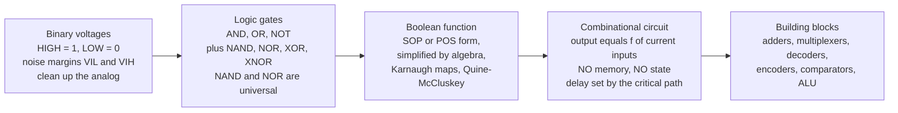

# 🔢 Boolean Logic and Combinational Circuits

> [!abstract] TL;DR
> All of digital electronics rests on the humblest decision: **is the voltage HIGH or LOW — a 1 or a 0?** Squeeze every noisy analog voltage into two clean levels (with **noise margins** $V_{IL}/V_{IH}$ so real signals still read reliably), wire those bits through **logic gates** (AND, OR, NOT, and their combinations NAND, NOR, XOR), and you can realize *any* Boolean function. A **combinational circuit** is pure input-to-output logic with **no memory** — its output depends only on the inputs *right now* — and from this you build adders, multiplexers, decoders, comparators, and the ALU at the heart of every CPU. This note is the EE/silicon-implementation view of the same logic that [[Boolean_Algebra_and_Logic_Gates]] and [[Combinational_Circuits]] cover from the architecture side, and it is the compute half of every processor. It opens the **Digital Electronics & Systems** section; sequential logic (memory) comes next.

## Intuition — analogy FIRST

Imagine a **vending machine's coin-checker**. You drop in coins, and a little mechanism instantly decides one thing: *"is there enough money for this item — yes or no?"* It has no memory of yesterday, no notion of who you are, no internal state that lingers. Given the coins present **right now**, it produces an answer **right now**. Feed it the same coins tomorrow and it gives the same answer. That is *exactly* what a **combinational circuit** is: a pure function from present inputs to present outputs, computed as fast as electrons can flow through gates.

The atom of the whole game is a single **yes/no decision** — a wire that is either near the supply voltage (call it **1**, HIGH) or near ground (call it **0**, LOW). Real voltages are noisy and analog, but digital circuits impose a brilliant discipline: *any* voltage above a threshold $V_{IH}$ counts as 1, *any* voltage below $V_{IL}$ counts as 0, and the forbidden band between is designed never to be a valid steady output. This **binary abstraction** — throwing away analog detail on purpose — is the single trick that makes digital hardware astonishingly robust to noise, temperature, and aging where analog circuits drift.

From that one binary atom, wired through gates that compute **AND** (all inputs true), **OR** (any input true), and **NOT** (flip it), you can build a machine that adds numbers, compares them, routes data, selects one of many signals, and — chained with memory — computes literally *anything computable*. Combinational logic is where **Boolean algebra becomes silicon**.

---

## How It Works

The pipeline runs from physics to arithmetic in four stages. Two continuous voltage levels get **quantized** into bits; bits flow through **gates** that each compute one primitive Boolean operation; gates are **wired together** to realize a chosen Boolean function; and the resulting **combinational block** — memoryless, its output a pure function of the current inputs — becomes a reusable building block like an adder or multiplexer.



The two invariants that define this whole layer: **(1) the binary abstraction** — information lives in two voltage bands, not a continuum, so noise below the margin is rejected outright; and **(2) memorylessness** — a combinational circuit holds no state, so the same inputs always yield the same outputs after the gates settle. Add memory (feedback with storage) and you leave combinational logic for **sequential logic** — the subject of the next note, where flip-flops and clocks enter.

---

## Key Concepts

### Secondary Level

- **The bit and the binary abstraction.** One wire carries one **bit**: HIGH ($\approx V_{DD}$) is **1**, LOW ($\approx 0\,\text{V}$) is **0**. The circuit refuses to treat in-between voltages as valid steady values — that discipline is what makes digital robust.
- **The three primitive gates.**
  - **NOT** (inverter): output is the opposite of the input. $\overline{A}$.
  - **AND**: output 1 only when **all** inputs are 1. $A \cdot B$.
  - **OR**: output 1 when **any** input is 1. $A + B$.
- **Truth tables.** A complete list of every input combination and the resulting output — the ground truth of what a logic circuit *does*. An $n$-input circuit has $2^n$ rows.
- **Combinational = no memory.** Output depends **only** on the inputs present now. There is no "remember what happened before" — that is the defining contrast with sequential logic.

### Undergraduate Level

- **Noise margins (the physical 0 and 1).** A gate guarantees valid *outputs* $V_{OH}$ (high) and $V_{OL}$ (low), and accepts *inputs* above $V_{IH}$ or below $V_{IL}$. The gaps $NM_H = V_{OH} - V_{IH}$ and $NM_L = V_{IL} - V_{OL}$ are the **noise margins** — how much interference a signal can pick up and still be read correctly. Positive, generous margins are why a long noisy PCB trace still delivers a clean bit.
- **Derived and universal gates.** **NAND** ($\overline{A \cdot B}$), **NOR** ($\overline{A + B}$), **XOR** ($A \oplus B$, "differ"), **XNOR** ($\overline{A \oplus B}$, "same"). Crucially, **NAND and NOR are *universal*** — you can build *every* Boolean function using only NANDs (or only NORs). That is why real CMOS libraries are NAND/NOR-heavy: one primitive suffices.
- **Boolean algebra.** The algebra of $\{0,1\}$: identities like $A + \overline{A} = 1$, $A \cdot \overline{A} = 0$, distributivity $A(B+C)=AB+AC$, and **De Morgan's laws** $\overline{A \cdot B} = \overline{A} + \overline{B}$, $\overline{A + B} = \overline{A}\cdot\overline{B}$ (the reason NAND/NOR are universal).
- **Canonical forms.** Any function can be written as a **Sum of Products (SOP)** — an OR of AND-terms (minterms), or a **Product of Sums (POS)** — an AND of OR-terms (maxterms). SOP maps directly to a two-level **AND-then-OR** gate network.
- **Minimization → fewer gates.** The canonical form is correct but wasteful. **Karnaugh maps** (visual grouping of adjacent 1s) and **Quine-McCluskey** (a tabular, algorithmic method) find the minimal SOP, cutting gate count, silicon area, cost, power, and delay. Fewer literals = fewer transistors.
- **Combinational building blocks.**
  - **Adders** — half adder, full adder, ripple-carry, carry-lookahead (below).
  - **Multiplexer (MUX)** — an $n$-to-1 selectable switch; **demultiplexer** routes one input to one of many outputs.
  - **Decoder** — $n$ inputs to $2^n$ one-hot outputs (address decoding); **encoder** does the reverse (often a **priority encoder** for interrupts).
  - **Comparator** — tests $A = B$, $A < B$, $A > B$.
  - **ALU (Arithmetic-Logic Unit)** — the compute core of a CPU: a mux-selected bundle of adders and logic ops.

### Graduate Level

- **Propagation delay and the critical path.** Every gate takes a finite time $t_{pd}$ to switch. The **critical path** is the *slowest* input-to-output chain through the circuit; it sets the maximum clock frequency of the whole system. Combinational logic is "instant" only in the idealized model — in silicon, delay is the currency you spend.
- **Why ripple-carry is slow → carry-lookahead exists.** In a ripple-carry adder the carry must propagate through *all* $N$ full adders in series, so delay grows **linearly**, $O(N)$. **Carry-lookahead** precomputes each stage's carry from **generate** $g_i = a_i b_i$ and **propagate** $p_i = a_i \oplus b_i$ signals in parallel, collapsing delay to $O(\log N)$ — the classic area-for-speed trade that appears throughout fast arithmetic (carry-select, carry-save, Kogge-Stone).
- **Glitches and hazards.** Because paths have *unequal* delays, an output can momentarily flip to the wrong value before settling — a **static hazard** (a transient glitch). It is harmless if the output is only sampled after settling, but dangerous if it feeds an asynchronous input (e.g. a clock or clear). Redundant "consensus" terms (extra K-map groupings) can cover hazards.
- **CMOS realizes the gates.** Each gate is a network of MOSFETs: a **pull-up** network of PMOS to $V_{DD}$ and a complementary **pull-down** network of NMOS to ground. CMOS naturally produces *inverting* gates (NAND/NOR/NOT), which is why those are cheapest — an AND is a NAND followed by an inverter. Static CMOS draws near-zero standby current, dissipating power mainly when it *switches* ($P \approx \alpha C V_{DD}^2 f$). This ties directly to the MOSFET/CMOS note in the analog and device sections.
- **Fan-out and loading.** One gate output can drive only so many gate inputs before its rise/fall time degrades and delay balloons — its **fan-out** limit. Large loads (long buses, many sinks) need **buffers** or repeaters, a first-order timing concern in real chips.
- **Timing analysis.** Static timing analysis (STA) sums worst-case gate and wire delays along every path to prove the circuit meets the clock period *before* fabrication — the industrial descendant of "find the critical path."

---

## Python Demo

```python
# Boolean logic in silicon, two experiments:
#   (A) TRUTH TABLE + MINIMIZATION: build a 3-variable function's truth table and
#       reduce it with a Quine-McCluskey-style prime-implicant search; count the
#       gate/literal cost before vs after.
#   (B) COMBINATIONAL BUILDING BLOCK: build a 1-bit FULL ADDER from gates, chain
#       into an N-bit RIPPLE-CARRY ADDER, verify it adds correctly over ALL inputs,
#       and show why carry rippling makes delay grow linearly (-> carry-lookahead).
# numpy + matplotlib only.
import numpy as np
import matplotlib.pyplot as plt
from itertools import combinations

# =====================================================================
# PART A: Truth table + Boolean minimization
# =====================================================================
# f(A,B,C) = 1 on minterms {0,1,2,5,6,7}.  (minterm index = 4A + 2B + C)
n_vars   = 3
names    = "ABC"
minterms = [0, 1, 2, 5, 6, 7]

# ---- full truth table: rows of [A, B, C, f] ----
truth = []
for i in range(2 ** n_vars):
    bits = [(i >> (n_vars - 1 - k)) & 1 for k in range(n_vars)]   # A,B,C (MSB first)
    truth.append(bits + [1 if i in minterms else 0])
truth = np.array(truth)

# ---- Quine-McCluskey: merge adjacent implicants until none merge -> primes ----
to_str = lambda i: format(i, f"0{n_vars}b")

def merge(a, b):
    diff = [k for k in range(n_vars) if a[k] != b[k]]
    if len(diff) == 1:                       # differ in exactly one position
        return a[:diff[0]] + '-' + a[diff[0] + 1:]
    return None

groups, prime = {to_str(m) for m in minterms}, set()
while groups:
    used, new = set(), set()
    for x, y in combinations(groups, 2):
        m = merge(x, y)
        if m is not None:
            new.add(m); used.add(x); used.add(y)
    prime |= (groups - used)                 # anything that never merged is prime
    groups = new
prime = sorted(prime)

def covers(imp):                             # minterms an implicant covers
    return {m for m in range(2 ** n_vars)
            if all(imp[k] == '-' or imp[k] == to_str(m)[k] for k in range(n_vars))}
pi_cover = {p: covers(p) for p in prime}

# ---- exact minimum cover: smallest set of primes covering all minterms ----
target, best = set(minterms), None
for r in range(1, len(prime) + 1):
    for combo in combinations(prime, r):
        if set().union(*(pi_cover[p] for p in combo)) == target:
            best = combo; break
    if best:
        break

def term_str(imp):
    lits = [names[k] + ("'" if ch == '0' else "") for k, ch in enumerate(imp) if ch != '-']
    return "".join(lits) if lits else "1"
minimized = " + ".join(term_str(p) for p in best)

# ---- cost accounting: literals = gate inputs (a proxy for transistors) ----
canon_terms, canon_lits = len(minterms), len(minterms) * n_vars
min_terms  = len(best)
min_lits   = sum(sum(ch != '-' for ch in p) for p in best)
print("Canonical SOP:", canon_terms, "product terms,", canon_lits, "literals")
print("Minimized SOP: f =", minimized, "->", min_terms, "terms,", min_lits, "literals")

# ---- verify the minimized expression reproduces the truth table exactly ----
def eval_min(A, B, C):
    v, out = {'A': A, 'B': B, 'C': C}, 0
    for p in best:
        t = 1
        for k, ch in enumerate(p):
            if ch == '1': t &= v[names[k]]
            elif ch == '0': t &= 1 - v[names[k]]
        out |= t
    return out
assert all(eval_min(*truth[i, :3]) == truth[i, 3] for i in range(len(truth)))
print("Minimized == truth table for all rows: PASS")

# =====================================================================
# PART B: full adder -> ripple-carry adder, correctness + delay growth
# =====================================================================
def full_adder(a, b, cin):
    s    = a ^ b ^ cin                       # sum   = XOR chain
    cout = (a & b) | (a & cin) | (b & cin)   # carry = majority(a, b, cin)
    return s, cout

def ripple_carry_add(A, B, nbits):
    carry, result = 0, 0
    for k in range(nbits):                   # LSB -> MSB, carry threads through
        s, carry = full_adder((A >> k) & 1, (B >> k) & 1, carry)
        result |= s << k
    return result | (carry << nbits)         # append final carry-out

nbits = 4
ok = all(ripple_carry_add(A, B, nbits) == A + B
         for A in range(2 ** nbits) for B in range(2 ** nbits))
print(f"{nbits}-bit ripple-carry adder correct over all "
      f"{2**nbits}x{2**nbits} inputs: {'PASS' if ok else 'FAIL'}")

S_mat = np.array([[ripple_carry_add(A, B, nbits) for B in range(2 ** nbits)]
                  for A in range(2 ** nbits)])           # visual proof it = A+B

# ---- delay models in unit gate-delays ----
bits     = np.arange(1, 33)
t_ripple = 2 * bits + 1               # carry ripples: ~2 gate delays per stage -> O(N)
t_cla    = 4 + 2 * np.log2(bits)      # carry-lookahead: parallel g/p tree     -> O(log N)

# =====================================================================
# PLOTS
# =====================================================================
fig, ax = plt.subplots(2, 2, figsize=(14, 10))

# (0,0) truth table as a grid
tbl = ax[0, 0]
tbl.imshow(truth, cmap="Blues", aspect="auto", vmin=0, vmax=1)
for i in range(truth.shape[0]):
    for j in range(truth.shape[1]):
        tbl.text(j, i, truth[i, j], ha="center", va="center",
                 color="white" if truth[i, j] else "black", fontsize=12)
tbl.set_xticks(range(4)); tbl.set_xticklabels(["A", "B", "C", "f"])
tbl.set_yticks(range(8)); tbl.set_yticklabels([f"m{i}" for i in range(8)])
tbl.set_title("Truth Table  f(A,B,C) = sum m(0,1,2,5,6,7)")

# (0,1) cost before vs after minimization
bar = ax[0, 1]
x = np.arange(2)
bar.bar(x - 0.2, [canon_terms, min_terms], 0.4, label="product terms")
bar.bar(x + 0.2, [canon_lits, min_lits], 0.4, label="literals (gate inputs)")
for xi, (t, l) in zip(x, [(canon_terms, canon_lits), (min_terms, min_lits)]):
    bar.text(xi - 0.2, t + 0.2, t, ha="center"); bar.text(xi + 0.2, l + 0.2, l, ha="center")
bar.set_xticks(x); bar.set_xticklabels(["Canonical SOP", f"Minimized\nf = {minimized}"])
bar.set_ylabel("count"); bar.set_title("Minimization cuts gate count")
bar.legend(); bar.grid(True, axis="y", alpha=0.3)

# (1,0) ripple-carry output surface -> a clean gradient == A + B
img = ax[1, 0]
im  = img.imshow(S_mat, origin="lower", cmap="viridis")
img.set_xlabel("B"); img.set_ylabel("A")
img.set_title(f"{nbits}-bit Ripple-Carry Adder output (= A + B, verified)")
fig.colorbar(im, ax=img, label="sum A + B")

# (1,1) delay vs word width: ripple O(N) vs carry-lookahead O(log N)
dly = ax[1, 1]
dly.plot(bits, t_ripple, "o-", label="ripple-carry  ~ 2N  (O(N))")
dly.plot(bits, t_cla, "s-", label="carry-lookahead ~ log N  (O(log N))")
dly.set_xlabel("adder width N (bits)"); dly.set_ylabel("critical-path delay (gate delays)")
dly.set_title("Why fast adders exist: carry ripple grows linearly")
dly.legend(); dly.grid(True, alpha=0.3)

plt.tight_layout()
plt.savefig("boolean_combinational.png", dpi=120)
print("Saved boolean_combinational.png")
```

**What it shows.** Part A takes a 3-variable function whose *canonical* SOP needs **6 product terms / 18 literals** and, purely by merging adjacent minterms into prime implicants, reduces it to **$f = A'B' + BC' + AC$** — **3 terms / 6 literals**, a two-thirds cut in gate inputs — then *proves* the reduced expression matches the original truth table on every row. Part B builds a full adder from XOR-and-majority gates, chains it into a 4-bit ripple-carry adder, and exhaustively confirms it computes $A+B$ for all $256$ input pairs (the output surface is a clean gradient). The final panel is the punchline: ripple-carry delay climbs **linearly** with word width because the carry must ripple through every stage, while carry-lookahead flattens to **logarithmic** — the exact reason real ALUs never use naive ripple adders for wide words.

---

## Real-World Applications

- **CPU/GPU arithmetic-logic units.** The ALU is a slab of combinational logic — adders, shifters, comparators, and bitwise AND/OR/XOR — muxed by the opcode. Every `ADD`, `AND`, `CMP` instruction is combinational logic firing between clock edges.
- **High-speed adders in every processor.** Carry-lookahead, carry-select, and prefix (Kogge-Stone) adders exist purely to beat ripple-carry's linear delay — a direct application of the propagation-delay analysis above.
- **Memory address decoding.** An $n$-to-$2^n$ **decoder** turns an address into a one-hot "select this row/chip" signal — the combinational glue that lets a CPU pick one word out of billions.
- **Data routing and selection.** **Multiplexers** switch buses, select register-file outputs, and implement conditional data paths; **FPGAs** realize *arbitrary* combinational functions in **lookup tables (LUTs)** — literally storing a small truth table in SRAM.
- **Interrupt controllers.** A **priority encoder** collapses many simultaneous interrupt requests into the index of the highest-priority one — combinational logic making a decision every cycle.
- **Error detection.** **XOR trees** compute parity and checksums; wide XOR/XNOR networks underpin CRC and ECC logic in memory and links.
- **Displays and glue logic.** Seven-segment decoders, bus comparators, and address-match logic are textbook combinational blocks in embedded systems.

---

## Common Pitfalls

- **Ignoring noise margins / the physical 0 and 1.** Bits are not magic — they are voltage *bands*. If a signal sags below $V_{IH}$ (weak driver, long trace, crosstalk, ground bounce), the receiver may misread a 1 as a 0. Always budget the noise margins $V_{OH}-V_{IH}$ and $V_{IL}-V_{OL}$; a level that is "logically 1" but electrically marginal is a field-failure waiting to happen.
- **Forgetting NAND and NOR are universal (and cheapest).** Beginners build with idealized AND/OR/NOT; real CMOS libraries are **NAND/NOR-first** because those map to a single complementary transistor network. An AND is a NAND *plus an inverter* — more delay and area. Design toward the primitives silicon actually gives you.
- **Skipping minimization.** Implementing the raw canonical SOP wastes gates, area, power, and delay. Use **Karnaugh maps** (by hand, up to ~4-5 vars) or **Quine-McCluskey / synthesis tools** to reach minimal SOP/POS. But do *not* over-minimize by hand for large functions — that is what logic synthesis is for.
- **Confusing combinational with sequential.** If your output depends on *history* (a count, a state, "what happened last clock"), it is **not** combinational — it needs memory (flip-flops), covered in the next note. A tell-tale sign you have accidentally created state: **unintended feedback** in a combinational netlist, which can latch or oscillate.
- **Treating gates as zero-delay.** The idealized "output = f(inputs)" is instantaneous; silicon is not. The **critical path** (slowest gate chain) caps clock speed. This is *the* reason ripple-carry is avoided for wide adders and why **carry-lookahead** exists — always ask "what is my longest path?"
- **Ignoring glitches / hazards.** Unequal path delays make outputs momentarily flip before settling. Harmless if only sampled after settling — **dangerous** if the glitchy signal drives a clock, reset, or asynchronous input. Add consensus terms or register the output.
- **Overloading a gate (fan-out).** One output driving too many inputs (or a long bus) slows its edges and blows the timing budget. Respect fan-out limits; insert **buffers** for heavy loads.
- **Forgetting gates are transistors.** Every gate is CMOS: it burns dynamic power $P \approx \alpha C V_{DD}^2 f$ when switching, and its speed depends on drive strength and load. Logic that looks "free" on paper has real area, power, and delay — the bridge to the MOSFETs/CMOS note.

---

## Related Concepts

- [[Boolean_Algebra_and_Logic_Gates]] — the Computer-Architecture-side treatment of the same gates, identities, and De Morgan's laws; this EE note is the *silicon-implementation* companion (voltages, margins, CMOS, timing).
- [[Combinational_Circuits]] — the architecture view of the identical building blocks (MUX, decoder, adder); pair it with this note's physical-reality angle (delay, hazards, fan-out).
- [[Arithmetic_Circuits_and_IEEE754]] — goes deeper on adders, multipliers, and floating-point hardware whose critical paths this note motivates.
- [[Sequential_Circuits_and_FSMs]] — what you get when you *add memory* to combinational logic: flip-flops, registers, and finite-state machines; the defining contrast drawn throughout this note.
- [[Hardware_Description_Languages]] — Verilog/VHDL describe these combinational functions for synthesis into real gate netlists.
- [[Propositional_Logic_and_Boolean_Semantics]] — the formal logic underlying Boolean algebra; truth tables and satisfiability are the mathematical bedrock of gate networks.
- [[Logic_and_Proof_Techniques]] — discrete-math foundations of Boolean operations, truth tables, and logical equivalence.
- [[Hardware_and_Circuit_Verification]] — formally *proving* a combinational (or sequential) circuit meets its specification, e.g. that an adder is correct for all inputs — the industrial version of this note's exhaustive test.
- [[Electrical_Engineering_Overview]] — the parent map placing digital logic among the six branches of EE.

*Sibling notes in this section (Digital Electronics & Systems), referenced here in prose and built next: Sequential_Logic_and_Flip_Flops (adds memory and clocking), Digital_System_Design_and_HDL (Verilog/VHDL design flow), MOSFETs_and_CMOS (the transistors that physically realize these gates), Memory_and_Programmable_Logic (ROM/RAM/PLA/FPGA), and Data_Converters_ADC_and_DAC (the analog-digital boundary).*

---

## Review Questions

1. **(Secondary)** Explain, using the vending-machine coin-checker analogy, what "combinational" means and why such a circuit has no memory. Then give the truth table of a 2-input **XOR** gate and describe in one sentence what real-world question ("are these two bits...?") it answers.
2. **(Undergraduate)** You are given $f(A,B,C) = \sum m(0,1,2,5,6,7)$. Draw its Karnaugh map, find the minimal SOP, and state how many product terms and literals you saved versus the canonical form. Separately, explain why you could build this entire function using **only NAND gates**, and what De Morgan's laws have to do with it.
3. **(Graduate)** A 32-bit ripple-carry adder is missing its timing target. Explain *precisely* why its delay grows as $O(N)$, identify the critical path, and describe how a **carry-lookahead** adder reduces this to $O(\log N)$ using generate/propagate signals. Then discuss one hazard that can arise in the resulting logic and how unequal path delays cause it — and why it might or might not matter given how the output is sampled.

---

## Sources

- Harris, D. M. & Harris, S. L. — *Digital Design and Computer Architecture* (Morgan Kaufmann) — the canonical modern bridge from gates and combinational blocks to a working processor. [Elsevier](https://www.elsevier.com/books/digital-design-and-computer-architecture/harris/978-0-12-800056-4)
- Mano, M. M. & Ciletti, M. D. — *Digital Design: With an Introduction to the Verilog HDL* (Pearson) — the standard undergraduate text on Boolean algebra, K-maps, and combinational/sequential design. [Pearson](https://www.pearson.com/en-us/subject-catalog/p/digital-design/P200000003318)
- Wakerly, J. F. — *Digital Design: Principles and Practices* (Pearson) — practical logic design with real device families, noise margins, and timing. [Pearson](https://www.pearson.com/en-us/subject-catalog/p/digital-design-principles-and-practices/P200000003322)
- Sedra, A. S. & Smith, K. C. — *Microelectronic Circuits* (Oxford) — the CMOS gate and transistor-level implementation of logic, noise margins, and static/dynamic power. [Oxford UP](https://global.oup.com/academic/product/microelectronic-circuits-9780199339136)
- Katz, R. H. & Borriello, G. — *Contemporary Logic Design* (Pearson) — combinational building blocks, hazards, and PLD/FPGA implementation. [Pearson](https://www.pearson.com/en-us/subject-catalog/p/contemporary-logic-design/P200000003300)

---

#electrical-engineering #digital-logic #combinational-circuits #boolean-algebra #adders
