# 🔌 Data Converters (ADC and DAC)

> [!abstract] TL;DR
> A **data converter** is the translator at the border between the **analog** physical world (continuous in time *and* amplitude) and the **digital** domain (discrete 0s and 1s). An **ADC** crosses the border in two steps — **sampling** (measure the signal at rate $f_s$) and **quantization** (round each sample to one of $2^N$ levels, $N$ = bit depth) — while a **DAC** reverses it (codes → voltages → **reconstruction filter** → smooth output). Two hard limits govern everything: **sampling in time** demands $f_s > 2 f_{\max}$ (the **Nyquist** condition; violate it and **aliasing** irreversibly folds high frequencies down to false low ones), and **quantization in amplitude** injects noise that caps the signal-to-noise ratio at $\mathrm{SNR} \approx 6.02 N + 1.76\text{ dB}$ — each extra bit buys about $6\text{ dB}$. Every sensor, microphone, camera, radio, and speaker lives or dies at this border.

## Intuition — analogy FIRST

The world is **analog**: sound, light, temperature, and pressure all vary *smoothly*, taking on any value at any instant. Computers, though, only speak in **0s and 1s** — discrete numbers, arriving at discrete moments. Data converters are the **bilingual translators** posted at this border.

An **ADC is like a photographer filming a moving scene**: it snaps the analog signal at regular instants (that snapping rate is the **sampling rate**) and rounds each snapshot to the nearest available number (how finely it can round is the **bit depth**). A **DAC does the reverse** — it reconstructs a smooth waveform out of a stream of numbers, exactly how your phone turns an MP3 back into music you can hear.

Every microphone, camera, sensor, and speaker crosses this analog–digital border, and how *faithfully* it crosses is set by just two numbers: **how fast** you snap (sampling rate) and **how finely** you round (bit depth). Get either too small and the digital copy lies about the original — a fast motion masquerades as a slow one, or a smooth curve turns into a coarse staircase.

---

## How It Works

An ADC performs two independent discretizations. **Sampling** discretizes *time*: it grabs the instantaneous value $x(nT_s)$ every $T_s = 1/f_s$ seconds, usually via a **sample-and-hold** that freezes the voltage while the converter measures it. **Quantization** discretizes *amplitude*: it maps that held voltage to the nearest of $2^N$ code levels, spaced one **LSB** apart, $q = \tfrac{V_{FS}}{2^N}$. The rounding error, bounded by $\pm q/2$, is **quantization noise**.

Because sampling *replicates* the signal's spectrum every $f_s$ Hz, any content above $f_s/2$ (the **Nyquist frequency**) overlaps a neighboring copy and **aliases** — an irreversible corruption. So a real ADC is *always* preceded by an **anti-alias low-pass filter** that strips energy above $f_s/2$ before the sampler ever sees it. On the way back out, a DAC emits held voltage steps and a **reconstruction (anti-imaging) filter** smooths those steps into the continuous output.

```mermaid
graph LR
    IN["Analog input x of t<br/>continuous in time and amplitude"]
    AAF["Anti-alias filter<br/>low-pass, cutoff near fs/2<br/>removes energy above Nyquist"]
    SH["Sample and hold<br/>grab value every Ts = 1/fs<br/>sampling in TIME"]
    QT["Quantizer<br/>round to nearest of 2 to the N levels<br/>quantization in AMPLITUDE"]
    CODE["Digital code<br/>N-bit words, x of n"]
    DSP["Digital processing<br/>DSP, storage, transmission"]
    DAC["DAC<br/>codes back to held voltages"]
    RCF["Reconstruction filter<br/>anti-imaging low-pass<br/>smooths the staircase"]
    OUT["Analog output<br/>x-hat of t"]

    IN --> AAF --> SH --> QT --> CODE --> DSP
    DSP --> DAC --> RCF --> OUT

    style IN fill:#2563eb,color:#fff
    style AAF fill:#e74c3c,color:#fff
    style SH fill:#f39c12,color:#fff
    style QT fill:#7c3aed,color:#fff
    style CODE fill:#059669,color:#fff
    style DAC fill:#f39c12,color:#fff
    style RCF fill:#e74c3c,color:#fff
    style OUT fill:#2563eb,color:#fff
```



---

## Key Concepts / Details

### Secondary Level — Two Knobs: How Fast and How Finely

Crossing the border is set by exactly **two** decisions:

| Axis | The knob | The number | If too small |
|---|---|---|---|
| **Time** | how *fast* you sample | sampling rate $f_s$ | fast motions become fake slow ones (**aliasing**) |
| **Amplitude** | how *finely* you round | bit depth $N$ → $2^N$ levels | the signal turns into a coarse **staircase** (noise) |

The golden rule for the time axis is **Nyquist**: sample at *more than twice* the highest frequency present, $f_s > 2 f_{\max}$. CD audio uses $f_s = 44.1\text{ kHz}$ to capture sound up to $\approx 20\text{ kHz}$ (the edge of human hearing). The golden rule for the amplitude axis: **each extra bit roughly doubles the resolution and adds about $6\text{ dB}$ of dynamic range** — which is why 16-bit CD audio ($\approx 96\text{ dB}$) sounds so much cleaner than an old 8-bit sample ($\approx 48\text{ dB}$).

### Undergraduate Level — Nyquist, Quantization Noise, and the SNR Law

**Sampling in time.** Sampling multiplies $x(t)$ by an impulse train, which in the frequency domain *replicates* the spectrum every $f_s$. If $f_s > 2 f_{\max}$ the copies do not overlap and the original is perfectly recoverable by an ideal low-pass (sinc) reconstruction. If $f_s < 2 f_{\max}$ the copies overlap: a tone at $f$ folds to an **alias** at $\lvert f - k f_s\rvert$ and is *permanently* indistinguishable from a real tone at that alias — no later processing can undo it. Hence the **anti-alias filter must precede the ADC**.

**Quantization in amplitude.** Rounding to $2^N$ levels introduces an error uniformly distributed over $[-q/2, +q/2]$ with power $\sigma_e^2 = q^2/12$. For a **full-scale sinusoid** of power $V_{FS}^2/8$ with $q = V_{FS}/2^N$:

$$\mathrm{SNR} = \frac{V_{FS}^2/8}{q^2/12} = \frac{3}{2}\,2^{2N} \quad\Longrightarrow\quad \boxed{\mathrm{SNR}_{\text{dB}} \approx 6.02\,N + 1.76}$$

Every added bit halves the step size, cutting quantization noise by $6.02\text{ dB}$. **ENOB** (effective number of bits) inverts this — $\mathrm{ENOB} = (\mathrm{SINAD} - 1.76)/6.02$ — reporting the *real* resolution once thermal noise, distortion, and jitter are folded in.

**Reconstruction.** Perfect reconstruction needs an infinite sinc; a real DAC uses a **zero-order hold** (piecewise-constant steps) whose $\text{sinc}$-shaped frequency droop must be corrected, followed by a smoothing **reconstruction filter**.

### Graduate Level — Architectures, Linearity, Oversampling, and Dither

The **resolution vs speed vs power** triangle drives the choice of ADC architecture:

| Architecture | Mechanism | Speed | Resolution | Typical use |
|---|---|---|---|---|
| **Flash** | $2^N - 1$ parallel comparators, one clock | fastest | low ($\le 8$ bit) | video, RF front-ends, oscilloscopes |
| **SAR** | binary search, one comparator + DAC | medium | medium ($8$–$18$ bit) | microcontrollers, sensors, general purpose |
| **Sigma-Delta ($\Sigma\Delta$)** | 1-bit oversampling + **noise shaping** + decimation | slow, high BW cost | very high ($16$–$24$ bit) | audio, instrumentation, precision DC |
| **Pipeline** | cascaded low-res stages, each resolving a few bits | fast | high ($12$–$16$ bit) | communications, cameras, radar |

**Flash** trades exponential hardware ($2^N$ comparators) for a single-cycle conversion. **SAR** does an $N$-step binary search — a comparator plus an internal DAC halving the search interval each step. **Sigma-delta** is the clever one: it **oversamples** at rate $\mathrm{OSR}\cdot f_{Nyq}$ and uses a feedback loop to **shape** quantization noise *out* of the signal band (up to high frequencies where a digital filter removes it), trading bandwidth for resolution — every doubling of OSR with a first-order modulator adds $\approx 9\text{ dB}$. **Pipeline** stages the conversion in time for high throughput.

**DAC architectures** mirror this: **binary-weighted** (one current/resistor per bit — simple but needs a huge, precise range of values), **R-2R ladder** (only two resistor values, excellent matching, the workhorse), and **sigma-delta** DACs (1-bit + oversampling, standard in audio).

**Static linearity** is graded by **DNL** (differential nonlinearity — how far each code step deviates from $1\,$LSB; $\text{DNL} < -1\,$LSB means a *missing code*) and **INL** (integral nonlinearity — cumulative deviation of the transfer curve from the ideal straight line). **Dither** — adding a tiny random noise *before* quantization — decorrelates quantization error from the signal, trading a hair of noise floor for the removal of ugly harmonic distortion and enabling sub-LSB resolution via averaging. Data converters are among the **hardest mixed-signal design problems** precisely because they must hold analog precision (matching, noise, jitter) while switching at digital speeds.

---

## Python Demo

```python
# Data converters: the two discretizations, visualized.
#   (a) SAMPLING & NYQUIST  -- sample a sinusoid ABOVE Nyquist (perfect sinc
#       reconstruction) and BELOW Nyquist (ALIASING: the fast tone masquerades
#       as a phantom low-frequency tone).
#   (b) QUANTIZATION -- round a smooth signal to N bits: plot the STAIRCASE and
#       the quantization ERROR (bounded by +/- q/2), then confirm the law
#       SNR ~= 6.02*N + 1.76 dB (each bit ~ +6 dB) by measuring SNR vs bit depth.
# Only numpy + matplotlib.
import numpy as np
import matplotlib.pyplot as plt

fig, ax = plt.subplots(2, 2, figsize=(14, 10))

# ---------------------------------------------------------------
# (a) SAMPLING & NYQUIST + ALIASING
# ---------------------------------------------------------------
f0 = 5.0                                   # true signal frequency (Hz)
t_cont = np.linspace(0, 1.0, 4000)         # "continuous" reference
x_cont = np.sin(2 * np.pi * f0 * t_cont)

def sinc_reconstruct(t_query, samples, ts):
    # Whittaker-Shannon: x(t) = sum_n x[n] * sinc((t - n*ts)/ts)
    n = np.arange(samples.size)
    arg = (t_query[:, None] - n[None, :] * ts) / ts
    return np.sinc(arg) @ samples          # np.sinc is normalized (has the pi)

# -- Good sampling: fs = 20 Hz  ( > 2*f0 = 10 Hz ) --
fs_good = 20.0
t_g = np.arange(int(fs_good)) / fs_good
x_g = np.sin(2 * np.pi * f0 * t_g)
x_rec = sinc_reconstruct(t_cont, x_g, 1 / fs_good)

axg = ax[0, 0]
axg.plot(t_cont, x_cont, color='0.6', lw=1.2, label=f"original {f0:g} Hz")
axg.plot(t_cont, x_rec, 'g--', lw=1.6, label="sinc reconstruction")
axg.stem(t_g, x_g, linefmt='b-', markerfmt='bo', basefmt=' ',
         label=f"samples fs={fs_good:g} Hz")
axg.set_title(f"(a) Nyquist satisfied: fs={fs_good:g} > 2*fmax={2*f0:g} Hz")
axg.set_xlabel("time [s]"); axg.set_ylabel("amplitude")
axg.set_xlim(0, 1); axg.grid(alpha=0.3); axg.legend(loc="upper right", fontsize=8)

# -- Undersampled: fs = 7 Hz  ( < 2*f0 = 10 Hz )  -> aliasing --
fs_bad = 7.0
t_b = np.arange(int(fs_bad) + 1) / fs_bad
x_b = np.sin(2 * np.pi * f0 * t_b)
f_alias = abs(f0 - round(f0 / fs_bad) * fs_bad)   # folded frequency
x_alias = np.sin(2 * np.pi * f_alias * t_cont)    # phantom low tone

axb = ax[0, 1]
axb.plot(t_cont, x_cont, color='0.6', lw=1.2, label=f"true {f0:g} Hz")
axb.plot(t_cont, x_alias, 'r--', lw=1.6, label=f"alias {f_alias:g} Hz (phantom)")
axb.stem(t_b, x_b, linefmt='r-', markerfmt='rs', basefmt=' ',
         label=f"samples fs={fs_bad:g} Hz")
axb.set_title(f"(a) ALIASING: fs={fs_bad:g} < 2*fmax={2*f0:g} Hz")
axb.set_xlabel("time [s]"); axb.set_ylabel("amplitude")
axb.set_xlim(0, 1); axb.grid(alpha=0.3); axb.legend(loc="upper right", fontsize=8)

# ---------------------------------------------------------------
# (b) QUANTIZATION: staircase, error, and SNR ~ 6.02 N + 1.76 dB
# ---------------------------------------------------------------
def quantize(x, nbits, xmax=1.0):
    levels = 2 ** nbits
    q = 2 * xmax / levels                       # step size (1 LSB)
    xc = np.clip(x, -xmax, xmax - q)            # keep inside full scale
    code = np.floor((xc + xmax) / q)            # integer code 0 .. levels-1
    return (code + 0.5) * q - xmax, q           # mid-tread reconstruction

t2 = np.linspace(0, 1.0, 2000)
x2 = 0.9 * np.sin(2 * np.pi * 3 * t2)           # near full-scale sine
nbits_demo = 3
xq, q = quantize(x2, nbits_demo)
err = x2 - xq

axq = ax[1, 0]
axq.plot(t2, x2, color='0.6', lw=1.4, label="smooth signal")
axq.step(t2, xq, 'b-', lw=1.4, where='mid',
         label=f"{nbits_demo}-bit staircase ({2**nbits_demo} levels)")
axq.plot(t2, err, 'r-', lw=1.0, label="quantization error")
axq.axhline(q / 2, color='k', ls=':', lw=0.8)
axq.axhline(-q / 2, color='k', ls=':', lw=0.8)
axq.text(0.02, q / 2 + 0.03, "error bounded by +/- q/2", fontsize=8)
axq.set_title(f"(b) Quantization to {nbits_demo} bits: staircase + error")
axq.set_xlabel("time [s]"); axq.set_ylabel("amplitude")
axq.set_xlim(0, 1); axq.grid(alpha=0.3); axq.legend(loc="upper right", fontsize=8)

# -- SNR vs bit depth: measured vs 6.02 N + 1.76 dB --
bits = np.arange(2, 17)
t3 = np.linspace(0, 1.0, 200000)
x3 = np.sin(2 * np.pi * 5 * t3)                 # full-scale sine, many periods
snr_meas = []
for N in bits:
    xq3, _ = quantize(x3, N)
    noise = x3 - xq3
    snr_meas.append(10 * np.log10(np.mean(x3 ** 2) / np.mean(noise ** 2)))
snr_meas = np.array(snr_meas)
snr_theory = 6.02 * bits + 1.76

axs = ax[1, 1]
axs.plot(bits, snr_theory, 'k--', lw=1.6, label="6.02 N + 1.76 dB (theory)")
axs.plot(bits, snr_meas, 'g-o', lw=1.4, label="measured SNR")
axs.set_title("(b) SNR vs bit depth: each bit adds ~6 dB")
axs.set_xlabel("bit depth  N"); axs.set_ylabel("SNR [dB]")
axs.grid(alpha=0.3); axs.legend(loc="upper left", fontsize=9)

plt.tight_layout()
plt.savefig("data_converters_adc_dac.png", dpi=110)
print("Saved data_converters_adc_dac.png")

# --- Numeric sanity checks ---
print(f"Aliasing: true {f0} Hz sampled at {fs_bad} Hz folds to {f_alias} Hz")
for N in (4, 8, 12, 16):
    xq3, _ = quantize(x3, N)
    s = 10 * np.log10(np.mean(x3 ** 2) / np.mean((x3 - xq3) ** 2))
    print(f"N={N:2d} bits: measured SNR = {s:6.2f} dB, theory = {6.02*N+1.76:6.2f} dB")
```

Running it draws four panels: at $f_s = 20\text{ Hz}$ the samples reconstruct the $5\text{ Hz}$ sine perfectly via sinc interpolation; at $f_s = 7\text{ Hz}$ the *same* $5\text{ Hz}$ tone folds onto a phantom $2\text{ Hz}$ alias that fits the samples just as well — visually irreversible. The quantization panel shows the smooth signal turning into a $3$-bit staircase with a sawtooth error trapped inside $\pm q/2$, and the final panel shows measured SNR marching up the $6.02N + 1.76\text{ dB}$ line, one $\approx 6\text{ dB}$ step per bit.

---

## Real-World Applications

- **Audio (microphones, phones, CD/streaming).** A $\Sigma\Delta$ ADC oversamples the mic signal to reach $16$–$24$ bit depth at $44.1$/$48\text{ kHz}$; a $\Sigma\Delta$ DAC + reconstruction filter turns the MP3 back into sound. Bit depth sets the noise floor; sample rate sets the audio bandwidth.
- **Cameras and image sensors.** Each pixel's analog charge is digitized by column-parallel or pipeline ADCs; bit depth becomes the dynamic range between shadow noise and highlight clipping.
- **Software-defined radio and 5G.** Fast pipeline/flash ADCs sample RF or IF signals directly; **bandpass (undersampling)** deliberately aliases a narrow high-carrier band down to baseband — aliasing used *on purpose*.
- **Medical instrumentation (ECG, EEG).** High-resolution $\Sigma\Delta$ ADCs capture microvolt biosignals; anti-alias and mains-notch filtering sit in front of the converter.
- **Sensors on every microcontroller.** The on-chip **SAR** ADC (temperature, pressure, current, potentiometers) is the default general-purpose converter; DACs drive analog outputs and audio.
- **Instrumentation and test.** Oscilloscopes use ultra-fast flash/pipeline ADCs; precision DMMs use slow, high-resolution $\Sigma\Delta$ converters — the classic speed-versus-resolution split.

---

## Common Pitfalls

- **Sampling too slow (aliasing).** Violating $f_s > 2 f_{\max}$ folds high frequencies onto false low ones **irreversibly**. Aliasing cannot be fixed digitally after the fact — you must band-limit *before* the ADC.
- **Omitting the anti-alias filter.** Even if your signal of interest is low-frequency, wideband noise above $f_s/2$ aliases *into* your band. An analog low-pass ahead of the sampler is mandatory; its steepness trades off against how far above $f_{\max}$ you set $f_s$.
- **Sampling exactly at Nyquist.** The theorem needs *strict* inequality $f_s > 2f_{\max}$; a sinusoid sampled at exactly $2f_{\max}$ with an unlucky phase can vanish to zeros.
- **Confusing resolution with accuracy (ignoring ENOB, INL/DNL).** A "16-bit" ADC riddled with noise, distortion, and jitter may deliver only $12$ effective bits. Trust **ENOB/SINAD**, not the nameplate. **DNL $<-1$ LSB** means missing codes; **INL** bends the transfer curve.
- **Picking the wrong architecture.** Flash = fast but power-hungry and low-res; SAR = balanced general purpose; $\Sigma\Delta$ = superb resolution but limited bandwidth (oversampling costs speed); pipeline = fast *and* high-res but latency and calibration. Match the converter to the **resolution/speed/power** budget.
- **Forgetting the reconstruction (anti-imaging) filter.** A DAC emits stair-steps whose zero-order-hold **sinc droop** and spectral images must be smoothed and equalized — skip it and you get a rough, image-laden output.
- **Never dithering.** Quantizing a quiet, slowly varying signal produces *correlated* error that shows up as tonal distortion. A sub-LSB **dither** randomizes it into benign broadband noise and unlocks sub-LSB averaging.
- **Neglecting clock jitter and the sample-and-hold.** Aperture jitter turns timing error into amplitude error that grows with input frequency ($\Delta V \approx 2\pi f A\,\Delta t$) — often the true limit on high-speed ADC SNR, not the bit count.

Sibling digital-systems notes (in prose): *Sequential_Logic_and_Flip_Flops* supplies the SAR register and clocked comparators inside a converter; *Signals_and_LTI_Systems* provides the sampling/spectral-replication theory; *Digital_Signal_Processing_Hardware* consumes the ADC's codes and feeds the DAC; *Communication_Systems_Fundamentals* relies on data converters for every modem front-end; *Operational_Amplifiers* build the sample-and-hold, comparators, and reconstruction filters.

---

## Related Concepts

- [[Sampling_Theorem]] — the Nyquist-Shannon condition $f_s > 2 f_{\max}$, spectral replication, and aliasing that govern the *time* axis of every ADC.
- [[Analog_Filters_and_Frequency_Response]] — the anti-alias filter *before* the ADC and the reconstruction filter *after* the DAC are both analog low-passes.
- [[Digital_Audio_Fundamentals]] — PCM, sample rate, and bit depth are the audio-domain names for the very sampling and quantization done here.
- [[DFT_and_FFT]] — the spectrum of the digitized codes, where aliasing and the quantization noise floor become visible.
- [[Digital_Filter_Design]] — the decimation/interpolation filters inside sigma-delta converters and the DSP that processes the codes.
- [[Frequency_Spectrum]] — sampling replicates and quantization raises the noise floor of a signal's spectrum.
- [[Rate_Distortion_Theory_and_Lossy_Compression]] — quantization is the physical instance of the rate-versus-distortion tradeoff: more bits, less error.
- [[MOSFETs_and_CMOS]] — the comparators, switches, and R-2R/charge-redistribution networks that physically implement converters are CMOS mixed-signal circuits.

---

## Review Questions

1. **(Secondary)** You want to digitize a sound whose highest frequency is $10\text{ kHz}$. What is the minimum sampling rate, and if you also want a $\approx 90\text{ dB}$ signal-to-noise ratio, roughly how many bits do you need?
2. **(Undergraduate)** A $5\text{ kHz}$ tone is sampled at $8\text{ kHz}$ with no anti-alias filter. What alias frequency appears, why can no amount of later digital processing remove it, and where should the fix go in the signal chain?
3. **(Graduate)** You must digitize a $\mu\text{V}$-level thermocouple signal (bandwidth $\sim 10\text{ Hz}$) to $20$ effective bits, and separately a $200\text{ MHz}$ radar IF to $10$ bits. Which ADC architecture fits each, and explain the resolution/speed/power and oversampling/noise-shaping tradeoffs that drive the choice. How would ENOB, INL/DNL, and clock jitter enter your decision?

---

## Sources

- Razavi, B. — *Principles of Data Conversion System Design* (IEEE Press) — architectures, sampling, and mixed-signal design.
- Kester, W. (ed.) — *The Data Conversion Handbook* (Analog Devices) — ADC/DAC architectures, ENOB, INL/DNL, dither, practical design.
- Oppenheim, A. & Schafer, R. — *Discrete-Time Signal Processing* — sampling theorem, quantization noise, oversampling and noise shaping.
- Sedra, A. & Smith, K. — *Microelectronic Circuits* — sample-and-hold, comparators, R-2R ladders, and converter circuits.
- Shannon, C. E. (1949). *Communication in the Presence of Noise*, Proc. IRE — the sampling theorem.

---

#electrical-engineering #adc #dac #sampling #quantization
