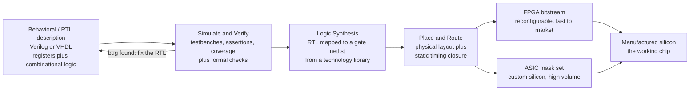

# 🧩 Digital System Design and HDL

> [!abstract] TL;DR
> A modern chip has **billions of transistors** — nobody draws them by hand. Instead engineers **write** the hardware: they *describe* what a circuit should do in a **Hardware Description Language** (**Verilog / SystemVerilog** or **VHDL**), then automated **synthesis** tools translate that description into actual gates and wires — a compiler, but the "machine code" is physical silicon. The standard abstraction is **RTL** (Register-Transfer Level): the design is a set of **registers** (state) plus the **combinational logic** that computes the next state between clock edges. The flow is **write RTL → simulate & verify → synthesize to a gate netlist → place-and-route → timing closure → FPGA bitstream or ASIC masks**. The single most important — and most violated — rule: **HDL is not software.** Its statements describe **concurrent hardware that all runs in parallel**, not a sequence of instructions.

---

## Intuition

**Analogy: you don't build a skyscraper by laying each brick by hand — you draw the blueprint and a crew builds it.** Nobody wires a billion-transistor chip transistor-by-transistor, the way you can't stack a skyscraper brick-by-brick. Instead, hardware engineers **write** the chip: they describe what it should *do* in a hardware description language (Verilog or VHDL), and automated tools **synthesize** that text into real gates and wires — exactly like a compiler turning code into a runnable program, except here the "program" is a physical arrangement of silicon.

This "designing hardware with software" is how **every** modern chip is actually built, from a \$2 microcontroller to a supercomputer's GPU. But the twist that trips up every programmer: the HDL text does **not** execute top-to-bottom. Each line becomes a piece of hardware that is *always on, all at once*. When you write two `always` blocks, you are not writing two functions that run in sequence — you are describing **two circuits that operate simultaneously and forever**, like two water pipes both flowing at the same time. Grasp that one shift — from *instructions in time* to *structure in space* — and HDL suddenly makes sense.

---

## How It Works

### Core Mechanics

1. **Describe at RTL (Register-Transfer Level).** You express the design as **registers** (flip-flops that hold state, updated on a clock edge) and the **combinational logic** that computes each register's *next value* and the module's outputs. You say "on every clock, the accumulator becomes its old value plus the input" — you do **not** place individual gates.
2. **Simulate and verify.** Before any silicon exists, a **testbench** drives inputs into the design under test and checks outputs, while **assertions** flag illegal states and **coverage** measures how much of the behavior was exercised. Verification typically consumes **the majority of a real project's effort**, and modern flows add **formal** hardware verification for exhaustive proofs (see [[Hardware_and_Circuit_Verification]]).
3. **Synthesize.** A **logic synthesis** tool (Synopsys Design Compiler, Cadence Genus, or open-source Yosys) translates RTL into a **gate-level netlist** mapped to a specific **technology library** of real cells — this is the "compiler for hardware," and it optimizes for area, speed, and power.
4. **Place-and-route + timing closure.** Physical tools decide *where* each gate sits and *how* wires connect them, then **static timing analysis (STA)** verifies that every signal path settles before the next clock edge. Fixing the paths that are too slow is **timing closure**.
5. **Target the hardware.** The result becomes either an **FPGA bitstream** (configuration loaded into reconfigurable logic — fast, reprogrammable, great for prototyping) or an **ASIC mask set** (custom photomasks used to manufacture fixed silicon — best performance/power/cost at high volume, but enormous non-recurring engineering cost).

### Flow / Architecture



---

## Key Concepts

### Secondary Level

- **A chip is written, not drawn.** Engineers type a *description* of the hardware in a language (Verilog or VHDL); software then builds the actual gates. This is why one person can design something with billions of parts.
- **The big mental switch:** HDL code describes hardware that runs **all at the same time**, not step-by-step like a normal program. Every line is a piece of circuit that is always working.
- **Two flavors of logic:**
  - **Combinational** — output depends only on the current inputs (an adder, a multiplexer). No memory.
  - **Clocked / sequential** — a **register** remembers a value and updates only on the tick of a **clock**. This is how a chip keeps state and marches through steps.
- **Two ways to end up with a chip:** an **FPGA** is a reprogrammable chip you can reconfigure like software (great for trying ideas), while an **ASIC** is custom-manufactured silicon that is fixed forever but faster, cheaper, and lower-power at huge volumes.

### Undergraduate Level

- **RTL abstraction.** The design is modeled as **state registers** + **next-state/output combinational logic**. On each clock edge, all registers latch their computed next values simultaneously. This is the standard level at which digital systems are designed.
- **Blocking vs non-blocking assignments (the classic Verilog trap):**
  - Use **blocking** `=` inside combinational blocks (`always @(*)`) — statements model an ordered computation of "what feeds what."
  - Use **non-blocking** `<=` inside clocked blocks (`always @(posedge clk)`) — every register samples its *old* inputs and updates *together*, faithfully modeling parallel flip-flops. Mixing these up is the #1 source of "works in simulation, breaks in silicon" bugs.
- **The design flow, end to end:** write RTL → **simulate/verify** (testbenches, assertions, coverage) → **synthesize** (RTL → gate netlist on a technology library) → **place-and-route** → **static timing analysis / timing closure** → **bitstream or masks**.
- **Latch inference.** An incomplete `if`/`case` in a combinational block (no `default`, or a missing branch) accidentally tells synthesis to *remember* the old value — inferring an unwanted latch. Always assign every output on every path.
- **Pipelining for throughput.** Inserting registers to break a long combinational path into stages lets the clock run faster (higher **throughput**), at the cost of extra **latency** (more cycles), more registers (**area**), and more power. This is the fundamental **area-vs-speed** knob (see [[Pipelining_and_Hazards]]).
- **FPGA vs ASIC trade-off.** FPGAs = LUTs + flip-flops + block RAM + DSP slices, reconfigurable, low NRE, fast time-to-market, in-field updates, but slower/pricier per unit. ASICs = custom masks, huge NRE and long turnaround, but best performance/power and lowest unit cost at volume.

### Graduate Level

- **Synthesis as compilation.** RTL elaboration → technology-independent optimization (Boolean minimization, retiming, resource sharing) → **technology mapping** onto standard cells → gate-level netlist. Constraints (`.sdc`) specify clock periods, input/output delays, and false/multicycle paths that steer optimization — directly analogous to a backend's [[Code_Generation_and_Instruction_Selection|instruction selection and scheduling]].
- **Static timing analysis (STA).** Timing closure means every register-to-register path satisfies **setup** ($t_{clk\text{-}q} + t_{logic} + t_{setup} + t_{skew} \le T_{clk}$) and **hold** constraints across all corners (process/voltage/temperature). STA is exhaustive and pattern-independent — it checks *paths*, not vectors.
- **Clock-domain crossing (CDC).** Signals moving between asynchronous clocks risk **metastability**; synchronizers (two-flop, handshakes, async FIFOs, gray-coded pointers) are mandatory, and dedicated CDC lint/formal tools verify them because STA alone cannot.
- **Micro-architectural techniques.** Retiming, pipelining, unrolling, resource sharing, operand isolation, and clock/power gating trade **area ↔ speed ↔ power**. Throughput can be raised with parallelism (more hardware) or higher clock (deeper pipeline) — the choice is a power/area budget decision.
- **High-Level Synthesis (HLS).** Tools (Vitis HLS, Catapult) compile **C/C++/SystemC** into RTL, automatically scheduling operations into clock cycles and inferring datapaths — raising the abstraction again, at the cost of less control over the exact micro-architecture.
- **Verification dominates.** Constrained-random simulation (UVM), functional coverage, and **formal property verification** (proving temporal assertions exhaustively) typically outweigh design effort. A missed corner case in an ASIC is a multi-million-dollar respin — which is why formal methods have their strongest industrial foothold in hardware.

---

## Python Demo

```python
# Digital System Design in two views that mirror the real HDL flow:
#
#   (a) RTL SIMULATION IN PYTHON
#       Model a small synchronous datapath at the register-transfer level:
#       an 8-bit ACCUMULATOR register plus a mod-4 STATE (FSM) register.
#       Each is updated by a purely COMBINATIONAL next-state function that
#       is latched on the (virtual) rising clock edge -- exactly how flip-
#       flops behave. Running the clocked update for many cycles and plotting
#       the register contents reproduces what an HDL simulator (Verilator/
#       ModelSim) dumps as a VCD waveform.
#
#   (b) SYNTHESIS TRADEOFF: AREA vs SPEED via PIPELINING
#       A combinational block with total logic delay T_logic makes ONE result
#       per (slow) clock. Splitting it into k pipeline stages shortens the
#       critical path to ~T_logic/k, so the clock (throughput) rises -- but
#       every register bank adds overhead (setup + clk-to-Q) and AREA, and the
#       LATENCY grows to k cycles. Classic diminishing returns.
import numpy as np
import matplotlib.pyplot as plt

# ============================================================
# (a) RTL SIMULATION  --  clocked register-transfer model
# ============================================================
N_CYCLES = 16
rng      = np.random.default_rng(7)
data_in  = rng.integers(0, 8, size=N_CYCLES)     # 3-bit input data stream
rst      = np.zeros(N_CYCLES, dtype=int)
rst[0]   = 1                                      # synchronous reset, cycle 0
rst[9]   = 1                                      # mid-stream reset pulse

# Register STATE (what real flip-flops hold); updated once per clock edge.
acc, state = 0, 0
acc_trace, state_trace = [], []

for c in range(N_CYCLES):
    # ---- sample register OUTPUTS visible during THIS cycle ----
    acc_trace.append(acc)
    state_trace.append(state)

    # ---- COMBINATIONAL next-state logic (computed, not yet stored) ----
    if rst[c]:
        acc_next, state_next = 0, 0
    else:
        acc_next   = (acc + int(data_in[c])) & 0xFF   # accumulate, 8-bit wrap
        state_next = (state + 1) & 0x3                 # mod-4 FSM counter

    # ---- CLOCK EDGE: all registers latch simultaneously (non-blocking <=) ----
    acc, state = acc_next, state_next

acc_trace   = np.array(acc_trace)
state_trace = np.array(state_trace)

# Build a two-phase clock waveform just for the "waveform viewer" look
tclk = np.linspace(0, N_CYCLES, N_CYCLES * 2, endpoint=False)
clk  = np.arange(N_CYCLES * 2) % 2

# ============================================================
# (b) SYNTHESIS TRADEOFF  --  pipelining area vs speed
# ============================================================
T_logic  = 20.0        # ns : total combinational delay of the unpipelined block
t_reg    = 0.5         # ns : per-stage register overhead (setup + clk-to-Q + skew)
reg_area = 1.0         # arbitrary area units added per pipeline register bank

depth        = np.arange(1, 21)                 # pipeline depth k (1 = combinational)
Tclk_ns      = T_logic / depth + t_reg          # achievable clock period per depth
fmax_MHz     = 1e3 / Tclk_ns                     # clock freq (MHz) = steady throughput
latency_ns   = depth * Tclk_ns                   # end-to-end latency of one result
area_units   = 1.0 + (depth - 1) * reg_area      # base logic + pipeline registers
fmax_ceiling = 1e3 / t_reg                        # asymptote: register overhead limit

# ============================================================
#  PLOT: RTL waveform trace  +  pipelining area/speed tradeoff
# ============================================================
fig, ax = plt.subplots(2, 2, figsize=(15, 9))

# ---- (a1) control signals: clk + reset ----
ax[0, 0].step(tclk, clk + 2.3, where='post', color='tab:blue', lw=1.6)
ax[0, 0].step(np.arange(N_CYCLES), rst + 0.0, where='post', color='tab:red', lw=1.8)
ax[0, 0].text(-1.7, 2.75, "clk",  color='tab:blue', fontsize=10, va='center')
ax[0, 0].text(-1.7, 0.45, "rst",  color='tab:red',  fontsize=10, va='center')
ax[0, 0].set_title("(a) RTL waveform : control signals")
ax[0, 0].set_xlabel("clock cycle")
ax[0, 0].set_yticks([]); ax[0, 0].set_xlim(-2, N_CYCLES)
ax[0, 0].grid(True, axis='x', alpha=0.3)

# ---- (a2) register contents: data_in, accumulator, FSM state ----
ax[1, 0].step(np.arange(N_CYCLES), data_in,      where='post', color='tab:green',
              lw=1.8, label="data_in (3-bit)")
ax[1, 0].step(np.arange(N_CYCLES), acc_trace,    where='post', color='tab:purple',
              lw=2.2, label="acc register (8-bit)")
ax[1, 0].step(np.arange(N_CYCLES), state_trace,  where='post', color='tab:orange',
              lw=1.8, label="FSM state (mod-4)")
for c in np.where(rst == 1)[0]:                  # mark the reset cycles
    ax[1, 0].axvline(c, color='tab:red', ls=':', lw=1.2)
ax[1, 0].set_title("(a) RTL waveform : register contents per cycle")
ax[1, 0].set_xlabel("clock cycle"); ax[1, 0].set_ylabel("register value")
ax[1, 0].set_xlim(0, N_CYCLES - 1)
ax[1, 0].legend(fontsize=8, loc='upper left'); ax[1, 0].grid(True, alpha=0.3)

# ---- (b1) throughput vs pipeline depth, with area on twin axis ----
axb = ax[0, 1]
l1, = axb.plot(depth, fmax_MHz, 'o-', color='tab:blue', lw=2, label="throughput fmax [MHz]")
axb.axhline(fmax_ceiling, color='gray', ls='--', lw=1.2)
axb.text(11, fmax_ceiling - 180, f"ceiling = 1/t_reg = {fmax_ceiling:.0f} MHz",
         color='gray', fontsize=8)
axr = axb.twinx()
l2, = axr.plot(depth, area_units, 's--', color='tab:red', lw=1.8,
               label="area [register banks]")
axb.set_title("(b) Pipelining: speed rises, area grows")
axb.set_xlabel("pipeline depth  k  (stages)")
axb.set_ylabel("throughput fmax [MHz]", color='tab:blue')
axr.set_ylabel("relative area [units]", color='tab:red')
axb.tick_params(axis='y', labelcolor='tab:blue')
axr.tick_params(axis='y', labelcolor='tab:red')
axb.legend(handles=[l1, l2], fontsize=8, loc='center right')
axb.grid(True, alpha=0.3)

# ---- (b2) the real design curve: throughput vs latency ----
axc = ax[1, 1]
sc = axc.scatter(latency_ns, fmax_MHz, c=depth, cmap='viridis', s=55, zorder=3)
axc.plot(latency_ns, fmax_MHz, color='0.6', lw=1, zorder=2)
for k in (1, 2, 4, 8, 16):
    i = k - 1
    axc.annotate(f"k={k}", (latency_ns[i], fmax_MHz[i]),
                 textcoords="offset points", xytext=(6, 6), fontsize=8)
axc.set_title("(b) Area/speed frontier: throughput vs latency")
axc.set_xlabel("end-to-end latency of one result [ns]")
axc.set_ylabel("throughput fmax [MHz]")
axc.grid(True, alpha=0.3)
fig.colorbar(sc, ax=axc, label="pipeline depth k")

plt.tight_layout()
plt.savefig("digital_system_design_hdl.png", dpi=120)
plt.show()

# ---- Numerical summary ----
print("RTL sim -- final accumulator =", acc_trace[-1],
      " final FSM state =", state_trace[-1])
print(f"Combinational (k=1): fmax = {fmax_MHz[0]:.0f} MHz, "
      f"latency = {latency_ns[0]:.1f} ns, area = {area_units[0]:.0f}")
print(f"Pipelined   (k=5) : fmax = {fmax_MHz[4]:.0f} MHz "
      f"({fmax_MHz[4]/fmax_MHz[0]:.1f}x faster clock), "
      f"latency = {latency_ns[4]:.1f} ns, area = {area_units[4]:.0f}")
print(f"Deep        (k=20): fmax = {fmax_MHz[-1]:.0f} MHz -- "
      f"nearing the {fmax_ceiling:.0f} MHz register-overhead ceiling "
      f"(diminishing returns)")
```

The left column is a **waveform trace** — the same view an HDL simulator produces from a VCD dump: `clk` toggling, the synchronous `rst` clearing state, and the `acc`/`state` registers stepping to new values *only* on clock edges. The right column is the **synthesis trade-off**: pipelining lifts throughput (clock frequency) as you add stages, but area climbs linearly and — because each register bank costs a fixed `t_reg` overhead — throughput flattens toward a **ceiling** while latency keeps growing. That curve *is* the area-vs-speed decision every digital designer makes.

---

## Real-World Applications

- **Every CPU, GPU, and SoC.** Apple's M-series, NVIDIA GPUs, AMD Ryzen, and Arm cores are all written as millions of lines of Verilog/SystemVerilog (or VHDL), simulated for years, then synthesized and taped out to ASIC masks. The RISC-V open cores (Rocket, BOOM, CVA6) are public RTL you can read and synthesize yourself.
- **AI accelerators.** Google's TPU, Tesla's Dojo, Groq, and Cerebras are custom datapaths of multiply-accumulate arrays described in HDL, where **pipelining** and **parallelism** are pushed to the limit for throughput-per-watt.
- **FPGA prototyping and edge compute.** Xilinx (AMD) and Intel/Altera FPGAs run network switches, 5G basebands, high-frequency trading engines, video pipelines, and hardware prototypes of not-yet-fabricated ASICs — reprogrammable in the field, no mask set required.
- **Networking and storage silicon.** Switch ASICs (Broadcom Tomahawk), SSD controllers, and NIC offload engines are HDL designs where line-rate throughput forces deep pipelines and careful timing closure.
- **Open-source silicon.** The Yosys + OpenROAD + Verilator toolchain and the SkyWater 130nm PDK (via Google's OpenMPW/Tiny Tapeout) let hobbyists synthesize RTL all the way to real fabricated chips — the democratization of "designing hardware with software."
- **Safety-critical hardware.** Aerospace, automotive (ISO 26262), and CPU vendors apply **formal hardware verification** to prove RTL correctness exhaustively, because a bug in shipped silicon means a recall or a respin.

---

## Common Pitfalls

- **Treating HDL as software (the #1 trap).** Verilog/VHDL statements describe **concurrent hardware**, not a sequence of instructions. Two `always` blocks are two circuits running in parallel *forever*, not two functions called in order. Programmers who write HDL "top to bottom" produce designs that simulate strangely and synthesize to nonsense.
- **Blocking vs non-blocking confusion.** Use **non-blocking** `<=` in clocked blocks (registers update together on the edge) and **blocking** `=` in combinational blocks. Swapping them creates simulation **races** where results differ between the simulator and the real silicon — the hardest class of bug to catch.
- **Accidental latch inference.** An `if`/`case` in a combinational block that doesn't assign every output on every path tells synthesis to *hold the old value*, inferring an unwanted latch. Always include a `default` and assign all outputs unconditionally at the top.
- **Confusing simulation constructs with hardware.** `#10` delays, `$display`, `initial` blocks, `real` variables, and division are **simulation-only** — they are ignored or unsupported by synthesis. RTL timing comes from **clock edges**, never from `#delay`.
- **Ignoring the RTL abstraction.** Designing at the gate level for a large block wastes effort and confuses synthesis, which optimizes better when you describe *intent* (registers + next-state logic) and let it choose the gates.
- **Skimping on verification.** Because verification dominates real projects, an under-tested corner case survives to silicon — where in an ASIC it costs a multi-million-dollar respin. Testbenches, assertions, coverage, and **formal** checks (tie-in to [[Hardware_and_Circuit_Verification]]) are not optional.
- **Forgetting timing closure and CDC.** RTL that is functionally correct can still fail because a path is too slow (setup violation) or crosses clock domains without a synchronizer (metastability). **Static timing analysis** and CDC checks are mandatory before you trust silicon.
- **Choosing FPGA vs ASIC wrongly.** Reaching for an ASIC for low volume burns huge NRE and months of turnaround; reaching for an FPGA at massive volume wastes power and unit cost. Match the target to volume, performance, and time-to-market.
- **Over-pipelining.** Adding stages past the point where register overhead dominates gives no more throughput but piles on latency, area, and power — the flattening curve in the demo. Pipeline to the timing target, not beyond it.

---

## Related Concepts

- [[Hardware_Description_Languages]] — the companion deep-dive on Verilog/SystemVerilog syntax, `always` blocks, blocking vs non-blocking, testbenches, and the synthesis flow this note frames at the systems level.
- [[Sequential_Circuits_and_FSMs]] — the flip-flops, registers, and finite-state machines that the RTL abstraction is built from; the "state" half of register-transfer level.
- [[Combinational_Circuits]] — adders, multiplexers, and ALUs that make up the "logic between the registers" that computes each next state.
- [[Boolean_Algebra_and_Logic_Gates]] — the gate-level Boolean primitives that synthesis maps RTL down onto.
- [[Pipelining_and_Hazards]] — the same throughput-vs-latency pipelining trade-off explored in the demo, applied inside CPU micro-architecture.
- [[CPU_Datapath_and_Control]] — a full processor is itself an RTL design; datapath + control is the canonical example of describing hardware in HDL.
- [[ISA_Design_RISC_vs_CISC]] — the instruction-set spec that a CPU's RTL must faithfully implement and be verified against.
- [[Hardware_and_Circuit_Verification]] — formal methods for proving RTL correct, the verification effort that dominates real chip projects.
- [[Code_Generation_and_Instruction_Selection]] — the compiler analogy made literal: logic synthesis is code generation and technology mapping for hardware instead of a CPU.
- [[Electrical_Engineering_Overview]] — situates digital system design within the broader EE landscape of analog, devices, and signals.

*Sibling notes in this Digital Electronics section (prose references, to be built): Boolean_Logic_and_Combinational_Circuits, Sequential_Logic_and_Flip_Flops, Memory_and_Programmable_Logic, Embedded_Systems_and_Microcontrollers, and MOSFETs_and_CMOS (the physical devices these gates are made of).*

---

## Review Questions

1. **(Secondary)** Using the "skyscraper blueprint" analogy, explain why engineers describe a chip in a language and let tools build it, rather than placing each transistor by hand. Then explain the one way HDL is *unlike* ordinary programming: why does the code describe things happening "all at once" instead of step-by-step?
2. **(Undergraduate)** You wrote a 3-stage pipeline in Verilog but used blocking assignments (`=`) inside `always @(posedge clk)`. (a) Why might it *pass* simulation yet *fail* in silicon? (b) Rewrite the rule you should follow for clocked vs combinational blocks. (c) Separately, given a combinational block with total delay 20 ns, estimate the clock frequency if you split it into 4 equal pipeline stages with 0.5 ns register overhead each — and state what you paid in latency and area.
3. **(Graduate)** You must ship a datapath that sustains 1 result per cycle at 2 GHz. Walk through the flow from RTL to silicon: how does **synthesis** map your description to a netlist, what does **static timing analysis** check on each register-to-register path, and how do **retiming/pipelining** help you hit the clock target? Then argue when you would prototype on an **FPGA** versus tape out an **ASIC**, and explain why **formal verification** (rather than more simulation vectors) is the tool of choice for proving no illegal state is reachable.

---

## Sources

- Harris, D. & Harris, S. — *Digital Design and Computer Architecture* (Morgan Kaufmann) — the standard bridge from logic design through HDL (Verilog/VHDL), RTL, and synthesis into processor design.
- Palnitkar, S. — *Verilog HDL: A Guide to Digital Design and Synthesis* (Prentice Hall) — the canonical Verilog reference: modules, always blocks, blocking vs non-blocking, testbenches, and synthesis.
- Ashenden, P. — *The Designer's Guide to VHDL* (Morgan Kaufmann) — the definitive VHDL treatment of concurrent hardware description, simulation, and synthesizable subsets.
- Weste, N. & Harris, D. — *CMOS VLSI Design: A Circuits and Systems Perspective* (Pearson) — the physical side: standard cells, timing, place-and-route, and the ASIC implementation flow.
- Kilts, S. — *Advanced FPGA Design: Architecture, Implementation, and Optimization* (Wiley) — pipelining, timing closure, clock-domain crossing, and area/speed/power trade-offs on real FPGAs.

---

#electrical-engineering #hdl #verilog #fpga #rtl-design
