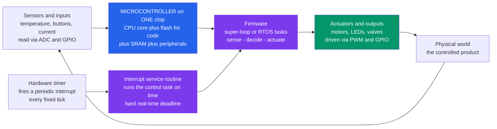

# 🔌 Embedded Systems and Microcontrollers

> [!abstract] TL;DR
> An **embedded system** is a computer built *into* a larger product to perform one **dedicated** function reliably forever — the hidden brain of a microwave, car ECU, drone, pacemaker, thermostat, or smart bulb — as opposed to a general-purpose PC that runs anything. Its engine is the **microcontroller (MCU)**: a *single* cheap chip that integrates a CPU core (ARM Cortex-M, AVR, RISC-V, ESP32) with on-chip **memory** (flash for code, SRAM for data) and a rich set of **peripherals** — GPIO, timers, PWM, ADC/DAC, and UART/SPI/I2C/CAN comms — so one tiny part is a complete computer wired to the physical world. Firmware (in C, embedded C++, or increasingly Rust) reads sensors, decides, and drives actuators in a tight **sense-compute-actuate loop**, usually driven by **interrupts** and hard **real-time** deadlines under severe **resource constraints** (kilobytes of RAM, tight power budgets). There are **tens of billions** of these — vastly outnumbering PCs and phones — and they are how computing actually touches cars, medicine, appliances, industry, and the entire IoT.

## Intuition — analogy FIRST

Most of the computers in your life have **no screen and no keyboard**. They are the hidden brains inside your microwave, your car, your thermostat, your fitness tracker, and your washing machine. You never "use" them the way you use a laptop — you press *Start*, and a tiny dedicated computer welded into the product quietly reads sensors, makes decisions, and drives motors and lights, doing **one job**, correctly, for a decade.

That is an **embedded system**: not a general-purpose machine that runs whatever you install, but a **special-purpose appliance-computer** with a fixed, unchangeable mission. Think of the difference between a *Swiss Army knife* (a PC — flexible, many tools, master of none) and a *purpose-forged surgical scalpel* (an MCU — one job, done perfectly, cheaply, and forever). And here is the staggering part: there are **tens of billions** of these microcontrollers on Earth, dwarfing every PC and phone combined. The visible computers we obsess over are the tiny minority; the physical world actually runs on the *invisible* ones.

---

## How It Works

An embedded system lives in a **closed loop with the physical world**. It **senses** the environment (a temperature, a button, a motor current) through input peripherals, **computes** a decision in firmware, and **actuates** the world back (spins a motor, dims an LED, opens a valve) through output peripherals — then repeats, forever. What makes this a *computer* rather than a fixed circuit is that the decision is **software (firmware)** stored in on-chip flash, executed by a CPU core, with the whole loop paced by a **hardware timer** that fires a periodic **interrupt** so the control task runs on time, every time. Missing that timing is not a slowdown — in **hard real-time** systems it is a *failure*.

The magic of the **microcontroller** is integration: the CPU, the code memory (flash), the data memory (SRAM), and all the peripherals that talk to the physical world sit on **one chip**. A microprocessor is *only* a CPU and needs external memory and support chips to become a computer; an MCU *is* the computer.



The deep point: an embedded system trades **generality and raw speed** for **dedication, determinism, low cost, and reliability**. A desktop CPU that averages fast but occasionally stalls for 50 ms is useless for firing an airbag; a humble MCU that *always* responds within a guaranteed microsecond window is exactly right.

---

## Key Concepts / Details

### Secondary Level — What an Embedded System Is, and the Chip That Runs It

- **Embedded = dedicated, not general-purpose.** A PC is built to run *any* program. An embedded system is a computer built **into a product** to do **one fixed thing** — control a microwave, a drone, a pacemaker, a smart bulb. You do not install apps on your thermostat.
- **The microcontroller (MCU) is a whole computer on one chip.** It packs together, on a single die:
  - a **CPU core** (does the computing — commonly **ARM Cortex-M**, **AVR** as in Arduino, **RISC-V**, **PIC**, or the Wi-Fi-capable **ESP32**),
  - **flash memory** that permanently holds the **code** (the firmware),
  - **SRAM** that holds the **data/variables** while running (often just kilobytes),
  - and a set of **peripherals** that connect to the outside world.
- **MCU vs microprocessor vs SoC.** A **microprocessor** (like your laptop's CPU) is *only* the processing core — it needs external RAM, storage, and support chips to be useful. An **MCU** integrates CPU + memory + peripherals into one cheap self-contained part. An **SoC** (system-on-chip, e.g. a phone chip) is a much larger integration that usually runs a full OS. Rule of thumb: **microprocessor = brain alone; MCU = tiny complete computer; SoC = big complete computer.**
- **The sense-compute-actuate loop.** Read sensors, decide in software, drive actuators, repeat. This loop *is* the embedded system.

### Undergraduate Level — Peripherals, Interrupts, and the Bare-Metal Program

The CPU is worthless without **peripherals** — the on-chip hardware blocks that bridge software to the physical world:

| Peripheral | What it does | Typical use |
|---|---|---|
| **GPIO** | general-purpose digital in/out pins (read 0/1, write 0/1) | read a button, blink an LED, drive a relay |
| **Timers / counters** | count clock ticks; fire events at exact intervals | schedule the control loop, measure pulse width |
| **PWM** | pulse-width modulation: a fast square wave whose **duty cycle** sets average power | dim LEDs, set motor speed, generate analog-like output |
| **ADC / DAC** | analog-to-digital and digital-to-analog converters | read a temperature/voltage sensor; output an analog signal |
| **UART / SPI / I2C** | serial buses to talk to sensors, displays, memory | connect an IMU, an SD card, a display |
| **CAN / USB** | robust/host communication buses | automotive networks, PC connectivity |
| **Watchdog** | a timer that resets the chip if firmware hangs | auto-recovery from a crash |

**Interrupts vs polling — the central programming choice:**

- **Polling** means the CPU repeatedly *asks* "is the button pressed yet? is the byte here yet?" in a loop — simple but wasteful, and it can miss fast events while busy elsewhere.
- **Interrupts** invert control: a hardware event (timer expiry, byte arrival, pin edge) instantly *interrupts* the CPU, which jumps to a small **interrupt service routine (ISR)**, handles it, and returns to what it was doing. This is **event-driven**, efficient, and low-latency. Interrupts have **priorities** (an urgent motor-fault ISR preempts a lazy UART ISR) and a bounded **latency** (the time from event to the first instruction of the ISR).

**The two firmware architectures:**

- **Bare-metal super-loop:** `setup()` once, then `while(1) { do everything }`, with interrupts handling time-critical events. Simplest, smallest, most predictable — the classic Arduino model.
- **RTOS (real-time operating system):** for complex, concurrent needs, a small kernel (**FreeRTOS**, **Zephyr**) provides **tasks**, a **scheduler**, and synchronization — so "read sensor," "run control," and "handle comms" can be written as separate tasks with priorities and deadlines. See [[Real_Time_and_Embedded_Operating_Systems]].

Firmware is written close to the metal — historically **C**, increasingly **embedded C++** and **Rust** (memory safety without a garbage collector; see [[Rust_Embedded]]) — and peripherals are controlled by reading/writing **memory-mapped registers** (see [[Memory_Mapped_IO]]).

### Graduate Level — Real-Time, Determinism, and Designing Under Constraint

The defining discipline of embedded engineering is **doing correct work on a deadline with almost no resources**:

- **Real-time is about *determinism*, not speed.** A **hard real-time** deadline missed = catastrophic failure (airbag deployment, motor commutation, engine timing, medical infusion). A **soft real-time** miss merely degrades quality (a dropped audio sample, a laggy UI). The engineering goal is **worst-case guarantees**, so you analyze **worst-case execution time (WCET)** and **interrupt latency**, not average throughput. A CPU that is fast *on average* but occasionally stalls (cache miss, page fault, garbage-collection pause) is disqualifying — which is why MCUs favor simple, **predictable** cores (often no cache, no virtual memory, no OS jitter).
- **Scheduling theory.** With an RTOS, tasks are scheduled by **priority** (rate-monotonic: shorter-period tasks get higher priority) or by deadline (EDF). Schedulability analysis proves *in advance* that every deadline is met; **priority inversion** (a low-priority task holding a lock a high-priority task needs) is the classic failure — famously fixed on the Mars Pathfinder by **priority inheritance**. This connects directly to [[CPU_Scheduling_Algorithms]].
- **Severe resource constraints shape everything.** Kilobytes of RAM (no lavish data structures, careful **stack** sizing), small flash (compact code), low clock (tens of MHz), and — crucially — **tight power budgets** for battery/IoT devices. Firmware spends most of its life in **low-power sleep modes**, waking only on an interrupt, to make a coin cell last years.
- **Safety and reliability over features.** **Watchdog timers** auto-reset a hung system; **ECC** and memory protection guard against bit flips; brown-out detectors handle sag; redundancy and formal analysis back safety-critical code (ISO 26262 for automotive, IEC 62304 for medical, DO-178C for avionics).
- **The instruction set and I/O plumbing.** The ubiquitous **ARM Cortex-M** family is a load-store RISC ISA tuned for interrupts and low power (see [[ISA_Design_RISC_vs_CISC]]); interrupts, traps, and DMA are the mechanism by which peripherals reach the CPU efficiently (see [[Interrupts_and_DMA]]). **DMA** (direct memory access) lets a peripheral shuttle data to/from memory *without* the CPU, freeing it for real work.
- **Debugging the invisible.** With no screen and no OS, you debug through **JTAG/SWD** hardware debug ports (breakpoints, single-step, register/memory inspection), plus logic analyzers, oscilloscopes, and sparing `printf`-over-UART. Reproducing a bug that only appears at a specific interrupt timing is the embedded engineer's daily craft.

**The big idea:** embedded computing is **dedicated, constrained, real-time computing at the hardware-software boundary** — where determinism and reliability matter far more than raw performance or features.

---

## Python Demo

```python
# Simulate a MICROCONTROLLER running a closed-loop controller in firmware.
#   (a) SENSE-DECIDE-ACTUATE: a PID thermostat reads a (noisy) temp sensor, computes,
#       and drives a heater via a PWM DUTY CYCLE every fixed control tick.
#   (b) PWM: a fast square wave whose duty cycle sets the AVERAGE (effective analog) power.
#   (c) REAL-TIME: a periodic hardware-timer INTERRUPT releases the control task each tick;
#       if the task's compute time exceeds the period, the DEADLINE is MISSED (= failure).
# Only numpy + matplotlib.
import numpy as np
import matplotlib.pyplot as plt

np.random.seed(0)

# ---------------- (a) sense-decide-actuate control loop ----------------
# First-order thermal plant driven by heater power (duty in 0..1):
#   C_th * dT/dt = P_max*duty - U_loss*(T - T_amb)
T_amb, T_set = 20.0, 75.0          # ambient and setpoint  [degC]
C_th, U_loss, P_max = 40.0, 1.2, 120.0

dt, t_end = 0.05, 40.0             # control tick period [s]; the timer interrupt fires every dt
N = int(t_end / dt)
t = np.arange(N) * dt

Kp, Ki, Kd = 0.06, 0.02, 0.01      # discrete PID gains
T = np.zeros(N); T[0] = T_amb
duty = np.zeros(N)
integ, prev_err = 0.0, 0.0
for k in range(1, N):
    # --- SENSE: read a NOISY sensor (models ADC quantization + noise) ---
    meas = T[k-1] + np.random.normal(0.0, 0.15)
    err = T_set - meas
    # --- DECIDE: PID with clamping anti-windup ---
    integ_try = integ + err * dt
    d_err = (err - prev_err) / dt
    u = Kp*err + Ki*integ_try + Kd*d_err
    u_clamped = float(np.clip(u, 0.0, 1.0))       # duty MUST stay in 0..1
    if u == u_clamped:                            # only wind up the integrator when unsaturated
        integ = integ_try
    duty[k] = u_clamped
    prev_err = err
    # --- ACTUATE + plant update (Euler integration) ---
    power = P_max * duty[k]
    T[k] = T[k-1] + (power - U_loss*(T[k-1] - T_amb)) / C_th * dt

print(f"settled temperature = {T[-1]:.2f} degC (setpoint {T_set}), final duty = {duty[-1]*100:.0f}%")

# ---------------- (b) PWM: duty cycle -> average power ----------------
f_pwm = 50.0                                      # PWM carrier frequency [Hz]
tp = np.linspace(0, 0.06, 4000)                   # ~3 PWM periods
def pwm(tp, duty, f):
    return ((tp * f) % 1.0 < duty).astype(float)  # HIGH for the first 'duty' fraction of each period

# ---------------- (c) real-time timer interrupts & deadlines ----------------
period = 10.0                                     # control period [ms] = the deadline
compute = np.array([3.0, 4.0, 3.0, 12.0, 4.0, 3.0])   # task compute time each release [ms]
releases = np.arange(len(compute)) * period
missed = compute > period                         # a release whose work overran the deadline

# ============================ plots ============================
fig, ax = plt.subplots(2, 2, figsize=(13, 9))

# (a) controlled variable converging to setpoint
ax[0, 0].plot(t, T, color="tab:red", lw=1.8, label="temperature (controlled)")
ax[0, 0].axhline(T_set, color="k", ls="--", lw=1.2, label="setpoint")
ax[0, 0].set_title("(a) Sense-Decide-Actuate: PID thermostat converges to setpoint")
ax[0, 0].set_xlabel("time  [s]"); ax[0, 0].set_ylabel("temperature  [degC]")
ax[0, 0].legend(fontsize=8, loc="lower right"); ax[0, 0].grid(alpha=0.3)

# (b) the actuator command: PWM duty cycle the firmware writes each tick
ax[0, 1].plot(t, duty * 100.0, color="tab:blue", lw=1.6)
ax[0, 1].set_title("(b) Actuator command: PWM duty cycle vs time")
ax[0, 1].set_xlabel("time  [s]"); ax[0, 1].set_ylabel("duty cycle  [%]")
ax[0, 1].set_ylim(-5, 105); ax[0, 1].grid(alpha=0.3)

# (c) PWM waveforms: duty cycle sets the average (effective analog) output
for d, col in zip([0.25, 0.50, 0.75], ["tab:green", "tab:orange", "tab:purple"]):
    ax[1, 0].plot(tp * 1e3, pwm(tp, d, f_pwm) + 0*d, col, lw=1.3, alpha=0.35)
    ax[1, 0].axhline(d, color=col, ls="--", lw=1.6, label=f"duty={int(d*100)}%  ->  avg={d:.2f}")
ax[1, 0].set_title("(c) PWM: fast square wave; DUTY sets the average power")
ax[1, 0].set_xlabel("time  [ms]"); ax[1, 0].set_ylabel("output (0/1) and its average")
ax[1, 0].set_ylim(-0.1, 1.25); ax[1, 0].legend(fontsize=8, loc="upper right"); ax[1, 0].grid(alpha=0.3)

# (d) real-time: compute time per release vs the deadline (period)
colors = ["tab:red" if m else "tab:green" for m in missed]
ax[1, 1].bar(np.arange(len(compute)), compute, color=colors, edgecolor="k")
ax[1, 1].axhline(period, color="k", ls="--", lw=1.6, label="deadline = period (10 ms)")
ax[1, 1].text(3, compute[3] + 0.4, "MISSED\nDEADLINE", ha="center", color="tab:red", fontsize=9, weight="bold")
ax[1, 1].set_title("(d) Real-time: task must finish before the next timer interrupt")
ax[1, 1].set_xlabel("control-loop release #"); ax[1, 1].set_ylabel("compute time  [ms]")
ax[1, 1].legend(fontsize=8, loc="upper left"); ax[1, 1].grid(alpha=0.3, axis="y")

plt.tight_layout()
plt.savefig("embedded_systems_and_microcontrollers.png", dpi=110)
print("Saved embedded_systems_and_microcontrollers.png")
```

Running it prints the settled temperature and final duty, then produces four panels: **(a)** the sensor-fed PID loop drives the temperature smoothly to its **setpoint** despite noisy reads; **(b)** the firmware's **actuator command** — the PWM duty cycle — starts saturated at 100% (heater full-on) then eases to the steady level that exactly balances heat loss; **(c)** three **PWM** waveforms whose **duty cycle** sets the *average* delivered power (25/50/75%), the whole trick behind using a purely digital pin to make an analog-like output; and **(d)** a **real-time** view where each control task must finish before the next timer interrupt — release #3 overruns the 10 ms period, a **missed deadline** that in a hard real-time system is a system *failure*, not a hiccup.

---

## Real-World Applications

- **Automotive.** Modern cars run **50-150+ ECUs** (electronic control units) — engine/transmission control, ABS, airbags (hard real-time), body electronics, infotainment — networked over **CAN** buses. Airbag and engine-timing ECUs are textbook hard real-time embedded systems.
- **Consumer appliances.** Microwaves, washing machines, thermostats, coffee makers, and smart bulbs each hide a low-cost MCU running a fixed control program on a few kilobytes of RAM.
- **Medical devices.** Pacemakers, insulin pumps, infusion pumps, and glucose monitors are safety-critical embedded systems where a missed deadline or a bug can be lethal; they are built to IEC 62304 with watchdogs and redundancy.
- **Drones and robotics.** Flight controllers (e.g. STM32-based) run tight attitude-control loops at hundreds of Hz, fusing IMU data and driving motor ESCs via PWM — the chip-level embodiment of the sense-compute-actuate loop (see [[Actuators_Sensors_and_Embedded_Robotics]]).
- **The IoT edge.** ESP32/Cortex-M nodes with Wi-Fi/BLE sense the environment, run lightweight logic (increasingly small ML models on-device), and stream to the cloud — sensors, smart locks, wearables, industrial monitors.
- **Industrial automation.** PLCs and motor drives run deterministic control of pumps, conveyors, and CNC machines; determinism and reliability trump raw speed.
- **Everyday invisible compute.** Keyboards, mice, USB chargers, TV remotes, battery chargers, and power tools all contain MCUs — the reason embedded chips outnumber every other computer by orders of magnitude.

---

## Common Pitfalls

- **Doing real work inside an ISR.** Interrupt service routines must be **short and non-blocking** — set a flag or push to a queue and return. Long ISRs (or worse, `delay()`/blocking I/O inside them) inflate interrupt latency and cause *other* deadlines to slip. Defer heavy work to the main loop or a task.
- **Forgetting `volatile` on shared variables.** A variable written by an ISR and read by the main loop (or a memory-mapped register) must be `volatile`, or the compiler may cache it in a register and never see the update — a maddening bug that vanishes when you disable optimization.
- **Races between ISR and main code.** Reading a multi-byte variable that an ISR updates can tear (you catch it half-updated). Use **atomic access** or briefly disable interrupts around the critical section — but keep that window tiny.
- **Stack overflow, silently.** With kilobytes of RAM and no MMU, a deep call chain or a big local array quietly corrupts memory. Size the stack deliberately, avoid large stack buffers and recursion, and watermark the stack in testing.
- **Blocking / busy-waiting instead of using interrupts.** Polling a sensor in a tight `while` loop burns the CPU and power and starves other work. Prefer interrupts or DMA, and sleep between events to save battery.
- **Not feeding the watchdog — or feeding it blindly.** A watchdog that is never kicked resets you mid-operation; one that is kicked from a dumb timer ISR even while the main logic is hung defeats its purpose. Kick it only when the system has proven it is making real progress.
- **Priority inversion.** A high-priority task blocked on a lock held by a low-priority task (preempted by a medium task) can miss its deadline — the classic Mars Pathfinder bug. Use **priority inheritance** mutexes in your RTOS.
- **Integer overflow and fixed-point mistakes.** Many MCUs have no FPU; floating point is slow or emulated. Timer counters wrap, and 8/16-bit arithmetic overflows fast. Compute timer deltas with unsigned modular arithmetic and prefer fixed-point math where speed matters.
- **Assuming average speed is enough.** Embedded correctness is a **worst-case** property. A path that is usually fast but occasionally slow (an ISR storm, a flash-write stall) blows a hard deadline. Analyze WCET, not averages.
- **Treating an MCU like a PC.** No OS to fall back on, no `malloc` heap you can lean on (fragmentation is fatal in long-running devices), no `printf` for free (it is huge and slow). Static allocation, careful memory budgets, and minimalism are the norm.
- **Floating GPIO inputs.** An unconnected input pin floats and reads random 0/1s; always enable a pull-up/pull-down resistor. Similarly, un-debounced buttons register dozens of phantom presses per push.

---

## Related Concepts

- [[PID_Control]] — the canonical control law an MCU runs in firmware; the Python demo above is a discrete PID thermostat executed once per timer tick.
- [[Actuators_Sensors_and_Embedded_Robotics]] — the robotics-level view of the same sense-compute-actuate loop; motors, encoders, and IMUs are the sensors and actuators an MCU wires to.
- [[Real_Time_and_Embedded_Operating_Systems]] — the RTOS alternative to a bare-metal super-loop: tasks, scheduling, and real-time guarantees (FreeRTOS/Zephyr).
- [[Interrupts_and_DMA]] — the hardware mechanism by which peripherals reach the CPU without polling, and by which data moves without CPU involvement.
- [[Memory_Mapped_IO]] — how firmware controls peripherals: reading and writing hardware registers that appear at fixed memory addresses.
- [[ISA_Design_RISC_vs_CISC]] — why embedded cores (ARM Cortex-M, RISC-V, AVR) are simple load-store RISC designs tuned for interrupts and low power.
- [[Rust_Embedded]] — writing firmware in Rust for memory safety without a garbage collector, an increasingly common alternative to C.
- [[Electrical_Engineering_Overview]] — parent map; embedded systems sit at the hardware-software boundary of the EE discipline.

Sibling digital-systems notes (in prose): **Data_Converters_ADC_and_DAC** are the ADC/DAC peripherals that turn the analog world into numbers and back; **Memory_and_Programmable_Logic** covers the flash/SRAM and FPGA/CPLD alternatives to a fixed MCU; **Digital_System_Design_and_HDL** describes designing custom digital logic (the hardware an MCU replaces in software); **Feedback_and_Control_Systems** generalizes the closed control loop the firmware implements; **Sequential_Logic_and_Flip_Flops** are the registers and timers/counters inside every peripheral.

---

## Review Questions

1. **(Secondary)** Your smart thermostat and your laptop both contain a computer. Explain what makes the thermostat's an *embedded system* and the laptop's a *general-purpose* one, and name three things a microcontroller integrates onto a single chip that a bare microprocessor does not.
2. **(Undergraduate)** You must read a button, blink an LED at exactly 1 Hz, and receive bytes over UART, all "at once" on one MCU. Describe how you would use a **timer interrupt**, **GPIO**, and a **UART interrupt** to do this on a bare-metal super-loop, and explain why polling all three in a single `while(1)` loop is fragile. Then explain how **PWM duty cycle** would let you *dim* the LED with a purely digital pin.
3. **(Graduate)** Contrast **hard** and **soft** real-time with concrete examples, and explain why "the CPU is fast on average" is an inadequate guarantee for a motor-commutation loop. Then describe **priority inversion**, why it caused the Mars Pathfinder resets, and how **priority inheritance** fixes it — relating your answer to worst-case execution time and interrupt latency.

---

## Sources

- Valvano, J. — *Embedded Systems: Introduction to ARM Cortex-M Microcontrollers* (peripherals, GPIO, timers, interrupts, ADC, real-time on Cortex-M).
- White, E. — *Making Embedded Systems* (practical firmware architecture: super-loop vs RTOS, interrupts, low-power, design under constraint).
- Simon, D. — *An Embedded Software Primer* (interrupts, ISRs, real-time scheduling, RTOS fundamentals, shared-data problems).
- Yiu, J. — *The Definitive Guide to ARM Cortex-M Processors* (core architecture, NVIC/interrupt model, memory-mapped I/O, low-power modes).
- Barr, M. & Massa, A. — *Programming Embedded Systems in C and C++* (registers, `volatile`, memory-mapped peripherals, real-time constraints).

---

#electrical-engineering #embedded-systems #microcontrollers #firmware #real-time
