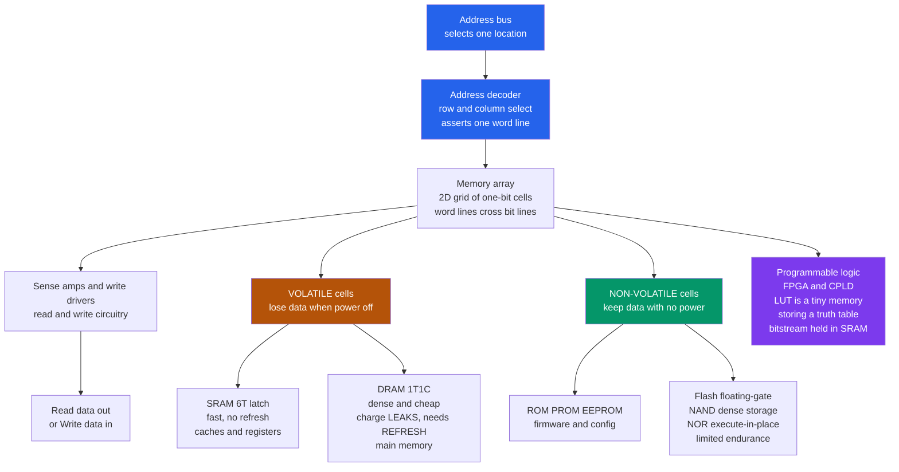

# 🧠 Memory and Programmable Logic

> [!abstract] TL;DR
> **Memory** is an **addressable array of one-bit cells** wired to an **address decoder** and read/write circuitry: give it an address, it hands back (or stores) the contents of that location. The great divide is **volatile vs non-volatile**. **Volatile** memory forgets when power dies: **SRAM** is a fast six-transistor latch (caches, registers — small, expensive) while **DRAM** is a dense one-transistor-plus-one-capacitor cell that is cheap but *leaks* and must be **refreshed** thousands of times a second (main memory). **Non-volatile** memory keeps its bits with no power: **ROM/PROM/EEPROM** and above all **flash**, whose **floating-gate** cells trap charge — **NAND** flash is dense storage (SSDs, phones), **NOR** flash is random-access firmware, both limited by write **endurance** and needing **wear-leveling**. Because speed and cost-per-bit trade off by *orders of magnitude*, systems layer a **memory hierarchy** (registers → SRAM cache → DRAM → flash SSD → disk). **Programmable logic** — PLA/PAL/CPLD and the **FPGA** — is reconfigurable hardware whose function is set *after* manufacture by loading configuration bits into memory-like arrays of **LUTs**: here memory and logic converge.

## Intuition — analogy FIRST

Picture memory as a vast wall of **numbered mailboxes**. You do not search box by box; you speak an **address** and the postal machinery — the **address decoder** — swings open exactly that one box so you can drop a letter in (**write**) or read what is inside (**read**). A memory chip is nothing more than millions of these boxes plus the decoder that turns a number into "open *this* box."

But there are two very different kinds of boxes, and the difference is the whole story. Some boxes are like a **whiteboard**: you can scribble on them at lightning speed, but the instant the lights go out the writing vanishes — this is **volatile** memory (SRAM, DRAM), blazing fast but forgetful. Other boxes are like **carved stone**: what you engrave stays for years even with no power, but carving is slow and the stone wears out after enough re-carvings — this is **non-volatile** memory (ROM, flash). This whiteboard-versus-stone tradeoff — **speed against permanence**, and always **cost against capacity** — is exactly why every computer has a *hierarchy* of memory: a tiny sliver of lightning-fast whiteboard next to the processor, backed by ever-larger, cheaper, slower tiers of stone below it.

And there is a twist even among whiteboards: an **SRAM** whiteboard holds its scribble as long as the lights stay on, but a **DRAM** whiteboard is written in disappearing ink that fades in milliseconds — so a busy attendant must run around **re-tracing every mark** thousands of times a second (that is **refresh**) just to keep the data legible.

---

## How It Works

A memory is a two-dimensional **array of cells**, each holding one bit. To pick a location you feed an **address** to a **row/column address decoder**, which asserts exactly one **word line** (selecting a row of cells) and steers the chosen columns onto **bit lines**. **Sense amplifiers** read the tiny signal the cell puts on the bit line; write drivers force the cell to the desired value. The physical cell determines everything else — how fast, how dense, how power-hungry, and whether the bit survives a power-off:

1. **Volatile cells** store the bit in an active or capacitive state that needs power. An **SRAM** cell is a **6-transistor** cross-coupled latch that actively holds a 1 or 0 as long as $V_{DD}$ is present — fast and stable but large. A **DRAM** cell is just **one access transistor + one capacitor** (1T1C): the bit is charge on the capacitor, which **leaks** through the transistor and substrate, so the whole array must be **refreshed** (read-and-rewritten) on a fixed interval (roughly every 32–64 ms) or the data rots.
2. **Non-volatile cells** trap the bit physically. A flash cell is a MOSFET with an extra **floating gate** buried in oxide; pushing electrons onto it (via tunneling / hot-carrier injection) shifts the transistor's threshold voltage, encoding a 0 or 1 that persists for years because the electrons are stranded by the insulator. Erasing pulls them back off — a slow, high-voltage operation done in **blocks**, and each erase slightly damages the oxide (finite **endurance**).
3. **Read vs write asymmetry.** Volatile memory reads and writes symmetrically and fast. Flash reads fast and by byte/page but *writes* only after a coarse **block erase** and wears out — so controllers add **wear-leveling** and error correction.
4. **Programmable logic** turns memory *into* logic. An **FPGA**'s logic is a sea of **look-up tables (LUTs)** — each LUT is literally a tiny memory whose stored bits *are* the truth table of a Boolean function — plus flip-flops, block RAM, and DSP blocks, all wired by a configurable routing fabric. The whole configuration is a **bitstream** usually held in SRAM and reloaded at power-up.



---

## Key Concepts / Details

### Secondary Level — Addresses, and the Whiteboard vs Stone Divide

The simplest mental model: memory is a numbered list of boxes, and there are two families of boxes.

- **Address, data, control.** You put an **address** on the address lines, a **read/write** signal on control lines, and data flows in or out on the data lines. Width matters: an $n$-bit address can name $2^n$ locations (so 32 address bits reach 4 GiB).
- **Volatile = forgets on power-off.** **RAM** (Random-Access Memory, meaning *any* location is equally quick to reach) comes in two flavors — **SRAM** and **DRAM** — and both lose everything the moment power is cut. This is why an unsaved document vanishes in a crash.
- **Non-volatile = remembers without power.** **ROM** and **flash** keep their contents on the shelf for years. Your phone's photos, a PC's firmware, and a USB stick all live in non-volatile flash.
- **RAM vs ROM naming is historical.** "ROM" once meant read-only, but modern flash/EEPROM is rewritable non-volatile memory — the real axis is *volatile vs non-volatile*, not *readable vs writable*.
- **Why a hierarchy?** Fast memory is expensive and small; cheap memory is slow and huge. No single technology is fast *and* cheap *and* big, so computers stack them.

### Undergraduate Level — Cells, Refresh, Floating Gates, and the Hierarchy

- **SRAM cell (6T).** Two cross-coupled inverters latch the bit; two access transistors connect it to the bit lines during read/write. It **holds indefinitely while powered**, needs **no refresh**, and is **fast** (sub-nanosecond to a few ns), but six transistors per bit make it **large and expensive** — so it is used only where speed is paramount: **CPU registers and L1/L2/L3 caches**.
- **DRAM cell (1T1C).** One transistor gates charge onto one capacitor — one-sixth or less the area of SRAM, hence **dense and cheap** → **main memory**. The catch: charge **leaks**, so the controller must **refresh** every row on a fixed interval (typically 64 ms, split across rows). Reads are **destructive** (they drain the capacitor) and must be immediately rewritten by the sense amps. Latency (tens of ns) is far worse than SRAM. See [[DRAM_Architecture]] for row/column timing (tRCD, tCL, tRP).
- **Floating-gate flash.** A flash transistor stores charge on an isolated gate; the trapped charge shifts the threshold voltage, read as a 1 or 0. **NAND** flash strings cells in series for maximum density — read/written in **pages**, erased in **blocks** — powering SSDs, phones, and memory cards. **NOR** flash allows true random byte access (**execute-in-place** for firmware) at lower density. Multi-level cells (**MLC/TLC/QLC**) store 2–4 bits per cell by distinguishing multiple charge levels, trading endurance and speed for capacity.
- **Endurance and wear.** Each erase/program cycle stresses the tunnel oxide; flash blocks survive only ~$10^3$–$10^5$ cycles. Controllers spread writes with **wear-leveling**, remap **bad blocks**, and apply strong **ECC**.
- **The memory hierarchy.** Ordered by speed and inverse cost/capacity: **registers → SRAM cache → DRAM → flash SSD → hard disk**. It works only because programs exhibit **locality** (temporal and spatial), so a small fast tier captures most accesses — the basis of caching and of virtual memory ([[Cache_Hierarchy]], [[Memory_Hierarchy_and_Caching]], [[Virtual_Memory_and_TLB]]).
- **Programmable logic ladder.** **PLA/PAL** implement sum-of-products with programmable AND/OR planes; **CPLDs** add flip-flops and are non-volatile; **FPGAs** offer thousands of **LUT-based** logic blocks, flip-flops, **block RAM**, DSP multipliers, and I/O, configured by a bitstream. You describe the design in an HDL ([[Hardware_Description_Languages]]) and a toolchain maps it onto the fabric.

### Graduate Level — Physics, Reliability, Reconfigurable Fabrics, and Emerging NVM

- **Charge, leakage, and refresh math.** A DRAM cell holds $Q = C V$ on a femtofarad-scale capacitor. Subthreshold, junction, and gate leakage discharge it roughly exponentially with a retention time constant $\tau$; the refresh interval must satisfy $t_{REFI} \ll \tau \ln(V_{full}/V_{th})$ so the sensed voltage never falls below the sense-amp threshold. Shrinking cells lowers $C$ and worsens retention, forcing more aggressive refresh and eating into bandwidth and power.
- **SRAM stability.** The cell's robustness is quantified by the **static noise margin (SNM)** — the side of the largest square that fits in the butterfly of the two inverters' transfer curves. Scaling and variability shrink SNM, driving **assist** circuits and larger cells in critical arrays.
- **Flash device physics.** Programming injects electrons via **Fowler–Nordheim tunneling** or **channel hot-electron** injection; erase tunnels them back. Repeated tunneling creates **oxide traps** that cause charge loss and read errors — the root of finite endurance and retention limits. **3D NAND** stacks cells vertically (100+ layers) to keep scaling density without shrinking the cell footprint.
- **Error-correcting codes (ECC).** DRAM and flash both deploy ECC. **SECDED** (single-error-correct, double-error-detect) Hamming codes protect DRAM; flash uses stronger **BCH/LDPC** codes because raw bit-error rates climb with wear and with MLC/TLC/QLC. Server DRAM adds **on-die ECC** (DDR5) and **chipkill** to survive whole-device failures.
- **Rowhammer and security.** Rapidly hammering a DRAM row can disturb charge in adjacent rows and flip bits without accessing them — a hardware fault turned into a **privilege-escalation exploit**, mitigated by **TRR** (target row refresh) and ECC.
- **FPGA fabric internals.** A LUT with $k$ inputs is a $2^k$-bit SRAM addressed by the logic inputs — the stored bits *are* the truth table, so **any** $k$-input function is realizable. Combined with carry chains, flip-flops, block RAM, DSP slices, and a programmable interconnect, the fabric trades the raw speed/efficiency of an ASIC for **post-fabrication reconfigurability**. Because SRAM-based configuration is volatile, the bitstream reloads from an external flash at power-up; the config memory itself needs SEU/radiation hardening in aerospace use.
- **Emerging non-volatile memory (NVM).** Contenders attack the volatility/speed/density tradeoff: **MRAM** (magnetic tunnel junctions, spin-transfer torque — fast, endurant, non-volatile, tied to [[Magnetic_Materials_and_Magnetic_Domains]] and [[Thermoelectric_and_Spintronic_Devices]]), **ReRAM/memristor** (resistance-switching filaments), **PCM** (phase-change chalcogenide toggled between amorphous and crystalline), and continued **3D NAND** scaling. The dream is **storage-class memory**: DRAM-like speed with flash-like persistence, blurring the memory/storage boundary and reshaping the hierarchy.
- **Why it dominates chip design.** Memory often occupies the **majority of a modern chip's transistors and area**, and its latency is frequently the true performance bottleneck (the "memory wall"). The whole discipline of caching, prefetching, and hierarchy exists to hide it.

---

## Python Demo

```python
# Memory and Programmable Logic, visualized two ways:
#   (a) MEMORY HIERARCHY: scatter of real memory technologies on axes of
#       SPEED (access time) vs COST-per-bit -- registers, SRAM cache, DRAM,
#       NAND SSD, hard disk -- showing the orders-of-magnitude tradeoff
#       (fast+expensive+small at top-left, slow+cheap+huge at bottom-right)
#       that FORCES a layered hierarchy. Bubble size = typical capacity.
#   (b) DRAM REFRESH vs SRAM HOLD: model a DRAM cell as a leaky capacitor
#       whose stored voltage DECAYS exponentially and must be periodically
#       REFRESHED back to full before it drops below the sense threshold,
#       contrasted with a static SRAM cell that holds indefinitely while
#       powered, and with an UNREFRESHED DRAM cell whose data is LOST.
# Only numpy + matplotlib.
import numpy as np
import matplotlib.pyplot as plt

# ---- (a) Memory hierarchy: access time vs cost per GB -------------
# name, access_time_ns, cost_usd_per_GB, typical_capacity_GB
techs = [
    ("Registers",   0.3,   5.0e6, 1e-6),
    ("SRAM L1/L2",  2.0,   1.0e4, 5e-5),
    ("SRAM L3",     12.0,  3.0e3, 3e-2),
    ("DRAM (DDR)",  80.0,  3.0,   16.0),
    ("NAND SSD",    8.0e4, 0.10,  1.0e3),
    ("Hard Disk",   8.0e6, 0.02,  1.0e4),
]
names   = [t[0] for t in techs]
access  = np.array([t[1] for t in techs])   # ns
cost    = np.array([t[2] for t in techs])   # $/GB
cap     = np.array([t[3] for t in techs])   # GB
# bubble size from log-capacity (shift so smallest is visible)
sizes   = 60 + 40 * (np.log10(cap) - np.log10(cap).min())

fig, (axA, axB) = plt.subplots(1, 2, figsize=(15, 6))

sc = axA.scatter(access, cost, s=sizes, c=np.arange(len(techs)),
                 cmap="viridis", edgecolor="k", zorder=3, alpha=0.85)
for x, y, nm in zip(access, cost, names):
    axA.annotate(nm, (x, y), textcoords="offset points",
                 xytext=(8, 8), fontsize=9, weight="bold")
# guide line: cost falls as access time rises (the hierarchy trend)
axA.plot(access, cost, "k--", lw=0.8, alpha=0.5, zorder=1)
axA.set_xscale("log"); axA.set_yscale("log")
axA.set_xlabel("access time  [ns]   (slower ->)")
axA.set_ylabel("cost per GB  [USD]   (cheaper -> down)")
axA.set_title("(a) Memory hierarchy: SPEED vs COST\nfast+expensive (top-left) -> slow+cheap (bottom-right)")
axA.grid(alpha=0.3, which="both")
axA.text(0.5, 2e5,
         "orders-of-magnitude gaps\nforce a LAYERED hierarchy\n(bubble size = capacity)",
         fontsize=9, va="top",
         bbox=dict(boxstyle="round", fc="white", ec="gray", alpha=0.85))

# ---- (b) DRAM leaky-capacitor decay + refresh vs SRAM hold -------
Vdd       = 1.0     # full stored voltage (logic 1)
Vth       = 0.5     # sense-amplifier threshold: below this the bit is lost
tau       = 40.0    # ms: leakage time constant of the DRAM cell
t_refresh = 24.0    # ms: refresh interval (chosen < tau*ln(Vdd/Vth) = 27.7 ms)
T, dt     = 160.0, 0.02
t         = np.arange(0.0, T, dt)

# DRAM WITH refresh: sawtooth -- decay then snap back to Vdd each interval
V_dram = np.empty_like(t)
last = 0.0
for i, ti in enumerate(t):
    if ti - last >= t_refresh:
        last = ti
    V_dram[i] = Vdd * np.exp(-(ti - last) / tau)

# DRAM WITHOUT refresh: keeps decaying -> crosses threshold -> data lost
V_norefresh = Vdd * np.exp(-t / tau)

# SRAM: actively held, flat at Vdd while powered (no refresh needed)
V_sram = np.full_like(t, Vdd)

axB.plot(t, V_sram, color="tab:green", lw=2.2,
         label="SRAM (6T latch): holds indefinitely while powered")
axB.plot(t, V_dram, color="tab:blue", lw=2.0,
         label="DRAM with REFRESH: decays then restored")
axB.plot(t, V_norefresh, color="tab:red", lw=1.8, ls="--",
         label="DRAM without refresh: charge lost")
axB.axhline(Vth, color="black", ls=":", lw=1.2)
axB.text(2, Vth + 0.02, "sense threshold Vth (bit lost below)", fontsize=8)

# mark refresh events on the DRAM sawtooth
for k in range(1, int(T // t_refresh) + 1):
    axB.axvline(k * t_refresh, color="tab:blue", ls=":", lw=0.6, alpha=0.5)
# mark where the unrefreshed cell fails
t_fail = tau * np.log(Vdd / Vth)
axB.plot(t_fail, Vth, "rx", ms=10, mew=2)
axB.annotate("data lost", (t_fail, Vth), textcoords="offset points",
             xytext=(10, -18), color="tab:red", fontsize=9, weight="bold")

axB.set_ylim(0, 1.1)
axB.set_xlabel("time  [ms]")
axB.set_ylabel("stored cell voltage  [V]")
axB.set_title("(b) Volatile cells: DRAM must REFRESH, SRAM holds statically")
axB.legend(loc="upper right", fontsize=8)
axB.grid(alpha=0.3)

plt.tight_layout()
plt.savefig("memory_and_programmable_logic.png", dpi=110)
print("Saved memory_and_programmable_logic.png")

# ---- numeric sanity checks --------------------------------------
span_time = access.max() / access.min()
span_cost = cost.max() / cost.min()
print(f"access-time spread: {span_time:.1e}x  (registers vs disk)")
print(f"cost-per-GB spread: {span_cost:.1e}x  (registers vs disk)")
print(f"max safe refresh interval = tau*ln(Vdd/Vth) = {t_fail:.1f} ms; using {t_refresh} ms")
print(f"DRAM voltage just before refresh = {Vdd*np.exp(-t_refresh/tau):.3f} V (must stay > Vth = {Vth})")
print(f"unrefreshed cell crosses threshold at t = {t_fail:.1f} ms -> bit lost")
```

Panel (a) is the classic **memory-hierarchy** picture: on log-log axes the technologies march from **fast-but-expensive** registers/SRAM (top-left) down to **slow-but-cheap** flash and disk (bottom-right), spanning roughly **seven orders of magnitude** in both access time and cost per bit — the gap no single technology can close, which is precisely *why* the hierarchy exists. Panel (b) contrasts the volatile cells: the **SRAM** trace is a flat green line (it holds as long as it is powered), the **DRAM-with-refresh** trace is a blue **sawtooth** decaying then snapping back to full each interval, and the **unrefreshed DRAM** trace (red dashed) slides straight through the sense threshold and **loses the bit** — a visual proof of why DRAM burns power and bandwidth on constant refresh while SRAM does not.

---

## Real-World Applications

- **CPU caches and registers (SRAM).** Every processor puts SRAM L1/L2/L3 caches and the register file next to the pipeline to hide DRAM latency — the fast tip of the hierarchy that makes modern performance possible.
- **Main memory (DRAM).** DDR4/DDR5 DIMMs, LPDDR in phones, and GDDR/HBM on GPUs are all DRAM — dense, cheap gigabytes, continuously refreshed, feeding the processor.
- **Solid-state storage (NAND flash).** SSDs, phone storage, memory cards, and USB drives are 3D NAND flash behind a controller doing wear-leveling and ECC — the technology that displaced spinning disks in performance tiers. Interfaces covered in [[Storage_Interfaces_NVMe_SATA]].
- **Firmware and boot (NOR flash / ROM).** BIOS/UEFI, microcontroller program memory, and boot ROMs use NOR flash or mask ROM for execute-in-place code that must be present the instant power arrives.
- **FPGAs in production.** Network switches, 5G basestations, high-frequency-trading NICs, video encoders, and ML inference accelerators use FPGAs for custom, reconfigurable datapaths — reprogrammable in the field as standards evolve.
- **Emerging NVM.** MRAM is shipping as embedded non-volatile memory in microcontrollers and as last-level cache candidates; PCM and ReRAM target storage-class memory and in-memory computing for AI.
- **Reliability-critical systems.** Server DRAM with ECC/chipkill, radiation-hardened memory in spacecraft, and automotive-grade flash all depend on the error-correction and endurance engineering above.

---

## Common Pitfalls

- **Conflating SRAM and DRAM.** Both are volatile RAM, but they are opposites in engineering: **SRAM** is a **6-transistor** latch — fast, no refresh, expensive, used for **cache**; **DRAM** is **1 transistor + 1 capacitor** — dense, cheap, but **leaks and must be refreshed**, used for **main memory**. Swapping their roles in reasoning is a classic error.
- **Thinking DRAM refresh is free.** Refresh consumes power and steals memory bandwidth (rows are unavailable while refreshing), and as cells shrink, retention worsens and refresh overhead grows — a real design constraint, not a footnote.
- **Assuming flash writes like RAM.** Flash cannot overwrite in place: you **erase a whole block** before reprogramming, writes are **page-granular**, and each cell has **finite endurance** ($10^3$–$10^5$ cycles). Treating an SSD like byte-addressable RAM ignores wear-leveling, write amplification, and the need for ECC.
- **Forgetting non-volatile is not eternal.** Flash **retention** also degrades — trapped charge slowly leaks over years, worse when worn or at high temperature. Long-term cold storage on unpowered SSDs can silently lose data.
- **Ignoring the hierarchy / locality.** The hierarchy only works because of **temporal and spatial locality**; code with poor locality thrashes caches and hits DRAM/SSD latency, killing performance. "It's all just memory" hides orders-of-magnitude differences.
- **Misreading NAND vs NOR.** **NAND** is dense, page/block-accessed **storage** (SSDs, phones); **NOR** is random-access, **execute-in-place** firmware memory. Choosing NAND for boot code that must run in place, or NOR for bulk storage, is a mismatch.
- **Treating an FPGA like software.** LUT-based logic is **spatial** parallel hardware, not a fast CPU: resources (LUTs, block RAM, DSPs) are finite, timing closure matters, and the SRAM-held bitstream must reload from external flash at power-up. Sequential software habits produce poor or unroutable designs.
- **Overlooking ECC and Rowhammer.** Dense memory has nonzero raw bit-error rates and disturb effects (Rowhammer). Systems without ECC or refresh mitigations risk silent corruption and even security exploits.
- **Address-space and organization mistakes.** Underestimating address width, misaligning row/column/bank organization, or ignoring endianness/alignment leads to wasted capacity, decoder complexity, and subtle bugs.

---

## Related Concepts

- [[DRAM_Architecture]] — the 1T1C cell, row/column addressing, refresh timing (tRCD/tCL/tRP), ECC, and Rowhammer in full detail.
- [[Cache_Hierarchy]] — how fast SRAM caches sit above DRAM to exploit locality and hide latency.
- [[Memory_Hierarchy_and_Caching]] — the OS-level view of layering registers, cache, DRAM, and storage by speed and cost.
- [[Virtual_Memory_and_TLB]] — address translation that lets DRAM and disk present a unified, larger address space.
- [[Storage_Interfaces_NVMe_SATA]] — the interfaces (NVMe/SATA) that connect NAND-flash SSDs to the system.
- [[Memory_Management_and_Allocation]] — how the operating system carves and hands out the DRAM address space.
- [[Hardware_Description_Languages]] — the RTL you write to target FPGAs and synthesize logic into LUTs and block RAM.
- [[Semiconductors_Intrinsic_and_Extrinsic]] — the doped-silicon physics underlying every memory cell and floating gate.
- [[Magnetic_Materials_and_Magnetic_Domains]] — the domain and tunnel-junction physics behind MRAM and magnetic storage.
- [[Thermoelectric_and_Spintronic_Devices]] — spintronic mechanisms (spin-transfer torque) that drive STT-MRAM.

Sibling digital-electronics notes (in prose): **Sequential_Logic_and_Flip_Flops** supplies the flip-flop and latch primitives from which SRAM cells and FPGA registers are built; **Boolean_Logic_and_Combinational_Circuits** defines the truth tables that an FPGA LUT stores as memory; **Digital_System_Design_and_HDL** designs whole systems that instantiate memories and map logic to fabrics; **Embedded_Systems_and_Microcontrollers** integrate on-chip SRAM, flash program memory, and EEPROM in real products; **MOSFETs_and_CMOS** is the transistor physics beneath the 6T SRAM cell, the 1T1C access transistor, and the floating-gate flash device.

---

## Review Questions

1. **(Secondary)** Explain, using the "whiteboard vs carved stone" analogy, the difference between volatile and non-volatile memory. Give one real device that uses each, and state what happens to the data in each when power is removed.
2. **(Undergraduate)** SRAM and DRAM are both volatile RAM, yet one is used for caches and the other for main memory. Compare their cell structures (6T vs 1T1C), explain *why* DRAM needs refresh but SRAM does not, and justify why DRAM is cheaper per bit but slower. Then place registers, SRAM cache, DRAM, SSD, and disk in order on the speed-vs-cost hierarchy and explain what property of programs makes the hierarchy effective.
3. **(Graduate)** A DRAM cell holds charge $Q=CV$ on a capacitor that leaks with time constant $\tau$; the sense amp fails below threshold $V_{th}$. Derive the maximum safe refresh interval and explain how cell scaling (smaller $C$) pressures refresh power and bandwidth. Separately, explain how an FPGA LUT uses **memory to implement logic**: why is a $k$-input LUT a $2^k$-bit SRAM, why must its bitstream reload at power-up, and how does that SRAM-configuration choice affect speed, power, and radiation reliability versus an ASIC? Finally, name two emerging NVM technologies and the specific limitation of DRAM or flash each aims to overcome.

---

## Sources

- Harris, D. & Harris, S. — *Digital Design and Computer Architecture* (memory arrays, ROM/RAM, and FPGA/LUT-based programmable logic).
- Jacob, B., Ng, S. & Wang, D. — *Memory Systems: Cache, DRAM, Disk* (DRAM organization, refresh, the hierarchy, and reliability).
- Rabaey, J., Chandrakasan, A. & Nikolić, B. — *Digital Integrated Circuits: A Design Perspective* (SRAM/DRAM cell design, sense amplifiers, and non-volatile memory).
- Hennessy, J. & Patterson, D. — *Computer Architecture: A Quantitative Approach* (memory hierarchy, caches, and the memory wall).
- Micheloni, R., Crippa, L. & Marelli, A. — *Inside NAND Flash Memories* (floating-gate physics, NAND/NOR, endurance, wear-leveling, and ECC).

---

#electrical-engineering #memory #sram-dram #flash #fpga
