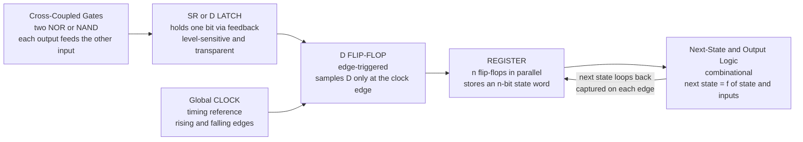

# 🔁 Sequential Logic and Flip-Flops

> [!abstract] TL;DR
> **Combinational logic is memoryless** — its output is purely a function of the inputs *right now*, so it forgets everything the instant an input changes. Real computation needs to **remember**: a running total, the current step, the mode you are in. **Sequential logic** adds that missing half: its output depends on the inputs **and** on stored **state**. The atom of state is the **flip-flop**, a single bit of memory built from **cross-coupled gates** (feedback that holds its own output) plus a **clock** so every bit updates in lockstep on the clock **edge**. Stack *n* flip-flops into a **register**, add **next-state logic**, and you have a **finite state machine** — the general model of every counter, controller, and CPU. What ultimately sets a chip's speed is the **register-to-register timing**: the clock period must cover clock-to-Q plus combinational delay plus setup time, so $f_{max} = 1/(t_{pcq}+t_{comb}+t_{setup})$.

---

## Intuition

**Analogy:** Combinational logic is a **calculator with no display and no memory** — the answer flickers into existence only while you hold the buttons, and vanishes the instant you let go. To compute anything interesting you must *remember*: where you are in a sequence, the number so far, the light that is currently green. A **flip-flop is a single electronic light-switch that STAYS where you flip it** — one bit of memory that holds its value after your finger leaves. Wire a circuit so that its output loops back and feeds its own input (**feedback**), and the circuit will *hold* a bit indefinitely. Add a **clock** — a metronome that says "everybody update *now*" on each tick — and all your light-switches march forward together in perfect lockstep. That single idea, *held state advancing on a clock edge*, is the missing half of every computer: the ability to **count, remember, and sequence**.

The rest of this note is just the engineering of that light-switch: how feedback holds a bit (the **latch**), how a clock makes the update happen only at a precise instant (the **flip-flop**), how many of them form **registers** and **state machines**, and the sharp **timing rules** that decide how fast the metronome can safely tick.

---

## How It Works

### Core Mechanics

1. **Feedback creates memory.** Take two NOR (or NAND) gates and cross-couple them — each gate's output drives the other's input. This **SR latch** now has two stable states (Q = 0 or Q = 1) and *holds whichever one it is in*. A brief pulse on **Set** forces Q = 1; a pulse on **Reset** forces Q = 0; with both inputs idle, the feedback loop **remembers**. That is one bit of storage made from pure logic.
2. **A latch is transparent (level-sensitive).** Add an enable/clock level to get a **D latch**: while the clock is high the output *follows* the D input (transparent); while it is low the output *freezes*. The danger: during the transparent phase, whatever wiggles on D flows straight through — timing is hard to reason about.
3. **A flip-flop is edge-triggered.** Chain two latches (a **master** and a **slave**) driven by opposite clock levels. Now the output can only change at the **instant** the clock transitions — the rising (or falling) **edge**. The flip-flop **samples D at the edge** and holds it for the whole cycle. This is the workhorse: state changes are *synchronized* to clock edges, which makes timing analyzable.
4. **Flavors of flip-flop.** The **D** (data) flip-flop simply captures D. The **SR**, **JK** (set/reset/toggle), and **T** (toggle) types repackage the same idea; modern synthesis maps all of them onto D flip-flops.
5. **Registers and synchronous design.** Put *n* flip-flops side by side sharing one clock and you have an **n-bit register** — a word of memory. A **global clock** drives every register, so the whole machine advances together: the dominant **synchronous design** style.
6. **Finite state machines.** The general pattern is **state register + next-state logic + output logic**. The register holds the current state; combinational logic computes the *next* state from the current state and the inputs and feeds it back to be captured on the next edge. **Moore** machines make outputs depend only on the state; **Mealy** machines let outputs also depend on the current inputs. A state diagram (traffic light, protocol handshake, CPU control unit) compiles directly into this structure.
7. **Timing sets the clock speed.** Each flip-flop needs its data stable for a **setup time** $t_{setup}$ *before* the edge and a **hold time** $t_{hold}$ *after* it, and produces its output after a **clock-to-Q** delay $t_{pcq}$. The register-to-register path must fit inside one clock period: $T_{clk} \ge t_{pcq}+t_{comb}+t_{setup}$, which caps the **maximum clock frequency**. Violate the aperture (often with an **asynchronous** input) and the flip-flop can go **metastable** — hovering between 0 and 1 for an unpredictable time.

### Flow / Architecture



---

## Key Concepts

### Secondary Level

- **Memory vs no memory** — **combinational** logic (gates, adders, multiplexers) outputs a function of the inputs *now*; **sequential** logic also remembers **state** from the past.
- **Flip-flop** — one bit of memory; a light-switch that stays where you flip it. A **D flip-flop** captures its D input and holds it.
- **Clock** — a steady on/off signal (the metronome) that tells every flip-flop *when* to update: on its rising or falling **edge**.
- **Register** — a row of flip-flops storing a multi-bit number (a byte, a word).
- **Counter** — a register wired so its stored number increases by one on every clock tick — the simplest useful state machine.

### Undergraduate Level

- **Latch vs flip-flop** — a **latch** is *level-sensitive* (transparent while enabled); a **flip-flop** is *edge-triggered* (updates only at the clock edge). Prefer flip-flops for predictable timing; accidental **latch inference** in HDL is a classic bug.
- **Flip-flop types** — **SR** (set/reset), **D** (data), **JK** (adds toggle on J=K=1), **T** (toggle). Characteristic equations: D flip-flop $Q^{+}=D$; T flip-flop $Q^{+}=Q\oplus T$; JK $Q^{+}=J\bar{Q}+\bar{K}Q$.
- **Synchronous design** — one global clock; all state updates happen together on the edge, so the circuit is analyzable as *state $\to$ next state* per cycle.
- **Finite state machine** — **Moore** ($\text{out}=f(\text{state})$, glitch-free registered outputs) vs **Mealy** ($\text{out}=f(\text{state},\text{input})$, faster, usually fewer states). Design flow: state diagram $\to$ state table $\to$ state encoding $\to$ next-state + output logic.
- **Timing parameters** — **setup** $t_{setup}$ (stable before edge), **hold** $t_{hold}$ (stable after edge), **clock-to-Q** $t_{pcq}$ (propagation). Setup constraint $T_{clk}\ge t_{pcq}+t_{comb}+t_{setup}$ fixes $f_{max}$; hold constraint $t_{hold}\le t_{pcq}+t_{comb,\min}$ is independent of clock speed.
- **Building blocks** — **shift registers** (serialize/deserialize, delay lines), **counters** (binary, ring, Johnson), and the memory/register-file front end.

### Graduate Level

- **Metastability** — an edge that samples a signal changing inside the aperture drives the flip-flop's cross-coupled pair to its unstable balance point; it resolves exponentially, so failures are *probabilistic*: $MTBF = \dfrac{e^{\,t_r/\tau}}{f_{clk}\,f_{data}}$, where $\tau$ is the regeneration time constant and $t_r$ the resolution time available. Cascaded **synchronizers** (2–3 flip-flops) buy resolution time and push MTBF to years.
- **Clock distribution** — **clock skew** (edge arrives at different registers at different times) tightens setup on one path and *loosens* hold on another; positive skew can even help a path but hurt its neighbor. **Jitter** adds cycle-to-cycle uncertainty. Managed with balanced **clock trees / H-trees** and static timing analysis.
- **Static timing analysis (STA)** — the industrial method: enumerate every register-to-register path, check setup at the capture edge and hold at the same edge, across process/voltage/temperature (PVT) corners. This, not simulation, is what signs off silicon frequency.
- **Clock-domain crossing (CDC)** — moving a signal between unrelated clocks *guarantees* setup/hold violations somewhere; correct designs use flip-flop synchronizers for single bits and **gray-coded FIFOs** (one bit changes per step) for multi-bit words.
- **Low-power and advanced timing** — clock gating, retiming (moving registers to balance logic depth), time borrowing with transparent latches, and multi-cycle/false-path exceptions in STA.
- **FSM verification** — a synchronous machine *is* a finite automaton; its reachable-state space can be checked exhaustively by **model checking** for safety/liveness properties (deadlock-free, one-hot preserved), the industrial bridge from EE to formal methods.

---

## Python Demo

```python
# Two demos in one:
#   (a) COUNTER / FSM: three D flip-flops clocked together as a 3-bit binary counter;
#       the stored state advances on every RISING clock edge -> a TIMING DIAGRAM.
#   (b) SETUP/HOLD & METASTABILITY: a data transition that lands inside the
#       setup/hold aperture -> the flip-flop goes metastable; plus the
#       register-to-register path that sets the MAXIMUM clock frequency.
import numpy as np
import matplotlib.pyplot as plt

# =============== (a) 3-bit binary counter as a timing diagram ===============
n_bits   = 3
n_cycles = 8
T_clk    = 1.0                      # normalized clock period (one "unit" per cycle)
spc      = 400                      # samples per clock cycle (fine -> near-vertical edges)
t = np.linspace(0, n_cycles * T_clk, n_cycles * spc, endpoint=False)

# Clock: high in the first half of each period; a RISING edge at each period start.
clk = (np.mod(t, T_clk) < T_clk / 2).astype(float)

# The counter value held during cycle k is (k mod 8) -> it advances on every rising edge.
cycle = np.floor(t / T_clk).astype(int)
state = np.mod(cycle, 2 ** n_bits)                          # 0,1,2,...,7
Q = [((state >> b) & 1).astype(float) for b in range(n_bits)]  # Q0 = LSB ... Q2 = MSB

fig1, ax = plt.subplots(figsize=(12, 5))
waves  = [clk] + Q[::-1]                                    # CLK on top, then Q2, Q1, Q0
names  = ["CLK", "Q2 (MSB)", "Q1", "Q0 (LSB)"]
colors = ["#6c5ce7", "#e17055", "#00b894", "#0984e3"]
for i, (w, nm, c) in enumerate(zip(waves, names, colors)):
    off = (len(waves) - 1 - i) * 1.6                       # vertical slot for this signal
    ax.plot(t, w * 0.9 + off, lw=2, color=c)
    ax.text(-0.35, off + 0.35, nm, ha="right", va="center", fontsize=10, color=c)

# Mark rising edges and annotate the decimal counter value held during each cycle.
for k in range(n_cycles):
    ax.axvline(k * T_clk, color="grey", ls=":", lw=0.8, alpha=0.6)
    ax.text(k * T_clk + 0.5, -1.1, str(k % 8), ha="center", va="center", fontsize=11,
            bbox=dict(boxstyle="round", fc="#ffeaa7", ec="grey"))
ax.text(-0.35, -1.1, "count", ha="right", va="center", fontsize=9)
ax.set_title("3-bit binary counter (D flip-flops): state advances on each RISING clock edge")
ax.set_xlabel("time  [clock periods]")
ax.set_yticks([]); ax.set_ylim(-1.7, len(waves) * 1.6); ax.set_xlim(-0.6, n_cycles * T_clk)
fig1.tight_layout(); fig1.savefig("ff_counter_timing.png", dpi=120)

# =============== (b) setup/hold window + metastability + fmax ===============
fig2, bx = plt.subplots(1, 2, figsize=(13, 4.6))

# --- left: the setup/hold aperture with a VIOLATING data transition ---
t2      = np.linspace(-3, 6, 3000)      # ns; the clock edge is at t = 0
t_setup = 1.0                           # ns: data must be stable BEFORE the edge
t_hold  = 0.5                           # ns: data must be stable AFTER the edge

# Data transitions at t = +0.2 ns -> INSIDE the [-t_setup, +t_hold] aperture => VIOLATION.
data = np.where(t2 < 0.2, 0.0, 1.0)

# Metastable Q: at the edge it hovers near mid-rail, rings, then resolves (here to 1).
tau = 0.9
Q_meta = np.where(t2 < 0, 0.0,
                  0.5 + 0.5 * (1 - np.exp(-t2 / tau))
                      + 0.18 * np.exp(-t2 / tau) * np.cos(7 * t2))

bx[0].axvspan(-t_setup, t_hold, color="#ff7675", alpha=0.25, label="setup/hold aperture")
bx[0].axvline(0, color="#6c5ce7", lw=2, label="clock edge")
bx[0].plot(t2, data + 3.2, lw=2, color="#0984e3", label="D (data)")
bx[0].plot(t2, Q_meta + 1.4, lw=2, color="#e17055", label="Q (metastable!)")
bx[0].axhline(1.4 + 0.5, color="grey", ls=":", lw=1)          # mid-rail reference for Q
bx[0].text(2.6, 1.4 + 0.62, "hovers at mid-rail, then\nresolves after unknown delay",
           fontsize=8, color="#e17055")
bx[0].set_title("Setup/hold violation -> metastability")
bx[0].set_xlabel("time relative to clock edge  [ns]")
bx[0].set_yticks([]); bx[0].legend(fontsize=8, loc="upper left")
bx[0].grid(True, axis="x", alpha=0.3)

# --- right: the register-to-register path sets the maximum clock frequency ---
t_pcq  = 0.15    # ns: clock-to-Q propagation delay of the LAUNCHING flip-flop
t_comb = 2.00    # ns: worst-case combinational logic between the two registers
t_su   = 0.20    # ns: setup time of the CAPTURING flip-flop
T_min  = t_pcq + t_comb + t_su
fmax   = 1.0 / T_min                                           # cycles per ns = GHz
print(f"T_min = t_pcq + t_comb + t_setup = {t_pcq} + {t_comb} + {t_su} = {T_min:.2f} ns")
print(f"fmax  = 1 / T_min = {fmax*1000:.0f} MHz")

segs = [("t_pcq (clk->Q)", t_pcq, "#6c5ce7"),
        ("t_comb (logic)",  t_comb, "#00b894"),
        ("t_setup",         t_su,  "#e17055")]
left = 0.0
for nm, w, c in segs:
    bx[1].barh(0, w, left=left, height=0.5, color=c, edgecolor="k")
    bx[1].text(left + w / 2, 0, nm, ha="center", va="center", fontsize=8, color="w")
    left += w
bx[1].axvline(T_min, color="k", ls="--", lw=1.5)
bx[1].text(T_min, 0.42, f"T_min = {T_min:.2f} ns\nfmax = {fmax*1000:.0f} MHz",
           ha="right", va="bottom", fontsize=10)
bx[1].set_xlim(0, T_min * 1.15); bx[1].set_ylim(-0.6, 0.95); bx[1].set_yticks([])
bx[1].set_xlabel("register-to-register delay  [ns]")
bx[1].set_title("Clock must cover the whole path:  T_clk >= t_pcq + t_comb + t_setup")
fig2.tight_layout(); fig2.savefig("ff_timing_fmax.png", dpi=120)
plt.show()
```

The first figure is the defining picture of sequential logic: the counter's three bits change **only** on rising clock edges, and reading them top-to-bottom spells out the binary sequence 000, 001, 010, ... — a machine that *remembers* where it was and *advances*. The second figure shows the two things that bound how fast the metronome can safely tick: a data edge that lands inside the **setup/hold aperture** throws the flip-flop into a **metastable** hover with no bounded settling time, and — even when timing is met — the clock period must swallow the entire **clock-to-Q + logic + setup** path, giving the $f_{max}$ that datasheets and static timing analysis ultimately report.

---

## Real-World Applications

- **Every CPU is a giant synchronous FSM.** The program counter, pipeline registers, register file, and control unit are all banks of D flip-flops advancing on the core clock; the "GHz" number on a chip is literally the largest safe $f = 1/(t_{pcq}+t_{comb}+t_{setup})$ that static timing analysis certified across all register-to-register paths.
- **Counters and timers everywhere** — frequency dividers, watchdog timers, PWM generators, real-time clocks, and baud-rate generators are all flip-flop counters. A T flip-flop is a divide-by-two; a chain of them is a ripple counter.
- **Serial communication (shift registers)** — UART, SPI, and JTAG serialize a parallel word one bit per clock through a shift register and deserialize it at the other end; LED strips (WS2812), scan chains for chip test, and PRBS generators are the same building block.
- **Control units and protocol engines** — traffic-light controllers, vending machines, memory controllers, USB/PCIe link state machines, and elevator logic are Moore/Mealy FSMs compiled from a state diagram into a state register plus next-state logic.
- **Clock-domain crossing in real SoCs** — any signal moving between the CPU clock, the USB clock, and the DDR clock passes through a **synchronizer** (or gray-coded FIFO); missing one is a top cause of intermittent, temperature-dependent silicon bugs.
- **FPGA and ASIC design** — the fundamental fabric is *look-up tables (combinational) + flip-flops (sequential)*; register **retiming** and pipelining to hit a target clock are everyday timing-closure tasks.

---

## Common Pitfalls

- **Confusing combinational with sequential.** If the output depends only on the present inputs it is combinational; the moment it depends on **stored state** (past inputs), it is sequential and needs a memory element. Trying to build a counter or a "remember the last value" behavior out of pure gates is a category error.
- **Latch vs flip-flop mix-ups (and accidental latches).** A **latch** is level-sensitive and *transparent* while enabled; a **flip-flop** updates only on the clock **edge**. In an HDL, an incomplete `if`/`case` in a combinational block (a missing `else` or `default`) makes the synthesizer *infer a latch* you never wanted — a subtle, timing-breaking bug. Always assign every output on every path.
- **Reasoning as if the clock were free.** The **setup** constraint $T_{clk}\ge t_{pcq}+t_{comb}+t_{setup}$ caps frequency — fix a violation by pipelining (shorter logic between registers) or slowing the clock. The **hold** constraint $t_{hold}\le t_{pcq}+t_{comb,\min}$ is *independent of clock period*: you cannot fix a hold violation by slowing down; you must add delay to the fast path. Misdiagnosing which one you have wastes days.
- **Treating asynchronous inputs as safe.** A button press, a signal from another clock domain, or a reset that is not synchronized *will* eventually violate setup/hold and drive a flip-flop **metastable**. Metastability cannot be eliminated, only made improbable — always pass async inputs through a two/three flip-flop **synchronizer**, and use **gray coding** for multi-bit crossings.
- **Ignoring clock skew and jitter.** Assuming every register sees the clock edge at the exact same instant is naive. **Skew** can secretly steal setup margin on one path while relaxing hold on another; **jitter** eats into the period. Real designs need balanced clock trees and STA across corners.
- **Forgetting reset and initial state.** A flip-flop with no reset powers up in an unknown state; simulation may hide it (X-propagation) while silicon fails intermittently. Give state machines a defined reset state and, ideally, a safe/default branch so an illegal state cannot deadlock the machine.
- **Using Mealy outputs directly on external pins.** Because a Mealy output is combinational on the inputs, it can **glitch** mid-cycle when an input changes; register it (or use a Moore output) before driving anything that latches on it.

---

## Related Concepts

- [[Sequential_Circuits_and_FSMs]] — the Computer-Architecture-side treatment (master/slave internals, Moore/Mealy tables, MTBF math, CDC, and pipeline registers); this note is the EE / flip-flop-**implementation** companion to it.
- [[Combinational_Circuits]] — the memoryless other half; **sequential = combinational logic + state**, and the "t_comb" in the timing equation lives here.
- [[Boolean_Algebra_and_Logic_Gates]] — the gates whose **cross-coupling** creates the feedback that makes a latch hold a bit.
- [[Finite_Automata_DFA_and_NFA]] — the Theory-of-Computation formalism (states, transitions, acceptance) that a synchronous FSM physically **realizes** in hardware.
- [[State_Based_Modeling_and_Invariants]] — the Formal-Methods view of modeling a system as states + transitions + invariants, the abstract sibling of an FSM's state diagram.
- [[Model_Checking_Fundamentals]] — exhaustively verifying that an FSM/state machine satisfies safety and liveness properties (no deadlock, one-hot preserved).
- [[Hardware_and_Circuit_Verification]] — formally proving sequential hardware correct (sequential equivalence checking, timing/property verification) — where this note meets formal methods.
- [[Semiconductor_Devices_and_Diodes]] — the device layer beneath the abstraction: a flip-flop is ultimately transistors, and clock-to-Q / propagation delay come from switching those devices.
- [[RC_RL_and_RLC_Transients]] — propagation delay, rise/fall times, and clock-to-Q all trace back to **RC charging** of gate and wire capacitances.
- [[Electrical_Engineering_Overview]] — where digital electronics and systems sit within the six branches of EE.

*Sibling notes in this section (Digital Electronics and Systems), referenced in prose only until built: **Boolean_Logic_and_Combinational_Circuits** (the memoryless half that feeds these flip-flops), **Digital_System_Design_and_HDL** (describing this behavior in Verilog/VHDL and synthesizing it), **Memory_and_Programmable_Logic** (SRAM/DRAM/ROM and PLD/FPGA fabric built from these cells), **Embedded_Systems_and_Microcontrollers** (the systems that run on synchronous FSMs), and **MOSFETs_and_CMOS** (the transistor-level implementation of every gate and latch here).*

---

## Review Questions

1. **(Secondary)** Using the light-switch analogy, explain the difference between a **combinational** circuit and a **sequential** one, and why you cannot build a counter without memory. What role does the **clock** play?
2. **(Undergraduate)** Contrast a **D latch** with a **D flip-flop**. For a register-to-register path with $t_{pcq}=0.15$ ns, worst-case $t_{comb}=2.0$ ns, and $t_{setup}=0.2$ ns, compute the maximum clock frequency. If the design misses timing, name two distinct fixes and state which one *cannot* help a **hold** violation and why.
3. **(Graduate)** An asynchronous button input feeds directly into a state machine and the product fails randomly in the field, more often when warm. Explain the mechanism (metastability), why the failure is probabilistic and temperature-sensitive, and how a two-flip-flop synchronizer changes the $MTBF = e^{\,t_r/\tau}/(f_{clk}f_{data})$. When would you instead need a **gray-coded FIFO**?

---

## Sources

- Harris, D. M. & Harris, S. L. — *Digital Design and Computer Architecture* (Morgan Kaufmann) — sequential building blocks, timing (setup/hold, $f_{max}$), metastability, and FSM design.
- Mano, M. M. & Ciletti, M. D. — *Digital Design* (Pearson) — latches, flip-flops, registers, counters, and synchronous FSM analysis/synthesis.
- Wakerly, J. F. — *Digital Design: Principles and Practices* (Pearson) — thorough treatment of clocking, hazards, and practical sequential-circuit design.
- Rabaey, J., Chandrakasan, A. & Nikolic, B. — *Digital Integrated Circuits: A Design Perspective* (Prentice Hall) — the transistor-level and timing/metastability view of flip-flops and clock distribution.

---

#electrical-engineering #sequential-logic #flip-flops #finite-state-machines #clocking
