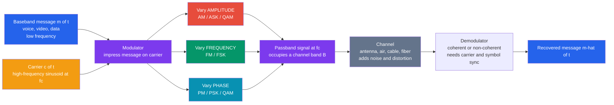

# 📡 Analog and Digital Modulation

> [!abstract] TL;DR
> **Modulation** impresses a **baseband message** (voice, video, data) onto a high-frequency **carrier** wave so it can actually be transmitted — a raw kHz voice signal would need a miles-long antenna, propagates poorly, and would collide with everyone else in the same band. Shifting it up to a carrier frequency $f_c$ enables **reasonable-size antennas** ($\sim \lambda/4$), **frequency-division sharing** (each station/channel its own carrier), and **better propagation**. You modulate by varying one of the carrier's three knobs with the message: **amplitude** (AM, ASK), **frequency** (FM, FSK), or **phase** (PM, PSK) — and combining amplitude and phase gives **QAM**. Digital schemes map bits to discrete carrier states drawn as points on the **I-Q constellation**: more points means more **bits per symbol** (higher rate) but smaller spacing means less **noise margin** (needs higher SNR) — the rate-versus-robustness tradeoff that pushes every modern link toward the **Shannon capacity** limit. It is how every radio, phone, Wi-Fi link, satellite, cable modem, and fiber transmitter puts information onto a physical carrier.

## Intuition — analogy FIRST

Your voice is a **low-frequency** signal: it can't travel far on its own and it can't share the airwaves with everyone else's voice — they'd all pile up in the same low band and turn to mush. So radio does something clever: it takes a fast, invisible **carrier** wave and rides your message on top of it — like **writing a message on a fast-moving train**. The train travels far and fast; your message just goes along for the ride.

There are three ways to write on that train. **AM radio varies the carrier's HEIGHT** (amplitude) with your voice — loud sounds make a taller wave. **FM varies its SPEED/pitch** (frequency) — loud sounds nudge the carrier faster or slower. **Digital systems flip the carrier between distinct states** to send 1s and 0s — hop between two frequencies, two phases, or a grid of amplitude-and-phase points.

Modulation is how every wireless signal gets onto the airwaves at the *right frequency* — it's why a thousand radio stations, your Wi-Fi, your Bluetooth earbuds, and your phone can all share the same sky without colliding: each rides a train on a different track (carrier). Once you can *see* a message as a rider on a high-frequency carrier, you understand why antennas are small, why stations don't interfere, and why "more data" always fights "more robust."

---

## How It Works

A carrier is a pure sinusoid $c(t) = A_c\cos(2\pi f_c t + \phi)$ with three parameters you can touch: **amplitude** $A_c$, **frequency** $f_c$, and **phase** $\phi$. Modulation *impresses* the message $m(t)$ onto **exactly one** (or a combination) of these:

1. **Vary amplitude** — $s(t) = A_c\,[1 + \mu\,m(t)]\cos(2\pi f_c t)$. This is **AM** (analog) or **ASK/OOK** and the amplitude axis of **QAM** (digital). Simple to build, but noise attacks amplitude directly.
2. **Vary frequency** — the instantaneous frequency becomes $f_c + k_f\, m(t)$, so $s(t) = A_c\cos\!\big(2\pi f_c t + 2\pi k_f\!\int m\,d\tau\big)$. This is **FM** (analog) or **FSK** (digital). Constant envelope, so it shrugs off amplitude noise — at the cost of **wider bandwidth**.
3. **Vary phase** — $s(t) = A_c\cos(2\pi f_c t + k_p\, m(t))$. This is **PM** (analog) or **PSK** (digital: BPSK, QPSK).

The result is a **passband** signal centered at $f_c$, occupying a channel of bandwidth $B$ around it. The transmitter radiates it; the channel (air, cable, fiber) adds noise and distortion; the **receiver demodulates** — recovering $m(t)$ either **coherently** (regenerating the exact carrier phase) or **non-coherently** (envelope/energy detection, simpler but less efficient).



---

## Key Concepts / Details

### Secondary Level — Three Knobs, Three Ways to Ride the Carrier

A carrier wave has three things you can change, and each gives a family of modulation:

| Knob you vary | Analog name | Digital name | Feel for it |
|---|---|---|---|
| **Height** (amplitude) | **AM** | **ASK / OOK** | loud = taller wave; simple radios but noise-prone |
| **Speed** (frequency) | **FM** | **FSK** | loud = faster wiggle; noise-resistant, needs more room |
| **Timing** (phase) | **PM** | **PSK** | shift where the wave "starts"; robust, used everywhere digital |

Two headline facts. **Why modulate at all:** a low frequency needs an antenna kilometres long (antenna size $\sim$ a quarter of the wavelength), and everyone's low-frequency signals would overlap — moving to a high carrier makes antennas small and gives each user their own **channel**. **AM vs FM:** AM is simple and cheap but static (noise) rides right on the amplitude, so it's crackly; FM hides the message in the *frequency*, which noise barely touches, so FM radio sounds clean — Edwin **Armstrong**'s great insight — but FM needs a wider slice of spectrum per station.

### Undergraduate Level — Sidebands, Bandwidth, and the I-Q Constellation

**AM spectrum and sidebands.** Multiplying by $\cos(2\pi f_c t)$ *shifts* the message spectrum up to $f_c$ (the modulation property of the [[Fourier_Transform]]). Standard AM produces a **carrier** spike at $f_c$ plus **two sidebands** (upper and lower), each a copy of the message spectrum, so its bandwidth is $B_{AM} = 2W$ where $W$ is the message bandwidth. The carrier itself conveys *no* information — it wastes power. **DSB-SC** removes it; **SSB** transmits only one sideband, halving bandwidth to $W$ (used in old ham/telephony trunks).

**FM bandwidth — Carson's rule.** FM's bandwidth isn't $2W$; the frequency deviation $\Delta f$ spawns theoretically infinite Bessel sidebands, and a good engineering estimate is **Carson's rule** $B_{FM} \approx 2(\Delta f + W) = 2W(\beta + 1)$, where $\beta = \Delta f / W$ is the modulation index. Wide-deviation FM trades **bandwidth for noise immunity** (the FM "capture" and quieting effect).

**Digital: bits become symbols on the I-Q plane.** Any passband signal can be written as $s(t) = I(t)\cos(2\pi f_c t) - Q(t)\sin(2\pi f_c t)$ — an **in-phase** ($I$) and a **quadrature** ($Q$) component, $90^\circ$ apart. A digital scheme sends one **symbol** per interval $T_s$ by choosing a point $(I, Q)$ from a fixed set — the **constellation diagram**:

| Scheme | Points | Bits/symbol | What varies |
|---|---|---|---|
| **BPSK** | 2 | 1 | phase ($0$ or $\pi$) |
| **QPSK / 4-QAM** | 4 | 2 | phase (4 values) |
| **16-QAM** | 16 | 4 | amplitude + phase |
| **64-QAM** | 64 | 6 | amplitude + phase |
| **256-QAM** | 256 | 8 | amplitude + phase |

**More points → more bits per symbol → higher data rate.** But packing more points into the same average power shrinks the spacing between them, so a smaller amount of noise pushes a received point across a **decision boundary** into a neighbor → a **symbol error**. That is the fundamental **rate-versus-robustness** tradeoff, and it demands higher **SNR** for higher-order QAM.

### Graduate Level — Nyquist Pulse Shaping, OFDM, Spread Spectrum, and Shannon

**Symbol rate, bandwidth, and pulse shaping.** Symbols can't be infinitely sharp — a rectangular pulse has infinite bandwidth, and truncating it makes adjacent symbols smear into each other as **inter-symbol interference (ISI)**. The **Nyquist criterion for zero ISI**: a pulse whose spectrum has odd symmetry about $\pm 1/2T_s$ (the **raised-cosine / root-raised-cosine** family, roll-off $\alpha$) is zero at every *other* symbol's sampling instant. The minimum ISI-free bandwidth is $B = (1+\alpha)/2T_s$; at $\alpha = 0$ you approach the **Nyquist rate** of $1/2T_s$ Hz per dimension. The transmit and receive filters split the RRC to also act as the **matched filter** that maximizes SNR at the sampling instant.

**OFDM — many parallel narrowband carriers.** Instead of one fast, wideband carrier (which suffers frequency-selective fading and ugly ISI over multipath channels), **OFDM** splits the band into thousands of **orthogonal subcarriers**, each carrying a slow, low-rate QAM stream. Implemented with an **IFFT/FFT**, a **cyclic prefix** absorbs multipath delay spread, converting a nasty channel into many flat sub-channels each with its own QAM order. OFDM is the physical layer of **Wi-Fi ([[WiFi_Standards_802_11]]), LTE/5G ([[Cellular_4G_5G]]), DSL, DVB digital TV, and powerline**.

**Spread spectrum.** **DSSS/CDMA** multiply the symbol by a fast pseudo-random code, spreading energy over a wide band; many users share the band via orthogonal codes, gaining interference/jam resistance and a low probability of intercept (GPS, 3G CDMA, Bluetooth uses frequency-hopping FHSS).

**The link to Shannon.** The [[The_Gaussian_Channel_and_Shannon_Hartley|Shannon-Hartley]] law $C = B\log_2(1 + \mathrm{SNR})$ sets the ceiling: a modulation's **spectral efficiency** (bits/s/Hz) can approach $C/B$ only with the right constellation size *and* [[Error_Correcting_Codes_Fundamentals|error-correcting codes]]. This is why real links use **adaptive modulation and coding (AMC)**: when the channel is clean, jump to 256-QAM with a light code for max throughput; when it degrades, drop to QPSK with a strong code to stay reliable. **Coherent** detection (recover carrier phase, better BER) vs **non-coherent** (no phase reference, simpler, worse) and robust **carrier + symbol synchronization** (PLLs, timing recovery) are what make it all actually work.

---

## Python Demo

```python
# Analog & digital modulation, visualized end to end. Only numpy + matplotlib.
#   (a) ANALOG: a low-frequency message -> AM (carrier amplitude ~ message) and
#       FM (carrier frequency ~ message); plot the message, the AM & FM waveforms,
#       and their SPECTRA -- AM shows a carrier line + two sidebands, FM shows a
#       wider spread (the bandwidth cost of noise immunity).
#   (b) DIGITAL: constellation (I-Q) diagrams for BPSK, QPSK, and 16-QAM at the
#       SAME SNR -- more points/symbol = more bits but tighter spacing, so 16-QAM
#       scatters across decision boundaries into errors while BPSK/QPSK stay clean.
import numpy as np
import matplotlib.pyplot as plt

rng = np.random.default_rng(0)
fig, ax = plt.subplots(3, 3, figsize=(16, 13))

# ================================================================
# (a) ANALOG MODULATION: AM and FM
# ================================================================
fs = 4000.0                      # sample rate (Hz)
dt = 1.0 / fs
t  = np.arange(0, 1.0, dt)
fm = 5.0                         # message frequency (Hz)
fc = 80.0                        # carrier frequency (Hz)
m  = np.sin(2 * np.pi * fm * t)  # baseband message, peak-normalized to 1

# --- AM: amplitude proportional to (1 + mu*m) ---
mu   = 0.8                                    # modulation index (< 1: no overmod)
s_am = (1.0 + mu * m) * np.cos(2 * np.pi * fc * t)

# --- FM: instantaneous frequency = fc + kf*m ; phase = integral of freq ---
kf   = 30.0                                   # frequency deviation (Hz)
phi  = 2 * np.pi * fc * t + 2 * np.pi * kf * np.cumsum(m) * dt
s_fm = np.cos(phi)

def spectrum_db(x):
    X = np.fft.rfft(x * np.hanning(x.size))
    f = np.fft.rfftfreq(x.size, dt)
    mag = np.abs(X) / np.max(np.abs(X))
    return f, 20 * np.log10(mag + 1e-6)

f_am, S_am = spectrum_db(s_am)
f_fm, S_fm = spectrum_db(s_fm)

win = t < 0.30                                # short window to see waveforms
ax[0, 0].plot(t[win], m[win], 'k', lw=1.8)
ax[0, 0].set_title(f"(a) Message m(t)  ({fm:g} Hz)")
ax[0, 0].set_xlabel("time [s]"); ax[0, 0].set_ylabel("amplitude"); ax[0, 0].grid(alpha=0.3)

ax[0, 1].plot(t[win], s_am[win], 'tab:red', lw=0.9)
ax[0, 1].plot(t[win],  (1 + mu*m)[win], 'k--', lw=1.2, label="envelope 1+mu*m")
ax[0, 1].plot(t[win], -(1 + mu*m)[win], 'k--', lw=1.2)
ax[0, 1].set_title(f"(a) AM: amplitude carries m  (fc={fc:g} Hz, mu={mu:g})")
ax[0, 1].set_xlabel("time [s]"); ax[0, 1].grid(alpha=0.3); ax[0, 1].legend(fontsize=8, loc="upper right")

ax[0, 2].plot(t[win], s_fm[win], 'tab:green', lw=0.9)
ax[0, 2].set_title(f"(a) FM: frequency carries m  (dev kf={kf:g} Hz)")
ax[0, 2].set_xlabel("time [s]"); ax[0, 2].grid(alpha=0.3)

# --- spectra: zoom around the carrier ---
band = (f_am >= 0) & (f_am <= 160)
ax[1, 0].plot(f_am[band], S_am[band], 'tab:red', lw=1.4)
ax[1, 0].axvline(fc, color='k', ls=':', lw=0.8)
for sb in (fc - fm, fc + fm):
    ax[1, 0].axvline(sb, color='0.6', ls=':', lw=0.8)
ax[1, 0].set_title("(a) AM spectrum: carrier + 2 sidebands  (B = 2W)")
ax[1, 0].set_xlabel("frequency [Hz]"); ax[1, 0].set_ylabel("|S| [dB]")
ax[1, 0].set_ylim(-70, 5); ax[1, 0].grid(alpha=0.3)

ax[1, 1].plot(f_fm[band], S_fm[band], 'tab:green', lw=1.4)
ax[1, 1].axvline(fc, color='k', ls=':', lw=0.8)
B_carson = 2 * (kf + fm)
ax[1, 1].axvspan(fc - B_carson/2, fc + B_carson/2, color='tab:green', alpha=0.10)
ax[1, 1].set_title(f"(a) FM spectrum: wider spread  (Carson B~{B_carson:g} Hz)")
ax[1, 1].set_xlabel("frequency [Hz]"); ax[1, 1].set_ylim(-70, 5); ax[1, 1].grid(alpha=0.3)

# small comparison note panel
ax[1, 2].axis("off")
ax[1, 2].text(0.02, 0.95,
    "AM vs FM bandwidth\n\n"
    "AM: B = 2W = %.0f Hz\n   (carrier line + 2 sidebands)\n\n"
    "FM (Carson): B ~ 2(dev+W) = %.0f Hz\n   (many Bessel sidebands)\n\n"
    "FM trades BANDWIDTH for\nNOISE IMMUNITY (constant envelope)."
    % (2*fm, B_carson),
    fontsize=11, va="top", family="monospace")

# ================================================================
# (b) DIGITAL MODULATION: constellations with noise
# ================================================================
def norm_pts(pts):
    pts = np.asarray(pts, dtype=complex)
    return pts / np.sqrt(np.mean(np.abs(pts) ** 2))     # unit average energy

bpsk = norm_pts([-1, 1])
qpsk = norm_pts([1 + 1j, 1 - 1j, -1 + 1j, -1 - 1j])
lv   = np.array([-3, -1, 1, 3])
qam16 = norm_pts([complex(i, q) for q in lv for i in lv])

def transmit(points, n, snr_db):
    idx   = rng.integers(0, points.size, n)
    tx    = points[idx]
    snr   = 10 ** (snr_db / 10.0)               # Es/N0 (Es = 1 after norm_pts)
    n0    = 1.0 / snr
    noise = np.sqrt(n0 / 2) * (rng.standard_normal(n) + 1j * rng.standard_normal(n))
    rx    = tx + noise
    dec   = np.argmin(np.abs(rx[:, None] - points[None, :]), axis=1)  # ML decision
    ser   = np.mean(dec != idx)
    return idx, rx, ser

snr_db = 12.0                                    # SAME channel for all three
demos  = [("BPSK  (1 bit/sym)",  bpsk),
          ("QPSK  (2 bits/sym)", qpsk),
          ("16-QAM (4 bits/sym)", qam16)]

for col, (name, pts) in enumerate(demos):
    idx, rx, ser = transmit(pts, 2000, snr_db)
    a = ax[2, col]
    a.scatter(rx.real, rx.imag, s=6, c=idx, cmap="tab10", alpha=0.5)
    a.scatter(pts.real, pts.imag, s=120, marker="x", c="k", linewidths=2,
              label="ideal symbols")
    a.set_title(f"(b) {name}\nEs/N0={snr_db:g} dB   symbol errors={ser:.1%}")
    a.set_xlabel("In-phase  I"); a.set_ylabel("Quadrature  Q")
    a.set_xlim(-2, 2); a.set_ylim(-2, 2); a.set_aspect("equal")
    a.axhline(0, color="0.7", lw=0.6); a.axvline(0, color="0.7", lw=0.6)
    a.grid(alpha=0.3); a.legend(fontsize=8, loc="upper right")

plt.tight_layout()
plt.savefig("analog_and_digital_modulation.png", dpi=110)
print("Saved analog_and_digital_modulation.png")

# --- numeric summary ---
print(f"AM bandwidth 2W = {2*fm:.0f} Hz;  FM Carson bandwidth = {B_carson:.0f} Hz")
for name, pts in demos:
    _, _, ser = transmit(pts, 200000, snr_db)
    bits = int(round(np.log2(pts.size)))
    print(f"{name:22s}: {bits} bits/sym, Es/N0={snr_db:g} dB -> symbol error rate {ser:.4%}")
```

Running it draws a 3x3 panel. Top row: the clean $5\text{ Hz}$ message, the **AM** waveform whose *envelope* traces the message, and the **FM** waveform whose *wiggle rate* speeds up and slows down with the message. Middle row: the **AM spectrum** shows a sharp carrier line flanked by two sidebands ($B = 2W$), while the **FM spectrum** spreads into many Bessel sidebands across a much wider band (Carson's rule) — the visible bandwidth cost of FM's noise immunity. Bottom row: at the *same* $E_s/N_0 = 12\text{ dB}$, **BPSK** (2 well-separated clusters) and **QPSK** (4 clusters) stay comfortably inside their decision regions with essentially no errors, but **16-QAM**'s 16 tightly packed points let noise scatter received symbols across the boundaries — a nonzero symbol-error rate. Same channel, more bits per symbol, less margin: the rate-versus-robustness tradeoff made visible.

---

## Real-World Applications

- **Broadcast radio & TV.** AM band (medium wave, simple envelope-detector receivers), FM band (88–108 MHz, high-fidelity audio via wide-deviation FM), and analog TV audio (FM). Digital broadcast (DAB, DVB-T/ATSC) uses OFDM + QAM.
- **Wi-Fi ([[WiFi_Standards_802_11]]).** OFDM with adaptive QAM per subcarrier — BPSK/QPSK at long range, up to 256-QAM (Wi-Fi 5) and 1024-QAM (Wi-Fi 6) up close, chosen by link quality.
- **Cellular 4G/5G ([[Cellular_4G_5G]]).** OFDMA downlink, adaptive modulation and coding (QPSK → 256-QAM) plus MIMO; the modulation order is picked in real time from channel-quality feedback.
- **Bluetooth ([[Bluetooth_and_BLE]]).** GFSK (a smoothed FSK) for the basic rate and BLE, frequency-hopping spread spectrum for interference resistance.
- **Cable & DSL modems.** DOCSIS cable uses up to 4096-QAM on each channel; DSL uses **DMT** (discrete multitone, an OFDM variant) loading more bits onto quieter frequencies of the copper pair.
- **Satellite & deep-space.** Power-limited links favor robust low-order PSK (BPSK/QPSK, OQPSK) with strong FEC; the constellation is chosen for the *power* budget, not bandwidth.
- **Optical / fiber (coherent).** Modern long-haul fiber uses coherent detection with QPSK and 16/64-QAM on *both* polarizations — the same I-Q constellation math, at hundreds of terahertz.
- **Modems, RFID, key fobs.** Legacy telephone modems (QAM), garage/car remotes and RFID (OOK/ASK for simplicity and cheap non-coherent detection).

---

## Common Pitfalls

- **Forgetting WHY you modulate.** Baseband can't be radiated efficiently — antennas are $\sim\lambda/4$, low frequencies propagate poorly, and everyone would collide. Modulation to a carrier is what makes small antennas, **frequency-division sharing**, and clean propagation possible in the first place.
- **AM over-modulation.** If $\mu > 1$ the envelope $1 + \mu\,m(t)$ goes negative, the envelope detector clips, and the recovered audio distorts. Keep $\mu \le 1$ (or switch to DSB-SC/SSB, which spend no power on the carrier).
- **Assuming FM bandwidth is $2W$.** FM is *not* narrowband — deviation spawns many Bessel sidebands. Use **Carson's rule** $B \approx 2(\Delta f + W)$; wide-deviation FM buys noise immunity by *spending* spectrum.
- **Confusing bit rate with symbol rate.** Data rate $=$ (symbols/s) $\times$ (bits/symbol). 16-QAM sends 4 bits per symbol at the *same* symbol rate as QPSK's 2 — but demands more SNR. Higher-order QAM is throughput bought with signal quality.
- **Chasing constellation order past the SNR budget.** More points = smaller spacing = smaller **noise margin**; beyond what the SNR supports, the symbol-error rate explodes. This is the rate-vs-robustness wall that only more SNR (or coding) moves — toward the [[The_Gaussian_Channel_and_Shannon_Hartley|Shannon]] limit.
- **Ignoring pulse shaping / ISI.** Rectangular symbols smear into neighbors (ISI) and hog bandwidth. Use **root-raised-cosine** matched filtering to meet the **Nyquist** zero-ISI criterion; skipping it closes the eye diagram and floods errors.
- **Sampling/carrier/symbol sync errors.** A **coherent** receiver must lock the carrier phase (PLL) and symbol timing; a fixed phase offset *rotates* the whole constellation, and timing error samples between symbols — both destroy the decision even with plenty of SNR. Non-coherent schemes dodge this but pay in efficiency.
- **Treating OFDM as magic.** OFDM tames multipath only *with* the cyclic prefix and orthogonality; frequency/timing offset breaks subcarrier orthogonality (inter-carrier interference), and its high peak-to-average power ratio (PAPR) stresses the amplifier.

Sibling communication-systems notes (in prose): *Communication_Systems_Fundamentals* frames the source → modulator → channel → demodulator → sink chain this note's modulation block lives in; *Signals_and_LTI_Systems* supplies the frequency-shift and convolution theory behind sidebands and pulse shaping; *RF_and_Microwave_Engineering* builds the mixers, oscillators, and antennas that physically upconvert and radiate the passband signal; *Digital_Signal_Processing_Hardware* runs the IFFT/FFT, matched filters, and timing/carrier recovery that implement modern modems; *Fourier_and_Laplace_in_Circuits* provides the transform machinery for reading every spectrum here.

---

## Related Concepts

- [[Fourier_Transform]] — modulation *is* the frequency-shift property: multiplying by $\cos(2\pi f_c t)$ slides the message spectrum up to $\pm f_c$, creating the sidebands.
- [[Frequency_Spectrum]] — the AM carrier-plus-sidebands and FM's wider Bessel spread are read directly off the signal's spectrum; bandwidth is a spectral measurement.
- [[Sampling_Theorem]] — digital modulation transmits discrete symbols at a symbol rate; the Nyquist zero-ISI criterion is the passband cousin of the sampling/Nyquist rate.
- [[Channel_Capacity_and_the_Noisy_Channel_Theorem]] — sets the ultimate bits/s a modulated channel can carry; constellation order and coding are how you approach it.
- [[The_Gaussian_Channel_and_Shannon_Hartley]] — $C = B\log_2(1+\mathrm{SNR})$ is the exact ceiling behind the rate-vs-robustness tradeoff of QAM order.
- [[Error_Correcting_Codes_Fundamentals]] — coded modulation pairs a constellation with FEC so the link can run near capacity at a target error rate; adaptive modulation *and coding*.
- [[WiFi_Standards_802_11]] — OFDM with adaptive BPSK→1024-QAM per subcarrier is the applied form of everything here.
- [[Cellular_4G_5G]] — OFDMA + adaptive modulation and coding + MIMO; modulation order tracks channel quality in real time.
- [[Bluetooth_and_BLE]] — GFSK and frequency-hopping spread spectrum: the low-power, non-coherent end of the design space.
- [[Physical_Layer]] — modulation is the core job of the OSI physical layer: turning bits into a physical passband waveform.
- [[Wave_Motion_and_Properties]] — the carrier is a physical wave; wavelength $\lambda = c/f_c$ is why high carriers permit small antennas.
- [[Data_Converters_ADC_and_DAC]] — every digital modem front-end lives on ADCs/DACs that turn the I-Q samples into analog and back.
- [[Analog_Filters_and_Frequency_Response]] — band-select, anti-alias, matched, and pulse-shaping filters shape the modulated spectrum and limit ISI.

---

## Review Questions

1. **(Secondary)** Your voice is a low-frequency signal. Explain in the train analogy why it must be "modulated" onto a carrier before broadcast, and describe the physical difference between how an AM station and an FM station encode the same voice.
2. **(Undergraduate)** A message occupies $W = 15\text{ kHz}$. Compare the transmitted bandwidth of standard AM, SSB, and wide-deviation FM with $\Delta f = 75\text{ kHz}$ (use Carson's rule). For a digital link, if you switch from QPSK to 16-QAM at the same symbol rate, what happens to the bit rate, and what must happen to the SNR — and why?
3. **(Graduate)** You are designing an adaptive OFDM link. Explain how you would choose the per-subcarrier constellation (QPSK vs 64-QAM vs 256-QAM) and code rate from channel state, referencing decision-region spacing, the Shannon-Hartley limit, and the role of root-raised-cosine pulse shaping and cyclic-prefix length. What breaks the scheme if carrier or symbol synchronization is imperfect?

---

## Sources

- Haykin, S. — *Communication Systems* (Wiley) — AM/FM/PM, DSB/SSB, digital passband modulation, noise performance.
- Proakis, J. & Salehi, M. — *Communication Systems Engineering* — analog and digital modulation, constellations, matched filtering, capacity.
- Sklar, B. — *Digital Communications: Fundamentals and Applications* — PSK/QAM, pulse shaping, synchronization, coded modulation.
- Couch, L. W. — *Digital and Analog Communication Systems* — spectra, bandwidth, AM/FM detail, and system-level tradeoffs.
- Goldsmith, A. — *Wireless Communications* — adaptive modulation, OFDM, and fading-channel design.

---

#electrical-engineering #modulation #am-fm #qam #constellation
