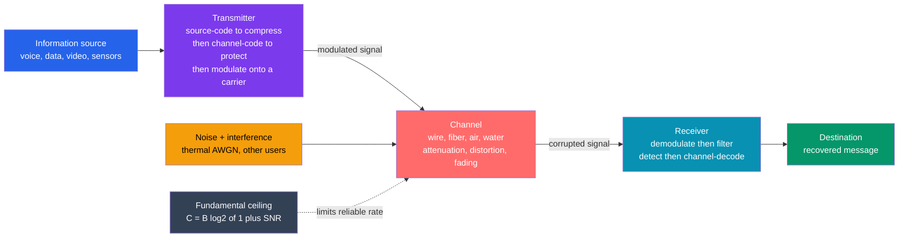

# 📡 Communication Systems Fundamentals

> [!abstract] TL;DR
> A **communication system** is the engineering of moving a message reliably from A to B across a hostile medium. Every system on Earth — a whisper, a phone call, Wi-Fi, 5G, a Mars rover downlink — is the *same* five-block story: **SOURCE → TRANSMITTER → CHANNEL → RECEIVER → DESTINATION**. The **transmitter** dresses the message up (source-codes to remove redundancy, channel-codes to add *protective* redundancy, then **modulates** onto a signal fit for the medium); the **channel** carries it while corrupting it with **noise** (thermal / AWGN), attenuation, **fading**, and interference; the **receiver** demodulates, filters, and decodes to undo the damage. The master metric is **signal-to-noise ratio (SNR)**, and the crown jewel is **Shannon's channel capacity** $C = B\log_2(1 + \mathrm{SNR})$ — the *unbeatable* ceiling on the rate at which information can cross a bandwidth-$B$ channel with arbitrarily low error. Everything in the field — coding, modulation, multiplexing — is a battle against noise fought with bandwidth, power, and cleverness.

## Intuition — analogy FIRST

Getting a message across a **room** is easy: speak, and the listener hears you. Getting it across an **ocean** — through static, through noise, to *exactly* the right person, with nothing lost — is the entire art of communication engineering.

Picture shouting a sentence to a friend across a loud, crowded stadium. You can't just talk. You (the **transmitter**) do three clever things: you strip the sentence to its essentials so there's less to send (**source coding**), you repeat the key words and spell them out — "B as in Bravo" — so a garbled word can still be reconstructed (**channel coding**), and you pitch your voice high above the crowd's rumble so it *rides* over the noise (**modulation**). The stadium air is the **channel**: it carries your voice but drowns it in the crowd's roar (**noise**), muffles it with distance (**attenuation**), and bounces echoes off the walls (**fading**). Your friend (the **receiver**) cups their ears, filters out the crowd, and pieces your sentence back together (**demodulate + decode**).

The deep question is: **how much can you reliably shout through that roar?** Louder voice (more power) helps; a wider pitch range (more bandwidth) helps; smarter spelling (better codes) helps. But is there a *hard limit*? Claude Shannon proved in 1948 that **yes** — there is an exact, unbeatable ceiling, $C = B\log_2(1 + \mathrm{SNR})$, and it sets the ultimate speed limit of every phone, cable, and fiber on the planet. Below it, *perfect* communication is possible with enough coding cleverness; above it, it is *provably impossible*. That single equation is the birth of information theory and the number every modem on Earth chases.

---

## How It Works

### Core Mechanics

Every communication system decomposes into the same **five blocks**, and understanding them individually explains almost the whole field:

1. **Information source & source coding.** The message (voice, text, image, sensor stream) is digitized and then **compressed** — redundancy is *removed* so we transmit the fewest bits carrying the same information. This is the province of **entropy** and the source-coding theorem: you cannot compress below the source's entropy $H$ without losing information.
2. **Channel coding (error-correcting codes).** Now redundancy is deliberately *added back* — but *structured* redundancy (parity bits, algebraic structure) that lets the receiver **detect and correct** errors the noise will inflict. Hamming, convolutional, turbo, and LDPC codes push right up to Shannon's limit. Source coding removes redundancy; channel coding adds smart redundancy — two opposite steps, both essential.
3. **Modulation.** The coded bits are impressed onto a physical **carrier signal** matched to the medium — varying its amplitude, frequency, or phase. This shifts the message from **baseband** up to a **passband** the channel can actually carry (an antenna, a fiber's light, a wire's frequency window). *(Full treatment in the sibling note Analog_and_Digital_Modulation.)*
4. **Channel.** The physical medium — copper, optical fiber, free-space RF, even water — that **transports and corrupts**. It adds **thermal noise** (modeled as **Additive White Gaussian Noise, AWGN**), **attenuates** the signal with distance, distorts it (frequency-dependent delay), suffers **fading** (multipath, moving reflectors), and picks up **interference** from other users.
5. **Receiver & destination.** The receiver **demodulates** (recovers baseband), **filters** out-of-band noise, **detects** the most likely transmitted symbols, and **channel-decodes** to correct residual errors — delivering the message to its destination.

The two numbers that govern everything are the **signal-to-noise ratio (SNR)** = signal power ÷ noise power (quality of the link), and the **bandwidth $B$** in hertz (the frequency span the channel offers). Crucially, **bandwidth (Hz) is not the same as data rate (bits/s)** — bandwidth is a *frequency width*; data rate is *information per second*. Shannon's theorem is precisely the bridge that converts one into the other given the SNR.

### Flow / Architecture



The diagram is the whole subject in one picture: the **transmitter** conditions the message for the journey, the **channel** injects the noise that fights it, the **receiver** reverses the damage, and **Shannon's capacity** sets the referee's whistle — the maximum rate at which the receiver can win.

---

## Key Concepts / Details

### Secondary Level — The Universal Model, Noise, and SNR

Every system, from tin-can telephones to satellites, is the same **five-block chain**: *source → transmitter → channel → receiver → destination*. Two ideas dominate:

- **Noise is the enemy.** The **channel** always adds unwanted random energy. The dominant, universal form is **thermal noise** — the jiggle of electrons at any temperature above absolute zero — modeled as **Additive White Gaussian Noise (AWGN)**: *additive* (it sums onto the signal), *white* (equal power at all frequencies), *Gaussian* (bell-curve amplitudes).
- **SNR is king.** The **signal-to-noise ratio** is the ratio of signal power to noise power, usually in decibels: $\mathrm{SNR}_{\mathrm{dB}} = 10\log_{10}\!\frac{P_{\text{signal}}}{P_{\text{noise}}}$. High SNR = clear message; low SNR = message buried in hiss. Everything a communication engineer does is, ultimately, an effort to raise the *effective* SNR or to squeeze more information out of the SNR they have.

**Analog vs digital.** Older systems (AM/FM radio, analog TV) sent a *continuous* waveform — noise directly degrades it and accumulates at every hop. **Digital** systems send *discrete symbols* (bits): as long as noise doesn't push a symbol past a decision threshold, the receiver **regenerates the exact original** — and repeaters can clean and re-transmit perfectly. This **noise immunity and regeneration** is why digital communication won.

### Undergraduate Level — Bandwidth vs Rate, BER, and Shannon-Hartley

**Bandwidth is not data rate.** **Bandwidth $B$** (hertz) is the *width of the frequency band* the channel offers. **Data rate $R$** (bits/second) is how much *information* you push through it. They are related but distinct — a wide band poorly used can carry less than a narrow band used cleverly. Modulation and coding are how you convert available Hz into bits/s.

**Bit-error rate (BER).** For digital links, the headline quality metric is the **bit-error rate** — the fraction of received bits that are wrong. BER falls as SNR rises: more noise → more symbols cross the decision threshold → more errors. For **BPSK** over AWGN, $\mathrm{BER} = Q\!\big(\sqrt{2E_b/N_0}\big)$, where $E_b/N_0$ is the energy-per-bit to noise-density ratio — the "SNR normalized per bit" that lets you compare modulation schemes fairly.

**Shannon-Hartley — the crown jewel.** The **channel capacity** of a bandwidth-$B$ AWGN channel is

$$C = B\,\log_2\!\left(1 + \mathrm{SNR}\right) \quad\text{[bits/second]}.$$

This is the **maximum rate at which information can be transmitted with arbitrarily low error**. Shannon's **noisy-channel coding theorem** proved two shocking facts at once: (1) for *any* rate $R < C$, there exists a code making the error probability as small as you like — reliable communication is possible right up to the ceiling; and (2) for $R > C$, reliable communication is *impossible* — no code can save you. Capacity grows only *logarithmically* with SNR (throwing power at the problem has diminishing returns) but *linearly* with bandwidth (more Hz is the cheap lever). This one equation defines what is achievable for every modem, and the whole modern-coding endeavor (turbo, LDPC) is the quest to *reach* it.

**Source coding vs channel coding — the two-step dance.**

| | Source coding | Channel coding |
|---|---|---|
| **Goal** | remove redundancy (compress) | add *structured* redundancy (protect) |
| **Fights** | wasted bandwidth | noise-induced errors |
| **Governed by** | entropy $H$ (lower bound) | capacity $C$ (upper bound) |
| **Examples** | Huffman, LZ, JPEG, MP3 | Hamming, convolutional, turbo, LDPC |

Shannon's **separation theorem** says (for a point-to-point link) you can design these two independently and lose nothing — compress optimally, *then* protect optimally.

### Graduate Level — Link Budgets, Multiplexing, and Reaching Capacity

**The link budget.** Real design starts by accounting for *every* gain and loss between transmitter and receiver to predict the received SNR:

$$P_{\text{rx}} = P_{\text{tx}} + G_{\text{tx}} + G_{\text{rx}} - L_{\text{path}} - L_{\text{misc}} \quad\text{(all in dB)},$$

and the **noise floor** $N = kTB$ (Boltzmann constant $k$, temperature $T$, bandwidth $B$) sets the noise power. The **link margin** = received SNR minus the SNR the modulation/coding needs for a target BER. Deep-space links (Voyager) and satellite downlinks live or die by the link budget — huge antennas and powerful codes buy back the enormous path loss.

**Fading and the channel's real personality.** Beyond AWGN, wireless channels suffer **multipath fading**: reflections arrive with different delays and can *cancel*, causing deep, time-varying SNR drops. Countermeasures — **diversity** (multiple antennas / MIMO), **equalization**, **interleaving** (spread a codeword's bits over time so a fade hits scattered, correctable bits), and **OFDM** (split the band into many narrow, individually-flat subcarriers) — dominate 4G/5G/Wi-Fi design.

**Multiplexing & multiple access — sharing the channel.** One medium, many users:

| Scheme | Shares the channel by | Used in |
|---|---|---|
| **FDM** | frequency slots | radio/TV broadcast, analog telephony |
| **TDM** | time slots | 2G GSM, digital telephony (T1/E1) |
| **CDMA** | orthogonal codes (all share time+freq) | 3G, GPS |
| **OFDM(A)** | thousands of orthogonal subcarriers | 4G LTE, 5G, Wi-Fi, DSL, DVB |

**Approaching capacity.** For decades, practical codes sat several dB *below* Shannon's limit. **Turbo codes** (1993) and **LDPC codes** (rediscovered late 1990s), decoded with iterative belief propagation, came within a *fraction of a dB* of capacity — closing the 50-year gap Shannon opened and enabling 4G/5G, Wi-Fi 6, DVB-S2, and modern storage. The **baseband vs passband** distinction (message spectrum near DC vs shifted up to a carrier) is the launching point for **modulation** — the sibling note Analog_and_Digital_Modulation.

---

## Python Demo

```python
# Communication systems: NOISE, SNR, bit-error rate, and the Shannon ceiling.
#   (a) SIGNAL + NOISE: transmit a bipolar digital signal (BPSK-style +/-1 bits),
#       add Gaussian channel (AWGN) noise at a LOW and a HIGH SNR, and plot the
#       received waveform -> noise corrupts it at 0 dB, signal recovers at 15 dB.
#       Then Monte-Carlo the BIT-ERROR RATE vs SNR (more noise -> more errors).
#   (b) SHANNON CAPACITY: plot the Shannon-Hartley limit C = B*log2(1+SNR) vs SNR
#       for several bandwidths B, and mark where real modulation schemes sit BELOW
#       the ceiling. Only numpy + matplotlib.
import numpy as np
import matplotlib.pyplot as plt

rng = np.random.default_rng(0)
fig, ax = plt.subplots(2, 2, figsize=(14, 10))

# ---------------------------------------------------------------
# (a) DIGITAL SIGNAL + AWGN at LOW and HIGH SNR  (signal power = 1)
# ---------------------------------------------------------------
n_bits, sps = 20, 40
bits    = rng.integers(0, 2, n_bits)
symbols = 2*bits - 1.0                 # bit 0 -> -1 , bit 1 -> +1
tx      = np.repeat(symbols, sps)      # transmitted waveform
t       = np.arange(tx.size)

def add_awgn(sig, snr_db):
    sigma = np.sqrt(1.0 / 10**(snr_db/10))   # signal power = 1
    return sig + sigma * rng.standard_normal(sig.size)

for col, (snr_db, title) in zip(range(2),
        [(0.0,  "LOW SNR = 0 dB  (noise ~ signal)"),
         (15.0, "HIGH SNR = 15 dB  (signal recovers)")]):
    rx = add_awgn(tx, snr_db)
    a  = ax[0, col]
    a.plot(t, rx, color='0.6', lw=0.8, label="received (signal + noise)")
    a.step(t, tx, where='mid', color='k', lw=1.8, label="transmitted bits")
    a.axhline(0, color='tab:red', ls='--', lw=1, label="decision threshold")
    a.set_title(f"(a) Channel noise at {title}")
    a.set_xlabel("sample"); a.set_ylabel("amplitude")
    a.set_ylim(-4, 4); a.grid(alpha=0.3); a.legend(loc="upper right", fontsize=8)

# ---------------------------------------------------------------
# (a) BIT-ERROR RATE vs SNR   (Monte-Carlo BPSK: more noise -> more errors)
# ---------------------------------------------------------------
snr_axis = np.arange(-4, 13, 1.0)
Nbits    = 300_000
tx_bits  = rng.integers(0, 2, Nbits)
tx_sym   = 2*tx_bits - 1.0
ber = []
for s in snr_axis:
    sigma = np.sqrt(1.0 / 10**(s/10))
    rx    = tx_sym + sigma * rng.standard_normal(Nbits)
    det   = (rx > 0).astype(int)                 # threshold detector
    ber.append(np.mean(det != tx_bits))
ber       = np.array(ber)
ber_floor = np.maximum(ber, 0.5/Nbits)           # keep log plot finite

axb = ax[1, 0]
axb.semilogy(snr_axis, ber_floor, 'o-', color='tab:blue', lw=2)
axb.set_title("(a) Bit-Error Rate collapses as SNR rises (BPSK)")
axb.set_xlabel("SNR  [dB]"); axb.set_ylabel("bit-error rate  (log)")
axb.grid(True, which='both', alpha=0.3)
axb.text(-3.5, 3e-4, "more noise\n= more errors", fontsize=9, color='tab:blue')

# ---------------------------------------------------------------
# (b) SHANNON-HARTLEY CEILING   C = B * log2(1 + SNR)
# ---------------------------------------------------------------
snr_db  = np.linspace(-5, 30, 400)
snr_lin = 10**(snr_db/10)
axc = ax[1, 1]
for B, c in [(1e3, 'tab:green'), (1e4, 'tab:orange'), (2e4, 'tab:red')]:
    axc.plot(snr_db, B*np.log2(1+snr_lin)/1e3, color=c, lw=2, label=f"B = {B/1e3:g} kHz")

# mark real modulation schemes (spectral efficiency x B) sitting UNDER the ceiling
Bref    = 2e4
schemes = {"BPSK": (1, 10.5), "QPSK": (2, 13.5), "16-QAM": (4, 20.5), "64-QAM": (6, 26.5)}
for name, (bits_per_hz, req_snr) in schemes.items():
    axc.plot(req_snr, bits_per_hz*Bref/1e3, 'k^', ms=8)
    axc.annotate(name, (req_snr, bits_per_hz*Bref/1e3),
                 textcoords="offset points", xytext=(-6, 7), fontsize=8)
axc.set_title("(b) Shannon-Hartley limit  C = B log2(1 + SNR)")
axc.set_xlabel("SNR  [dB]"); axc.set_ylabel("capacity C  [kbit/s]")
axc.grid(alpha=0.3); axc.legend(loc="upper left")
axc.text(5.5, 150, "real schemes sit\nBELOW the ceiling", fontsize=9)

plt.tight_layout()
plt.savefig("communication_systems_fundamentals.png", dpi=110)
print("Saved communication_systems_fundamentals.png")

# --- numeric sanity checks ---
print(f"BER at  0 dB : {ber[np.argmin(np.abs(snr_axis-0))]:.3f}   (noise ~ signal)")
print(f"BER at 10 dB : {ber[np.argmin(np.abs(snr_axis-10))]:.2e}  (nearly clean)")
for snr_test in (10, 20, 30):
    C = 2e4*np.log2(1+10**(snr_test/10))/1e3
    print(f"Shannon C at SNR={snr_test} dB, B=20 kHz : {C:6.1f} kbit/s")
```

Running it produces four panels. **Top row:** the transmitted bit pattern buried in noise at $0\text{ dB}$ (the grey received waveform wanders wildly around the decision threshold — many bits would flip) versus the same signal at $15\text{ dB}$ (the noise is a thin fuzz on clean $\pm1$ levels — every bit recovers). **Bottom-left:** the BER falling by orders of magnitude as SNR climbs — the quantitative face of "more noise, more errors." **Bottom-right:** the Shannon-Hartley capacity curves rising with SNR (and scaling with bandwidth $B$), with real modulation schemes (BPSK, QPSK, 16-QAM, 64-QAM) plotted as points that all sit *below* the ceiling — the unbeatable limit every one of them is trying to approach.

---

## Real-World Applications

- **Cellular 4G LTE / 5G NR.** OFDM(A) tiles the band into thousands of orthogonal subcarriers to beat multipath fading; LDPC/turbo (LTE) and LDPC + polar (5G) codes push within a fraction of a dB of Shannon; adaptive modulation (QPSK → 256-QAM) trades rate for robustness as your SNR changes with distance.
- **Wi-Fi (802.11).** OFDM + adaptive QAM + convolutional/LDPC coding; the router drops from 256-QAM to BPSK as you walk away and SNR falls — a live demonstration of the capacity/SNR trade.
- **Deep-space & satellite links.** Voyager, Mars orbiters, and DVB-S2 broadcasting run enormous antennas and powerful concatenated / LDPC codes to claw usable SNR out of catastrophic path loss — pure link-budget engineering.
- **Fiber-optic backbone.** The Internet's core: light modulated with QAM (coherent optics), forward-error-correction (LDPC/staircase codes) to hit near-error-free rates over thousands of km.
- **Deep-water / underwater acoustic modems.** Water is a brutal channel (severe multipath, tiny bandwidth); the same TX-channel-RX theory, just with sound instead of RF.
- **Data storage.** Hard drives, SSDs, QR codes, and CDs are "channels in space": Reed-Solomon and LDPC channel coding correct read errors exactly as a wireless link corrects noise.
- **GPS.** CDMA spreads each satellite's weak signal below the noise floor; the receiver despreads with the known code, a textbook use of coding gain and multiple access.

---

## Common Pitfalls

- **Skipping the TX-CHANNEL-RX model.** Every system is *source → transmitter → channel → receiver → destination*. If you can't name which block does what, you don't understand the system. Noise, distortion, fading, and interference are properties of the **channel**; coding and modulation are properties of the **transmitter/receiver**.
- **Confusing bandwidth (Hz) with data rate (bits/s).** Bandwidth is a *frequency width*; data rate is *information per second*. They are linked only through the SNR, via Shannon's $C = B\log_2(1+\mathrm{SNR})$. Doubling bandwidth doubles capacity; doubling SNR barely nudges it (logarithm).
- **Treating Shannon capacity as achievable rate.** $C$ is the *theoretical ceiling* with ideal, infinitely-complex coding. Real modems sit **below** it (a "gap to capacity"). Turbo/LDPC codes shrank that gap to a fraction of a dB, but you can never *exceed* $C$ — that's the theorem's other, harder half.
- **Believing more power always fixes it.** Because capacity grows only *logarithmically* with SNR, brute-forcing power has sharply diminishing returns and often just raises interference for everyone else. Bandwidth and better coding are usually the smarter levers.
- **Mixing up source coding and channel coding.** **Source** coding *removes* redundancy (compression, bounded below by entropy). **Channel** coding *adds structured* redundancy (error correction, bounded above by capacity). They pull in opposite directions and are both required — compress, *then* protect.
- **Forgetting the noise floor / link budget.** Received SNR = transmitted power + gains − losses − noise floor $kTB$. Ignore the link budget and your beautiful modulation scheme simply won't close the link. Widening bandwidth $B$ *raises* the noise floor too — a real tension.
- **Assuming AWGN is the whole story.** Thermal AWGN is the baseline, but real (especially wireless) channels add **fading**, frequency-selective **distortion**, and **interference**. OFDM, diversity/MIMO, equalization, and interleaving exist precisely because AWGN is the *easy* case.
- **Underrating why digital won.** Analog degrades continuously and accumulates noise at every hop; digital **regenerates** exact symbols and can be error-corrected and repeated perfectly. That noise immunity — not "digital is modern" — is the engineering reason.
- **Ignoring the power–bandwidth–rate–error trade.** You cannot maximize data rate, minimize error rate, minimize power, and minimize bandwidth all at once. Every design (deep-space vs 5G vs fiber) is a different corner of that four-way trade.

---

## Related Concepts

- [[The_Gaussian_Channel_and_Shannon_Hartley]] — the information-theory derivation of $C = B\log_2(1+\mathrm{SNR})$ that this note applies; the mathematical heart of the capacity ceiling.
- [[Channel_Capacity_and_the_Noisy_Channel_Theorem]] — Shannon's proof that reliable communication is possible below $C$ and impossible above it — the theorem behind the whole discipline.
- [[Entropy_and_Information_Content]] — defines the information $H$ that source coding compresses toward; the lower bound complementing capacity's upper bound.
- [[Source_Coding_Theorem_and_Data_Compression]] — the "remove redundancy" half of the transmitter; compression down to the entropy limit.
- [[Error_Correcting_Codes_Fundamentals]] — the "add structured redundancy" half; how channel coding detects and corrects the noise this note describes.
- [[Fourier_Transform]] — the frequency-domain lens that defines a channel's *bandwidth* and the spectra that modulation and multiplexing manipulate.
- [[Sampling_Theorem]] — the bridge from analog messages to the digital bits that modern communication systems actually transmit.
- [[Physical_Layer]] — the networking-stack layer that *is* this note: encoding, modulation, and signaling of bits over the medium (OSI layer 1).
- [[Cellular_4G_5G]] — a flagship real system built on OFDM, adaptive QAM, and near-capacity LDPC/turbo/polar codes.

Sibling Electrical-Engineering notes (in prose): *Analog_and_Digital_Modulation* details the carrier techniques (ASK/FSK/PSK/QAM) previewed here; *Signals_and_LTI_Systems* supplies the linear-system and convolution foundation for filtering and channels; *Digital_Signal_Processing_Hardware* implements the modems, filters, and codecs; *RF_and_Microwave_Engineering* builds the antennas, amplifiers, and link budgets of the physical channel; *Fourier_and_Laplace_in_Circuits* underpins the baseband/passband spectrum analysis.

---

## Review Questions

1. **(Secondary)** Explain the five-block model (source → transmitter → channel → receiver → destination) using the stadium-shouting analogy. Which block adds the *noise*, and what does "signal-to-noise ratio" measure? Why is a digital text message more robust to a bad connection than an analog phone call?
2. **(Undergraduate)** A channel has bandwidth $B = 20\text{ kHz}$ and an SNR of $30\text{ dB}$. Compute the Shannon capacity $C$. If you *double the bandwidth* to $40\text{ kHz}$, what happens to $C$? If instead you *double the SNR in linear terms* (i.e. +3 dB), what happens to $C$? Explain why raising bandwidth is a far more effective lever than raising power, and distinguish this capacity from the *actual* data rate a real 64-QAM modem would achieve.
3. **(Graduate)** You are designing a link that must operate over a fading wireless channel at a target BER of $10^{-6}$. Discuss how you would allocate your "budget" across **transmit power, bandwidth, channel-coding rate, and modulation order**, and explain the role of **interleaving** and **OFDM** in combating multipath. Where does Shannon's separation theorem (source vs channel coding designed independently) hold, and where — e.g. in a multi-user or delay-limited setting — might it break down?

---

## Sources

- Haykin, S. — *Communication Systems* (the canonical block-diagram, noise, and modulation reference).
- Proakis, J. & Salehi, M. — *Communication Systems Engineering* (digital communications, capacity, coding, and detection theory).
- Shannon, C. E. — *A Mathematical Theory of Communication* (Bell System Technical Journal, 1948) — the founding paper: entropy, capacity, and the coding theorems.
- Sklar, B. — *Digital Communications: Fundamentals and Applications* (link budgets, BER, and practical system design).
- Cover, T. & Thomas, J. — *Elements of Information Theory* (rigorous treatment of channel capacity and the Gaussian channel).

---

#electrical-engineering #communications #shannon-capacity #snr #channel-coding
