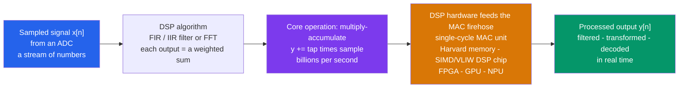

# 🔢 Digital Signal Processing Hardware

> [!abstract] TL;DR
> **Digital signal processing (DSP)** is doing **math on sampled signals**: once an ADC turns a waveform into a stream of numbers $x[n]$, you can apply filters and transforms that are perfectly **reproducible**, arbitrarily **precise**, and even **adaptive** — things no analog circuit can match. That math is overwhelmingly *one* operation repeated billions of times per second: the **multiply-accumulate (MAC)**, $y \mathrel{+}= \text{tap} \cdot \text{sample}$. Digital filters come in two families — **FIR** (finite impulse response: a plain convolution of the input with fixed taps, always stable, can have exactly linear phase) and **IIR** (infinite impulse response: uses feedback, cheap in coefficients but can go unstable). The **FFT** collapses the DFT from $O(N^2)$ to $O(N \log N)$, making real-time spectral processing feasible. Because DSP is MAC-bound, an entire lineage of **hardware** exists to feed it: single-cycle MAC units, **Harvard architecture** (separate data/instruction memory), **SIMD/VLIW DSP chips**, and today **FPGAs, GPUs, and NPUs** — the same MAC at scale that also powers AI accelerators. This is the algorithmic engine inside your phone, hearing aid, modem, radar, and Wi-Fi chip.

## Intuition — analogy FIRST

Once a signal is a **stream of numbers**, you can do things to it that no analog circuit ever could. An analog filter is a *fixed physical object* — a fistful of resistors and capacitors soldered to one cutoff frequency, drifting with temperature and age. A digital filter is a *recipe*: a short list of numbers (the **taps**) and a rule for combining them. Change the recipe and the filter changes; store the numbers and the filter is perfectly reproducible on any chip forever; make the recipe *watch its own output* and it becomes **adaptive**, retuning itself to cancel whatever noise it hears. That is the whole magic of "going digital" — the signal becomes data, and data obeys algorithms.

But here is the catch that shapes all of DSP hardware: that algorithm, whether it's a filter or an FFT, is almost entirely **one move repeated a staggering number of times** — grab a number, multiply it by a coefficient, add it to a running total. **Multiply, add, multiply, add**, billions of times a second. It is less like a symphony and more like an assembly line doing the identical bolt-turn over and over. So the winning hardware is not a clever general-purpose brain; it is a machine built to do **multiply-and-add** at blistering speed and never stall. That single insight — *DSP is a MAC firehose* — is why noise-cancelling headphones, 5G modems, and the FFT that decodes your data all run on chips with a dedicated multiply-accumulate unit at their heart.

---

## How It Works

A continuous waveform $x(t)$ is **sampled** every $T_s = 1/f_s$ seconds by an ADC into a sequence $x[n] = x(nT_s)$. From that point on, "processing" means computing a new sequence $y[n]$ from the old one with arithmetic. The workhorse is the **FIR filter**, which is nothing but a **discrete convolution** of the input with a fixed list of coefficients $h[k]$ (the *taps* or *impulse response*):

$$y[n] = \sum_{k=0}^{M-1} h[k]\, x[n-k].$$

Read that sum literally: to produce **one** output sample you perform $M$ multiplications and $M$ additions — $M$ **multiply-accumulates**. A modest $64$-tap filter running on $48\,\text{kHz}$ audio is $64 \times 48000 \approx 3$ million MACs per second per channel; a radar or Wi-Fi front end wants *billions*. Everything else — IIR filters, correlators, the FFT butterfly — is the same $y \mathrel{+}= a \cdot b$ pattern in a different loop. **DSP is the art of arranging MACs.**

Because the MAC is the bottleneck, DSP **hardware** is organized to sustain one (or many) per clock: a **single-cycle multiplier-accumulator**, a **Harvard architecture** that fetches the coefficient and the sample from *separate* memories in the *same* cycle (a von Neumann machine would serialize them), and special addressing (circular buffers, auto-increment) so no cycles are wasted on bookkeeping. Scale that up and you get **SIMD/VLIW DSP processors** (many MACs in lockstep), **FPGAs** (hundreds of parallel MAC blocks wired to the exact algorithm), **GPUs**, and **NPUs/TPUs** — which are, at bottom, giant MAC arrays, because a neural network's matrix multiply *is* a mountain of multiply-accumulates.



---

## Key Concepts / Details

### Secondary Level — Why Digital, and the Two Filter Families

**Why go digital at all?** Sampling a signal into numbers unlocks five things analog cannot offer:

| Superpower | What it means |
|---|---|
| **Reproducible & precise** | The same coefficients give the *exact* same response on every chip, forever — no drift with heat or age. |
| **Arbitrary responses** | Any transfer function you can write down (even ones with no physical circuit) can be realized as taps. |
| **Adaptive** | The algorithm can *watch its own output* and retune itself — echo cancellers, noise cancelling, auto-EQ. |
| **Storage & delay** | Numbers can be delayed, buffered, and replayed for free; a perfect delay line is just memory. |
| **Reconfigurable in software** | Change the app, not the hardware — one chip becomes a modem, then an EQ, then a spectrum analyzer. |

**The two digital filter families** — the discrete cousins of analog filters:

- **FIR (Finite Impulse Response)** — output is a **weighted sum of only past inputs**: a plain convolution with the taps. It has *no feedback*, so it is **always stable**, and by making the taps symmetric it can have **exactly linear phase** (every frequency delayed by the same time, so waveform shape is preserved). Cost: sharp filters need **many taps** (many MACs).
- **IIR (Infinite Impulse Response)** — reuses **past outputs** via **feedback**, so its impulse response rings on forever. It hits a sharp response with **very few coefficients** (cheap), but the feedback can make it **unstable**, and its phase is nonlinear. It is usually designed by warping a classic analog prototype (Butterworth, Chebyshev) into the digital domain.

A one-line mnemonic: **FIR = no feedback, always safe, but hungry for taps; IIR = feedback, cheap and sharp, but can blow up.**

### Undergraduate Level — Convolution, the z-Transform, MAC-Centric Hardware

**FIR as convolution; IIR as a difference equation.** The general linear time-invariant digital filter is the **difference equation**

$$y[n] = \sum_{k=0}^{M} b_k\, x[n-k] \; - \; \sum_{k=1}^{N} a_k\, y[n-k].$$

If all $a_k = 0$ it is **FIR** (feed-forward only). If any $a_k \neq 0$ it is **IIR** (the $y[n-k]$ terms are the feedback). Either way, computing $y[n]$ is a batch of MACs.

**The z-transform and frequency response.** Just as the Laplace transform turns analog circuits into algebra, the **z-transform** $X(z) = \sum_n x[n] z^{-n}$ turns a difference equation into a rational **transfer function**

$$H(z) = \frac{\sum_k b_k z^{-k}}{1 + \sum_k a_k z^{-k}} = \frac{Y(z)}{X(z)}.$$

Its **poles and zeros** live in the **z-plane**, and stability is now the **unit circle**: an IIR filter is stable iff *all poles lie inside* $|z| = 1$ (the discrete analog of "left-half plane"). Evaluating $H(z)$ on the unit circle $z = e^{j\omega}$ gives the **discrete-time frequency response** $H(e^{j\omega})$, periodic in $\omega$ with period $2\pi$ — a direct consequence of sampling.

**Why special hardware exists.** A general CPU spends cycles fetching instructions, decoding, chasing pointers. A DSP is built so that the **inner loop is free**:

- **Single-cycle MAC:** hardware multiplier + accumulator that does $\text{acc} \mathrel{+}= a \cdot b$ every clock, with a wide **accumulator** (e.g. 40-bit) to avoid overflow while summing.
- **Harvard architecture:** *separate* buses/memories for instructions and data (and often two data buses) so a coefficient $h[k]$ and a sample $x[n-k]$ arrive **in the same cycle** — a plain von Neumann bus can fetch only one per cycle.
- **Zero-overhead loops & circular addressing:** dedicated hardware repeats the MAC loop and wraps the sample buffer (the delay line) without any spare instructions.
- **SIMD / VLIW:** issue many MACs per cycle in parallel (e.g. the TI C6000 family, CEVA, Qualcomm Hexagon).

**Fixed-point vs floating-point.** Cheap, low-power embedded DSPs often use **fixed-point** arithmetic (integers with an implied binary point, e.g. Q15) — fast and tiny, but the engineer must manage **scaling, rounding, and overflow** by hand. Higher-end DSPs and all GPUs offer **floating-point**, which handles huge dynamic range automatically at more silicon and power cost. This is the exact trade-off catalogued in *Arithmetic_Circuits_and_IEEE754*.

### Graduate Level — The FFT, Real-Time Throughput, and the MAC-to-AI Bridge

**The FFT — the landmark that made spectral DSP real-time.** The **Discrete Fourier Transform** turns $N$ samples into $N$ frequency bins:

$$X[k] = \sum_{n=0}^{N-1} x[n]\, e^{-j 2\pi k n / N}, \qquad k = 0,\dots,N-1.$$

Computed directly this is $N^2$ complex multiply-accumulates — hopeless for large $N$ in real time. The **Fast Fourier Transform** (Cooley–Tukey, 1965) exploits the symmetry of the twiddle factors $W_N = e^{-j2\pi/N}$ to recursively split the sum into even/odd halves, collapsing the cost to $O(N \log N)$:

| $N$ | Direct DFT $\sim N^2$ | FFT $\sim N\log_2 N$ | Speedup |
|---|---|---|---|
| $1{,}024$ | $\approx 10^6$ | $\approx 10^4$ | $\sim 100\times$ |
| $65{,}536$ | $\approx 4.3\times10^9$ | $\approx 10^6$ | $\sim 4000\times$ |
| $1{,}048{,}576$ | $\approx 10^{12}$ | $\approx 2\times10^7$ | $\sim 50000\times$ |

That single algorithmic change is what makes real-time **spectrum analysis, OFDM (Wi-Fi / LTE / 5G), fast convolution** (multiply spectra instead of convolving), and spectrograms possible. See *DFT_and_FFT* for the butterfly derivation.

**Real-time throughput and latency.** DSP hardware is judged not by average speed but by a **hard deadline**: every sampling period $T_s$, a new sample arrives and a result is due. The system must sustain the required **MAC throughput** *and* bound the **latency** (algorithmic delay). These two fight: a longer FIR (more taps) or a bigger FFT block gives better frequency selectivity but adds delay — unacceptable in a hearing aid or a control loop, tolerable in offline audio mastering. **Pipelining and parallelism** (more MAC lanes, deeper pipelines) buy throughput; block-based processing (FFT frames, overlap-add) trades latency for efficiency.

**The MAC-to-AI bridge.** The reason DSP hardware knowledge is suddenly everywhere is that a **neural network is a MAC machine too** — every layer is a matrix multiply, i.e. a vast pile of multiply-accumulates. **NPUs, TPUs, and tensor cores** are the direct descendants of DSP MAC arrays, often adding **low-precision fixed-point** (int8) for exactly the power/area reasons embedded DSPs went fixed-point decades ago (see *Quantization* in the AI infra vault). The vector-processing units in modern CPUs (*SIMD_and_Vector_ISA*) and the massively parallel MAC grids of GPUs (*GPU_Architecture_and_CUDA*) are the same idea at different scales.

---

## Python Demo

```python
# Digital Signal Processing, from the MAC to the FFT --- numpy + matplotlib only (no scipy).
#   (a) FIR FILTER: build a windowed-sinc low-pass FIR, apply it to a noisy signal as a
#       CONVOLUTION (the multiply-accumulate at the heart of DSP), and plot input vs output
#       plus the filter's frequency response. tap count M = MAC operations per output sample.
#   (b) FFT: take the FFT of the signal (the O(N log N) workhorse), and plot the operation
#       count of the naive O(N^2) DFT vs the O(N log N) FFT --- the algorithm that made
#       real-time spectral processing feasible.  Note: fixed-point vs floating-point below.
import numpy as np
import matplotlib.pyplot as plt

fig, ax = plt.subplots(2, 2, figsize=(14, 10))

# ---------------------------------------------------------------
# (a) DESIGN A WINDOWED-SINC LOW-PASS FIR FILTER
#     h[k] = sinc(2*fc/fs * (k - mid)) * Hamming window, normalized to unity DC gain.
# ---------------------------------------------------------------
fs      = 2000.0            # sample rate (Hz)
fc      = 60.0             # low-pass cutoff (Hz): keep the 20 Hz tone, kill 300 Hz + hiss
M       = 51               # number of taps  ->  M multiply-accumulates PER output sample
k       = np.arange(M)
mid     = (M - 1) / 2
h       = np.sinc(2 * fc / fs * (k - mid))    # ideal low-pass impulse response
h      *= np.hamming(M)                        # window to tame ripple / leakage
h      /= np.sum(h)                            # normalize so gain at DC (0 Hz) is exactly 1

# ---------------------------------------------------------------
# (a) APPLY THE FILTER = CONVOLUTION = a stream of multiply-accumulates
#     y[n] = sum_k h[k] * x[n-k].  np.convolve does exactly the MAC sum.
# ---------------------------------------------------------------
t     = np.arange(0, 1.0, 1 / fs)
clean = np.sin(2 * np.pi * 20 * t)            # wanted 20 Hz tone
rng   = np.random.default_rng(0)
noisy = clean + 0.7 * np.sin(2 * np.pi * 300 * t) + 0.3 * rng.standard_normal(t.size)
y     = np.convolve(noisy, h, mode="same")    # <-- the DSP: M*len(x) MAC operations

macs_per_sample  = M
macs_per_second  = M * fs
print(f"[FIR] taps M = {M}  ->  {macs_per_sample} MACs per output sample, "
      f"{macs_per_second:,.0f} MACs/second at fs={fs:g} Hz")

# ---- Panel 1: time-domain filtering ----
a0 = ax[0, 0]
a0.plot(t, noisy, color="0.7", lw=0.8, label="input: 20 Hz tone + 300 Hz + hiss")
a0.plot(t, y,     color="tab:blue", lw=2, label=f"FIR low-pass output (M={M} taps)")
a0.plot(t, clean, color="k", ls="--", lw=1.1, label="original 20 Hz tone (reference)")
a0.set_xlim(0, 0.25); a0.set_title("(a) FIR filtering in the time domain (MAC convolution)")
a0.set_xlabel("time  t  [s]"); a0.set_ylabel("amplitude")
a0.grid(alpha=0.3); a0.legend(loc="upper right", fontsize=8)

# ---- Panel 2: FIR frequency response  H(f) = sum_k h[k] exp(-j 2 pi f k / fs) ----
f  = np.linspace(0, fs / 2, 2000)                       # 0 .. Nyquist
H  = h @ np.exp(-1j * 2 * np.pi * np.outer(k, f) / fs)  # DTFT of the taps, vectorized
a1 = ax[0, 1]
a1.plot(f, 20 * np.log10(np.abs(H) + 1e-12), color="tab:purple", lw=2)
a1.axvline(fc, color="k", ls="--", lw=0.8); a1.axhline(-3, color="gray", ls=":", lw=1)
a1.text(fc + 8, -2, f"cutoff fc = {fc:g} Hz", fontsize=9)
a1.text(320, -8, "20 Hz tone passes,\n300 Hz noise rejected", fontsize=8, color="tab:red")
a1.set_title("(a) FIR frequency response (magnitude)")
a1.set_xlabel("frequency  f  [Hz]"); a1.set_ylabel("|H(f)|  [dB]")
a1.set_ylim(-80, 5); a1.grid(True, which="both", alpha=0.3)

# ---------------------------------------------------------------
# (b) FFT of the signal --- the spectrum, computed in O(N log N)
# ---------------------------------------------------------------
X     = np.fft.rfft(noisy)                    # real-input FFT
freqs = np.fft.rfftfreq(noisy.size, d=1 / fs)
Xmag  = (2 / noisy.size) * np.abs(X)          # scale to physical amplitude
a2 = ax[1, 0]
a2.plot(freqs, Xmag, color="tab:green", lw=1.5)
a2.set_xlim(0, fs / 2); a2.set_title("(b) FFT magnitude spectrum of the noisy signal")
a2.set_xlabel("frequency  [Hz]"); a2.set_ylabel("amplitude")
a2.annotate("20 Hz",  xy=(20, Xmag[np.argmin(abs(freqs - 20))]),  xytext=(70, 0.8),
            arrowprops=dict(arrowstyle="->"), fontsize=9)
a2.annotate("300 Hz", xy=(300, Xmag[np.argmin(abs(freqs - 300))]), xytext=(400, 0.5),
            arrowprops=dict(arrowstyle="->"), fontsize=9)
a2.grid(alpha=0.3)

# ---------------------------------------------------------------
# (b) OPERATION COUNT: naive DFT O(N^2) vs FFT O(N log N)
# ---------------------------------------------------------------
Ns      = 2 ** np.arange(2, 21)               # N = 4 .. ~1,000,000
dft_ops = Ns.astype(float) ** 2               # ~ N^2 complex multiply-accumulates
fft_ops = Ns * np.log2(Ns)                    # ~ N log2 N
a3 = ax[1, 1]
a3.loglog(Ns, dft_ops, "o-", color="tab:red",  lw=2, label="naive DFT  ~ N^2")
a3.loglog(Ns, fft_ops, "s-", color="tab:blue", lw=2, label="FFT  ~ N log2 N")
a3.set_title("(b) Why the FFT wins: operation count vs N")
a3.set_xlabel("transform size  N"); a3.set_ylabel("complex multiply-accumulates")
a3.grid(True, which="both", alpha=0.3); a3.legend(loc="upper left")
Nbig = 1 << 20
a3.text(1e3, 1e11, f"at N={Nbig:,}:\n~{Nbig**2/(Nbig*np.log2(Nbig)):,.0f}x faster",
        fontsize=9, color="tab:blue")

plt.tight_layout()
plt.savefig("digital_signal_processing_hardware.png", dpi=110)
print("Saved digital_signal_processing_hardware.png")

# Numeric sanity checks
print(f"[FIR] DC gain sum(h) = {np.sum(h):.4f} (expect 1.000)")
print(f"[FIR] noise power in  = {np.var(noisy - clean):.4f}, "
      f"out = {np.var(y - clean):.4f}  (should shrink a lot)")
for N in (1024, 1 << 16, 1 << 20):
    print(f"[FFT] N={N:>9,}: DFT={N**2:,} MACs vs FFT={int(N*np.log2(N)):,} MACs "
          f"-> {N**2/(N*np.log2(N)):,.0f}x speedup")
# FIXED-POINT vs FLOATING-POINT: the demo runs in float64 (huge dynamic range, easy).
# A cheap embedded DSP would run this in Q15 fixed-point: coefficients scaled to
# integers, a wide accumulator to prevent overflow, and explicit rounding/scaling --
# faster and lower power, but the engineer must manage quantization by hand.
```

Running it produces four panels: the noisy grey input **cleaned back to the dashed 20 Hz tone** by the FIR (that convolution *is* $M$ MACs per sample); the FIR's **frequency response** passing DC-to-cutoff and crushing the 300 Hz noise; the **FFT spectrum** with sharp spikes at exactly 20 Hz and 300 Hz; and the **log-log operation-count** plot where the $O(N^2)$ DFT rockets away from the near-flat $O(N \log N)$ FFT — the whole reason real-time spectral DSP exists.

---

## Real-World Applications

- **Audio — noise cancelling, effects, codecs.** ANC headphones run an **adaptive FIR** that continuously retunes its taps to invert the ambient noise it hears; reverb/EQ/compressors are filter banks; MP3/AAC/Opus codecs use FFT-family transforms (MDCT) to quantize the spectrum perceptually.
- **Communications — modems, Wi-Fi, 5G, software-defined radio.** OFDM systems (Wi-Fi, LTE, 5G NR) are *built on* the (I)FFT: data symbols are mapped onto subcarriers by an IFFT and recovered by an FFT. Channel equalization, matched filtering, and pulse shaping are all FIR/IIR MAC loops. An SDR pushes almost all of this into software on a DSP/FPGA.
- **Image & video.** JPEG's DCT, denoising, sharpening (2-D convolution), and scaling are separable FIR filters — huge MAC counts that map naturally onto GPUs.
- **Radar & sonar.** Range-FFT and Doppler-FFT turn raw echoes into a range–velocity map; pulse compression is a giant correlation (MAC) with the transmitted waveform.
- **Biomedical.** ECG/EEG front ends use notch filters (kill 50/60 Hz mains hum) and band-pass FIRs to isolate physiological bands, often on ultra-low-power fixed-point DSPs in wearables and pacemakers.
- **Control & instrumentation.** Digital controllers, lock-in amplifiers, and vibration analyzers are difference equations plus FFTs running under a hard real-time deadline.
- **AI accelerators.** The same MAC-array hardware, now called an NPU/TPU/tensor core, runs neural networks — DSP's MAC lineage scaled to trillions of ops.

---

## Common Pitfalls

- **Thinking DSP is "just analog in code."** The power of DSP is that it is **numeric processing of sampled signals** — reproducible, arbitrarily precise, reconfigurable, and *adaptive*. Treating a digital filter as a fixed circuit throws away exactly what makes it special.
- **Choosing FIR vs IIR blindly.** **FIR** = no feedback, unconditionally **stable**, can be **linear-phase** (preserves waveform shape), but needs **many taps** (many MACs) for a sharp cutoff. **IIR** = feedback, **cheap and sharp** with few coefficients, but can be **unstable** and has **nonlinear phase**. Use FIR when phase linearity or guaranteed stability matters; use IIR when MAC/coefficient budget is tight and phase is unimportant.
- **Ignoring the MAC count.** A filter's real cost is $M$ MACs per sample $\times f_s \times$ channels. It is easy to design a beautiful 512-tap filter that no cheap chip can run in real time. Count MACs *before* you commit.
- **Fixed-point overflow and quantization.** On embedded fixed-point DSPs, summing many products **overflows** narrow registers, and rounding each coefficient/product injects **quantization noise** that can move IIR poles and destabilize a filter. Use a **wide accumulator**, scale carefully, and prefer FIR (or cascaded second-order IIR sections) for numerical robustness.
- **Forgetting IIR stability lives on the unit circle.** An IIR filter is stable only if **all poles are inside $|z| = 1$**. Careless coefficient quantization or a design error can push a pole outside and make the output blow up — a failure mode FIR filters simply cannot have.
- **Using the naive DFT.** Computing a spectrum with the $O(N^2)$ definition instead of the $O(N \log N)$ FFT is the classic performance blunder — at $N = 2^{20}$ that's roughly a **50,000×** slowdown. Always use an FFT.
- **Confusing latency with throughput.** A DSP can have enormous MAC **throughput** yet still miss a **real-time deadline** because a long FIR or a big FFT block adds **latency**. Hearing aids and control loops need *low latency*; audio mastering can trade latency for efficiency. They are different constraints.
- **Skipping the anti-aliasing filter.** DSP begins *after* the ADC, but if the analog signal wasn't band-limited below Nyquist first, high frequencies **fold** into your band and no amount of digital cleverness can remove them (see *Sampling_Theorem*).

---

## Related Concepts

- [[Digital_Filter_Design]] — the design methods (windowed-sinc, Parks–McClellan for FIR; bilinear transform for IIR) that produce the taps and coefficients this note runs on hardware.
- [[DFT_and_FFT]] — the butterfly derivation of the $O(N \log N)$ FFT and its spectral applications; the algorithmic workhorse of real-time DSP.
- [[Z_Transform]] — the discrete-time transform that turns difference equations into $H(z)$, with stability read off pole locations inside the unit circle.
- [[DT_Convolution]] — the operation an FIR filter *is*: $y[n] = \sum_k h[k]\,x[n-k]$, i.e. the multiply-accumulate sum itself.
- [[Sampling_Theorem]] — sets the Nyquist rate and the anti-aliasing requirement that must be met *before* any digital processing.
- [[Digital_Audio_Fundamentals]] — the applied audio setting (sample rate, bit depth, PCM) where DSP filters and FFTs run every day.
- [[Arithmetic_Circuits_and_IEEE754]] — the fixed-point vs floating-point arithmetic and the multiplier/adder hardware that a MAC unit is built from.
- [[SIMD_and_Vector_ISA]] — CPU vector instructions that issue many MACs per cycle, the general-purpose sibling of a dedicated DSP MAC array.
- [[GPU_Architecture_and_CUDA]] — massively parallel MAC grids; the same multiply-accumulate at scale that runs both large FFTs/convolutions and neural networks.

Sibling Signals/Systems & Control notes (in prose): *Signals_and_LTI_Systems* provides the LTI foundation behind convolution and impulse response; *Fourier_and_Laplace_in_Circuits* is the continuous-domain ancestor of the z-transform picture; *Data_Converters_ADC_and_DAC* are the bookends that turn analog into $x[n]$ and $y[n]$ back into analog; *Analog_Filters_and_Frequency_Response* is the analog cousin whose Butterworth/Chebyshev prototypes become IIR filters; *Communication_Systems_Fundamentals* is where the FFT/OFDM and matched-filter MAC loops earn their keep.

---

## Review Questions

1. **(Secondary)** Give two things a *digital* filter can do that a fixed analog RC filter cannot, and explain in one sentence why a DSP chip is built around a "multiply-accumulate" unit rather than a general-purpose calculator.
2. **(Undergraduate)** You must run a 128-tap FIR filter on a 4-channel, 48 kHz audio stream in real time. (a) How many multiply-accumulates per second does that require? (b) Why does a **Harvard architecture** help sustain it? (c) If you switched to an IIR filter with only 8 coefficients for a similar cutoff, what do you gain and what new risk do you take on?
3. **(Graduate)** A cheap wearable ECG runs on a **fixed-point** DSP and needs to reject 50 Hz mains hum with a sharp notch while preserving the low-frequency ECG morphology. Discuss the trade-offs among: FIR vs IIR (MAC budget, stability, phase), fixed- vs floating-point (overflow, coefficient quantization moving poles), and latency vs selectivity — and state what you would choose and why.

---

## Sources

- Oppenheim, A. & Schafer, R. — *Discrete-Time Signal Processing* (the standard graduate text: z-transform, DFT/FFT, filter structures).
- Proakis, J. & Manolakis, D. — *Digital Signal Processing: Principles, Algorithms, and Applications* (FIR/IIR design, fixed-point effects, DSP architectures).
- Lyons, R. — *Understanding Digital Signal Processing* (intuitive, hardware-aware treatment of filters and the FFT).
- Smith, S. — *The Scientist and Engineer's Guide to Digital Signal Processing* (free online; convolution, MAC, and practical DSP).
- Cooley, J. & Tukey, J. — "An Algorithm for the Machine Calculation of Complex Fourier Series," *Math. Comp.* (1965) — the FFT.

---

#electrical-engineering #dsp #digital-filters #fft #multiply-accumulate
