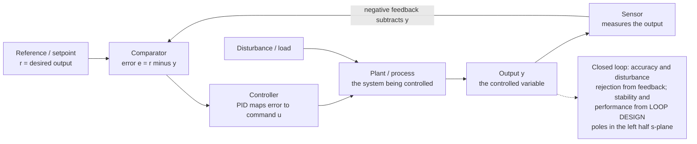

# 🎛️ Feedback and Control Systems

> [!abstract] TL;DR
> A **control system** makes a plant's **output** track a desired **reference** despite disturbances and uncertainty. **Open-loop** control commands the plant blindly (fast but fragile — any disturbance or model error shows up as permanent error). **Closed-loop / feedback** control measures the output, forms the **error** $e = r - y$, and drives a **controller** to shrink it — and that single act of comparison buys accuracy and desensitizes the loop to plant variation and disturbances (the *same* negative feedback that tames op-amps). The workhorse controller is **PID**: **P**roportional (stiffness/speed), **I**ntegral (kills steady-state error), **D**erivative (damping/anticipation). The central concern is **stability**: the closed-loop **poles must lie in the left-half $s$-plane**; too much loop **gain** or **delay** rotates poles into the right half and the loop oscillates or diverges. Classical tools — Routh-Hurwitz, root locus, and Bode/Nyquist with **gain and phase margins** — quantify how close you are to that edge, and you trade transient specs (rise time, overshoot, settling) against steady-state error.

## Intuition — analogy FIRST

You step into the shower and the water is scalding. You do not *calculate* the exact tap angle from the boiler temperature and pipe length — you **feel the water and nudge the tap**: too hot, turn it down; overshoot to cold, ease it back up; keep correcting until it settles at just right. You are running a feedback loop by hand, maybe once a second: **measure the output, compare it to what you want, adjust to close the gap.**

That is *all* control theory is — the mathematics of doing that loop well, thousands of times a second, automatically. A cruise control holding 70 mph on a hill, a thermostat holding room temperature, a drone holding altitude in gusty wind, a power supply holding 5.000 V under a swinging load — every one of them measures its output, subtracts it from a target to get an **error**, and pushes an actuator to drive that error toward zero.

The catch is the same one you feel in the shower: **react too weakly and you crawl toward the target; react too hard and you overshoot, then over-correct the other way, and oscillate.** Add a lag — a long pipe between tap and showerhead so your last adjustment hasn't arrived yet — and it is easy to get trapped swinging hot-cold-hot-cold, never settling. Get the loop right and the system is steady and precise; get it wrong and it overshoots, rings, or spirals out of control. **Control theory is the engineering of taming feedback.**

---

## How It Works

The plant is *whatever you are trying to control* — a motor, a heater, an aircraft, a voltage regulator. You cannot change its physics, but you can wrap a **loop** around it. A **sensor** measures the output $y$; a **comparator** subtracts it from the reference $r$ to form the **error** $e = r - y$; the **controller** maps that error into a command $u$ that drives the plant. Because the feedback is **negative** (it *subtracts* the measured output), any deviation — from a disturbance, a load change, or an inaccurate plant model — generates an error that the loop actively works to erase.



The whole loop is captured by two transfer functions. With controller $C(s)$ and plant $P(s)$, the **loop gain** is $L(s) = C(s)P(s)$, and the **closed-loop transfer function** from reference to output is

$$T(s) = \frac{Y(s)}{R(s)} = \frac{C(s)P(s)}{1 + C(s)P(s)} = \frac{L(s)}{1 + L(s)}.$$

Two facts fall straight out of that $1 + L$ denominator:

- **Accuracy and desensitization.** Where the loop gain is large ($|L| \gg 1$), $T \to 1$, so the output *tracks the reference* almost regardless of the plant's exact value — a $10\%$ drift in $P$ barely moves $y$. This is the identical $1/(1+T)$ desensitization that makes an op-amp's closed-loop gain depend on resistors, not on the transistor.
- **Stability.** The closed-loop **poles** are the roots of the **characteristic equation** $1 + L(s) = 0$. If any root has a positive real part (right-half plane), the natural response grows without bound: the loop is **unstable**. All of classical control is, in one way or another, the study of keeping those roots in the **left-half plane** as you crank up the gain to get accuracy and speed.

---

## Key Concepts / Details

### Secondary Level — Measure, Compare, Correct

- **Open-loop vs closed-loop.** A toaster on a timer is **open-loop**: it heats for a fixed time and *hopes* the bread is done — no measurement, no correction, so a cold kitchen or thick slice ruins it. A toaster with a browning sensor is **closed-loop**: it *watches* the bread and stops at the right color. Feedback is what makes the difference between "command and hope" and "measure and correct."
- **The error is the whole game.** error = what you want − what you have. The controller's only job is to make that number zero. Positive error (output too low) → push harder; negative error → back off.
- **Negative feedback is self-correcting.** Because the loop *subtracts* the measurement, it automatically fights any push away from the target — a gust that dips a drone raises the error, which spins the motors up. The same principle keeps a thermostat's room, a cruise control's speed, and a phone charger's voltage locked to their setpoints.
- **Too eager oscillates.** React too aggressively and you overshoot, then over-correct, then over-correct again — the shower swinging hot-cold-hot. A good controller reacts *firmly but not violently*, and anticipates.

### Undergraduate Level — The PID Controller and the Loop

**The three terms of PID.** The Proportional-Integral-Derivative controller is the workhorse of industry — the vast majority of real control loops are PID. Its command is

$$u(t) = K_p\,e(t) \;+\; K_i \int_0^t e(\tau)\,d\tau \;+\; K_d\,\frac{de(t)}{dt}, \qquad C(s) = K_p + \frac{K_i}{s} + K_d\,s.$$

| Term | Reacts to | Physical role | What it fixes / costs |
|---|---|---|---|
| **P** — proportional | *current* error | **stiffness / speed** — a spring pulling toward the target | faster rise, but alone leaves a **steady-state offset** and, pushed hard, overshoots |
| **I** — integral | *accumulated* error | **memory** — keeps pushing as long as *any* error remains | **eliminates steady-state error**, but adds phase lag → more overshoot, can wind up |
| **D** — derivative | *rate* of error | **damping / anticipation** — brakes as the target is approached | reduces overshoot and settling, but amplifies sensor **noise** |

The intuition: **P** is how hard you react *now*, **I** guarantees you *eventually* get there exactly, **D** stops you overshooting when you get close.

**Why P alone leaves an offset.** For a plant with finite DC gain, proportional control settles where the error is *just large enough* to produce the command that holds the output — so a residual error must remain. The integral term removes it: it accumulates that tiny error until the command is whatever it needs to be, driving steady-state error to **zero**.

**Tuning — Ziegler-Nichols.** A classic starting recipe: raise $K_p$ (with $K_i = K_d = 0$) until the loop just oscillates steadily at the **ultimate gain** $K_u$ with period $P_u$, then back off using their table (e.g. $K_p = 0.6K_u$, $K_i = 2K_p/P_u$, $K_d = K_p P_u/8$). It is aggressive and only a starting point, but it captures the method: probe the loop's stability limit, then retreat to a safe margin.

**Transient vs steady-state specs.** A step response is judged by:
- **Rise time** — how fast it first reaches the target.
- **Overshoot** — how far it blows past (a $\zeta = 0.5$ second-order system overshoots ~$16\%$).
- **Settling time** — when it stays within a band (e.g. $\pm 2\%$).
- **Steady-state error** — the residual gap once settled.

These trade against each other: crank $K_p$ for a fast rise and you pay in overshoot; add $K_d$ to buy the overshoot back; add $K_i$ to kill the offset but reintroduce some overshoot. **Control design is negotiating this triangle.**

### Graduate Level — Stability, the $s$-Plane, and Margins

**Stability = poles in the left-half plane.** The closed-loop poles are the roots of $1 + C(s)P(s) = 0$. Each pole $s = \sigma + j\omega$ contributes a mode $e^{\sigma t}$: $\sigma < 0$ (LHP) decays, $\sigma = 0$ (imaginary axis) sustains, $\sigma > 0$ (RHP) grows. A loop is **BIBO stable** iff *every* closed-loop pole is strictly in the open left-half plane. The recurring failure mode: increasing loop gain (for accuracy/speed) or adding **delay/lag** rotates a pole pair rightward until it crosses the imaginary axis — the loop breaks into sustained then growing oscillation.

**Three classical stability tools** — all answering "are the roots in the LHP, and how much margin do I have?":

| Tool | Domain | What it gives |
|---|---|---|
| **Routh-Hurwitz** | algebraic | Tests whether all characteristic-equation roots are in the LHP *without solving for them* — a table of sign changes; also yields the exact gain at the stability boundary. |
| **Root locus** | $s$-plane | Traces how the closed-loop poles *move* as a gain $K$ varies from $0$ to $\infty$ — you literally watch a branch head for the RHP and read off the critical gain where it crosses. |
| **Bode / Nyquist** | frequency | The Nyquist criterion counts encirclements of the $-1$ point by $L(j\omega)$; the Bode plot reads off **gain margin** and **phase margin** directly. |

**Gain and phase margin — how close to the edge.** Instability at the boundary means the loop gain has magnitude $1$ with $180°$ of phase (so negative feedback becomes positive and the signal reinforces itself — exactly the **Barkhausen** condition of an oscillator, viewed from the "avoid it" side). The safety cushions:
- **Phase margin** $= 180° + \angle L(j\omega_{gc})$ at the **gain-crossover** frequency where $|L| = 1$ — how much extra phase lag (e.g. from delay) the loop can absorb before oscillating. Design for $\gtrsim 45°$–$60°$.
- **Gain margin** $= 1/|L(j\omega_{pc})|$ at the **phase-crossover** frequency where $\angle L = -180°$ — how much more gain you can add before instability.

**Why delay is deadly.** A pure time delay $e^{-s\tau}$ has unity magnitude but a phase lag $-\omega\tau$ that grows without bound with frequency. It *eats phase margin* while contributing no attenuation — which is why loops with transport lag (thermal systems, networked control, the shower's long pipe) are so prone to oscillation, and why the Smith predictor and other delay-compensation schemes exist.

**The fundamental trade-offs.** High loop gain gives tight tracking and disturbance rejection but erodes stability margins and amplifies measurement noise. The **sensitivity** $S = 1/(1+L)$ and **complementary sensitivity** $T = L/(1+L)$ satisfy $S + T = 1$ everywhere — you cannot make both small at the same frequency, and Bode's integral theorem says pushing sensitivity down in one band *pushes it up* in another (the "waterbed effect"). Loop shaping is the art of allocating that constraint.

**Digital / sampled-data control.** Modern controllers run on microcontrollers: the loop is **sampled** at rate $T_s$, so analysis moves to the **$z$-domain** (the discrete analog of the $s$-plane, with the unit circle playing the role of the imaginary axis — stable poles lie **inside** it). Sampling adds an effective delay of about half a sample and an anti-alias requirement; too slow a sample rate erodes phase margin and can destabilize a loop that was fine in continuous time. The PID is discretized (backward-difference or Tustin) and augmented with anti-windup and derivative filtering for real deployment.

---

## Python Demo

```python
# Closed-loop control & stability, with numpy + matplotlib only (no scipy).
#   (a) PID STEP RESPONSE on a 2nd-order plant  P(s) = b0 / (s^2 + a1 s + a0), DC gain 1:
#       open-loop (no feedback) vs P vs PI vs PID -- how the terms shape rise time,
#       overshoot, and steady-state error; plus a proportional-gain sweep showing
#       the under-damped (fast, ringing) vs over-damped (sluggish) trade.
#   (b) STABILITY: a 3rd-order plant  P(s) = 1/(s+1)^3 under proportional gain K.
#       Routh-Hurwitz says the loop is stable iff K < 8. We simulate K = 4 (stable),
#       K = 8 (marginal, sustained oscillation), K = 12 (unstable, growing) and plot
#       the closed-loop POLES crossing the imaginary axis at the stability boundary.
import numpy as np
import matplotlib.pyplot as plt

# ----- RK4 step for a state-derivative function -----
def rk4(f, x, dt):
    k1 = f(x); k2 = f(x + 0.5*dt*k1); k3 = f(x + 0.5*dt*k2); k4 = f(x + dt*k3)
    return x + (dt/6.0)*(k1 + 2*k2 + 2*k3 + k4)

# ============================================================
# (a) PID on a 2nd-order plant:  y'' = b0*u - a1*y' - a0*y
#     state = [y, v=y', I=integral of error]; error e = r - y
#     command u = Kp*e + Ki*I - Kd*v   (derivative on measurement -> no "kick")
# ============================================================
a1, a0, b0 = 1.0, 1.0, 1.0     # zeta = 0.5, wn = 1, DC gain b0/a0 = 1
r = 1.0                          # unit-step reference
T, dt = 20.0, 0.002
n = int(T/dt); t = np.arange(n)*dt

def sim_pid(Kp, Ki, Kd, open_loop=False):
    def deriv(s):
        y, v, I = s
        e = r - y
        u = r if open_loop else (Kp*e + Ki*I - Kd*v)  # open loop: blind feedforward u=r
        return np.array([v, b0*u - a1*v - a0*y, e])
    x = np.zeros(3); y = np.empty(n)
    for k in range(n):
        y[k] = x[0]; x = rk4(deriv, x, dt)
    return y

y_open = sim_pid(0, 0, 0, open_loop=True)   # no feedback
y_P    = sim_pid(5, 0, 0)                    # P only  -> fast but steady-state OFFSET
y_PI   = sim_pid(5, 3, 0)                    # PI      -> offset removed, overshoot
y_PID  = sim_pid(5, 3, 3)                    # PID     -> offset removed, damped
print(f"steady-state error  P-only : {r - y_P[-1]:+.3f}   <- offset remains")
print(f"steady-state error  PI     : {r - y_PI[-1]:+.3f}   <- integral kills it")
print(f"steady-state error  PID    : {r - y_PID[-1]:+.3f}")

# proportional-gain sweep: under-damped (high Kp) vs over-damped (low Kp)
sweep = {Kp: sim_pid(Kp, 0, 0) for Kp in (0.5, 2, 8, 20)}

# ============================================================
# (b) STABILITY: 3rd-order plant 1/(s+1)^3, proportional gain K, unity feedback.
#     controllable-canonical closed-loop:  char poly = s^3 + 3 s^2 + 3 s + (1+K)
#     Routh-Hurwitz: stable iff 3*3 > 1+K  ->  K < 8.
# ============================================================
def sim_p3(K, T3=25.0):
    n3 = int(T3/dt); tt = np.arange(n3)*dt
    A = np.array([[0,1,0],[0,0,1],[-(1.0+K),-3.0,-3.0]])
    B = np.array([0.0, 0.0, K])
    def deriv(s): return A @ s + B*r
    x = np.zeros(3); y = np.empty(n3)
    for k in range(n3):
        y[k] = x[0]; x = rk4(deriv, x, dt)
    return tt, y

cases = [(4.0, "K=4  stable", "tab:green"),
         (8.0, "K=8  marginal (boundary)", "tab:orange"),
         (12.0, "K=12  unstable", "tab:red")]

# ============================================================
# PLOTS
# ============================================================
fig, ax = plt.subplots(2, 2, figsize=(14, 10))

# (a1) open vs P vs PI vs PID
ax[0,0].axhline(r, color='k', ls='--', lw=1, label="reference r")
ax[0,0].plot(t, y_open, label="open-loop (no feedback)")
ax[0,0].plot(t, y_P,   label="P  (offset!)")
ax[0,0].plot(t, y_PI,  label="PI (no offset, overshoot)")
ax[0,0].plot(t, y_PID, lw=2, label="PID (no offset, damped)")
ax[0,0].set(title="(a) PID step response: P/I/D each shape the loop",
            xlabel="time [s]", ylabel="output y")
ax[0,0].legend(fontsize=8); ax[0,0].grid(alpha=0.3)

# (a2) proportional-gain sweep: under- vs over-damped
ax[0,1].axhline(r, color='k', ls='--', lw=1, label="reference r")
for Kp, y in sweep.items():
    ax[0,1].plot(t, y, label=f"Kp={Kp:g}")
ax[0,1].set(title="(a) P-gain sweep: over-damped (low Kp) -> under-damped (high Kp)",
            xlabel="time [s]", ylabel="output y")
ax[0,1].legend(fontsize=8); ax[0,1].grid(alpha=0.3)

# (b1) stable / marginal / unstable step responses
for K, lbl, col in cases:
    tt, y = sim_p3(K)
    ax[1,0].plot(tt, y, color=col, label=lbl)
ax[1,0].axhline(r, color='k', ls='--', lw=1)
ax[1,0].set(title="(b) Too much loop gain -> oscillation/instability (Routh: K<8)",
            xlabel="time [s]", ylabel="output y", ylim=(-2, 4))
ax[1,0].legend(fontsize=8); ax[1,0].grid(alpha=0.3)

# (b2) closed-loop poles crossing the imaginary axis
for K, lbl, col in cases:
    poles = np.roots([1, 3, 3, 1.0+K])
    ax[1,1].scatter(poles.real, poles.imag, s=80, color=col,
                    marker='x', linewidths=2, label=lbl)
ax[1,1].axvline(0, color='k', lw=1)         # the stability boundary
ax[1,1].axhline(0, color='k', lw=0.5)
ax[1,1].fill_betweenx([-3,3], 0, 4, color='red', alpha=0.06)   # RHP = unstable
ax[1,1].text(1.2, 2.4, "RHP = unstable", color='red', fontsize=9)
ax[1,1].set(title="(b) Closed-loop poles: cross into RHP as K passes 8",
            xlabel="Re(s)", ylabel="Im(s)", xlim=(-4, 4), ylim=(-3, 3))
ax[1,1].legend(fontsize=8); ax[1,1].grid(alpha=0.3)

plt.tight_layout()
plt.savefig("feedback_and_control_systems.png", dpi=110)
print("Saved feedback_and_control_systems.png")
```

**What it shows.** Panel (a) is the PID story on one plant: the **open-loop** response reaches the target only via the plant's own slow damping; **P** control is faster but leaves a printed **steady-state offset** ($r - y_\infty \approx +0.17$); **PI** erases that offset (integral memory) at the cost of overshoot; **PID** keeps zero offset while the derivative term **damps** the overshoot. The gain sweep makes the transient trade explicit — small $K_p$ is sluggish/over-damped, large $K_p$ is fast but rings (under-damped). Panel (b) is stability made concrete: the third-order loop is **stable at $K=4$**, sits on the **boundary at $K=8$** with a sustained oscillation, and **diverges at $K=12$** — exactly matching the Routh-Hurwitz prediction $K<8$ — and the pole plot shows *why*: the dominant pole pair marches rightward and **crosses the imaginary axis** into the right-half plane precisely as $K$ passes the critical gain.

---

## Real-World Applications

- **Power supply regulation.** Every switch-mode supply and LDO closes a feedback loop: an error amplifier compares the output voltage to a reference and adjusts duty cycle to hold, say, $5.000\text{ V}$ under a load that swings from milliamps to amps. Loop compensation (type-II/III networks) sets the phase margin.
- **Motor drives and servos.** Speed and position control of DC/BLDC/stepper motors use nested PID loops (current inside velocity inside position); robotics joints, CNC axes, hard-drive head positioning, and camera gimbals all rely on them.
- **Phase-locked loops (PLLs).** A PLL is feedback applied to *phase* — a control loop whose "plant" is a VCO; it locks clocks, synthesizes RF frequencies, and recovers data clocks, and its loop filter is designed by the same stability/margin analysis.
- **Aircraft & spacecraft autopilots.** Flight control laws hold altitude, attitude, and heading; fly-by-wire stabilizes aircraft that are deliberately made *open-loop unstable* for agility — only feedback keeps them flyable.
- **Process control.** Chemical plants, refineries, and HVAC run thousands of PID loops regulating temperature, pressure, flow, and level; these are the loops Ziegler-Nichols was invented for, and where transport delay dominates.
- **Everyday embedded control.** Cruise control, thermostats, 3D-printer hotends, drone flight controllers, and quadcopter attitude stabilization are all digital PID loops sampling and correcting hundreds to thousands of times per second.

---

## Common Pitfalls

- **Confusing open-loop with closed-loop control.** Open-loop commands the plant with *no measurement* — cheap and fast but with zero rejection of disturbances or model error (a timed toaster, a stepper run without encoder). Feedback is what gives accuracy and robustness; if there is no sensor comparing output to reference, it is not a control *loop*.
- **Getting the feedback sign wrong.** The comparator must **subtract** the measurement ($e = r - y$). Wire it as *positive* feedback and the loop reinforces error instead of erasing it — you have built a latch or an oscillator, not a regulator. This is the same sign that separates a stable op-amp from a Barkhausen oscillator.
- **Expecting P alone to hit the target.** Proportional-only control on a finite-DC-gain plant *always* leaves a steady-state offset, because a nonzero error is required to sustain the command. Add the **integral** term to drive that error to exactly zero — that is what "I" is for.
- **Integral windup.** During a large sustained error (e.g. actuator saturated at full throttle), the integral keeps accumulating; when the error finally reverses, the wound-up term causes a huge overshoot. Cure with **anti-windup** (clamp/back-calculate the integrator when the actuator saturates).
- **Cranking gain for speed until it oscillates.** More loop gain tightens tracking but erodes phase margin; past the critical gain the poles cross into the RHP and the loop oscillates or diverges (the demo's $K=8$ boundary). Always keep a margin — design for $\sim 45°$–$60°$ of phase margin, not the edge.
- **Ignoring delay and lag.** A pure time delay contributes phase lag with no attenuation, silently consuming phase margin — networked, thermal, and long-pipe systems destabilize this way. Model the delay; do not assume a loop stable without it stays stable with it.
- **Derivative on noise.** The D term differentiates the measurement, amplifying sensor noise into violent actuator chatter. Filter the derivative (a first-order rolloff) or use derivative-on-measurement; never feed a raw noisy signal into a pure differentiator.
- **Designing in continuous time then deploying on a slow sampler.** Sampling adds ~half a sample of delay and an anti-alias constraint; a loop with healthy continuous-time margins can go unstable if the sample rate is too low. Design in the $z$-domain (or sample $\gtrsim 10$–$20\times$ the closed-loop bandwidth) and discretize the PID properly.

---

## Related Concepts

- [[Feedback_Control_Fundamentals]] — the core loop (reference, error, controller, plant, sensor) and negative-feedback principle developed from the robotics/control side; this EE note is the applied companion.
- [[PID_Control]] — the full treatment of the P/I/D terms, tuning (Ziegler-Nichols), anti-windup, and derivative filtering that this note summarizes.
- [[Transfer_Functions_and_Frequency_Response]] — how the loop gain $L(s) = C(s)P(s)$ and closed-loop $T(s)$ are built and read in the frequency domain.
- [[Stability_Routh_Hurwitz_and_Root_Locus]] — the algebraic (Routh) and $s$-plane (root-locus) tests behind the demo's "stable iff $K<8$" boundary.
- [[Bode_Nyquist_and_Loop_Shaping]] — gain and phase margins, the Nyquist $-1$ encirclement criterion, and shaping the loop for robustness.
- [[Transfer_Functions]] — the signals-and-systems foundation: poles, zeros, and the $s$-plane picture the closed-loop poles live in.
- [[Stability_Frequency_Response]] — BIBO stability and the pole-location / frequency-response viewpoint that underpins "poles in the left-half plane."
- [[Feedback_Loops_and_Causality]] — the systems-thinking generalization: *balancing* (negative) loops stabilize toward a goal, *reinforcing* (positive) loops amplify — the same two behaviors, beyond electronics.
- [[Cybernetics_and_Control]] — the historical and cross-domain roots of goal-seeking feedback (Wiener), the intellectual parent of engineering control.
- [[Electrical_Engineering_Overview]] — parent map; feedback control is where EE's signals, circuits, and systems threads converge.

Sibling EE notes (in prose): **Signals_and_LTI_Systems** supplies the LTI/impulse-response machinery the plant model is built on; **Fourier_and_Laplace_in_Circuits** provides the $s$-domain transforms behind every transfer function here; **Operational_Amplifiers** realize analog PID stages (summer + integrator + differentiator) and are negative feedback in its purest form; **Oscillators_and_Feedback_Amplifiers** are the *same* loop pushed deliberately to the Barkhausen edge this note works to avoid; **Motor_Drives_and_Control** is the flagship application — nested current/velocity/position loops driving real actuators.

---

## Review Questions

1. **(Secondary)** Explain, using the shower analogy, the difference between open-loop and closed-loop control. Why can an open-loop system never correct for a disturbance it cannot measure, and what single element must you add to make it closed-loop?
2. **(Undergraduate)** A proportional controller with $K_p = 5$ on a unity-DC-gain plant settles with a steady-state error of about $0.17$ for a unit-step reference. Explain *why* a residual error must remain with P-only control, which PID term removes it and by what mechanism, and what new problem that term can introduce (name the cure).
3. **(Graduate)** For the loop $L(s) = K/(s+1)^3$, use Routh-Hurwitz to find the exact gain at which the closed-loop poles cross the imaginary axis, and explain what the response looks like just below, at, and just above that gain. Then explain why adding a pure time delay $e^{-s\tau}$ to the same loop reduces the maximum stable gain even though the delay changes no magnitudes — relate your answer to phase margin.

---

## Sources

- Ogata, K. — *Modern Control Engineering*, 5th ed. (Pearson) — transfer functions, root locus, PID design, and stability analysis.
- Nise, N. — *Control Systems Engineering* (Wiley) — time-domain specs, Routh-Hurwitz, and frequency-response design with worked examples.
- Franklin, G., Powell, J. D. & Emami-Naeini, A. — *Feedback Control of Dynamic Systems* (Pearson) — loop shaping, digital control, and sensitivity trade-offs.
- Åström, K. J. & Murray, R. M. — *Feedback Systems: An Introduction for Scientists and Engineers* (Princeton) — a modern, freely available treatment of feedback, robustness, and performance limits. https://fbswiki.org/
- Ziegler, J. G. & Nichols, N. B. — "Optimum Settings for Automatic Controllers" (1942) — the original PID tuning rules.

---

#electrical-engineering #control-systems #feedback #pid #stability
