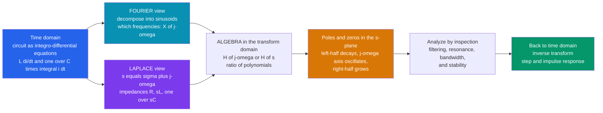

# 🌊 Fourier and Laplace in Circuits

> [!abstract] TL;DR
> Two transforms move circuit analysis out of the time domain, where it is a mess of derivatives and integrals, into a **frequency domain** where everything becomes algebra. The **Fourier transform** decomposes any signal into the sinusoids it is secretly made of — a discrete set of **harmonics** for periodic signals (Fourier *series*) or a continuous **spectrum** $X(j\omega)$ for one-shot signals — so filtering, resonance, and bandwidth become transparent, because a linear circuit simply *multiplies* each frequency by its **frequency response** $H(j\omega)$. The **Laplace transform** generalizes this to a complex frequency $s = \sigma + j\omega$, adding growth, decay, transients, and initial conditions; it turns a circuit's integro-differential equations into **algebra** (impedances become $R$, $sL$, $\tfrac{1}{sC}$) and produces a **transfer function** $H(s)$ whose **poles** and **zeros** in the **$s$-plane** reveal everything about behavior and stability: **left-half poles decay (stable), poles on the $j\omega$-axis oscillate, right-half poles blow up (unstable)**. Fourier is just Laplace evaluated on the $j\omega$ axis. This single change of perspective is arguably the most powerful idea in all of electrical engineering.

## Intuition — analogy FIRST

Strike three piano keys at once and your ear receives **one** complicated pressure wave — a single messy sound. Yet you effortlessly hear *three separate notes*. Your ear is quietly running a decomposition: it splits the tangled waveform into the pure tones it is built from. The **Fourier transform is a mathematical ear**. Hand it *any* signal and it tells you exactly which frequencies are inside and how loud each one is — it turns a wiggle in time into a bar chart over frequency.

Its more powerful cousin, the **Laplace transform**, is an ear that can also hear notes that are *fading away* or *swelling up*. It attaches a decay/growth knob $\sigma$ to the frequency, so it handles the ring-down of a plucked string as easily as a steady hum. And it performs a second miracle: it converts the ugly calculus of a circuit — the $L\,\tfrac{di}{dt}$ and $\tfrac{1}{C}\!\int i\,dt$ terms — into plain algebra. Once you can *see* a circuit as its frequencies and its **poles**, filtering, resonance, and stability stop being calculations and become something you read off a picture. That shift — from time to frequency — is the single most powerful change of perspective an electrical engineer ever makes.

---

## How It Works

A circuit built from resistors, inductors, and capacitors obeys **integro-differential equations** in time: a capacitor gives $i = C\,\tfrac{dv}{dt}$, an inductor gives $v = L\,\tfrac{di}{dt}$. Solving these directly is painful. The transform methods replace that pain with a detour through the frequency domain:

1. **Transform the problem.** Take the Fourier transform (to ask *which frequencies*) or the Laplace transform (to also capture transients and initial conditions). Time derivatives become multiplications: $\tfrac{d}{dt} \to j\omega$ (Fourier) or $\to s$ (Laplace).
2. **Elements become impedances.** With the derivative gone, each component is just a complex "resistance": resistor $R$, inductor $sL$, capacitor $\tfrac{1}{sC}$. The circuit is now a resistive-looking network you solve with Ohm's law, KVL, and KCL — pure **algebra**.
3. **Read off the transfer function.** The ratio $H(s) = \dfrac{\text{output}}{\text{input}}$ is a ratio of polynomials in $s$. Its numerator roots are **zeros**, its denominator roots are **poles**.
4. **Interpret the $s$-plane.** Pole *locations* tell the whole story: real part = decay/growth rate, imaginary part = oscillation frequency. Left half = stable, $j\omega$-axis = pure oscillation, right half = unstable.
5. **Come back.** Inverse-transform (or just evaluate $H(s)$ along $s = j\omega$ for the steady-state frequency response) to get the time-domain step or impulse response.



---

## Key Concepts / Details

### Secondary Level — Any Signal Is a Sum of Sinusoids

The founding idea (Fourier, 1807): **every signal can be built by adding up sinusoids** of different frequencies, amplitudes, and phases. There are two flavors depending on the signal:

| Signal type | Tool | What you get |
|---|---|---|
| **Periodic** (repeats forever) | **Fourier *series*** | a **discrete** set of **harmonics** — sinusoids at $f_0, 2f_0, 3f_0, \dots$ |
| **Aperiodic** (a one-shot pulse) | **Fourier *transform*** | a **continuous spectrum** $X(j\omega)$ — an amplitude and phase for *every* frequency |

A square wave, for example, is not "square" at all in the frequency world: it is a fundamental plus a fading series of **odd harmonics** ($1, 3, 5, \dots$) with amplitudes $\propto 1/n$. Once you look at a signal this way you have entered the **frequency domain**, the native language of audio, radio, filters, and control. The magnitude of each component says *how much* of that frequency is present; the phase says *when* it peaks.

### Undergraduate Level — Frequency Response, the DFT/FFT, and the Laplace Detour

**The FFT is how machines do it.** Real signals are *sampled*, so computers use the **Discrete Fourier Transform (DFT)**, evaluated efficiently by the **Fast Fourier Transform (FFT)** in $O(N\log N)$. The FFT of a captured waveform is the spectrum you see on every spectrum analyzer, audio EQ, and vibration monitor.

**Why the frequency domain matters for circuits.** A linear time-invariant (LTI) circuit is *frequency-preserving*: feed it a sinusoid and it returns a sinusoid at the **same** frequency, only scaled and phase-shifted. So its entire effect on any frequency is one complex number — the **frequency response** (transfer function evaluated on the imaginary axis):
$$H(j\omega) = \frac{\text{output phasor}}{\text{input phasor}}, \qquad |H| = \text{gain}, \quad \angle H = \text{phase shift}.$$
Because of the **convolution theorem**, messy time-domain convolution becomes simple **multiplication** in frequency:
$$y(t) = h(t) * x(t) \quad\Longleftrightarrow\quad Y(j\omega) = H(j\omega)\,X(j\omega).$$
That is *why* filtering, bandwidth, resonance, and distortion are obvious in the frequency domain: the output spectrum is just the input spectrum shaped by $|H(j\omega)|$.

**The Laplace transform** generalizes $j\omega$ to a full **complex frequency** $s = \sigma + j\omega$:
$$X(s) = \int_0^{\infty} x(t)\,e^{-st}\,dt.$$
The extra real part $\sigma$ lets it represent signals that **grow or decay**, capture **transients** (turn-on behavior, ringing), and fold in **initial conditions** ($v_C(0)$, $i_L(0)$) automatically. Under Laplace, an inductor is $sL$, a capacitor is $\tfrac{1}{sC}$, and Kirchhoff's laws produce **algebraic** equations — you solve an RLC circuit with the same effort as a resistor divider, transients included.

### Graduate Level — The Transfer Function, the s-Plane, and the Grand Unification

**The transfer function** $H(s) = \dfrac{N(s)}{D(s)}$ is a ratio of polynomials. Its **zeros** (roots of $N$) pull the response *down*; its **poles** (roots of $D$) push it *up* and govern the natural (unforced) behavior. Everything the circuit does is encoded in where those poles and zeros sit in the complex **$s$-plane**:

| Pole location | Real part $\sigma$ | Time-domain behavior | Stability |
|---|---|---|---|
| **Left half-plane** | $\sigma < 0$ | terms $\propto e^{\sigma t}$ **decay** | **stable** |
| **On the $j\omega$-axis** | $\sigma = 0$ | sustained **oscillation** (or constant) | marginal |
| **Right half-plane** | $\sigma > 0$ | terms **grow** without bound | **unstable** |

A complex pole pair $s = -\zeta\omega_n \pm j\omega_n\sqrt{1-\zeta^2}$ maps directly onto the classic second-order response: the **real part $-\zeta\omega_n$ is the decay rate** and the **imaginary part is the ringing frequency** $\omega_d$. Pull the poles toward the $j\omega$-axis (lower damping $\zeta$) and you get a taller resonant peak and more overshoot/ringing; push them left and the response settles faster.

**The unification.** These are not three separate subjects — they are one picture sliced three ways:

- **Transients / natural response** ⟶ **Laplace**, read from **pole positions**.
- **Steady-state AC** ⟶ **phasors**, i.e. impedance $Z(j\omega)$ = the transfer function evaluated at $s = j\omega$.
- **Filtering / spectra** ⟶ **Fourier**, the response along the $j\omega$-axis.

**Fourier is Laplace restricted to the $j\omega$ axis** — valid precisely when that axis lies inside the **region of convergence** (i.e. when the system is stable and there are no poles on the axis). This is why a stable circuit's frequency response is just its transfer function walked up the imaginary axis, and why an *unstable* circuit (poles in the right half) has no ordinary Fourier response at all.

---

## Python Demo

```python
# Fourier & Laplace in circuits, made visible:
#   (a) FOURIER  -- take a square wave, compute its FFT SPECTRUM (odd harmonics),
#       then reconstruct it by keeping only the first few harmonics (Gibbs overshoot).
#   (b) LAPLACE / POLE-ZERO -- for a 2nd-order low-pass H(s) = w0^2/(s^2 + 2*z*w0*s + w0^2),
#       plot the POLES in the s-plane for several damping ratios and the matching
#       step responses, showing LHP = decays/stable, jw-axis = oscillates, RHP = grows.
# numpy + matplotlib only (step response uses the closed form, no scipy).
import numpy as np
import matplotlib.pyplot as plt

fig, ax = plt.subplots(2, 2, figsize=(14, 10))

# =====================================================================
# (a) FOURIER: square wave -> spectrum, and reconstruction from harmonics
# =====================================================================
f0 = 5.0                                  # fundamental frequency (Hz)
fs = 2000.0                               # sample rate (Hz)
t  = np.arange(0, 1.0, 1/fs)
square = np.sign(np.sin(2*np.pi*f0*t))    # +/-1 square wave

N    = t.size
X    = np.abs(np.fft.rfft(square)) / N * 2   # single-sided amplitude spectrum
freq = np.fft.rfftfreq(N, d=1/fs)

axs = ax[0, 0]
axs.stem(freq, X, basefmt=" ")
axs.set_xlim(0, 60)
for k in [1, 3, 5, 7, 9]:                 # annotate the ODD harmonics
    axs.text(k*f0, 4/(np.pi*k)+0.03, f"{k}f0", ha="center", fontsize=8, color="tab:red")
axs.set_title("(a) FOURIER spectrum of a square wave: ODD harmonics, amplitude ~ 1/n")
axs.set_xlabel("frequency  f  [Hz]"); axs.set_ylabel("amplitude"); axs.grid(alpha=0.3)

axr = ax[0, 1]
axr.plot(t, square, color="0.7", lw=1.2, label="ideal square wave")
for n_terms, col in [(1, "tab:green"), (3, "tab:orange"), (15, "tab:blue")]:
    recon = np.zeros_like(t)
    for k in range(1, 2*n_terms, 2):      # keep odd harmonics 1, 3, 5, ...
        recon += (4/(np.pi*k)) * np.sin(2*np.pi*k*f0*t)
    axr.plot(t, recon, col, lw=1.5, label=f"{n_terms} harmonic(s)")
axr.set_xlim(0, 0.4); axr.set_ylim(-1.6, 1.6)
axr.set_title("(a) Reconstruction from harmonics (note Gibbs overshoot at edges)")
axr.set_xlabel("time  t  [s]"); axr.set_ylabel("amplitude")
axr.legend(loc="upper right", fontsize=8); axr.grid(alpha=0.3)

# =====================================================================
# (b) LAPLACE / POLE-ZERO: H(s) = w0^2 / (s^2 + 2*zeta*w0*s + w0^2)
# =====================================================================
w0 = 2*np.pi*1.0                          # natural frequency (rad/s)
cases = [(0.70, "tab:blue",   "zeta=0.70  stable  (LHP)"),
         (0.15, "tab:green",  "zeta=0.15  underdamped (LHP)"),
         (0.00, "tab:orange", "zeta=0.00  marginal (jw axis)"),
         (-0.10, "tab:red",   "zeta=-0.10 unstable (RHP)")]

# --- s-plane pole map (all-pole system: no finite zeros) ---
axp = ax[1, 0]
xlim = w0*1.05
axp.axvspan(-xlim, 0, alpha=0.06, color="green")     # shade the stable left half
for zeta, col, lab in cases:
    sigma = -zeta*w0                                 # pole real part = decay rate
    wd    = w0*np.sqrt(abs(1 - zeta**2))             # pole imag part = ring frequency
    axp.plot([sigma, sigma], [wd, -wd], "x", color=col, ms=13, mew=3, label=lab)
axp.axvline(0, color="k", lw=1.3); axp.axhline(0, color="k", lw=0.5)
axp.set_xlim(-xlim, xlim); axp.set_ylim(-w0*1.3, w0*1.3)
axp.text(-xlim*0.95, w0*1.0, "LEFT half\nstable / decays", color="green", fontsize=9)
axp.text(xlim*0.10, w0*1.0, "RIGHT half\nunstable / grows", color="tab:red", fontsize=9)
axp.set_title("(b) Poles in the s-plane (all-pole: no finite zeros)")
axp.set_xlabel("Re(s) = sigma  [1/s]   (decay rate)")
axp.set_ylabel("Im(s) = omega  [rad/s]   (oscillation)")
axp.legend(loc="lower left", fontsize=7); axp.grid(alpha=0.3)

# --- matching step responses: pole location made visible in time ---
axt = ax[1, 1]
ts = np.linspace(0, 5, 1400)
def step_response(t, z, w0):
    # underdamped closed form; algebra also holds for z < 0 (growth) and z = 0 (oscillation)
    wd  = w0*np.sqrt(1 - z**2)
    phi = np.arccos(z)
    return 1 - np.exp(-z*w0*t)/np.sqrt(1 - z**2)*np.sin(wd*t + phi)
for zeta, col, lab in cases:
    axt.plot(ts, step_response(ts, zeta, w0), col, lw=2, label=f"zeta={zeta:g}")
axt.axhline(1, color="k", ls=":", lw=1)
axt.set_ylim(-1.0, 3.5)
axt.set_title("(b) Step response: LHP settles, jw-axis oscillates, RHP diverges")
axt.set_xlabel("time  t  [s]"); axt.set_ylabel("output")
axt.legend(loc="upper right", fontsize=8); axt.grid(alpha=0.3)

plt.tight_layout()
plt.savefig("fourier_laplace_in_circuits.png", dpi=110)
print("Saved fourier_laplace_in_circuits.png")

# --- numeric sanity checks ---
print(f"Fundamental amplitude (FFT): {X[np.argmin(abs(freq-f0))]:.3f}  "
      f"(expect 4/pi = {4/np.pi:.3f})")
print(f"3rd-harmonic amplitude:      {X[np.argmin(abs(freq-3*f0))]:.3f}  "
      f"(expect 4/3pi = {4/(3*np.pi):.3f})")
print(f"2nd-harmonic amplitude:      {X[np.argmin(abs(freq-2*f0))]:.3f}  "
      f"(expect ~0: even harmonics absent)")
for zeta, _, lab in cases:
    fate = "decays (stable)" if zeta > 0 else ("oscillates (marginal)" if zeta == 0 else "GROWS (unstable)")
    print(f"{lab}: pole Re = {-zeta*w0:+.3f} 1/s -> {fate}")
```

**What it shows.** Panel (a-left) is the square wave's spectrum: sharp spikes only at the **odd** harmonics ($5, 15, 25\dots$ Hz), each $\approx 4/(\pi n)$ tall — the even harmonics are absent. Panel (a-right) rebuilds the wave from just those harmonics; one term is a pure sinusoid, and as you add harmonics the sum sharpens toward the square but keeps an $\approx 9\%$ **Gibbs overshoot** at every edge. Panel (b-left) plots the pole pairs: as damping $\zeta$ drops, the poles slide from deep in the stable left half toward the $j\omega$-axis and finally cross into the right half. Panel (b-right) shows the *same story in time*: the well-damped pole settles smoothly, the underdamped pole rings, the $j\omega$-axis pole oscillates forever, and the right-half pole diverges — **pole position and time-domain behavior are two views of one fact.**

---

## Real-World Applications

- **Filter design (analog and digital).** Every low-/high-/band-pass filter *is* a transfer function $H(s)$; designers place poles and zeros in the $s$-plane (Butterworth, Chebyshev, elliptic) to shape $|H(j\omega)|$, then map to discrete IIR filters via the bilinear transform for DSP.
- **Control-system stability.** A feedback loop is stable iff *all* closed-loop poles lie in the left half-plane. Root-locus, Bode, and Nyquist methods all watch where poles move as gain changes — the single most important use of the $s$-plane.
- **Communications and spectra.** Modulation, channel bandwidth, and interference are reasoned about entirely as spectra $X(j\omega)$; the FFT drives every spectrum analyzer, OFDM modem, and software-defined radio.
- **Power-supply and circuit transients.** Laplace with initial conditions predicts turn-on surges, ringing, and settling of RLC networks and switching converters without solving the ODEs by hand.
- **Audio, vibration, and condition monitoring.** FFT spectra expose which frequencies dominate a sound or a vibrating machine; a rising harmonic betrays a failing bearing or gear long before it breaks.
- **Anti-aliasing and sampling.** The whole ADC/DSP pipeline is designed in the frequency domain, using $H(j\omega)$ to bound content below Nyquist before sampling.

---

## Common Pitfalls

- **Series vs transform vs DFT.** **Fourier *series*** is for *periodic* signals and gives **discrete harmonics**; the **Fourier *transform*** is for *aperiodic* signals and gives a **continuous spectrum**; the **DFT/FFT** is the *sampled, finite, computational* version. They answer the same question at different resolutions — do not conflate them.
- **Forgetting Laplace $\supset$ Fourier.** With $s = \sigma + j\omega$, Laplace adds the decay/growth axis $\sigma$. **Fourier is Laplace evaluated on the line $\sigma = 0$** — but only when that $j\omega$-axis sits inside the **region of convergence**. An unstable system (right-half poles) has a perfectly good Laplace transform yet *no* ordinary Fourier transform.
- **Ignoring the region of convergence (ROC).** The same algebraic $X(s)$ can correspond to different time signals depending on the ROC (e.g. a causal vs anti-causal exponential). The ROC, not just the pole/zero pattern, fixes the answer and determines stability.
- **Reading only $|H|$, dropping the phase.** $H(j\omega)$ is **complex**: magnitude is gain, angle is phase/delay. Two filters with identical $|H|$ can distort a waveform completely differently. Phase (group delay) matters for pulses and data.
- **Poles vs zeros backwards.** **Poles** = denominator roots → they *raise* the response, set resonance and the natural modes, and govern **stability**. **Zeros** = numerator roots → they *notch* the response down. Only pole real parts decide stable/unstable.
- **Misjudging the $s$-plane halves.** **Left** half = stable (decaying), **$j\omega$-axis** = sustained oscillation / the Fourier steady state, **right** half = unstable growth. A pole *exactly* on the axis is marginal, not "safe."
- **Expecting a brick-wall reconstruction (Gibbs).** Summing finitely many harmonics of a discontinuous signal always overshoots the jump by $\approx 9\%$ no matter how many terms you add — the **Gibbs phenomenon**. More terms narrow the ripple, they never kill it.
- **Convolution vs multiplication mix-up.** Time-domain **convolution** equals frequency-domain **multiplication** ($y = h*x \Leftrightarrow Y = H\,X$) — and vice versa. Filtering is a multiply in frequency; forgetting the duality leads to doing the hard operation in the wrong domain.
- **Treating phasors as the whole story.** Phasors handle only **single-frequency steady state**; they cannot represent transients or turn-on behavior. For those you need Laplace (poles) or superpose many phasors (which *is* the Fourier view).

---

## Related Concepts

- [[Fourier_Transform]] — the "mathematical ear" that turns an aperiodic time signal into its continuous spectrum $X(j\omega)$; the theoretical core of the frequency-domain view.
- [[Fourier_Series]] — the periodic case: a signal becomes a discrete sum of harmonics, exactly the odd-harmonic structure the square-wave demo reveals.
- [[Frequency_Spectrum]] — the amplitude-and-phase-vs-frequency picture a circuit reshapes by multiplying with $|H(j\omega)|$.
- [[DFT_and_FFT]] — the sampled, computational Fourier transform; how machines actually compute the spectra shown here.
- [[Signals_and_Systems/03_Laplace_Transform/Laplace_Transform|Laplace Transform]] — generalizes Fourier to $s = \sigma+j\omega$, adding transients, growth/decay, and initial conditions, and turning ODE circuits into algebra.
- [[Transfer_Functions]] — the ratio $H(s) = \text{output}/\text{input}$ whose poles and zeros this note reads off the $s$-plane.
- [[Stability_Frequency_Response]] — formalizes how pole locations set stability and shape $|H(j\omega)|$; the theory behind the left/right half-plane rule.
- [[Complex_Numbers_and_Functions]] — the $s$-plane, $j\omega$, and $e^{j\theta}$ live here; Euler's formula is the engine that makes sinusoids the natural basis.
- [[Fourier_Analysis]] — the mathematics vault's treatment of Fourier series/transforms and orthogonal expansions underpinning the whole method.

Sibling electrical-engineering notes (in prose): *AC_Circuit_Analysis_and_Phasors* is the single-frequency steady-state special case — impedance $Z$ is $H(s)$ evaluated at $s = j\omega$; *Analog_Filters_and_Frequency_Response* places poles and zeros to shape $|H(j\omega)|$; *Signals_and_LTI_Systems* provides the convolution and LTI foundation that makes $H$ meaningful; *Feedback_and_Control_Systems* uses the same $s$-plane pole picture for closed-loop stability; *Digital_Signal_Processing_Hardware* implements these spectra and filters on sampled data via the FFT and the $z$-transform.

---

## Review Questions

1. **(Secondary)** A square wave and a pure sine wave of the same frequency sound and look very different. Using the idea that any signal is a sum of sinusoids, explain what the Fourier spectrum of the square wave contains that the sine's does not — and why adding just a few harmonics already starts to look "square."
2. **(Undergraduate)** An RLC circuit has transfer function $H(s) = \dfrac{\omega_n^2}{s^2 + 2\zeta\omega_n s + \omega_n^2}$. Where are its poles for $\zeta = 0.2$? Describe the step response you expect (overshoot? ringing? settling?), and explain how you would find the steady-state gain at a driving frequency $\omega$ from $H(s)$ without solving any differential equation.
3. **(Graduate)** A colleague computes a circuit's Laplace transfer function, finds a pole at $s = +3 \pm j40$, and concludes from the $|H(j\omega)|$ Bode plot that the circuit is a fine band-pass filter. Explain, using the region of convergence and the relationship between Fourier and Laplace, why the Bode plot is meaningless here and what the pole location actually implies about the circuit's behavior.

---

## Sources

- Oppenheim, A. V., Willsky, A. S. & Nawab, S. H. — *Signals and Systems* (2nd ed.), Prentice Hall. [Pearson](https://www.pearson.com/en-us/subject-catalog/p/signals-and-systems/P200000003377)
- Lathi, B. P. — *Linear Systems and Signals* (Fourier, Laplace, and the $s$-plane for circuits and systems). [Oxford University Press](https://global.oup.com/academic/product/linear-systems-and-signals-9780190200176)
- Hayt, W., Kemmerly, J. & Durbin, S. — *Engineering Circuit Analysis* (Laplace-domain circuit analysis, impedances $R$, $sL$, $1/sC$). [McGraw-Hill](https://www.mheducation.com/highered/product/engineering-circuit-analysis-hayt-kemmerly/M9780073545516.html)
- Bracewell, R. — *The Fourier Transform and Its Applications* (3rd ed.), McGraw-Hill.
- MIT OpenCourseWare 6.003 — *Signals and Systems* (Fourier and Laplace, poles/zeros, the $s$-plane). [MIT OCW](https://ocw.mit.edu/courses/6-003-signals-and-systems-fall-2011/)

---

#electrical-engineering #fourier-transform #laplace-transform #s-plane #transfer-function
