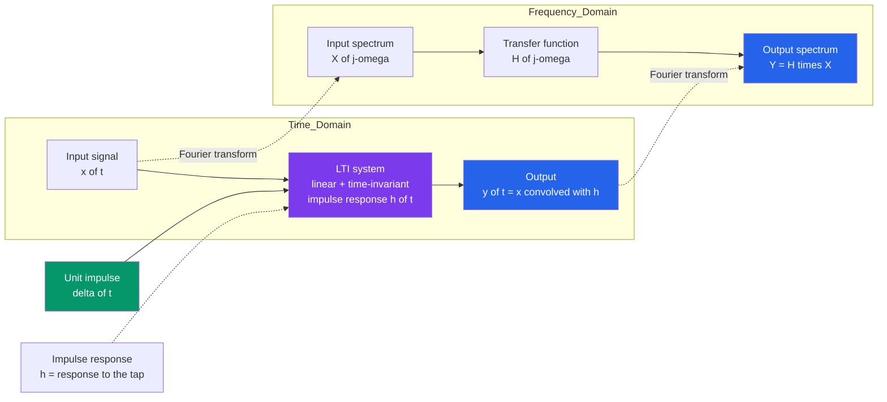

# 📡 Signals and LTI Systems

> [!abstract] TL;DR
> A **signal** is information riding on a quantity that changes over an independent variable — usually **time** (a voltage, a pressure, a price). A **system** is anything that takes a signal in and produces a signal out (an amplifier, a filter, a wire, an ear). The great simplification of engineering is that a huge class of real systems is **Linear** (scale/add the input → scale/add the output) and **Time-Invariant** (delay the input → the output just delays): **LTI**. For any LTI system, a single measurement — the **impulse response** $h(t)$, the output to one sharp "tap" $\delta(t)$ — tells you the response to *any* input, via **convolution** $y = x * h$. And because complex exponentials are the *eigenfunctions* of LTI systems, that convolution in time becomes plain **multiplication** in the frequency domain — the reason Fourier and Laplace transforms rule all of circuits, filters, control, communications, and DSP.

## Intuition — analogy FIRST

Think of a signal as a **voice riding on air pressure**: the words are information, the air pressure is the changing quantity that carries them over time. A heartbeat is information riding on a changing voltage; a stock ticker is information riding on changing dollars. A **signal is just a value that changes** along some axis (almost always time).

A **system** is any box that takes a signal in and puts a (changed) signal out — a microphone, a guitar amp, a room's echo, your eardrum. Most useful systems have two lucky properties: if you play the input **twice as loud**, the output is twice as loud (**linearity**); and if you play the same input **an hour later**, you get the same output an hour later (**time-invariance**). A box with *both* properties is **LTI** — the workhorse abstraction of all of electrical engineering.

Here is the magic. To fully characterize an LTI room, you do **not** need to play every possible song. You fire **one starter pistol** — a single sharp *tap* — and record the echo. That recording, the **impulse response** $h(t)$, is the system's complete fingerprint. Any song you ever play through that room is just the song *smeared with the echo*: mathematically, the **convolution** of the song with $h(t)$. One tap tells you everything.

---

## How It Works

An LTI system is completely pinned down by how it answers one question: *what comes out when I feed in a single unit impulse* $\delta(t)$? Call that answer the **impulse response** $h(t)$. Then, because any input $x(t)$ can be written as a dense sum of scaled, shifted impulses, and because the system is linear (responses add) and time-invariant (a shifted impulse gives a shifted $h$), the output is the same dense sum of scaled, shifted copies of $h$:

$$y(t) = \int_{-\infty}^{\infty} x(\tau)\,h(t-\tau)\,d\tau = (x * h)(t).$$

That operation — **flip $h$, slide it across $x$, multiply and integrate** — is **convolution**. The dual view is even more powerful: feed in a complex exponential $e^{st}$ and an LTI system spits out *the same exponential*, merely scaled by a complex number $H(s)$ (the **transfer function**). Exponentials are the system's **eigenfunctions**. So if you first break a signal into exponentials/sinusoids (Fourier / Laplace), the messy time-domain convolution collapses to a simple **per-frequency multiplication** $Y = H \cdot X$.



The whole edifice of signals-and-systems rests on the arrows in that diagram: **tap → measure $h$**; **any input → convolve with $h$**; **cross the Fourier bridge → multiply by $H$**.

---

## Key Concepts / Details

### Secondary Level — Signals, Systems, and the "One Tap"

- **Signal** — a value that changes over an axis, usually time. A song is a signal; so is a temperature log or an EKG trace. Signals carry *information* on a changing physical quantity (voltage, pressure, current, light).
- **System** — a box: signal in, signal out. Amplifier, filter, speaker, sensor, the atmosphere, a nerve.
- **Linear** — playing the input louder makes the output proportionally louder, and mixing two inputs gives the mix of their outputs (no new tones appear). This is **superposition**.
- **Time-invariant** — the box behaves the same today or tomorrow; delay the input and the output simply delays by the same amount.
- **LTI = both** — and for an LTI box, one sharp **tap** (the impulse) reveals everything: its recorded echo, the **impulse response** $h$, predicts the response to any input at all.

### Undergraduate Level — Classifications, Building Blocks, Convolution

**Classifying signals** (the vocabulary that decides which tools apply):

| Axis | Type A | Type B |
|---|---|---|
| Independent variable | **Continuous-time** $x(t)$ (analog) | **Discrete-time** $x[n]$ (sampled/digital) |
| Repetition | **Periodic** ($x(t)=x(t+T)$) | **Aperiodic** (one-shot) |
| Size measure | **Energy** signals ($\int|x|^2\,dt < \infty$, transients) | **Power** signals (finite average power, e.g. periodic) |
| Predictability | **Deterministic** (a formula) | **Random/stochastic** (a distribution — noise) |
| Symmetry | **Even** ($x(-t)=x(t)$) | **Odd** ($x(-t)=-x(t)$) |

**The three building-block signals**:

- **Unit impulse** $\delta(t)$ — an infinitely narrow, unit-area spike; the "tap." Its *sifting* property $\int x(\tau)\delta(t-\tau)\,d\tau = x(t)$ lets us write any signal as a sum of impulses.
- **Unit step** $u(t)$ — 0 before $t=0$, 1 after; models switching on. Note $\delta = \frac{d}{dt}u$.
- **Complex exponential / sinusoid** $e^{st}$, $\cos(\omega t)$ — the "pure tones" that Fourier and Laplace build everything from, and (crucially) the eigenfunctions of LTI systems.

**System properties** you must check before trusting a tool:

- **Linearity** — superposition holds: $\mathcal{H}\{a x_1 + b x_2\} = a\,\mathcal{H}\{x_1\} + b\,\mathcal{H}\{x_2\}$.
- **Time-invariance** — shift in → identical shift out.
- **Causality** — output depends only on present/past inputs; for LTI, $h(t)=0$ for $t<0$. Real-time systems must be causal.
- **Memory** — a memoryless system's output depends only on the current input ($h(t)=c\,\delta(t)$); memory means $h$ has width (integrators, capacitors, delays).
- **BIBO stability** — every **B**ounded **I**nput yields a **B**ounded **O**utput. For LTI this is *exactly* $\int_{-\infty}^{\infty}|h(\tau)|\,d\tau < \infty$ (absolutely integrable $h$).
- **Invertibility** — distinct inputs give distinct outputs, so the input can be recovered (the basis of channel *equalization*).

**The central result.** For an LTI system, $h(t)=\mathcal{H}\{\delta(t)\}$ *completely* characterizes it, and

$$y(t) = (x*h)(t) = \int_{-\infty}^{\infty} x(\tau)\,h(t-\tau)\,d\tau.$$

The **step response** $s(t)=\int_{-\infty}^{t} h(\tau)\,d\tau$ is an equivalent fingerprint ($h = ds/dt$).

### Graduate Level — Eigenfunctions, Transforms, Transfer Functions

**Eigenfunction property.** Feed $x(t)=e^{st}$ into an LTI system:
$$y(t)=\int h(\tau)e^{s(t-\tau)}\,d\tau = e^{st}\underbrace{\int h(\tau)e^{-s\tau}\,d\tau}_{H(s)} = H(s)\,e^{st}.$$
The exponential comes out unchanged in shape, scaled by the complex number $H(s)$ — the **transfer function**, which is exactly the **Laplace transform** of $h(t)$. On the imaginary axis $s=j\omega$, $H(j\omega)$ is the **frequency response** (the Fourier transform of $h$).

**Convolution ↔ multiplication.** Because exponentials diagonalize LTI systems, the convolution theorem holds:
$$y = x*h \quad\Longleftrightarrow\quad Y(j\omega) = H(j\omega)\,X(j\omega).$$
Each frequency component of the input is simply *scaled and phase-shifted* by $H(j\omega)$. This is **why transforms dominate** the field: they turn the hard operation (convolution) into the easy one (multiplication), and turn ODEs into algebra.

**Poles, zeros, stability.** Writing $H(s)=\frac{N(s)}{D(s)}$ (a ratio of polynomials for lumped systems), the **poles** (roots of $D$) set the natural modes and roll-off; the **zeros** (roots of $N$) carve notches. A causal LTI system is **BIBO stable** iff all poles lie in the open left half-plane (equivalently $h$ is absolutely integrable). The **region of convergence** of the Laplace/Z transform encodes causality and stability together.

**Discrete-time twin.** Everything ports to $x[n]$: the impulse is $\delta[n]$, convolution is a sum $y[n]=\sum_k x[k]h[n-k]$, the transfer function is the **Z-transform** $H(z)$, stability means poles inside the unit circle, and the eigenfunctions are $z^n$. This is the mathematics of every **digital filter**.

**Reality check.** No physical system is perfectly LTI. Amplifiers **saturate** and **slew** (nonlinearity); component values **drift** with temperature and age (time-variance); circuits are only linear over a limited signal range. LTI is a superb *local* approximation — valid for small signals and slow drift — which is precisely why it is so useful, and why knowing *when it breaks* is a mark of expertise.

---

## Python Demo

```python
# Signals & LTI systems: the impulse response and convolution, from first principles.
#   (a) CONVOLUTION: feed an input x(t) through an LTI system whose impulse response is
#       an RC low-pass exponential  h(t) = (1/tau) e^{-t/tau} u(t).  The output is the
#       CONVOLUTION  y = x * h  (numpy.convolve).  We also verify the DEFINING PROPERTY:
#       a sharp unit impulse in  ->  h(t) out.
#   (b) LINEARITY: 2x input  ->  exactly 2x output (superposition/scaling).
#   (c) TIME-INVARIANCE: delayed input  ->  identically delayed output.
# Only numpy + matplotlib. Continuous-time convolution is approximated by numpy.convolve * dt.
import numpy as np
import matplotlib.pyplot as plt

# ---- time grid and the LTI system (RC low-pass) --------------------------------
dt  = 0.001
t   = np.arange(0.0, 6.0, dt)          # 0 .. 6 s
tau = 0.5                              # RC time constant (s)
h   = (1.0 / tau) * np.exp(-t / tau)   # causal impulse response, integrates to 1 (DC gain = 1)

def lti_output(x):
    """Pass signal x through the LTI system: continuous-time convolution y = x * h."""
    y_full = np.convolve(x, h) * dt    # length len(x)+len(h)-1; * dt approximates the integral
    return y_full[:len(t)]             # keep the segment aligned with t

# ---- (a) CONVOLUTION with a real input, plus the impulse -> h property ----------
x = np.zeros_like(t)
x[(t >= 0.5) & (t < 1.0)] = 1.0        # a burst: two rectangular pulses
x[(t >= 2.0) & (t < 2.3)] = 1.5
y = lti_output(x)                      # smoothed, "echoey" output

imp        = np.zeros_like(t)
imp[0]     = 1.0 / dt                  # discrete unit impulse: area = imp[0]*dt = 1
y_from_imp = lti_output(imp)           # should reproduce h(t) exactly

# ---- (b) LINEARITY: 2x input -> 2x output --------------------------------------
y_2x    = lti_output(2.0 * x)
lin_ok  = np.allclose(y_2x, 2.0 * y)

# ---- (c) TIME-INVARIANCE: delayed input -> delayed output ----------------------
shift   = int(0.8 / dt)                # delay of 0.8 s
x_delay = np.zeros_like(t); x_delay[shift:] = x[:len(t) - shift]
y_delay = lti_output(x_delay)
# y_delay[n] should equal y[n - shift] for n >= shift:
ti_ok   = np.allclose(y_delay[shift:], y[:len(t) - shift], atol=1e-6)

# ---- plots ---------------------------------------------------------------------
fig, ax = plt.subplots(2, 2, figsize=(14, 9))

ax[0, 0].plot(t, h, 'tab:purple', lw=2, label="impulse response h(t)")
ax[0, 0].plot(t, y_from_imp, 'k--', lw=1.2, label="output to a unit impulse")
ax[0, 0].set_title("(a) The defining property: impulse in  ->  h(t) out")
ax[0, 0].set_xlabel("time t [s]"); ax[0, 0].set_ylabel("amplitude")
ax[0, 0].set_xlim(0, 4); ax[0, 0].grid(alpha=0.3); ax[0, 0].legend()

ax[0, 1].plot(t, x, color='0.6', lw=1.5, label="input x(t)")
ax[0, 1].plot(t, y, 'tab:blue', lw=2, label="output y = x * h")
ax[0, 1].set_title("(a) Convolution: system smears the input with h")
ax[0, 1].set_xlabel("time t [s]"); ax[0, 1].set_ylabel("amplitude")
ax[0, 1].set_xlim(0, 5); ax[0, 1].grid(alpha=0.3); ax[0, 1].legend()

ax[1, 0].plot(t, y,   'tab:blue',   lw=2,   label="y = H{x}")
ax[1, 0].plot(t, y_2x, 'tab:red',   lw=2,   label="H{2x} (measured)")
ax[1, 0].plot(t, 2*y, 'k--',        lw=1.2, label="2 * y (predicted)")
ax[1, 0].set_title(f"(b) Linearity: 2x in -> 2x out   [match = {lin_ok}]")
ax[1, 0].set_xlabel("time t [s]"); ax[1, 0].set_ylabel("amplitude")
ax[1, 0].set_xlim(0, 5); ax[1, 0].grid(alpha=0.3); ax[1, 0].legend()

ax[1, 1].plot(t, y,       'tab:blue', lw=2,   label="y(t)")
ax[1, 1].plot(t, y_delay, 'tab:green', lw=2,  label="output of delayed input")
ax[1, 1].axvline(0.8, color='k', ls=':', lw=1)
ax[1, 1].set_title(f"(c) Time-invariance: shift in -> shift out   [match = {ti_ok}]")
ax[1, 1].set_xlabel("time t [s]"); ax[1, 1].set_ylabel("amplitude")
ax[1, 1].set_xlim(0, 5); ax[1, 1].grid(alpha=0.3); ax[1, 1].legend()

plt.tight_layout()
plt.savefig("signals_and_lti_systems.png", dpi=110)
print("Saved signals_and_lti_systems.png")

# ---- numeric sanity checks -----------------------------------------------------
print(f"integral of h(t) dt   = {np.trapz(h, t):.4f}   (expect ~ 1.0, unity DC gain)")
print(f"impulse-in reproduces h: max |y_from_imp - h| = {np.max(np.abs(y_from_imp - h)):.2e}")
print(f"linearity  (2x -> 2y)  : {lin_ok}")
print(f"time-invariance (shift): {ti_ok}")
```

Running it produces four panels: the impulse-in output landing *exactly* on $h(t)$ (the defining property); the rectangular input burst emerging smoothed and time-smeared as $y=x*h$; the doubled input yielding a perfectly doubled output (linearity); and the delayed input yielding an identically delayed output (time-invariance). The console confirms $\int h\,dt \approx 1$, that impulse-in reproduces $h$ to machine precision, and that both LTI checks pass.

---

## Real-World Applications

- **Circuits as LTI systems.** An RC/RLC network driven in its linear range *is* an LTI system; its impulse response is a decaying exponential (or damped sinusoid), and its transfer function $H(s)$ is what you actually design. The bridge from lumped circuits to signal processing.
- **Convolution reverb (pro audio).** Record the impulse response of a real cathedral or plate, then convolve any dry recording with it to *teleport* the sound into that space — a literal use of "one tap characterizes the room."
- **Communication channels & equalization.** A wireless/wireline channel smears symbols by its impulse response $h$; the receiver's **equalizer** is (approximately) the inverse system $h^{-1}$ that undoes the convolution to recover the bits.
- **Radar / sonar matched filtering.** The optimal detector for a known pulse is an LTI filter with $h(t)=x^*(-t)$ (time-reversed conjugate) — convolution that maximizes signal-to-noise at the echo's arrival.
- **Control systems.** Plants and controllers are modeled by transfer functions $H(s)$; loop behavior, stability margins, and step responses all flow from the LTI/pole-zero picture.
- **Digital signal processing.** Every FIR filter *is* a discrete convolution $y[n]=\sum h[k]x[n-k]$; every IIR filter is an LTI difference equation with $H(z)$ — the DT descendant of everything above.
- **Optics & imaging.** A lens/blur is a 2-D LTI system whose impulse response is the **point-spread function (PSF)**; imaging is convolution, and deblurring is deconvolution.

---

## Common Pitfalls

- **Confusing continuous-time and discrete-time.** $x(t)$ (analog, integrals, Laplace/Fourier) and $x[n]$ (sampled, sums, Z-transform) share the same theory but different machinery; mixing $dt$ integrals with sample-index sums is a classic error. Convolution is $\int$ in CT and $\sum$ in DT.
- **Energy vs power confusion.** A transient (a pulse) is an **energy** signal ($\int|x|^2<\infty$); a persistent periodic tone or noise is a **power** signal (infinite energy, finite average power). Using the wrong norm gives nonsense (e.g., "infinite energy" for a sine wave).
- **Assuming every system is LTI.** LTI requires **both** linearity *and* time-invariance. A squarer $y=x^2$ is time-invariant but nonlinear; a multiplier by $\cos(\omega_c t)$ (a modulator) is linear but time-*varying*. Only *both* together give you $h$ and convolution.
- **Thinking $h$ characterizes any system.** The result "$y=x*h$" holds **only for LTI** systems. A time-varying system needs a two-argument kernel $h(t,\tau)\neq h(t-\tau)$; a nonlinear system has no single impulse response at all.
- **Botching the convolution flip.** Convolution is **flip, shift, multiply, integrate**: $y(t)=\int x(\tau)h(t-\tau)\,d\tau$. Forgetting to time-reverse $h$ (that's *correlation*, not convolution) or mis-aligning the limits is the most common exam mistake.
- **Forgetting convolution = multiplication in frequency.** The entire reason to learn Fourier/Laplace is that the painful time-domain convolution becomes $Y=H\cdot X$. If you are grinding out convolution integrals for a filter, you are probably in the wrong domain.
- **Ignoring causality and stability.** A real-time system must be **causal** ($h(t)=0$ for $t<0$); a usable system must be **BIBO stable** ($\int|h|\,d\tau<\infty$, all poles in the LHP). An "ideal brick-wall filter" is non-causal (its $h$ is a two-sided sinc) — you can approximate it but never build it exactly.
- **Impulse vs step mix-up.** $h(t)$ is the response to $\delta(t)$; the **step response** $s(t)$ is the response to $u(t)$, and $h=ds/dt$. They are equivalent fingerprints — don't confuse one for the other.
- **Missing the eigenfunction insight.** Sinusoids/exponentials pass through LTI systems *unchanged in shape*, only scaled by $H$. This is *why* Fourier works; treating each frequency independently is legitimate **only** for LTI systems.
- **Trusting LTI beyond its range.** Real amplifiers **clip** and **slew**; real components drift with temperature. LTI is a small-signal, short-timescale approximation. Push amplitude too far and superposition (and $h$) quietly stop being true.

---

## Related Concepts

This EE section-opener is the applied companion to the dedicated **Signals and Systems** vault; the notes below are its theoretical home base (all Glob-verified):

- [[CT_Signals]] — the impulse $\delta(t)$, step $u(t)$, and complex exponentials that build every signal here.
- [[System_Properties]] — linearity, time-invariance, causality, memory, stability defined rigorously; the checklist before invoking $h$.
- [[Impulse_Response]] — the full derivation that $h(t)$ characterizes an LTI system and yields the convolution integral.
- [[CT_Convolution]] — the flip-shift-multiply-integrate operation $y=x*h$ in depth, with graphical technique.
- [[BIBO_Stability]] — the absolute-integrability condition on $h$ and the pole-location test for stability.
- [[Fourier_Transform]] — the frequency-domain view where convolution becomes multiplication $Y=H\cdot X$.
- [[Transfer_Functions]] — $H(s)$, the Laplace transform of $h$; poles/zeros, and the eigenfunction scaling of $e^{st}$.
- [[Fourier_Analysis]] — the mathematics-vault foundation for decomposing signals into the sinusoids that diagonalize LTI systems.

Sibling notes in this Signals, Systems & Control section (in prose): *Fourier_and_Laplace_in_Circuits* recasts this $s$-plane pole/zero machinery for RLC networks; *Analog_Filters_and_Frequency_Response* is the frequency-shaping application of $H(j\omega)$; *Feedback_and_Control_Systems* wraps LTI plants in loops for stability and regulation; *Communication_Systems_Fundamentals* treats channels as LTI systems with equalizers as their inverses; and *Digital_Signal_Processing_Hardware* implements the discrete-time twin (FIR/IIR convolution) in silicon.

---

## Review Questions

1. **(Secondary)** In plain words, what does it mean for a system to be *linear* and *time-invariant*, and why does firing a single "tap" (impulse) into an LTI system tell you how it will respond to *any* input?
2. **(Undergraduate)** An LTI system has impulse response $h(t)=e^{-2t}u(t)$. (a) Is it causal? (b) Is it BIBO stable — evaluate $\int_0^\infty|h(\tau)|\,d\tau$. (c) Find the output to a unit step $u(t)$ by convolution, and state its steady-state value.
3. **(Graduate)** Explain why complex exponentials are the eigenfunctions of LTI systems and how this fact turns convolution in time into multiplication in frequency. Then give one concrete example each of a system that is (i) linear but time-varying and (ii) time-invariant but nonlinear, and explain why neither admits a single impulse-response description $y=x*h$.

---

## Sources

- Oppenheim, A. V., Willsky, A. S., & Nawab, S. H. — *Signals and Systems*, 2nd ed. (Prentice Hall) — Chs. 1-3 (signals, LTI systems, Fourier).
- Lathi, B. P. — *Signal Processing and Linear Systems* (Oxford) — LTI systems, convolution, and the transform methods.
- Haykin, S. & Van Veen, B. — *Signals and Systems*, 2nd ed. (Wiley) — system properties, impulse response, stability.
- Proakis, J. G. & Manolakis, D. G. — *Digital Signal Processing*, 4th ed. (Pearson) — the discrete-time LTI/convolution/Z-transform counterpart.

---

#electrical-engineering #signals #lti-systems #convolution #impulse-response
